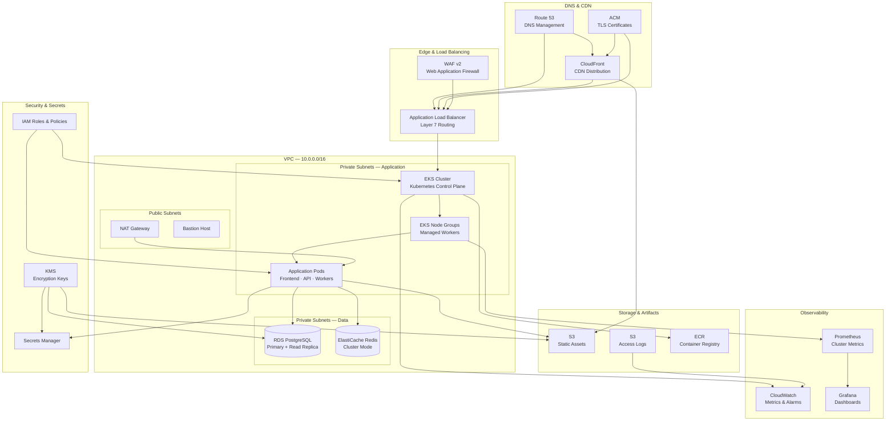

# Terraform AWS Masterclass

A comprehensive, zero-to-hero guide to building production-grade AWS infrastructure with Terraform. This repository walks you through every layer of a modern cloud architecture — from foundational networking to Kubernetes workloads, databases, caching, CDN, DNS, observability, and CI/CD — using battle-tested patterns, conventions, and security practices.

## Architecture Overview



## Directory Structure

```
terraform-guide/
├── bootstrap/                  # S3 + DynamoDB backend bootstrap
│   ├── main.tf
│   ├── variables.tf
│   ├── outputs.tf
│   ├── versions.tf
│   └── README.md
├── modules/                    # Reusable Terraform modules
│   ├── networking/             #   VPC, subnets, NAT, route tables
│   ├── security/               #   Security groups, NACLs, WAF
│   ├── compute/                #   EKS, node groups, ASG
│   ├── database/               #   RDS, ElastiCache
│   ├── storage/                #   S3, EFS
│   ├── cdn/                    #   CloudFront distributions
│   ├── dns/                    #   Route 53 zones and records
│   ├── monitoring/             #   CloudWatch, alarms, dashboards
│   ├── iam/                    #   Roles, policies, OIDC
│   └── README.md
├── environments/               # Per-environment root configurations
│   ├── dev/
│   ├── staging/
│   ├── prod/
│   └── README.md
├── components/                 # Standalone infrastructure components
│   ├── vpc/
│   ├── eks/
│   ├── rds/
│   ├── elasticache/
│   ├── s3/
│   ├── cloudfront/
│   ├── route53/
│   ├── alb/
│   └── README.md
├── examples/                   # End-to-end deployment examples
│   └── README.md
├── application/                # Sample application code
│   ├── frontend/               #   Next.js frontend
│   ├── backend/                #   Spring Boot API
│   └── README.md
├── k8s/                        # Kubernetes manifests and Helm values
│   ├── base/
│   ├── overlays/
│   └── README.md
├── scripts/                    # Utility and automation scripts
│   └── README.md
├── docs/                       # Extended documentation
│   ├── architecture/
│   ├── runbooks/
│   └── README.md
├── .editorconfig
├── .gitignore
├── .pre-commit-config.yaml
├── .terraform-version
├── CONTRIBUTING.md
├── GLOSSARY.md
├── LEARNING_PATH.md
├── LICENSE
├── Makefile
├── PREREQUISITES.md
├── SECURITY.md
└── TROUBLESHOOTING.md
```

## Quickstart

### 1. Install prerequisites

See [PREREQUISITES.md](PREREQUISITES.md) for the full list. At minimum you need:

```bash
# Terraform
tfenv install 1.9.8
tfenv use 1.9.8

# AWS CLI
aws configure --profile terraform-guide
export AWS_PROFILE=terraform-guide

# Pre-commit hooks
pip install pre-commit
pre-commit install
```

### 2. Bootstrap the remote backend

```bash
cd bootstrap/
terraform init
terraform plan -out=tfplan
terraform apply tfplan
```

This creates the S3 bucket and DynamoDB table used for state storage and locking.

### 3. Deploy an environment

```bash
# Format and validate first
make fmt
make validate

# Plan and apply for dev
make plan ENV=dev
make apply ENV=dev
```

### 4. Explore the learning path

Follow the [LEARNING_PATH.md](LEARNING_PATH.md) for a structured, phase-by-phase curriculum from beginner to advanced.

## Conventions

| Convention | Pattern | Example |
|---|---|---|
| Resource naming | `{project}-{environment}-{component}-{qualifier}` | `myapp-prod-api-sg` |
| Tagging | Project, Environment, ManagedBy, Team, CostCenter, Repository | Applied to every resource |
| Backend | S3 + DynamoDB | `ap-south-1` region |
| Terraform version | `>= 1.9.0` | Pinned to `1.9.8` via `.terraform-version` |
| AWS provider | `~> 5.0` | HashiCorp AWS provider |

## Learning Path Overview

| Phase | Topic | Complexity |
|---|---|---|
| 0 | [Project Setup & Conventions](docs/README.md) | Beginner |
| 1 | [Networking — VPC, Subnets, NAT](modules/networking/) | Beginner |
| 2 | [Security — SGs, NACLs, IAM](modules/security/) | Beginner–Intermediate |
| 3 | [Compute — EKS Cluster & Node Groups](modules/compute/) | Intermediate |
| 4 | [Database — RDS & ElastiCache](modules/database/) | Intermediate |
| 5 | [Storage & CDN — S3, CloudFront, Route 53](modules/storage/) | Intermediate |
| 6 | [Load Balancing — ALB & Target Groups](components/alb/) | Intermediate |
| 7 | [Application Deployment — K8s Manifests](k8s/) | Intermediate–Advanced |
| 8 | [Observability — CloudWatch, Prometheus, Grafana](modules/monitoring/) | Advanced |
| 9 | [CI/CD — GitHub Actions, ArgoCD](docs/architecture/) | Advanced |
| 10 | [Production Hardening — WAF, Backups, DR](docs/runbooks/) | Advanced |

## Key Links

- [Learning Path](LEARNING_PATH.md) — Structured curriculum
- [Prerequisites](PREREQUISITES.md) — Required tools and accounts
- [Glossary](GLOSSARY.md) — Terraform, AWS, and Kubernetes terminology
- [Troubleshooting](TROUBLESHOOTING.md) — Common errors and fixes
- [Contributing](CONTRIBUTING.md) — How to contribute
- [Security](SECURITY.md) — Responsible disclosure

## License

This project is licensed under the terms of the [MIT License](LICENSE).
