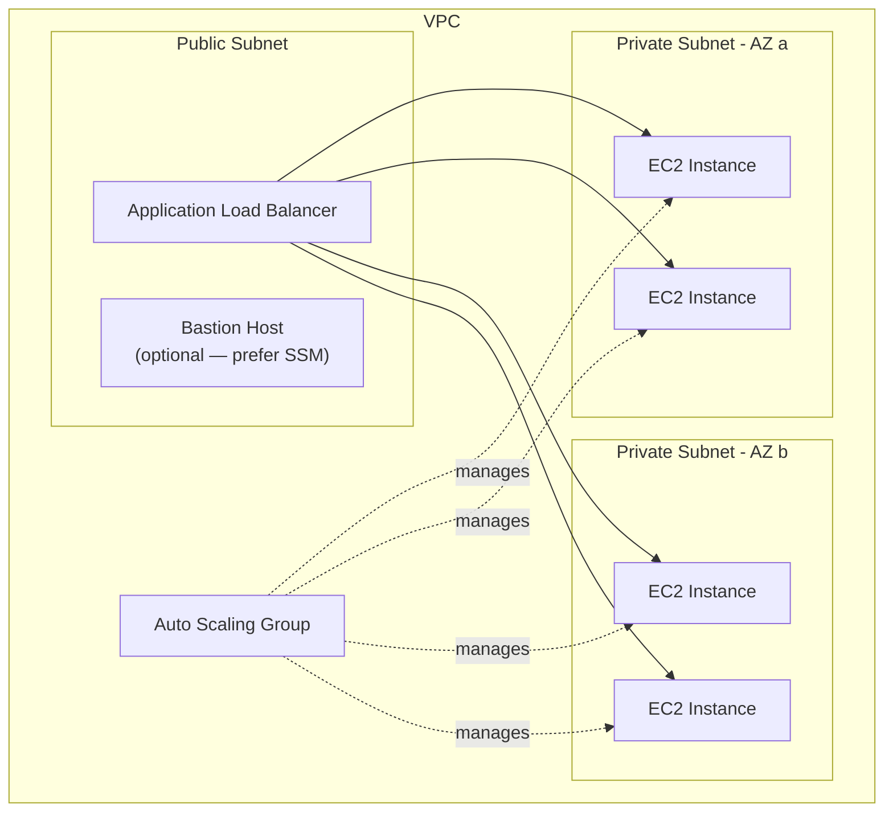

# AWS Compute (EC2) with Terraform

## Overview

Amazon EC2 provides resizable compute capacity in the cloud. This guide covers instance provisioning, AMI selection, instance type strategy, user data bootstrapping, key pairs, placement groups, and production-ready Terraform patterns.

---

## Architecture Overview



---

## AMI Selection

### Using AWS-Managed AMIs

```hcl
# Amazon Linux 2023 — recommended for most workloads
data "aws_ami" "amazon_linux" {
  most_recent = true
  owners      = ["amazon"]

  filter {
    name   = "name"
    values = ["al2023-ami-2023.*-x86_64"]
  }

  filter {
    name   = "virtualization-type"
    values = ["hvm"]
  }

  filter {
    name   = "architecture"
    values = ["x86_64"]
  }
}

# Ubuntu 22.04 LTS
data "aws_ami" "ubuntu" {
  most_recent = true
  owners      = ["099720109477"] # Canonical

  filter {
    name   = "name"
    values = ["ubuntu/images/hvm-ssd/ubuntu-jammy-22.04-amd64-server-*"]
  }

  filter {
    name   = "virtualization-type"
    values = ["hvm"]
  }
}

# ECS-optimized AMI (for ECS EC2 launch type)
data "aws_ami" "ecs_optimized" {
  most_recent = true
  owners      = ["amazon"]

  filter {
    name   = "name"
    values = ["amzn2-ami-ecs-hvm-*-x86_64-ebs"]
  }
}
```

### Using SSM Parameter for AMI (Preferred)

```hcl
# This always resolves to the latest Amazon Linux 2023 AMI
data "aws_ssm_parameter" "al2023" {
  name = "/aws/service/ami-amazon-linux-latest/al2023-ami-kernel-default-x86_64"
}

# Usage: ami = data.aws_ssm_parameter.al2023.value
```

---

## Instance Type Selection

### Decision Matrix

| Category | Instance Types | Use Case |
|----------|---------------|----------|
| General Purpose | t3, t3a, m6i, m7g | Web servers, small DBs, dev |
| Compute Optimized | c6i, c7g | Batch, HPC, media encoding |
| Memory Optimized | r6i, r7g, x2idn | In-memory caches, large DBs |
| Storage Optimized | i3, i4i, d3 | Data warehousing, HDFS |
| Accelerated | p4d, g5, inf2 | ML training/inference, GPU |
| Graviton (ARM) | m7g, c7g, r7g | 20-40% better price/perf |

### Burstable vs Fixed Performance

- **t3/t3a**: Burstable. Good for variable workloads. Monitor CPU credits.
- **m6i/m7g**: Fixed. Consistent performance. Use for production.
- Rule of thumb: if average CPU > 30%, move from `t3` to `m6i`.

---

## EC2 Instance Resource

```hcl
variable "instance_type" {
  description = "EC2 instance type"
  type        = string
  default     = "t3.medium"
}

variable "environment" {
  description = "Environment name"
  type        = string
}

variable "vpc_id" {
  type = string
}

variable "subnet_id" {
  type = string
}

resource "aws_instance" "app" {
  ami                    = data.aws_ssm_parameter.al2023.value
  instance_type          = var.instance_type
  subnet_id              = var.subnet_id
  vpc_security_group_ids = [aws_security_group.app.id]
  iam_instance_profile   = aws_iam_instance_profile.app.name

  # IMDSv2 — always enforce for security
  metadata_options {
    http_endpoint               = "enabled"
    http_tokens                 = "required"
    http_put_response_hop_limit = 2
  }

  root_block_device {
    volume_type           = "gp3"
    volume_size           = 30
    encrypted             = true
    delete_on_termination = true

    tags = {
      Name = "${var.environment}-app-root"
    }
  }

  user_data = base64encode(templatefile("${path.module}/user-data.sh", {
    environment = var.environment
  }))

  # Prevent recreation on AMI updates — use lifecycle for controlled rollouts
  lifecycle {
    ignore_changes = [ami]
  }

  tags = {
    Name        = "${var.environment}-app"
    Environment = var.environment
    ManagedBy   = "terraform"
  }
}
```

---

## User Data Bootstrapping

```bash
#!/bin/bash
# user-data.sh
set -euo pipefail

# Log all output
exec > >(tee /var/log/user-data.log) 2>&1
echo "User data execution started at $(date)"

# Install SSM agent (already included in AL2023)
# Install CloudWatch agent
yum install -y amazon-cloudwatch-agent

# Configure CloudWatch agent
cat > /opt/aws/amazon-cloudwatch-agent/etc/amazon-cloudwatch-agent.json <<'CWCONFIG'
{
  "agent": { "run_as_user": "root" },
  "logs": {
    "logs_collected": {
      "files": {
        "collect_list": [
          {
            "file_path": "/var/log/messages",
            "log_group_name": "/ec2/${environment}/messages",
            "log_stream_name": "{instance_id}"
          },
          {
            "file_path": "/var/log/application/*.log",
            "log_group_name": "/ec2/${environment}/application",
            "log_stream_name": "{instance_id}"
          }
        ]
      }
    }
  },
  "metrics": {
    "namespace": "Custom/EC2",
    "metrics_collected": {
      "mem": { "measurement": ["mem_used_percent"] },
      "disk": {
        "measurement": ["disk_used_percent"],
        "resources": ["/"]
      }
    }
  }
}
CWCONFIG

/opt/aws/amazon-cloudwatch-agent/bin/amazon-cloudwatch-agent-ctl \
  -a fetch-config -m ec2 \
  -c file:/opt/aws/amazon-cloudwatch-agent/etc/amazon-cloudwatch-agent.json -s

echo "User data execution completed at $(date)"
```

---

## Security Group

```hcl
resource "aws_security_group" "app" {
  name_prefix = "${var.environment}-app-"
  vpc_id      = var.vpc_id
  description = "Security group for application instances"

  # No inline rules — use aws_security_group_rule or aws_vpc_security_group_ingress_rule

  lifecycle {
    create_before_destroy = true
  }

  tags = {
    Name = "${var.environment}-app-sg"
  }
}

resource "aws_vpc_security_group_ingress_rule" "app_from_alb" {
  security_group_id            = aws_security_group.app.id
  referenced_security_group_id = aws_security_group.alb.id
  from_port                    = 8080
  to_port                      = 8080
  ip_protocol                  = "tcp"
  description                  = "Allow traffic from ALB"
}

resource "aws_vpc_security_group_egress_rule" "app_all_outbound" {
  security_group_id = aws_security_group.app.id
  cidr_ipv4         = "0.0.0.0/0"
  ip_protocol       = "-1"
  description       = "Allow all outbound traffic"
}
```

---

## IAM Instance Profile

```hcl
resource "aws_iam_role" "app" {
  name = "${var.environment}-app-role"

  assume_role_policy = jsonencode({
    Version = "2012-10-17"
    Statement = [{
      Action = "sts:AssumeRole"
      Effect = "Allow"
      Principal = {
        Service = "ec2.amazonaws.com"
      }
    }]
  })

  tags = {
    Environment = var.environment
  }
}

# SSM access — enables Session Manager (no SSH keys needed)
resource "aws_iam_role_policy_attachment" "ssm" {
  role       = aws_iam_role.app.name
  policy_arn = "arn:aws:iam::aws:policy/AmazonSSMManagedInstanceCore"
}

# CloudWatch agent
resource "aws_iam_role_policy_attachment" "cloudwatch" {
  role       = aws_iam_role.app.name
  policy_arn = "arn:aws:iam::aws:policy/CloudWatchAgentServerPolicy"
}

resource "aws_iam_instance_profile" "app" {
  name = "${var.environment}-app-profile"
  role = aws_iam_role.app.name
}
```

---

## Auto Scaling Group with Launch Template

```hcl
resource "aws_launch_template" "app" {
  name_prefix   = "${var.environment}-app-"
  image_id      = data.aws_ssm_parameter.al2023.value
  instance_type = var.instance_type

  vpc_security_group_ids = [aws_security_group.app.id]

  iam_instance_profile {
    arn = aws_iam_instance_profile.app.arn
  }

  metadata_options {
    http_endpoint               = "enabled"
    http_tokens                 = "required"
    http_put_response_hop_limit = 2
  }

  block_device_mappings {
    device_name = "/dev/xvda"

    ebs {
      volume_size           = 30
      volume_type           = "gp3"
      encrypted             = true
      delete_on_termination = true
    }
  }

  user_data = base64encode(templatefile("${path.module}/user-data.sh", {
    environment = var.environment
  }))

  tag_specifications {
    resource_type = "instance"
    tags = {
      Name        = "${var.environment}-app"
      Environment = var.environment
    }
  }

  lifecycle {
    create_before_destroy = true
  }
}

resource "aws_autoscaling_group" "app" {
  name_prefix         = "${var.environment}-app-"
  desired_capacity    = 2
  min_size            = 2
  max_size            = 10
  vpc_zone_identifier = var.private_subnet_ids
  health_check_type   = "ELB"
  health_check_grace_period = 300

  launch_template {
    id      = aws_launch_template.app.id
    version = "$Latest"
  }

  instance_refresh {
    strategy = "Rolling"
    preferences {
      min_healthy_percentage = 75
      instance_warmup        = 300
    }
  }

  tag {
    key                 = "Name"
    value               = "${var.environment}-app"
    propagate_at_launch = true
  }

  lifecycle {
    create_before_destroy = true
  }
}

# Target tracking scaling policy
resource "aws_autoscaling_policy" "cpu" {
  name                   = "${var.environment}-cpu-target"
  autoscaling_group_name = aws_autoscaling_group.app.name
  policy_type            = "TargetTrackingScaling"

  target_tracking_configuration {
    predefined_metric_specification {
      predefined_metric_type = "ASGAverageCPUUtilization"
    }
    target_value = 60.0
  }
}
```

---

## Placement Groups

```hcl
# Cluster — low latency, single AZ (HPC, big data)
resource "aws_placement_group" "cluster" {
  name     = "${var.environment}-cluster"
  strategy = "cluster"
}

# Spread — max 7 instances per AZ, max availability
resource "aws_placement_group" "spread" {
  name     = "${var.environment}-spread"
  strategy = "spread"
}

# Partition — large distributed workloads (Kafka, HDFS)
resource "aws_placement_group" "partition" {
  name            = "${var.environment}-partition"
  strategy        = "partition"
  partition_count = 3
}

# Usage in launch template
resource "aws_launch_template" "hpc" {
  # ... other config ...
  placement {
    group_name = aws_placement_group.cluster.name
  }
}
```

---

## Key Pairs and Access Strategy

**Prefer AWS Systems Manager Session Manager over SSH key pairs.** SSM provides audited, IAM-controlled access without opening port 22.

```hcl
# Only if SSH is truly required
resource "aws_key_pair" "deploy" {
  key_name   = "${var.environment}-deploy-key"
  public_key = var.ssh_public_key

  tags = {
    Environment = var.environment
  }
}

# Better approach: SSM-only access (no key pair, no port 22)
# Just attach AmazonSSMManagedInstanceCore policy to the instance role
# Then connect via: aws ssm start-session --target <instance-id>
```

---

## Instance Store vs EBS

| Feature | Instance Store | EBS gp3 | EBS io2 |
|---------|---------------|---------|---------|
| Persistence | Ephemeral | Persistent | Persistent |
| IOPS | Varies by type | 3,000 baseline | Up to 256,000 |
| Cost | Included | $0.08/GB/mo | $0.125/GB/mo + IOPS |
| Snapshots | No | Yes | Yes |
| Use Case | Temp data, caches | General | High-perf DB |

---

## Best Practices

1. **Always enforce IMDSv2** — prevents SSRF attacks from reaching instance metadata.
2. **Use launch templates**, not launch configurations (deprecated).
3. **Never hardcode AMI IDs** — use data sources or SSM parameters.
4. **Encrypt all EBS volumes** — use account-level default encryption.
5. **Use instance refresh** for rolling deployments in ASGs.
6. **Prefer Graviton instances** (m7g, c7g, r7g) for 20-40% better price/performance.
7. **Tag everything** — Name, Environment, Team, CostCenter at minimum.

---

## Related Guides

- [Networking](networking.md) — VPC and subnet design for EC2 placement
- [Security](security.md) — IAM roles, security groups, encryption
- [Monitoring](monitoring.md) — CloudWatch metrics and alarms for EC2
- [Cost Optimization](../07-production-patterns/cost-optimization.md) — Right-sizing and Reserved Instances
