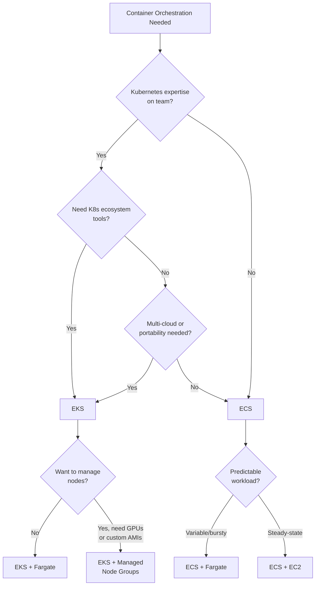

# AWS Containers with Terraform

## Overview

AWS provides two container orchestration platforms — ECS (Elastic Container Service) and EKS (Elastic Kubernetes Service) — each with two compute options: Fargate (serverless) and EC2 (self-managed). This guide covers architecture decisions, ECR for image management, and production Terraform patterns.

---

## ECS vs EKS Decision Framework



### Comparison Table

| Criteria | ECS | EKS |
|----------|-----|-----|
| Learning Curve | Low | High |
| Control Plane Cost | Free | $0.10/hr (~$73/mo) |
| AWS Integration | Deep, native | Good, via add-ons |
| Ecosystem | AWS-only | Vast K8s ecosystem |
| Portability | AWS-locked | Multi-cloud capable |
| Service Mesh | App Mesh (basic) | Istio, Linkerd, etc. |
| Ideal Team Size | Small-medium | Medium-large |

---

## ECR — Elastic Container Registry

```hcl
resource "aws_ecr_repository" "app" {
  name                 = "${var.environment}/${var.app_name}"
  image_tag_mutability = "IMMUTABLE"

  image_scanning_configuration {
    scan_on_push = true
  }

  encryption_configuration {
    encryption_type = "KMS"
    kms_key         = var.kms_key_arn
  }

  tags = {
    Environment = var.environment
    Application = var.app_name
  }
}

# Lifecycle policy — keep last 30 tagged images, expire untagged after 7 days
resource "aws_ecr_lifecycle_policy" "app" {
  repository = aws_ecr_repository.app.name

  policy = jsonencode({
    rules = [
      {
        rulePriority = 1
        description  = "Expire untagged images after 7 days"
        selection = {
          tagStatus   = "untagged"
          countType   = "sinceImagePushed"
          countUnit   = "days"
          countNumber = 7
        }
        action = {
          type = "expire"
        }
      },
      {
        rulePriority = 2
        description  = "Keep last 30 tagged images"
        selection = {
          tagStatus     = "tagged"
          tagPrefixList = ["v"]
          countType     = "imageCountMoreThan"
          countNumber   = 30
        }
        action = {
          type = "expire"
        }
      }
    ]
  })
}

# Cross-account pull access
resource "aws_ecr_repository_policy" "cross_account" {
  repository = aws_ecr_repository.app.name

  policy = jsonencode({
    Version = "2012-10-17"
    Statement = [{
      Sid    = "AllowCrossAccountPull"
      Effect = "Allow"
      Principal = {
        AWS = var.allowed_account_arns
      }
      Action = [
        "ecr:GetDownloadUrlForLayer",
        "ecr:BatchGetImage",
        "ecr:BatchCheckLayerAvailability",
      ]
    }]
  })
}
```

---

## ECS with Fargate — Complete Setup

### Cluster

```hcl
resource "aws_ecs_cluster" "main" {
  name = "${var.environment}-cluster"

  setting {
    name  = "containerInsights"
    value = "enabled"
  }

  configuration {
    execute_command_configuration {
      logging = "OVERRIDE"

      log_configuration {
        cloud_watch_log_group_name = aws_cloudwatch_log_group.ecs_exec.name
      }
    }
  }

  tags = {
    Environment = var.environment
  }
}

resource "aws_ecs_cluster_capacity_providers" "main" {
  cluster_name = aws_ecs_cluster.main.name

  capacity_providers = ["FARGATE", "FARGATE_SPOT"]

  default_capacity_provider_strategy {
    base              = 1
    weight            = 1
    capacity_provider = "FARGATE"
  }

  default_capacity_provider_strategy {
    weight            = 3
    capacity_provider = "FARGATE_SPOT"
  }
}
```

### Task Definition

```hcl
resource "aws_ecs_task_definition" "app" {
  family                   = "${var.environment}-${var.app_name}"
  requires_compatibilities = ["FARGATE"]
  network_mode             = "awsvpc"
  cpu                      = var.task_cpu
  memory                   = var.task_memory
  execution_role_arn       = aws_iam_role.ecs_execution.arn
  task_role_arn            = aws_iam_role.ecs_task.arn

  runtime_platform {
    operating_system_family = "LINUX"
    cpu_architecture        = "ARM64"  # Fargate Graviton — 20% cheaper
  }

  container_definitions = jsonencode([
    {
      name      = var.app_name
      image     = "${aws_ecr_repository.app.repository_url}:${var.image_tag}"
      essential = true

      portMappings = [{
        containerPort = var.container_port
        protocol      = "tcp"
      }]

      environment = [
        { name = "ENVIRONMENT", value = var.environment },
        { name = "PORT", value = tostring(var.container_port) },
      ]

      secrets = [
        {
          name      = "DATABASE_URL"
          valueFrom = aws_secretsmanager_secret.db_url.arn
        },
      ]

      logConfiguration = {
        logDriver = "awslogs"
        options = {
          "awslogs-group"         = aws_cloudwatch_log_group.app.name
          "awslogs-region"        = data.aws_region.current.name
          "awslogs-stream-prefix" = var.app_name
        }
      }

      healthCheck = {
        command     = ["CMD-SHELL", "curl -f http://localhost:${var.container_port}/health || exit 1"]
        interval    = 30
        timeout     = 5
        retries     = 3
        startPeriod = 60
      }
    }
  ])

  tags = {
    Environment = var.environment
    Application = var.app_name
  }
}
```

### Service with Load Balancer

```hcl
resource "aws_ecs_service" "app" {
  name            = "${var.environment}-${var.app_name}"
  cluster         = aws_ecs_cluster.main.id
  task_definition = aws_ecs_task_definition.app.arn
  desired_count   = var.desired_count

  capacity_provider_strategy {
    capacity_provider = "FARGATE"
    base              = 1
    weight            = 1
  }

  capacity_provider_strategy {
    capacity_provider = "FARGATE_SPOT"
    weight            = 3
  }

  network_configuration {
    subnets          = var.private_subnet_ids
    security_groups  = [aws_security_group.ecs_tasks.id]
    assign_public_ip = false
  }

  load_balancer {
    target_group_arn = aws_lb_target_group.app.arn
    container_name   = var.app_name
    container_port   = var.container_port
  }

  deployment_circuit_breaker {
    enable   = true
    rollback = true
  }

  deployment_configuration {
    maximum_percent         = 200
    minimum_healthy_percent = 100
  }

  enable_execute_command = true

  depends_on = [aws_lb_listener.https]

  lifecycle {
    ignore_changes = [desired_count]  # Let autoscaling manage this
  }

  tags = {
    Environment = var.environment
  }
}

# Auto Scaling
resource "aws_appautoscaling_target" "ecs" {
  max_capacity       = 20
  min_capacity       = var.desired_count
  resource_id        = "service/${aws_ecs_cluster.main.name}/${aws_ecs_service.app.name}"
  scalable_dimension = "ecs:service:DesiredCount"
  service_namespace  = "ecs"
}

resource "aws_appautoscaling_policy" "cpu" {
  name               = "${var.environment}-${var.app_name}-cpu"
  policy_type        = "TargetTrackingScaling"
  resource_id        = aws_appautoscaling_target.ecs.resource_id
  scalable_dimension = aws_appautoscaling_target.ecs.scalable_dimension
  service_namespace  = aws_appautoscaling_target.ecs.service_namespace

  target_tracking_scaling_policy_configuration {
    predefined_metric_specification {
      predefined_metric_type = "ECSServiceAverageCPUUtilization"
    }
    target_value       = 60
    scale_in_cooldown  = 300
    scale_out_cooldown = 60
  }
}
```

---

## IAM Roles for ECS

```hcl
# Execution role — used by ECS agent to pull images, push logs
resource "aws_iam_role" "ecs_execution" {
  name = "${var.environment}-ecs-execution"

  assume_role_policy = jsonencode({
    Version = "2012-10-17"
    Statement = [{
      Action = "sts:AssumeRole"
      Effect = "Allow"
      Principal = { Service = "ecs-tasks.amazonaws.com" }
    }]
  })
}

resource "aws_iam_role_policy_attachment" "ecs_execution" {
  role       = aws_iam_role.ecs_execution.name
  policy_arn = "arn:aws:iam::aws:policy/service-role/AmazonECSTaskExecutionRolePolicy"
}

# Allow pulling secrets
resource "aws_iam_role_policy" "ecs_execution_secrets" {
  name = "secrets-access"
  role = aws_iam_role.ecs_execution.id

  policy = jsonencode({
    Version = "2012-10-17"
    Statement = [{
      Effect = "Allow"
      Action = [
        "secretsmanager:GetSecretValue",
        "kms:Decrypt",
      ]
      Resource = [
        aws_secretsmanager_secret.db_url.arn,
        var.kms_key_arn,
      ]
    }]
  })
}

# Task role — used by your application code
resource "aws_iam_role" "ecs_task" {
  name = "${var.environment}-${var.app_name}-task"

  assume_role_policy = jsonencode({
    Version = "2012-10-17"
    Statement = [{
      Action = "sts:AssumeRole"
      Effect = "Allow"
      Principal = { Service = "ecs-tasks.amazonaws.com" }
    }]
  })
}
```

---

## ECS with EC2 Launch Type

When Fargate limits are hit (GPU, large memory, specific AMIs), use EC2 capacity providers.

```hcl
resource "aws_ecs_capacity_provider" "ec2" {
  name = "${var.environment}-ec2"

  auto_scaling_group_provider {
    auto_scaling_group_arn         = aws_autoscaling_group.ecs.arn
    managed_termination_protection = "ENABLED"

    managed_scaling {
      maximum_scaling_step_size = 5
      minimum_scaling_step_size = 1
      status                    = "ENABLED"
      target_capacity           = 80
    }
  }
}
```

---

## Fargate vs EC2 Decision

| Factor | Fargate | EC2 |
|--------|---------|-----|
| Operational Overhead | None | Patching, scaling |
| Startup Time | 30-60s | Instant (if capacity exists) |
| Max Task Size | 16 vCPU / 120 GB | Instance limits |
| GPU Support | No | Yes |
| Spot Pricing | ~70% discount | ~60-90% discount |
| Per-second Billing | Yes | Per-second (min 60s) |
| Persistent Storage | EFS only | EBS + EFS |
| Cost at Scale | Higher per unit | Lower per unit |

### When to Choose Fargate

- Teams without dedicated infrastructure engineers
- Variable or bursty workloads
- Microservices with small resource requirements
- Batch jobs that run occasionally

### When to Choose EC2

- GPU workloads (ML inference)
- Consistently high utilization (cost optimization)
- Workloads needing > 16 vCPU or 120 GB memory
- Need for specialized instance types or local storage

---

## Service Discovery

```hcl
resource "aws_service_discovery_private_dns_namespace" "main" {
  name        = "${var.environment}.local"
  vpc         = var.vpc_id
  description = "Service discovery namespace for ${var.environment}"
}

resource "aws_service_discovery_service" "app" {
  name = var.app_name

  dns_config {
    namespace_id = aws_service_discovery_private_dns_namespace.main.id

    dns_records {
      ttl  = 10
      type = "A"
    }

    routing_policy = "MULTIVALUE"
  }

  health_check_custom_config {
    failure_threshold = 1
  }
}

# Add to ECS service
# service_registries {
#   registry_arn = aws_service_discovery_service.app.arn
# }
```

---

## Best Practices

1. **Use IMMUTABLE image tags** in ECR — prevents tag overwriting and ensures reproducible deployments.
2. **Enable container insights** for CloudWatch metrics on ECS clusters.
3. **Use deployment circuit breakers** to auto-rollback failed deployments.
4. **Prefer Fargate Graviton (ARM64)** for 20% cost savings with no code changes for most workloads.
5. **Split execution and task roles** — execution role for ECS infra, task role for your app's AWS access.
6. **Set `ignore_changes = [desired_count]`** on services managed by auto scaling.
7. **Use ECS Exec** for debugging — avoid SSH into containers entirely.

---

## Related Guides

- [EKS Overview](../06-kubernetes/eks-overview.md) — When EKS is the better choice
- [Networking](networking.md) — VPC setup for container workloads
- [Security](security.md) — IAM patterns for container workloads
- [Monitoring](monitoring.md) — Container observability with CloudWatch
