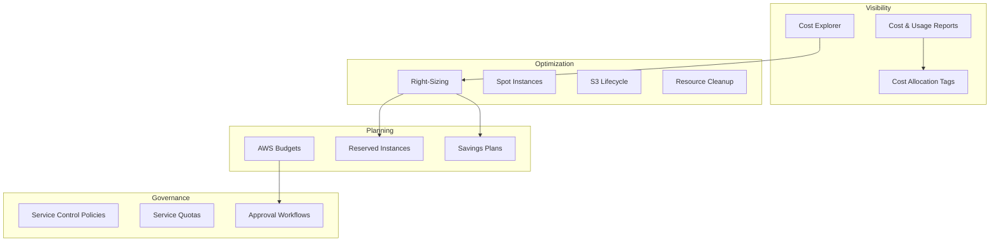

# AWS Cost Management with Terraform

## Overview

AWS cost management is an ongoing discipline, not a one-time exercise. This guide covers Cost Explorer, Budgets, Reserved Instances, Savings Plans, resource right-sizing, and tagging for cost allocation — all with Terraform configurations and practical strategies.

---

## Cost Management Framework



---

## Cost Allocation Tags

Tags are the foundation of cost visibility. Without consistent tagging, you cannot attribute costs to teams, projects, or environments.

### Tag Schema

```hcl
locals {
  required_tags = {
    Environment  = var.environment         # production, staging, development
    Team         = var.team                 # platform, backend, data
    Project      = var.project              # project or product name
    CostCenter   = var.cost_center          # finance cost center code
    ManagedBy    = "terraform"              # terraform, manual, cdk
    Owner        = var.owner_email          # team or individual email
  }
}

# Apply to all resources via default_tags in the provider
# provider "aws" {
#   default_tags {
#     tags = local.required_tags
#   }
# }
```

### Tag Enforcement with AWS Config

```hcl
resource "aws_config_config_rule" "required_tags" {
  name = "required-tags"

  source {
    owner             = "AWS"
    source_identifier = "REQUIRED_TAGS"
  }

  input_parameters = jsonencode({
    tag1Key   = "Environment"
    tag2Key   = "Team"
    tag3Key   = "Project"
    tag4Key   = "CostCenter"
    tag5Key   = "ManagedBy"
    tag6Key   = "Owner"
  })

  scope {
    compliance_resource_types = [
      "AWS::EC2::Instance",
      "AWS::RDS::DBInstance",
      "AWS::S3::Bucket",
      "AWS::Lambda::Function",
      "AWS::ECS::Service",
      "AWS::ElastiCache::CacheCluster",
    ]
  }

  tags = local.required_tags
}

# Activate cost allocation tags
resource "aws_ce_cost_allocation_tag" "tags" {
  for_each = toset(["Environment", "Team", "Project", "CostCenter"])

  tag_key = each.value
  status  = "Active"
}
```

---

## AWS Budgets

```hcl
resource "aws_budgets_budget" "monthly_total" {
  name         = "${var.environment}-monthly-total"
  budget_type  = "COST"
  limit_amount = var.monthly_budget_amount
  limit_unit   = "USD"
  time_unit    = "MONTHLY"

  cost_filter {
    name   = "TagKeyValue"
    values = ["user:Environment$${var.environment}"]
  }

  notification {
    comparison_operator        = "GREATER_THAN"
    threshold                  = 80
    threshold_type             = "PERCENTAGE"
    notification_type          = "ACTUAL"
    subscriber_email_addresses = var.budget_alert_emails
  }

  notification {
    comparison_operator        = "GREATER_THAN"
    threshold                  = 100
    threshold_type             = "PERCENTAGE"
    notification_type          = "ACTUAL"
    subscriber_email_addresses = var.budget_alert_emails
    subscriber_sns_topic_arns  = [var.cost_alert_sns_arn]
  }

  notification {
    comparison_operator        = "GREATER_THAN"
    threshold                  = 90
    threshold_type             = "PERCENTAGE"
    notification_type          = "FORECASTED"
    subscriber_email_addresses = var.budget_alert_emails
  }
}

# Per-service budgets
resource "aws_budgets_budget" "ec2" {
  name         = "${var.environment}-ec2-budget"
  budget_type  = "COST"
  limit_amount = var.ec2_budget_amount
  limit_unit   = "USD"
  time_unit    = "MONTHLY"

  cost_filter {
    name   = "Service"
    values = ["Amazon Elastic Compute Cloud - Compute"]
  }

  notification {
    comparison_operator        = "GREATER_THAN"
    threshold                  = 80
    threshold_type             = "PERCENTAGE"
    notification_type          = "ACTUAL"
    subscriber_email_addresses = var.budget_alert_emails
  }
}

# Per-team budget
resource "aws_budgets_budget" "teams" {
  for_each = var.team_budgets

  name         = "team-${each.key}-monthly"
  budget_type  = "COST"
  limit_amount = each.value.amount
  limit_unit   = "USD"
  time_unit    = "MONTHLY"

  cost_filter {
    name   = "TagKeyValue"
    values = ["user:Team$${each.key}"]
  }

  notification {
    comparison_operator        = "GREATER_THAN"
    threshold                  = 80
    threshold_type             = "PERCENTAGE"
    notification_type          = "ACTUAL"
    subscriber_email_addresses = each.value.alert_emails
  }
}
```

---

## Reserved Instances and Savings Plans

### Decision Matrix

| Commitment | Discount | Flexibility | Best For |
|-----------|----------|-------------|----------|
| No commitment | 0% | Full | Dev, testing |
| Savings Plan (Compute) | Up to 66% | Instance family, region, OS | Dynamic workloads |
| Savings Plan (EC2) | Up to 72% | Size flexible within family | Stable EC2 workloads |
| Reserved Instance (Standard) | Up to 72% | Limited exchange | Known, stable workloads |
| Reserved Instance (Convertible) | Up to 66% | Exchangeable | Long-term, may change |
| Spot Instances | Up to 90% | Can be interrupted | Fault-tolerant workloads |

### Right-Sizing Recommendations

AWS Cost Explorer provides right-sizing recommendations. Automate the review process:

```hcl
# Enable Cost Explorer (account-level)
resource "aws_ce_cost_category" "environment" {
  name = "Environment"

  rule {
    value = "Production"
    rule {
      tags {
        key           = "Environment"
        values        = ["production", "prod"]
        match_options = ["EQUALS"]
      }
    }
  }

  rule {
    value = "Non-Production"
    rule {
      tags {
        key           = "Environment"
        values        = ["staging", "development", "dev", "sandbox"]
        match_options = ["EQUALS"]
      }
    }
  }

  default_value = "Untagged"
}

# Anomaly detection
resource "aws_ce_anomaly_monitor" "service" {
  name              = "service-anomaly-monitor"
  monitor_type      = "DIMENSIONAL"
  monitor_dimension = "SERVICE"
}

resource "aws_ce_anomaly_monitor" "custom" {
  name         = "production-anomaly-monitor"
  monitor_type = "CUSTOM"

  monitor_specification = jsonencode({
    And = null
    Or  = null
    Not = null
    Tags = {
      Key          = "Environment"
      Values       = ["production"]
      MatchOptions = ["EQUALS"]
    }
  })
}

resource "aws_ce_anomaly_subscription" "alerts" {
  name = "cost-anomaly-alerts"

  monitor_arn_list = [
    aws_ce_anomaly_monitor.service.arn,
    aws_ce_anomaly_monitor.custom.arn,
  ]

  frequency = "DAILY"

  threshold_expression {
    dimension {
      key           = "ANOMALY_TOTAL_IMPACT_ABSOLUTE"
      values        = ["100"]
      match_options = ["GREATER_THAN_OR_EQUAL"]
    }
  }

  subscriber {
    type    = "EMAIL"
    address = var.cost_alert_email
  }

  subscriber {
    type    = "SNS"
    address = var.cost_alert_sns_arn
  }
}
```

---

## Resource Right-Sizing Patterns

### EC2 Right-Sizing

```hcl
# Use CloudWatch metrics to identify underutilized instances
# Then adjust instance types in Terraform

variable "instance_sizes" {
  description = "Instance sizes per environment"
  type        = map(string)
  default = {
    production  = "m6i.xlarge"
    staging     = "m6i.large"
    development = "t3.medium"
  }
}

resource "aws_instance" "app" {
  instance_type = var.instance_sizes[var.environment]
  # ...
}
```

### RDS Right-Sizing

```hcl
variable "rds_instance_classes" {
  description = "RDS instance classes per environment"
  type        = map(string)
  default = {
    production  = "db.r6g.xlarge"
    staging     = "db.r6g.large"
    development = "db.t4g.medium"
  }
}
```

### Lambda Right-Sizing

```hcl
# Use AWS Lambda Power Tuning to find optimal memory
# https://github.com/alexcasalboni/aws-lambda-power-tuning

variable "lambda_memory_map" {
  description = "Optimized memory settings per function"
  type        = map(number)
  default = {
    api_handler     = 256
    event_processor = 512
    report_generator = 1024
  }
}
```

---

## Spot Instances

```hcl
# Mixed instances ASG with Spot
resource "aws_autoscaling_group" "mixed" {
  name_prefix         = "${var.environment}-mixed-"
  desired_capacity    = 6
  min_size            = 2
  max_size            = 20
  vpc_zone_identifier = var.private_subnet_ids

  mixed_instances_policy {
    instances_distribution {
      on_demand_base_capacity                  = 2    # Minimum on-demand
      on_demand_percentage_above_base_capacity = 25   # 25% on-demand, 75% spot
      spot_allocation_strategy                 = "capacity-optimized"
    }

    launch_template {
      launch_template_specification {
        launch_template_id = aws_launch_template.app.id
        version            = "$Latest"
      }

      # Diversify across instance types to reduce interruption risk
      override {
        instance_type = "m6i.large"
      }
      override {
        instance_type = "m5.large"
      }
      override {
        instance_type = "m5a.large"
      }
      override {
        instance_type = "m7i.large"
      }
    }
  }

  tag {
    key                 = "Name"
    value               = "${var.environment}-mixed-asg"
    propagate_at_launch = true
  }
}
```

---

## S3 Cost Optimization

```hcl
# Intelligent-Tiering for unknown access patterns
resource "aws_s3_bucket_intelligent_tiering_configuration" "main" {
  bucket = aws_s3_bucket.main.id
  name   = "entire-bucket"

  tiering {
    access_tier = "DEEP_ARCHIVE_ACCESS"
    days        = 180
  }

  tiering {
    access_tier = "ARCHIVE_ACCESS"
    days        = 90
  }
}

# S3 Storage Lens for visibility
resource "aws_s3control_storage_lens_configuration" "main" {
  config_id = "organization-storage-lens"

  storage_lens_configuration {
    enabled = true

    account_level {
      activity_metrics {
        enabled = true
      }

      bucket_level {
        activity_metrics {
          enabled = true
        }

        prefix_level {
          storage_metrics {
            enabled = true
            selection_criteria {
              max_depth                    = 5
              min_storage_bytes_percentage = 1
            }
          }
        }
      }
    }

    data_export {
      s3_bucket_destination {
        account_id            = data.aws_caller_identity.current.account_id
        arn                   = var.storage_lens_export_bucket_arn
        format                = "CSV"
        output_schema_version = "V_1"
        prefix                = "storage-lens"
      }
    }
  }
}
```

---

## Cleanup Automation

### Unused Resources

```hcl
# Find unattached EBS volumes via AWS Config
resource "aws_config_config_rule" "unattached_ebs" {
  name = "ec2-volume-inuse-check"

  source {
    owner             = "AWS"
    source_identifier = "EC2_VOLUME_INUSE_CHECK"
  }

  tags = local.required_tags
}

# Find unused Elastic IPs
resource "aws_config_config_rule" "unused_eip" {
  name = "eip-attached"

  source {
    owner             = "AWS"
    source_identifier = "EIP_ATTACHED"
  }

  tags = local.required_tags
}

# Scheduled Lambda to clean up old snapshots
resource "aws_cloudwatch_event_rule" "cleanup" {
  name                = "${var.environment}-resource-cleanup"
  schedule_expression = "rate(1 day)"
}

resource "aws_cloudwatch_event_target" "cleanup" {
  rule = aws_cloudwatch_event_rule.cleanup.name
  arn  = var.cleanup_lambda_arn
}
```

---

## Cost Optimization Checklist

| Category | Action | Estimated Savings |
|----------|--------|-------------------|
| Compute | Switch to Graviton (m7g, c7g) | 20-40% |
| Compute | Use Savings Plans | Up to 66% |
| Compute | Spot for fault-tolerant workloads | Up to 90% |
| Storage | S3 Intelligent-Tiering | 40-70% on infrequent data |
| Storage | gp3 over gp2 for EBS | 20% |
| Network | NAT Gateway — use VPC endpoints | 50-80% on data transfer |
| Network | Single NAT in non-prod | 66% on NAT costs |
| Database | Aurora Serverless v2 for variable load | 30-50% |
| Database | RDS Reserved Instances | Up to 72% |
| Lambda | ARM64 architecture | 20% |
| Lambda | Right-size memory | 10-50% |
| Containers | Fargate Spot | ~70% |
| General | Delete unattached EBS, unused EIPs | Varies |
| General | Set S3 lifecycle policies | 40-90% on old data |

---

## Monthly Cost Review Process

1. **Review Cost Explorer** — check for unexpected spikes by service and tag.
2. **Check budget alerts** — ensure no budget exceeded 80%.
3. **Review right-sizing recommendations** — implement for any instance with < 30% average CPU.
4. **Check RI/SP coverage** — target 70-80% coverage for steady-state workloads.
5. **Review untagged resources** — ensure all resources are tagged for allocation.
6. **Clean up unused resources** — snapshots, volumes, IPs, old AMIs.
7. **Review data transfer costs** — often the hidden cost driver.

---

## Related Guides

- [Cost Optimization](../07-production-patterns/cost-optimization.md) — Detailed optimization patterns
- [Tagging Strategy](../07-production-patterns/tagging-strategy.md) — Tag governance
- [Monitoring](monitoring.md) — CloudWatch for cost-related alerts
