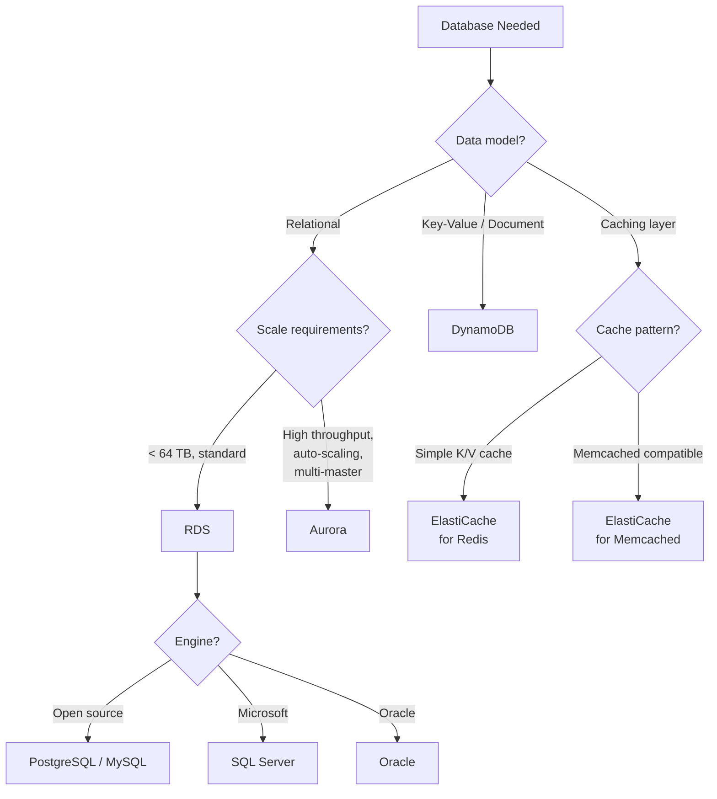
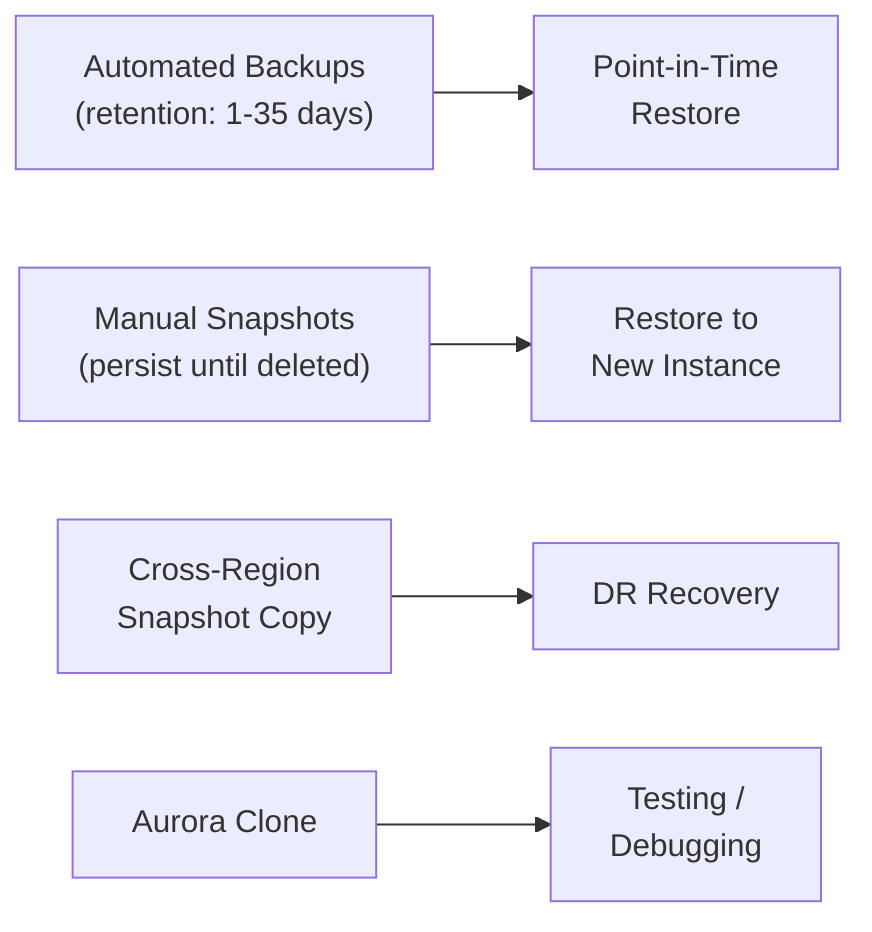

# AWS Databases with Terraform

## Overview

AWS offers purpose-built databases for different workload patterns. This guide covers RDS, Aurora, DynamoDB, and ElastiCache — when to use each, Terraform configuration patterns, and backup/restore strategies.

---

## Database Selection Framework



### Quick Comparison

| Feature | RDS | Aurora | DynamoDB | ElastiCache Redis |
|---------|-----|--------|----------|-------------------|
| Type | Relational | Relational | NoSQL | In-memory cache |
| Max Storage | 64 TB | 128 TB | Unlimited | 340 GB/node |
| Read Replicas | 5 | 15 | Global Tables | Cluster mode |
| Multi-AZ | Yes | Built-in | Built-in | Yes |
| Serverless | RDS Proxy | Aurora Serverless v2 | On-demand | Serverless |
| Backup | Automated + snapshots | Continuous | PITR + on-demand | Snapshots |

---

## RDS — Relational Database Service

### Production RDS PostgreSQL

```hcl
resource "aws_db_subnet_group" "main" {
  name       = "${var.environment}-db-subnet"
  subnet_ids = var.data_subnet_ids

  tags = {
    Name        = "${var.environment}-db-subnet-group"
    Environment = var.environment
  }
}

resource "aws_security_group" "rds" {
  name_prefix = "${var.environment}-rds-"
  vpc_id      = var.vpc_id
  description = "Security group for RDS instances"

  lifecycle {
    create_before_destroy = true
  }

  tags = {
    Name = "${var.environment}-rds-sg"
  }
}

resource "aws_vpc_security_group_ingress_rule" "rds_from_app" {
  security_group_id            = aws_security_group.rds.id
  referenced_security_group_id = var.app_security_group_id
  from_port                    = 5432
  to_port                      = 5432
  ip_protocol                  = "tcp"
  description                  = "PostgreSQL from application"
}

resource "aws_db_parameter_group" "postgres" {
  name_prefix = "${var.environment}-pg16-"
  family      = "postgres16"

  parameter {
    name  = "log_min_duration_statement"
    value = "1000"  # Log queries taking > 1s
  }

  parameter {
    name  = "shared_preload_libraries"
    value = "pg_stat_statements"
  }

  parameter {
    name  = "pg_stat_statements.track"
    value = "all"
  }

  parameter {
    name         = "max_connections"
    value        = "200"
    apply_method = "pending-reboot"
  }

  lifecycle {
    create_before_destroy = true
  }

  tags = {
    Environment = var.environment
  }
}

resource "aws_db_instance" "postgres" {
  identifier = "${var.environment}-postgres"

  engine               = "postgres"
  engine_version       = "16.3"
  instance_class       = var.db_instance_class
  allocated_storage    = 100
  max_allocated_storage = 500  # Enable storage autoscaling

  db_name  = var.database_name
  username = var.master_username
  password = var.master_password  # Use aws_secretsmanager_secret in practice

  db_subnet_group_name   = aws_db_subnet_group.main.name
  vpc_security_group_ids = [aws_security_group.rds.id]
  parameter_group_name   = aws_db_parameter_group.postgres.name

  multi_az            = var.environment == "production"
  publicly_accessible = false
  storage_type        = "gp3"
  storage_encrypted   = true
  kms_key_id          = var.kms_key_arn

  # Backup configuration
  backup_retention_period = 35
  backup_window           = "03:00-04:00"
  maintenance_window      = "Mon:04:00-Mon:05:00"
  copy_tags_to_snapshot   = true

  # Monitoring
  monitoring_interval          = 60
  monitoring_role_arn          = aws_iam_role.rds_monitoring.arn
  performance_insights_enabled = true
  performance_insights_retention_period = 731  # 2 years (free for 7 days)

  # Protection
  deletion_protection = var.environment == "production"
  skip_final_snapshot = var.environment != "production"
  final_snapshot_identifier = var.environment == "production" ? "${var.environment}-postgres-final" : null

  # Enable minor version upgrades during maintenance windows
  auto_minor_version_upgrade = true

  lifecycle {
    ignore_changes = [password]
  }

  tags = {
    Name        = "${var.environment}-postgres"
    Environment = var.environment
    Backup      = "daily"
  }
}

# Read replica
resource "aws_db_instance" "postgres_replica" {
  count = var.create_read_replica ? 1 : 0

  identifier          = "${var.environment}-postgres-replica"
  replicate_source_db = aws_db_instance.postgres.identifier
  instance_class      = var.replica_instance_class
  storage_encrypted   = true
  kms_key_id          = var.kms_key_arn

  vpc_security_group_ids = [aws_security_group.rds.id]
  parameter_group_name   = aws_db_parameter_group.postgres.name

  performance_insights_enabled = true
  monitoring_interval          = 60
  monitoring_role_arn          = aws_iam_role.rds_monitoring.arn

  tags = {
    Name = "${var.environment}-postgres-replica"
  }
}
```

---

## Aurora

### Aurora PostgreSQL Cluster

```hcl
resource "aws_rds_cluster" "aurora" {
  cluster_identifier = "${var.environment}-aurora"
  engine             = "aurora-postgresql"
  engine_version     = "16.3"
  engine_mode        = "provisioned"

  database_name   = var.database_name
  master_username = var.master_username
  master_password = var.master_password

  db_subnet_group_name   = aws_db_subnet_group.main.name
  vpc_security_group_ids = [aws_security_group.rds.id]

  storage_encrypted = true
  kms_key_id        = var.kms_key_arn

  backup_retention_period = 35
  preferred_backup_window = "03:00-04:00"
  copy_tags_to_snapshot   = true

  # Aurora Serverless v2 scaling (when using serverless instances)
  serverlessv2_scaling_configuration {
    min_capacity = 0.5
    max_capacity = 16
  }

  deletion_protection = var.environment == "production"
  skip_final_snapshot = var.environment != "production"

  enabled_cloudwatch_logs_exports = ["postgresql"]

  tags = {
    Name        = "${var.environment}-aurora"
    Environment = var.environment
  }

  lifecycle {
    ignore_changes = [master_password]
  }
}

# Writer instance (provisioned)
resource "aws_rds_cluster_instance" "writer" {
  identifier         = "${var.environment}-aurora-writer"
  cluster_identifier = aws_rds_cluster.aurora.id
  instance_class     = "db.r6g.xlarge"
  engine             = aws_rds_cluster.aurora.engine
  engine_version     = aws_rds_cluster.aurora.engine_version

  performance_insights_enabled = true
  monitoring_interval          = 60
  monitoring_role_arn          = aws_iam_role.rds_monitoring.arn

  tags = {
    Name = "${var.environment}-aurora-writer"
  }
}

# Reader instances (serverless v2 for elastic scaling)
resource "aws_rds_cluster_instance" "readers" {
  count = 2

  identifier         = "${var.environment}-aurora-reader-${count.index}"
  cluster_identifier = aws_rds_cluster.aurora.id
  instance_class     = "db.serverless"
  engine             = aws_rds_cluster.aurora.engine
  engine_version     = aws_rds_cluster.aurora.engine_version

  performance_insights_enabled = true

  tags = {
    Name = "${var.environment}-aurora-reader-${count.index}"
  }
}
```

### RDS vs Aurora Decision

| Factor | RDS | Aurora |
|--------|-----|--------|
| Cost (baseline) | Lower | ~20% more |
| Storage | gp3/io2, manual | Auto-scaling, 6-way replicated |
| Failover Time | 60-120s | < 30s |
| Read Replicas | Up to 5 | Up to 15 |
| Cloning | Snapshot restore | Fast clone (seconds) |
| Global DB | Cross-region replica | Native Global Database |
| Serverless | No | Aurora Serverless v2 |

**Choose RDS** for simple, cost-sensitive workloads. **Choose Aurora** when you need faster failover, more read capacity, or serverless scaling.

---

## DynamoDB

```hcl
resource "aws_dynamodb_table" "main" {
  name         = "${var.environment}-${var.table_name}"
  billing_mode = var.billing_mode  # PAY_PER_REQUEST or PROVISIONED
  hash_key     = "PK"
  range_key    = "SK"

  # Only needed for PROVISIONED mode
  read_capacity  = var.billing_mode == "PROVISIONED" ? var.read_capacity : null
  write_capacity = var.billing_mode == "PROVISIONED" ? var.write_capacity : null

  attribute {
    name = "PK"
    type = "S"
  }

  attribute {
    name = "SK"
    type = "S"
  }

  attribute {
    name = "GSI1PK"
    type = "S"
  }

  attribute {
    name = "GSI1SK"
    type = "S"
  }

  global_secondary_index {
    name            = "GSI1"
    hash_key        = "GSI1PK"
    range_key       = "GSI1SK"
    projection_type = "ALL"
  }

  # Point-in-time recovery
  point_in_time_recovery {
    enabled = true
  }

  # Encryption
  server_side_encryption {
    enabled     = true
    kms_key_arn = var.kms_key_arn
  }

  # TTL
  ttl {
    attribute_name = "ExpiresAt"
    enabled        = true
  }

  # Stream for event-driven patterns
  stream_enabled   = var.enable_streams
  stream_view_type = var.enable_streams ? "NEW_AND_OLD_IMAGES" : null

  tags = {
    Name        = "${var.environment}-${var.table_name}"
    Environment = var.environment
  }
}

# Auto scaling for provisioned mode
resource "aws_appautoscaling_target" "dynamodb_read" {
  count = var.billing_mode == "PROVISIONED" ? 1 : 0

  max_capacity       = var.read_capacity * 10
  min_capacity       = var.read_capacity
  resource_id        = "table/${aws_dynamodb_table.main.name}"
  scalable_dimension = "dynamodb:table:ReadCapacityUnits"
  service_namespace  = "dynamodb"
}

resource "aws_appautoscaling_policy" "dynamodb_read" {
  count = var.billing_mode == "PROVISIONED" ? 1 : 0

  name               = "${var.environment}-dynamodb-read-scaling"
  policy_type        = "TargetTrackingScaling"
  resource_id        = aws_appautoscaling_target.dynamodb_read[0].resource_id
  scalable_dimension = aws_appautoscaling_target.dynamodb_read[0].scalable_dimension
  service_namespace  = aws_appautoscaling_target.dynamodb_read[0].service_namespace

  target_tracking_scaling_policy_configuration {
    predefined_metric_specification {
      predefined_metric_type = "DynamoDBReadCapacityUtilization"
    }
    target_value = 70
  }
}
```

### DynamoDB Billing Modes

| Mode | Best For | Pricing |
|------|----------|---------|
| On-Demand | Unpredictable traffic, new tables | ~5x per-request cost |
| Provisioned | Steady traffic, predictable load | Lower unit cost |
| Provisioned + Auto Scaling | Variable but patterned traffic | Best of both worlds |

---

## ElastiCache for Redis

```hcl
resource "aws_elasticache_subnet_group" "main" {
  name       = "${var.environment}-redis"
  subnet_ids = var.data_subnet_ids
}

resource "aws_security_group" "redis" {
  name_prefix = "${var.environment}-redis-"
  vpc_id      = var.vpc_id

  lifecycle {
    create_before_destroy = true
  }

  tags = {
    Name = "${var.environment}-redis-sg"
  }
}

resource "aws_vpc_security_group_ingress_rule" "redis_from_app" {
  security_group_id            = aws_security_group.redis.id
  referenced_security_group_id = var.app_security_group_id
  from_port                    = 6379
  to_port                      = 6379
  ip_protocol                  = "tcp"
}

resource "aws_elasticache_replication_group" "redis" {
  replication_group_id = "${var.environment}-redis"
  description          = "Redis cluster for ${var.environment}"

  node_type            = var.redis_node_type
  num_cache_clusters   = var.environment == "production" ? 3 : 1
  engine               = "redis"
  engine_version       = "7.1"
  port                 = 6379
  parameter_group_name = aws_elasticache_parameter_group.redis.name

  subnet_group_name  = aws_elasticache_subnet_group.main.name
  security_group_ids = [aws_security_group.redis.id]

  automatic_failover_enabled = var.environment == "production"
  multi_az_enabled           = var.environment == "production"

  at_rest_encryption_enabled = true
  transit_encryption_enabled = true
  kms_key_id                 = var.kms_key_arn

  snapshot_retention_limit = 7
  snapshot_window          = "03:00-05:00"
  maintenance_window       = "Mon:05:00-Mon:06:00"

  auto_minor_version_upgrade = true

  tags = {
    Name        = "${var.environment}-redis"
    Environment = var.environment
  }
}

resource "aws_elasticache_parameter_group" "redis" {
  name   = "${var.environment}-redis71"
  family = "redis7"

  parameter {
    name  = "maxmemory-policy"
    value = "allkeys-lru"
  }

  parameter {
    name  = "notify-keyspace-events"
    value = "Ex"  # Enable expired key notifications
  }
}
```

---

## Backup and Restore Strategies

### RDS/Aurora Backup



```hcl
# Cross-region snapshot copy (disaster recovery)
resource "aws_db_snapshot_copy" "cross_region" {
  source_db_snapshot_identifier = aws_db_snapshot.manual.db_snapshot_arn
  target_db_snapshot_identifier = "${var.environment}-dr-snapshot"
  kms_key_id                    = var.dr_region_kms_key_arn

  # Copy to DR region
  provider = aws.dr_region
}
```

### DynamoDB Backup

```hcl
# On-demand backup
resource "aws_dynamodb_table_item" "backup_schedule" {
  # Use AWS Backup for scheduled DynamoDB backups
}

resource "aws_backup_plan" "dynamodb" {
  name = "${var.environment}-dynamodb-backup"

  rule {
    rule_name         = "daily"
    target_vault_name = aws_backup_vault.main.name
    schedule          = "cron(0 3 * * ? *)"

    lifecycle {
      delete_after = 35
    }

    copy_action {
      destination_vault_arn = var.dr_backup_vault_arn

      lifecycle {
        delete_after = 35
      }
    }
  }

  tags = {
    Environment = var.environment
  }
}

resource "aws_backup_selection" "dynamodb" {
  name         = "${var.environment}-dynamodb"
  iam_role_arn = aws_iam_role.backup.arn
  plan_id      = aws_backup_plan.dynamodb.id

  resources = [aws_dynamodb_table.main.arn]
}
```

---

## Best Practices

1. **Always encrypt at rest and in transit** — use KMS CMKs for production.
2. **Enable Performance Insights** on RDS/Aurora — it is free for 7-day retention.
3. **Use parameter groups** — never modify the default parameter group.
4. **Set `deletion_protection = true`** in production.
5. **Enable Point-in-Time Recovery** for DynamoDB tables.
6. **Use `ignore_changes` on passwords** — manage secrets outside Terraform.
7. **Monitor connection counts** — use RDS Proxy or PgBouncer to manage connection pooling.
8. **Test restores regularly** — backups are worthless if you cannot restore from them.

---

## Related Guides

- [Storage](storage.md) — S3 and EBS for data storage
- [Security](security.md) — Encryption and access control
- [Secrets Management](../07-production-patterns/secrets-management.md) — Database credential rotation
- [Disaster Recovery](../07-production-patterns/disaster-recovery.md) — Multi-region database strategies
