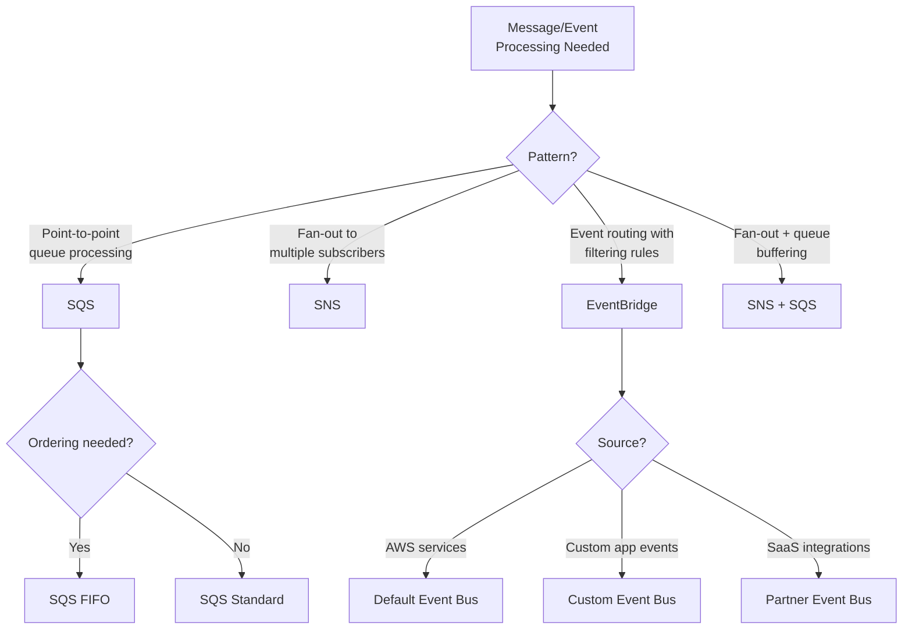
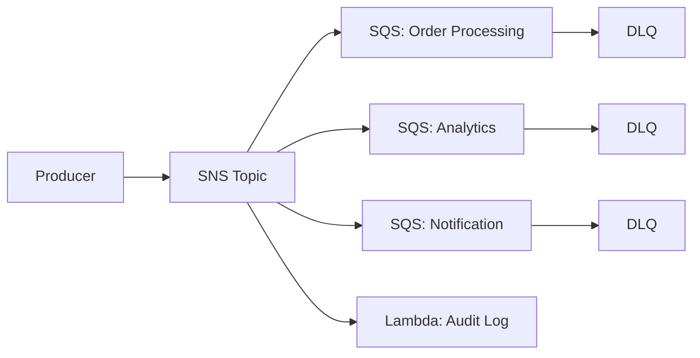
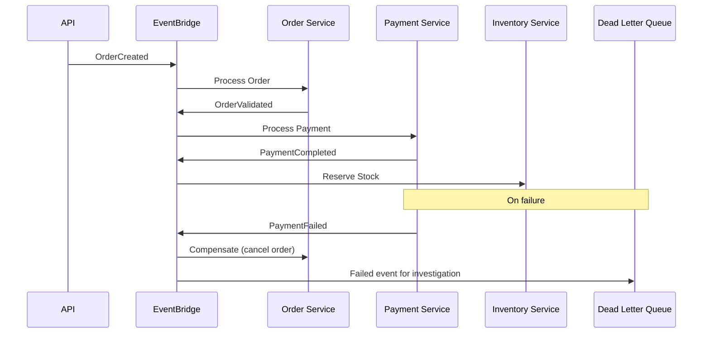

# AWS Messaging with Terraform

## Overview

AWS provides three core messaging services: SQS (queuing), SNS (pub/sub notifications), and EventBridge (event bus). This guide covers when to use each, Terraform configuration patterns, dead-letter queues, and event-driven architecture design.

---

## Messaging Service Selection



### Comparison

| Feature | SQS | SNS | EventBridge |
|---------|-----|-----|-------------|
| Pattern | Queue (pull) | Pub/sub (push) | Event bus (push) |
| Delivery | At-least-once | At-least-once | At-least-once |
| Ordering | FIFO available | FIFO available | Ordered per partition |
| Max Message Size | 256 KB | 256 KB | 256 KB |
| Retention | 1 min - 14 days | No retention | 24 hr replay |
| Filtering | No (app-level) | Message attributes | Content-based rules |
| Throughput | Nearly unlimited | Nearly unlimited | High (quotas apply) |
| DLQ Support | Yes | Yes (via SQS) | Yes |
| Cost | $0.40/million | $0.50/million | $1.00/million |

---

## SQS — Simple Queue Service

### Standard Queue with DLQ

```hcl
# Dead-letter queue — receives messages that fail processing
resource "aws_sqs_queue" "dlq" {
  name = "${var.environment}-${var.queue_name}-dlq"

  message_retention_seconds = 1209600  # 14 days — max retention
  kms_master_key_id         = var.kms_key_arn

  tags = {
    Environment = var.environment
    Type        = "dead-letter-queue"
  }
}

# Main processing queue
resource "aws_sqs_queue" "main" {
  name = "${var.environment}-${var.queue_name}"

  visibility_timeout_seconds = 300  # 6x your processing time
  message_retention_seconds  = 345600  # 4 days
  receive_wait_time_seconds  = 20      # Long polling (saves cost)
  max_message_size           = 262144  # 256 KB

  kms_master_key_id                 = var.kms_key_arn
  kms_data_key_reuse_period_seconds = 300

  redrive_policy = jsonencode({
    deadLetterTargetArn = aws_sqs_queue.dlq.arn
    maxReceiveCount     = 3  # Send to DLQ after 3 failures
  })

  tags = {
    Environment = var.environment
    Application = var.app_name
  }
}

# DLQ redrive — allow re-processing messages from DLQ
resource "aws_sqs_queue_redrive_allow_policy" "dlq" {
  queue_url = aws_sqs_queue.dlq.id

  redrive_allow_policy = jsonencode({
    redrivePermission = "byQueue"
    sourceQueueArns   = [aws_sqs_queue.main.arn]
  })
}

# Queue policy — allow SNS to send messages
resource "aws_sqs_queue_policy" "main" {
  queue_url = aws_sqs_queue.main.id

  policy = jsonencode({
    Version = "2012-10-17"
    Statement = [{
      Sid       = "AllowSNSPublish"
      Effect    = "Allow"
      Principal = { Service = "sns.amazonaws.com" }
      Action    = "sqs:SendMessage"
      Resource  = aws_sqs_queue.main.arn
      Condition = {
        ArnEquals = {
          "aws:SourceArn" = var.sns_topic_arn
        }
      }
    }]
  })
}
```

### FIFO Queue

```hcl
resource "aws_sqs_queue" "fifo" {
  name                        = "${var.environment}-${var.queue_name}.fifo"
  fifo_queue                  = true
  content_based_deduplication = true
  deduplication_scope         = "messageGroup"
  fifo_throughput_limit       = "perMessageGroupId"

  visibility_timeout_seconds = 300
  kms_master_key_id          = var.kms_key_arn

  redrive_policy = jsonencode({
    deadLetterTargetArn = aws_sqs_queue.fifo_dlq.arn
    maxReceiveCount     = 3
  })

  tags = {
    Environment = var.environment
  }
}

resource "aws_sqs_queue" "fifo_dlq" {
  name       = "${var.environment}-${var.queue_name}-dlq.fifo"
  fifo_queue = true

  message_retention_seconds = 1209600
  kms_master_key_id         = var.kms_key_arn

  tags = {
    Environment = var.environment
    Type        = "dead-letter-queue"
  }
}
```

---

## SNS — Simple Notification Service

### Topic with Multiple Subscriptions

```hcl
resource "aws_sns_topic" "events" {
  name              = "${var.environment}-${var.topic_name}"
  kms_master_key_id = var.kms_key_arn

  # Delivery policy for HTTP/S endpoints
  delivery_policy = jsonencode({
    http = {
      defaultHealthyRetryPolicy = {
        minDelayTarget     = 20
        maxDelayTarget     = 20
        numRetries         = 3
        numMaxDelayRetries = 0
        numNoDelayRetries  = 0
        backoffFunction    = "linear"
      }
      disableSubscriptionOverrides = false
    }
  })

  tags = {
    Environment = var.environment
  }
}

# SQS subscription with filter policy
resource "aws_sns_topic_subscription" "sqs_orders" {
  topic_arn = aws_sns_topic.events.arn
  protocol  = "sqs"
  endpoint  = aws_sqs_queue.orders.arn

  raw_message_delivery = true

  filter_policy = jsonencode({
    event_type = ["order.created", "order.updated"]
    priority   = [{ numeric = [">=", 1] }]
  })

  filter_policy_scope = "MessageBody"  # Filter on body, not attributes

  redrive_policy = jsonencode({
    deadLetterTargetArn = aws_sqs_queue.sns_dlq.arn
  })
}

# Lambda subscription
resource "aws_sns_topic_subscription" "lambda_notifications" {
  topic_arn = aws_sns_topic.events.arn
  protocol  = "lambda"
  endpoint  = var.notification_lambda_arn

  filter_policy = jsonencode({
    event_type = ["order.completed"]
  })
}

# Email subscription (for alerts)
resource "aws_sns_topic_subscription" "email" {
  topic_arn = aws_sns_topic.events.arn
  protocol  = "email"
  endpoint  = var.ops_email

  filter_policy = jsonencode({
    severity = ["critical"]
  })
}
```

### SNS + SQS Fan-Out Pattern



---

## EventBridge

### Custom Event Bus

```hcl
resource "aws_cloudwatch_event_bus" "app" {
  name = "${var.environment}-${var.app_name}-events"

  tags = {
    Environment = var.environment
  }
}

# Event rule — route order events to processing queue
resource "aws_cloudwatch_event_rule" "order_created" {
  name           = "${var.environment}-order-created"
  description    = "Route order.created events to processing"
  event_bus_name = aws_cloudwatch_event_bus.app.name

  event_pattern = jsonencode({
    source      = ["com.myapp.orders"]
    detail-type = ["OrderCreated"]
    detail = {
      status = ["pending"]
      amount = [{ numeric = [">", 0] }]
    }
  })

  tags = {
    Environment = var.environment
  }
}

# Target — SQS queue
resource "aws_cloudwatch_event_target" "order_queue" {
  rule           = aws_cloudwatch_event_rule.order_created.name
  event_bus_name = aws_cloudwatch_event_bus.app.name
  arn            = aws_sqs_queue.order_processing.arn
  target_id      = "order-processing-queue"

  # Transform the event before sending to target
  input_transformer {
    input_paths = {
      orderId = "$.detail.orderId"
      amount  = "$.detail.amount"
      userId  = "$.detail.userId"
    }
    input_template = <<EOF
{
  "orderId": <orderId>,
  "amount": <amount>,
  "userId": <userId>,
  "processedAt": "<aws.events.event.ingestion-time>"
}
EOF
  }

  dead_letter_config {
    arn = aws_sqs_queue.eventbridge_dlq.arn
  }

  retry_policy {
    maximum_retry_attempts       = 3
    maximum_event_age_in_seconds = 3600
  }
}

# Target — Step Functions (for complex workflows)
resource "aws_cloudwatch_event_target" "step_function" {
  rule           = aws_cloudwatch_event_rule.order_created.name
  event_bus_name = aws_cloudwatch_event_bus.app.name
  arn            = var.order_workflow_arn
  target_id      = "order-workflow"
  role_arn       = aws_iam_role.eventbridge.arn
}
```

### Scheduled Events (Cron)

```hcl
resource "aws_cloudwatch_event_rule" "daily_cleanup" {
  name                = "${var.environment}-daily-cleanup"
  description         = "Trigger daily cleanup Lambda"
  schedule_expression = "cron(0 3 * * ? *)"  # 3 AM UTC daily

  tags = {
    Environment = var.environment
  }
}

resource "aws_cloudwatch_event_target" "cleanup_lambda" {
  rule      = aws_cloudwatch_event_rule.daily_cleanup.name
  arn       = var.cleanup_lambda_arn
  target_id = "cleanup-lambda"
}

resource "aws_lambda_permission" "eventbridge" {
  statement_id  = "AllowEventBridgeInvoke"
  action        = "lambda:InvokeFunction"
  function_name = var.cleanup_lambda_name
  principal     = "events.amazonaws.com"
  source_arn    = aws_cloudwatch_event_rule.daily_cleanup.arn
}
```

### Cross-Account Event Bus

```hcl
# Allow another account to put events on our bus
resource "aws_cloudwatch_event_bus_policy" "cross_account" {
  event_bus_name = aws_cloudwatch_event_bus.app.name

  policy = jsonencode({
    Version = "2012-10-17"
    Statement = [{
      Sid       = "AllowCrossAccountPut"
      Effect    = "Allow"
      Principal = {
        AWS = var.trusted_account_arns
      }
      Action   = "events:PutEvents"
      Resource = aws_cloudwatch_event_bus.app.arn
    }]
  })
}
```

### EventBridge Pipes

```hcl
resource "aws_pipes_pipe" "sqs_to_step_functions" {
  name     = "${var.environment}-sqs-to-sfn"
  role_arn = aws_iam_role.pipes.arn

  source = aws_sqs_queue.main.arn

  source_parameters {
    sqs_queue_parameters {
      batch_size                         = 10
      maximum_batching_window_in_seconds = 30
    }
  }

  # Optional enrichment with Lambda
  enrichment = var.enrichment_lambda_arn

  target = var.step_function_arn

  target_parameters {
    step_function_state_machine_parameters {
      invocation_type = "FIRE_AND_FORGET"
    }
  }

  tags = {
    Environment = var.environment
  }
}
```

---

## Event-Driven Architecture Patterns

### Saga Pattern with EventBridge



---

## DLQ Monitoring and Alerting

```hcl
# Module for DLQ alarm — reuse across all queues
locals {
  dlq_queues = {
    orders      = aws_sqs_queue.orders_dlq.arn
    payments    = aws_sqs_queue.payments_dlq.arn
    events      = aws_sqs_queue.eventbridge_dlq.arn
  }
}

resource "aws_cloudwatch_metric_alarm" "dlq_messages" {
  for_each = local.dlq_queues

  alarm_name          = "${var.environment}-dlq-${each.key}-not-empty"
  comparison_operator = "GreaterThanThreshold"
  evaluation_periods  = 1
  metric_name         = "ApproximateNumberOfMessagesVisible"
  namespace           = "AWS/SQS"
  period              = 300
  statistic           = "Sum"
  threshold           = 0
  alarm_description   = "DLQ ${each.key} has messages — investigate failed processing"
  alarm_actions       = [var.alarm_sns_topic_arn]

  dimensions = {
    QueueName = split(":", each.value)[5]  # Extract queue name from ARN
  }

  tags = {
    Environment = var.environment
    Severity    = "warning"
  }
}
```

---

## IAM for Messaging

```hcl
# Producer policy
resource "aws_iam_policy" "sqs_producer" {
  name = "${var.environment}-sqs-producer"

  policy = jsonencode({
    Version = "2012-10-17"
    Statement = [{
      Effect = "Allow"
      Action = [
        "sqs:SendMessage",
        "sqs:GetQueueUrl",
        "sqs:GetQueueAttributes",
      ]
      Resource = [aws_sqs_queue.main.arn]
    }]
  })
}

# Consumer policy
resource "aws_iam_policy" "sqs_consumer" {
  name = "${var.environment}-sqs-consumer"

  policy = jsonencode({
    Version = "2012-10-17"
    Statement = [
      {
        Effect = "Allow"
        Action = [
          "sqs:ReceiveMessage",
          "sqs:DeleteMessage",
          "sqs:GetQueueAttributes",
          "sqs:ChangeMessageVisibility",
        ]
        Resource = [aws_sqs_queue.main.arn]
      },
      {
        Effect = "Allow"
        Action = ["kms:Decrypt"]
        Resource = [var.kms_key_arn]
      }
    ]
  })
}
```

---

## Best Practices

1. **Always configure dead-letter queues** — unprocessed messages should never be silently lost.
2. **Use long polling** (`receive_wait_time_seconds = 20`) — reduces empty receives and cost.
3. **Set visibility timeout to 6x processing time** — prevents duplicate processing.
4. **Use message filtering** at the SNS/EventBridge level — avoid filtering in consumer code.
5. **Monitor DLQ depth** — any message in a DLQ represents a processing failure.
6. **Use FIFO only when ordering matters** — FIFO queues have lower throughput (3,000 msg/s with batching).
7. **Encrypt all queues and topics** with KMS.
8. **Prefer EventBridge over SNS** for complex routing logic and AWS service integrations.
9. **Set message retention appropriately** — 4 days is usually sufficient; DLQ should be 14 days.

---

## Related Guides

- [Serverless](serverless.md) — Lambda event sources with SQS and EventBridge
- [Monitoring](monitoring.md) — CloudWatch alarms for queue metrics
- [Security](security.md) — IAM and encryption for messaging
