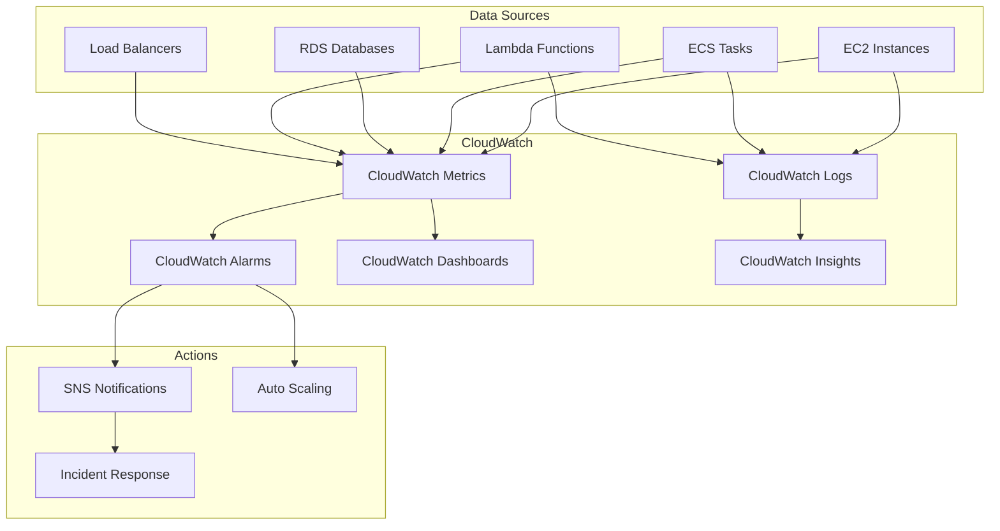

# AWS Monitoring with Terraform

## Overview

AWS provides a comprehensive monitoring stack: CloudWatch for metrics, logs, and alarms; CloudTrail for API auditing; and X-Ray for distributed tracing. This guide covers Terraform patterns for building a production observability layer.

---

## Monitoring Architecture



---

## CloudWatch Log Groups

```hcl
resource "aws_cloudwatch_log_group" "application" {
  name              = "/app/${var.environment}/${var.app_name}"
  retention_in_days = var.log_retention_days
  kms_key_id        = var.kms_key_arn

  tags = {
    Environment = var.environment
    Application = var.app_name
  }
}

# Metric filter — extract error counts from logs
resource "aws_cloudwatch_log_metric_filter" "errors" {
  name           = "${var.environment}-${var.app_name}-errors"
  pattern        = "[timestamp, level = \"ERROR\", ...]"
  log_group_name = aws_cloudwatch_log_group.application.name

  metric_transformation {
    name          = "ErrorCount"
    namespace     = "Custom/${var.app_name}"
    value         = "1"
    default_value = "0"
  }
}

# Metric filter — extract latency
resource "aws_cloudwatch_log_metric_filter" "latency" {
  name           = "${var.environment}-${var.app_name}-latency"
  pattern        = "{ $.duration > 0 }"
  log_group_name = aws_cloudwatch_log_group.application.name

  metric_transformation {
    name      = "RequestLatency"
    namespace = "Custom/${var.app_name}"
    value     = "$.duration"
  }
}

# Subscription filter — stream logs to Lambda or Kinesis
resource "aws_cloudwatch_log_subscription_filter" "lambda" {
  name            = "${var.environment}-log-processor"
  log_group_name  = aws_cloudwatch_log_group.application.name
  filter_pattern  = "{ $.level = \"ERROR\" }"
  destination_arn = var.log_processor_lambda_arn
}

# Log retention across all groups
locals {
  log_retention_map = {
    production  = 365
    staging     = 90
    development = 30
  }
}
```

---

## CloudWatch Alarms

### Application Alarms

```hcl
# SNS topic for alarm notifications
resource "aws_sns_topic" "alarms" {
  name              = "${var.environment}-alarms"
  kms_master_key_id = var.kms_key_arn

  tags = {
    Environment = var.environment
  }
}

resource "aws_sns_topic_subscription" "email" {
  for_each = toset(var.alarm_email_addresses)

  topic_arn = aws_sns_topic.alarms.arn
  protocol  = "email"
  endpoint  = each.value
}

# ALB 5xx error rate
resource "aws_cloudwatch_metric_alarm" "alb_5xx" {
  alarm_name          = "${var.environment}-alb-5xx-high"
  comparison_operator = "GreaterThanThreshold"
  evaluation_periods  = 3
  threshold           = 5
  alarm_description   = "ALB 5xx error rate is above 5%"
  alarm_actions       = [aws_sns_topic.alarms.arn]
  ok_actions          = [aws_sns_topic.alarms.arn]

  metric_query {
    id          = "error_rate"
    expression  = "(errors / requests) * 100"
    label       = "5xx Error Rate"
    return_data = true
  }

  metric_query {
    id = "errors"
    metric {
      metric_name = "HTTPCode_Target_5XX_Count"
      namespace   = "AWS/ApplicationELB"
      period      = 300
      stat        = "Sum"
      dimensions = {
        LoadBalancer = var.alb_arn_suffix
      }
    }
  }

  metric_query {
    id = "requests"
    metric {
      metric_name = "RequestCount"
      namespace   = "AWS/ApplicationELB"
      period      = 300
      stat        = "Sum"
      dimensions = {
        LoadBalancer = var.alb_arn_suffix
      }
    }
  }

  tags = {
    Environment = var.environment
    Severity    = "critical"
  }
}

# Response latency — P99
resource "aws_cloudwatch_metric_alarm" "latency_p99" {
  alarm_name          = "${var.environment}-latency-p99-high"
  comparison_operator = "GreaterThanThreshold"
  evaluation_periods  = 3
  metric_name         = "TargetResponseTime"
  namespace           = "AWS/ApplicationELB"
  period              = 300
  extended_statistic  = "p99"
  threshold           = 2  # 2 seconds
  alarm_description   = "P99 latency is above 2 seconds"
  alarm_actions       = [aws_sns_topic.alarms.arn]

  dimensions = {
    LoadBalancer = var.alb_arn_suffix
  }

  tags = {
    Environment = var.environment
    Severity    = "warning"
  }
}

# ECS service CPU
resource "aws_cloudwatch_metric_alarm" "ecs_cpu" {
  alarm_name          = "${var.environment}-${var.app_name}-cpu-high"
  comparison_operator = "GreaterThanThreshold"
  evaluation_periods  = 3
  metric_name         = "CPUUtilization"
  namespace           = "AWS/ECS"
  period              = 300
  statistic           = "Average"
  threshold           = 80
  alarm_description   = "ECS CPU utilization above 80%"
  alarm_actions       = [aws_sns_topic.alarms.arn]

  dimensions = {
    ClusterName = var.ecs_cluster_name
    ServiceName = var.ecs_service_name
  }

  tags = {
    Environment = var.environment
  }
}
```

### Database Alarms

```hcl
resource "aws_cloudwatch_metric_alarm" "rds_cpu" {
  alarm_name          = "${var.environment}-rds-cpu-high"
  comparison_operator = "GreaterThanThreshold"
  evaluation_periods  = 3
  metric_name         = "CPUUtilization"
  namespace           = "AWS/RDS"
  period              = 300
  statistic           = "Average"
  threshold           = 80
  alarm_description   = "RDS CPU above 80%"
  alarm_actions       = [aws_sns_topic.alarms.arn]

  dimensions = {
    DBInstanceIdentifier = var.rds_instance_id
  }
}

resource "aws_cloudwatch_metric_alarm" "rds_connections" {
  alarm_name          = "${var.environment}-rds-connections-high"
  comparison_operator = "GreaterThanThreshold"
  evaluation_periods  = 2
  metric_name         = "DatabaseConnections"
  namespace           = "AWS/RDS"
  period              = 300
  statistic           = "Average"
  threshold           = 150
  alarm_description   = "RDS connection count above 150"
  alarm_actions       = [aws_sns_topic.alarms.arn]

  dimensions = {
    DBInstanceIdentifier = var.rds_instance_id
  }
}

resource "aws_cloudwatch_metric_alarm" "rds_free_storage" {
  alarm_name          = "${var.environment}-rds-storage-low"
  comparison_operator = "LessThanThreshold"
  evaluation_periods  = 2
  metric_name         = "FreeStorageSpace"
  namespace           = "AWS/RDS"
  period              = 300
  statistic           = "Average"
  threshold           = 10737418240  # 10 GB in bytes
  alarm_description   = "RDS free storage below 10 GB"
  alarm_actions       = [aws_sns_topic.alarms.arn]

  dimensions = {
    DBInstanceIdentifier = var.rds_instance_id
  }

  tags = {
    Severity = "critical"
  }
}
```

---

## CloudWatch Dashboards

```hcl
resource "aws_cloudwatch_dashboard" "main" {
  dashboard_name = "${var.environment}-overview"

  dashboard_body = jsonencode({
    widgets = [
      {
        type   = "metric"
        x      = 0
        y      = 0
        width  = 12
        height = 6
        properties = {
          title   = "ALB Request Count"
          metrics = [
            ["AWS/ApplicationELB", "RequestCount", "LoadBalancer", var.alb_arn_suffix, { stat = "Sum", period = 300 }]
          ]
          view   = "timeSeries"
          region = data.aws_region.current.name
        }
      },
      {
        type   = "metric"
        x      = 12
        y      = 0
        width  = 12
        height = 6
        properties = {
          title = "ALB Response Time"
          metrics = [
            ["AWS/ApplicationELB", "TargetResponseTime", "LoadBalancer", var.alb_arn_suffix, { stat = "p50", period = 300, label = "p50" }],
            ["...", { stat = "p90", period = 300, label = "p90" }],
            ["...", { stat = "p99", period = 300, label = "p99" }]
          ]
          view   = "timeSeries"
          region = data.aws_region.current.name
        }
      },
      {
        type   = "metric"
        x      = 0
        y      = 6
        width  = 12
        height = 6
        properties = {
          title = "ECS CPU & Memory"
          metrics = [
            ["AWS/ECS", "CPUUtilization", "ClusterName", var.ecs_cluster_name, "ServiceName", var.ecs_service_name, { stat = "Average", period = 300, label = "CPU" }],
            ["AWS/ECS", "MemoryUtilization", "ClusterName", var.ecs_cluster_name, "ServiceName", var.ecs_service_name, { stat = "Average", period = 300, label = "Memory" }]
          ]
          view = "timeSeries"
        }
      },
      {
        type   = "metric"
        x      = 12
        y      = 6
        width  = 12
        height = 6
        properties = {
          title = "RDS Performance"
          metrics = [
            ["AWS/RDS", "CPUUtilization", "DBInstanceIdentifier", var.rds_instance_id, { stat = "Average", period = 300, label = "CPU" }],
            ["AWS/RDS", "ReadIOPS", "DBInstanceIdentifier", var.rds_instance_id, { stat = "Average", period = 300, label = "Read IOPS", yAxis = "right" }],
            ["AWS/RDS", "WriteIOPS", "DBInstanceIdentifier", var.rds_instance_id, { stat = "Average", period = 300, label = "Write IOPS", yAxis = "right" }]
          ]
          view = "timeSeries"
        }
      },
      {
        type   = "log"
        x      = 0
        y      = 12
        width  = 24
        height = 6
        properties = {
          title  = "Recent Errors"
          query  = "SOURCE '${aws_cloudwatch_log_group.application.name}' | filter @message like /ERROR/ | sort @timestamp desc | limit 20"
          region = data.aws_region.current.name
          view   = "table"
        }
      }
    ]
  })
}
```

---

## CloudTrail

```hcl
resource "aws_cloudtrail" "main" {
  name                       = "${var.environment}-trail"
  s3_bucket_name             = var.trail_bucket_name
  s3_key_prefix              = "cloudtrail"
  include_global_service_events = true
  is_multi_region_trail      = true
  enable_log_file_validation = true
  kms_key_id                 = var.kms_key_arn

  cloud_watch_logs_group_arn = "${aws_cloudwatch_log_group.cloudtrail.arn}:*"
  cloud_watch_logs_role_arn  = aws_iam_role.cloudtrail.arn

  event_selector {
    read_write_type           = "All"
    include_management_events = true

    data_resource {
      type   = "AWS::S3::Object"
      values = ["arn:aws:s3"]
    }
  }

  insight_selector {
    insight_type = "ApiCallRateInsight"
  }

  insight_selector {
    insight_type = "ApiErrorRateInsight"
  }

  tags = {
    Environment = var.environment
  }
}

resource "aws_cloudwatch_log_group" "cloudtrail" {
  name              = "/aws/cloudtrail/${var.environment}"
  retention_in_days = 365
  kms_key_id        = var.kms_key_arn
}

# Alert on root account usage
resource "aws_cloudwatch_log_metric_filter" "root_login" {
  name           = "root-account-usage"
  pattern        = "{ $.userIdentity.type = \"Root\" && $.userIdentity.invokedBy NOT EXISTS && $.eventType != \"AwsServiceEvent\" }"
  log_group_name = aws_cloudwatch_log_group.cloudtrail.name

  metric_transformation {
    name      = "RootAccountUsage"
    namespace = "Security"
    value     = "1"
  }
}

resource "aws_cloudwatch_metric_alarm" "root_login" {
  alarm_name          = "root-account-usage"
  comparison_operator = "GreaterThanThreshold"
  evaluation_periods  = 1
  metric_name         = "RootAccountUsage"
  namespace           = "Security"
  period              = 300
  statistic           = "Sum"
  threshold           = 0
  alarm_description   = "Root account was used"
  alarm_actions       = [var.security_sns_topic_arn]

  tags = {
    Severity = "critical"
  }
}

# Alert on console login without MFA
resource "aws_cloudwatch_log_metric_filter" "no_mfa_login" {
  name           = "console-login-no-mfa"
  pattern        = "{ $.eventName = \"ConsoleLogin\" && $.additionalEventData.MFAUsed != \"Yes\" }"
  log_group_name = aws_cloudwatch_log_group.cloudtrail.name

  metric_transformation {
    name      = "ConsoleLoginNoMFA"
    namespace = "Security"
    value     = "1"
  }
}
```

---

## Composite Alarms

```hcl
# Composite alarm — fires only when multiple conditions are met
resource "aws_cloudwatch_composite_alarm" "service_degraded" {
  alarm_name = "${var.environment}-service-degraded"

  alarm_rule = "ALARM(${aws_cloudwatch_metric_alarm.alb_5xx.alarm_name}) AND ALARM(${aws_cloudwatch_metric_alarm.latency_p99.alarm_name})"

  alarm_description = "Service is degraded: high error rate AND high latency"
  alarm_actions     = [aws_sns_topic.alarms.arn]
  ok_actions        = [aws_sns_topic.alarms.arn]

  tags = {
    Environment = var.environment
    Severity    = "critical"
  }
}
```

---

## CloudWatch Anomaly Detection

```hcl
resource "aws_cloudwatch_metric_alarm" "anomaly_detection" {
  alarm_name          = "${var.environment}-request-count-anomaly"
  comparison_operator = "LessThanLowerOrGreaterThanUpperThreshold"
  evaluation_periods  = 3
  threshold_metric_id = "anomaly_band"
  alarm_description   = "Request count is outside the expected band"
  alarm_actions       = [aws_sns_topic.alarms.arn]

  metric_query {
    id          = "request_count"
    return_data = true

    metric {
      metric_name = "RequestCount"
      namespace   = "AWS/ApplicationELB"
      period      = 300
      stat        = "Sum"

      dimensions = {
        LoadBalancer = var.alb_arn_suffix
      }
    }
  }

  metric_query {
    id          = "anomaly_band"
    expression  = "ANOMALY_DETECTION_BAND(request_count, 2)"
    label       = "Request Count Anomaly Band"
    return_data = true
  }

  tags = {
    Environment = var.environment
  }
}
```

---

## Key Metrics to Monitor

| Service | Metric | Threshold | Severity |
|---------|--------|-----------|----------|
| ALB | HTTPCode_Target_5XX_Count | > 1% of requests | Critical |
| ALB | TargetResponseTime (p99) | > 2s | Warning |
| ECS | CPUUtilization | > 80% | Warning |
| ECS | MemoryUtilization | > 85% | Warning |
| RDS | CPUUtilization | > 80% | Warning |
| RDS | FreeStorageSpace | < 10 GB | Critical |
| RDS | DatabaseConnections | > 80% of max | Warning |
| Lambda | Errors | > 1% | Warning |
| Lambda | Duration (p99) | > 80% of timeout | Critical |
| SQS | ApproximateAgeOfOldestMessage | > 5 min | Warning |

---

## Best Practices

1. **Set retention on all log groups** — unbounded logs are a cost trap.
2. **Use metric filters** to extract business metrics from application logs.
3. **Build composite alarms** to reduce alert noise — alert on symptoms, not individual metrics.
4. **Enable CloudTrail in all regions** with log file validation.
5. **Use CloudWatch anomaly detection** for metrics with seasonal patterns.
6. **Create dashboards per service** — one overview dashboard and deep-dive dashboards per component.
7. **Alert on security events** — root login, no-MFA console access, IAM policy changes.
8. **Export logs to S3** for long-term retention at lower cost.

---

## Related Guides

- [Security](security.md) — GuardDuty, CloudTrail security monitoring
- [Observability](../06-kubernetes/observability.md) — Kubernetes-specific monitoring
- [Incident Response](../08-workflows/incident-response.md) — Responding to alarms
