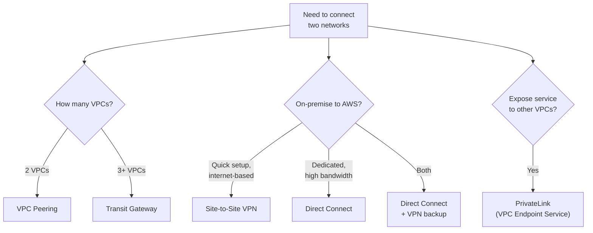
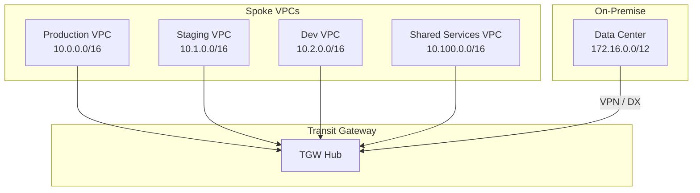
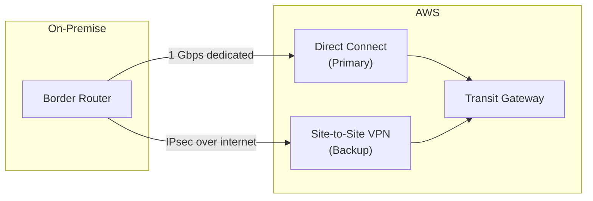

# Advanced AWS Networking with Terraform

## Overview

As organizations scale beyond a single VPC, they need connectivity patterns that span multiple VPCs, regions, and on-premise data centers. This guide covers Transit Gateway, VPC Peering, PrivateLink, Direct Connect, and VPN — all with production Terraform configurations.

---

## Connectivity Decision Framework



### Comparison

| Feature | VPC Peering | Transit Gateway | PrivateLink |
|---------|-------------|-----------------|-------------|
| Topology | 1:1 | Hub-and-spoke | Service endpoint |
| Transitive Routing | No | Yes | N/A |
| Cross-Region | Yes | Yes (inter-region peering) | Yes |
| Cross-Account | Yes | Yes (RAM sharing) | Yes |
| Bandwidth | No limit | 50 Gbps per AZ | Endpoint bandwidth |
| Cost | Data transfer only | $0.05/hr + data | $0.01/hr + data |
| Max Connections | 125 per VPC | 5,000 attachments | Per-service |

---

## Transit Gateway

Transit Gateway acts as a cloud router connecting VPCs, VPNs, and Direct Connect gateways through a central hub.



### Transit Gateway Setup

```hcl
resource "aws_ec2_transit_gateway" "main" {
  description = "Central transit gateway"

  amazon_side_asn                 = 64512
  auto_accept_shared_attachments  = "disable"
  default_route_table_association = "disable"
  default_route_table_propagation = "disable"
  dns_support                     = "enable"
  vpn_ecmp_support                = "enable"
  multicast_support               = "disable"

  tags = {
    Name = "${var.environment}-transit-gateway"
  }
}

# Share via RAM for cross-account
resource "aws_ram_resource_share" "tgw" {
  name                      = "transit-gateway-share"
  allow_external_principals = false  # Same org only

  tags = {
    Name = "transit-gateway-share"
  }
}

resource "aws_ram_resource_association" "tgw" {
  resource_arn       = aws_ec2_transit_gateway.main.arn
  resource_share_arn = aws_ram_resource_share.tgw.arn
}

resource "aws_ram_principal_association" "org" {
  principal          = var.organization_arn
  resource_share_arn = aws_ram_resource_share.tgw.arn
}
```

### Route Tables and Associations

```hcl
# Separate route tables for isolation
resource "aws_ec2_transit_gateway_route_table" "production" {
  transit_gateway_id = aws_ec2_transit_gateway.main.id

  tags = {
    Name = "production-routes"
  }
}

resource "aws_ec2_transit_gateway_route_table" "non_production" {
  transit_gateway_id = aws_ec2_transit_gateway.main.id

  tags = {
    Name = "non-production-routes"
  }
}

resource "aws_ec2_transit_gateway_route_table" "shared_services" {
  transit_gateway_id = aws_ec2_transit_gateway.main.id

  tags = {
    Name = "shared-services-routes"
  }
}

# VPC Attachments
resource "aws_ec2_transit_gateway_vpc_attachment" "production" {
  transit_gateway_id = aws_ec2_transit_gateway.main.id
  vpc_id             = var.production_vpc_id
  subnet_ids         = var.production_tgw_subnet_ids

  transit_gateway_default_route_table_association = false
  transit_gateway_default_route_table_propagation = false

  tags = {
    Name = "production-attachment"
  }
}

resource "aws_ec2_transit_gateway_vpc_attachment" "shared" {
  transit_gateway_id = aws_ec2_transit_gateway.main.id
  vpc_id             = var.shared_vpc_id
  subnet_ids         = var.shared_tgw_subnet_ids

  transit_gateway_default_route_table_association = false
  transit_gateway_default_route_table_propagation = false

  tags = {
    Name = "shared-services-attachment"
  }
}

# Route table associations
resource "aws_ec2_transit_gateway_route_table_association" "production" {
  transit_gateway_attachment_id  = aws_ec2_transit_gateway_vpc_attachment.production.id
  transit_gateway_route_table_id = aws_ec2_transit_gateway_route_table.production.id
}

# Propagations — production can reach shared services
resource "aws_ec2_transit_gateway_route_table_propagation" "prod_to_shared" {
  transit_gateway_attachment_id  = aws_ec2_transit_gateway_vpc_attachment.shared.id
  transit_gateway_route_table_id = aws_ec2_transit_gateway_route_table.production.id
}

# Shared services can reach production
resource "aws_ec2_transit_gateway_route_table_propagation" "shared_to_prod" {
  transit_gateway_attachment_id  = aws_ec2_transit_gateway_vpc_attachment.production.id
  transit_gateway_route_table_id = aws_ec2_transit_gateway_route_table.shared_services.id
}

# VPC route table entries — point non-local traffic to TGW
resource "aws_route" "production_to_tgw" {
  count = length(var.production_private_route_table_ids)

  route_table_id         = var.production_private_route_table_ids[count.index]
  destination_cidr_block = "10.0.0.0/8"
  transit_gateway_id     = aws_ec2_transit_gateway.main.id
}
```

### Inter-Region Transit Gateway Peering

```hcl
resource "aws_ec2_transit_gateway_peering_attachment" "cross_region" {
  transit_gateway_id      = aws_ec2_transit_gateway.main.id
  peer_transit_gateway_id = var.peer_tgw_id
  peer_region             = var.peer_region

  tags = {
    Name = "cross-region-peering"
  }
}

# Accepter (in the peer region)
resource "aws_ec2_transit_gateway_peering_attachment_accepter" "cross_region" {
  provider = aws.peer_region

  transit_gateway_attachment_id = aws_ec2_transit_gateway_peering_attachment.cross_region.id

  tags = {
    Name = "cross-region-peering-accepted"
  }
}
```

---

## VPC Peering

Best for simple, two-VPC connectivity when you do not need transitive routing.

```hcl
resource "aws_vpc_peering_connection" "main" {
  vpc_id        = var.requester_vpc_id
  peer_vpc_id   = var.accepter_vpc_id
  peer_owner_id = var.accepter_account_id
  peer_region   = var.accepter_region
  auto_accept   = false  # Cross-account requires manual accept

  tags = {
    Name = "vpc-peering-${var.requester_name}-to-${var.accepter_name}"
  }
}

# Accepter side
resource "aws_vpc_peering_connection_accepter" "main" {
  provider                  = aws.accepter
  vpc_peering_connection_id = aws_vpc_peering_connection.main.id
  auto_accept               = true

  tags = {
    Name = "vpc-peering-${var.accepter_name}-from-${var.requester_name}"
  }
}

# Requester route
resource "aws_route" "requester" {
  count = length(var.requester_route_table_ids)

  route_table_id            = var.requester_route_table_ids[count.index]
  destination_cidr_block    = var.accepter_vpc_cidr
  vpc_peering_connection_id = aws_vpc_peering_connection.main.id
}

# Accepter route
resource "aws_route" "accepter" {
  provider = aws.accepter
  count    = length(var.accepter_route_table_ids)

  route_table_id            = var.accepter_route_table_ids[count.index]
  destination_cidr_block    = var.requester_vpc_cidr
  vpc_peering_connection_id = aws_vpc_peering_connection.main.id
}
```

---

## PrivateLink (VPC Endpoint Services)

PrivateLink exposes a service behind an NLB to consumers in other VPCs or accounts without requiring peering or routing changes.

```hcl
# Provider side — expose a service
resource "aws_vpc_endpoint_service" "main" {
  acceptance_required        = true
  network_load_balancer_arns = [var.nlb_arn]

  allowed_principals = var.allowed_consumer_arns

  tags = {
    Name = "${var.environment}-endpoint-service"
  }
}

# Consumer side — connect to the service
resource "aws_vpc_endpoint" "service" {
  vpc_id              = var.consumer_vpc_id
  service_name        = aws_vpc_endpoint_service.main.service_name
  vpc_endpoint_type   = "Interface"
  private_dns_enabled = false

  subnet_ids         = var.consumer_subnet_ids
  security_group_ids = [aws_security_group.endpoint.id]

  tags = {
    Name = "${var.environment}-service-endpoint"
  }
}

# Private DNS with Route 53
resource "aws_route53_zone" "private" {
  name = "internal.${var.domain}"

  vpc {
    vpc_id = var.consumer_vpc_id
  }
}

resource "aws_route53_record" "endpoint" {
  zone_id = aws_route53_zone.private.zone_id
  name    = "api.internal.${var.domain}"
  type    = "A"

  alias {
    name                   = aws_vpc_endpoint.service.dns_entry[0].dns_name
    zone_id                = aws_vpc_endpoint.service.dns_entry[0].hosted_zone_id
    evaluate_target_health = true
  }
}
```

---

## Site-to-Site VPN

```hcl
# Customer Gateway (your on-premise device)
resource "aws_customer_gateway" "main" {
  bgp_asn    = 65000
  ip_address = var.on_prem_gateway_ip
  type       = "ipsec.1"

  tags = {
    Name = "${var.environment}-customer-gateway"
  }
}

# VPN Gateway (attached to VPC or TGW)
resource "aws_vpn_gateway" "main" {
  vpc_id          = var.vpc_id
  amazon_side_asn = 64512

  tags = {
    Name = "${var.environment}-vpn-gateway"
  }
}

# VPN Connection
resource "aws_vpn_connection" "main" {
  customer_gateway_id = aws_customer_gateway.main.id
  vpn_gateway_id      = aws_vpn_gateway.main.id
  type                = "ipsec.1"
  static_routes_only  = false  # Use BGP

  tunnel1_ike_versions                 = ["ikev2"]
  tunnel1_phase1_dh_group_numbers      = [20, 21]
  tunnel1_phase1_encryption_algorithms = ["AES256-GCM-16"]
  tunnel1_phase2_dh_group_numbers      = [20, 21]
  tunnel1_phase2_encryption_algorithms = ["AES256-GCM-16"]

  tunnel2_ike_versions                 = ["ikev2"]
  tunnel2_phase1_dh_group_numbers      = [20, 21]
  tunnel2_phase1_encryption_algorithms = ["AES256-GCM-16"]
  tunnel2_phase2_dh_group_numbers      = [20, 21]
  tunnel2_phase2_encryption_algorithms = ["AES256-GCM-16"]

  tags = {
    Name = "${var.environment}-vpn-connection"
  }
}

# Enable route propagation
resource "aws_vpn_gateway_route_propagation" "private" {
  count = length(var.private_route_table_ids)

  vpn_gateway_id = aws_vpn_gateway.main.id
  route_table_id = var.private_route_table_ids[count.index]
}
```

---

## Direct Connect

Direct Connect provides a dedicated network connection from your data center to AWS.

```hcl
# Request a hosted connection from your DX partner
# or use a dedicated connection if you own the cross-connect

resource "aws_dx_gateway" "main" {
  name            = "${var.environment}-dx-gateway"
  amazon_side_asn = 64512
}

# Virtual Interface
resource "aws_dx_private_virtual_interface" "main" {
  connection_id  = var.dx_connection_id
  dx_gateway_id  = aws_dx_gateway.main.id
  name           = "${var.environment}-private-vif"
  vlan           = var.vlan_id
  bgp_asn        = 65000
  address_family = "ipv4"

  tags = {
    Name = "${var.environment}-dx-private-vif"
  }
}

# Associate DX Gateway with Transit Gateway
resource "aws_dx_gateway_association" "tgw" {
  dx_gateway_id         = aws_dx_gateway.main.id
  associated_gateway_id = aws_ec2_transit_gateway.main.id

  allowed_prefixes = [
    "10.0.0.0/8",
  ]
}
```

### Direct Connect + VPN Failover



---

## Network Architecture Patterns

### Hub-and-Spoke with Inspection

```hcl
# Inspection VPC with Network Firewall
resource "aws_networkfirewall_firewall" "inspection" {
  name                = "${var.environment}-inspection-firewall"
  firewall_policy_arn = aws_networkfirewall_firewall_policy.main.arn
  vpc_id              = var.inspection_vpc_id

  dynamic "subnet_mapping" {
    for_each = var.firewall_subnet_ids
    content {
      subnet_id = subnet_mapping.value
    }
  }

  tags = {
    Name = "${var.environment}-network-firewall"
  }
}

resource "aws_networkfirewall_firewall_policy" "main" {
  name = "${var.environment}-firewall-policy"

  firewall_policy {
    stateless_default_actions          = ["aws:forward_to_sfe"]
    stateless_fragment_default_actions = ["aws:forward_to_sfe"]

    stateful_engine_options {
      rule_order = "STRICT_ORDER"
    }

    stateful_rule_group_reference {
      priority     = 1
      resource_arn = aws_networkfirewall_rule_group.domain_allowlist.arn
    }
  }

  tags = {
    Name = "${var.environment}-firewall-policy"
  }
}

resource "aws_networkfirewall_rule_group" "domain_allowlist" {
  capacity = 100
  name     = "${var.environment}-domain-allowlist"
  type     = "STATEFUL"

  rule_group {
    rule_variables {
      ip_sets {
        key = "HOME_NET"
        ip_set {
          definition = ["10.0.0.0/8"]
        }
      }
    }

    rules_source {
      rules_source_list {
        generated_rules_type = "ALLOWLIST"
        target_types         = ["HTTP_HOST", "TLS_SNI"]
        targets = [
          ".amazonaws.com",
          ".github.com",
          ".docker.io",
        ]
      }
    }

    stateful_rule_options {
      capacity = 100
    }
  }

  tags = {
    Name = "${var.environment}-domain-allowlist"
  }
}
```

---

## DNS and Hybrid Resolution

```hcl
# Route 53 Resolver — forward DNS queries to on-premise
resource "aws_route53_resolver_endpoint" "outbound" {
  name      = "${var.environment}-outbound-resolver"
  direction = "OUTBOUND"

  security_group_ids = [aws_security_group.resolver.id]

  dynamic "ip_address" {
    for_each = var.resolver_subnet_ids
    content {
      subnet_id = ip_address.value
    }
  }

  tags = {
    Name = "${var.environment}-outbound-resolver"
  }
}

resource "aws_route53_resolver_rule" "on_prem" {
  domain_name          = "corp.internal"
  name                 = "forward-to-onprem"
  rule_type            = "FORWARD"
  resolver_endpoint_id = aws_route53_resolver_endpoint.outbound.id

  dynamic "target_ip" {
    for_each = var.on_prem_dns_servers
    content {
      ip = target_ip.value
    }
  }

  tags = {
    Name = "forward-corp-internal"
  }
}

# Share rule across accounts via RAM
resource "aws_route53_resolver_rule_association" "main" {
  resolver_rule_id = aws_route53_resolver_rule.on_prem.id
  vpc_id           = var.vpc_id
}
```

---

## Best Practices

1. **Use Transit Gateway** when connecting 3+ VPCs — VPC peering does not scale and lacks transitive routing.
2. **Segment TGW route tables** to isolate production from non-production traffic.
3. **Always configure both VPN tunnels** — AWS maintenance can take down one tunnel.
4. **Use BGP over static routing** for VPN and Direct Connect — it provides automatic failover.
5. **Deploy Direct Connect in pairs** across different DX locations for redundancy.
6. **Use PrivateLink** to expose services — avoids opening broad network access.
7. **Enable VPC Flow Logs** on all interconnected VPCs for troubleshooting.
8. **Plan CIDRs upfront** — overlapping CIDRs block peering and TGW connectivity.

---

## Related Guides

- [Networking](networking.md) — VPC, subnet, and route table fundamentals
- [Security](security.md) — Network security layers
- [Disaster Recovery](../07-production-patterns/disaster-recovery.md) — Multi-region connectivity
