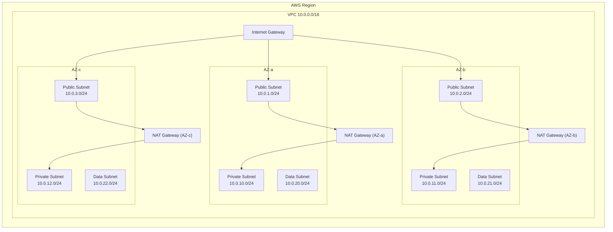

# AWS Networking with Terraform

## Overview

Amazon VPC (Virtual Private Cloud) is the foundational networking layer for nearly every AWS resource. This guide covers VPC architecture, CIDR planning, subnet design, routing, internet and NAT gateways, VPC endpoints, and multi-AZ patterns — all managed through Terraform.

---

## Architecture Overview



---

## CIDR Planning

CIDR planning is the single most important networking decision. Mistakes here cascade into peering conflicts, IP exhaustion, and painful migrations.

### Guidelines

| VPC Size | CIDR | Usable IPs | Best For |
|----------|------|------------|----------|
| Small | /24 | 251 | Dev/sandbox |
| Medium | /20 | 4,091 | Single-team workloads |
| Large | /16 | 65,531 | Production, multi-service |

### Non-Overlapping Allocation Scheme

Reserve ranges per environment to avoid peering conflicts:

| Environment | CIDR Block | Notes |
|------------|------------|-------|
| Production | 10.0.0.0/16 | Largest allocation |
| Staging | 10.1.0.0/16 | Mirror of production |
| Development | 10.2.0.0/16 | Shared dev environment |
| Sandbox | 10.3.0.0/20 | Smaller, ephemeral |
| Corporate VPN | 172.16.0.0/16 | On-premise range |

### Subnet Sizing

AWS reserves 5 IPs per subnet (first four and last). A /24 gives 251 usable addresses. For EKS clusters or large ASGs, use /20 or /19 subnets in private tiers.

---

## Complete VPC Module

```hcl
# variables.tf
variable "vpc_cidr" {
  description = "CIDR block for the VPC"
  type        = string
  default     = "10.0.0.0/16"
}

variable "environment" {
  description = "Environment name"
  type        = string
}

variable "availability_zones" {
  description = "List of AZs to use"
  type        = list(string)
  default     = ["us-east-1a", "us-east-1b", "us-east-1c"]
}

variable "enable_nat_gateway" {
  description = "Enable NAT gateways for private subnets"
  type        = bool
  default     = true
}

variable "single_nat_gateway" {
  description = "Use a single NAT gateway (cost saving for non-prod)"
  type        = bool
  default     = false
}

# main.tf
resource "aws_vpc" "main" {
  cidr_block           = var.vpc_cidr
  enable_dns_hostnames = true
  enable_dns_support   = true

  tags = {
    Name        = "${var.environment}-vpc"
    Environment = var.environment
    ManagedBy   = "terraform"
  }
}

# Public Subnets — one per AZ
resource "aws_subnet" "public" {
  count                   = length(var.availability_zones)
  vpc_id                  = aws_vpc.main.id
  cidr_block              = cidrsubnet(var.vpc_cidr, 8, count.index + 1)
  availability_zone       = var.availability_zones[count.index]
  map_public_ip_on_launch = true

  tags = {
    Name                     = "${var.environment}-public-${var.availability_zones[count.index]}"
    "kubernetes.io/role/elb" = "1"
    Tier                     = "public"
  }
}

# Private Subnets — application tier
resource "aws_subnet" "private" {
  count             = length(var.availability_zones)
  vpc_id            = aws_vpc.main.id
  cidr_block        = cidrsubnet(var.vpc_cidr, 8, count.index + 10)
  availability_zone = var.availability_zones[count.index]

  tags = {
    Name                              = "${var.environment}-private-${var.availability_zones[count.index]}"
    "kubernetes.io/role/internal-elb" = "1"
    Tier                              = "private"
  }
}

# Data Subnets — databases, caches
resource "aws_subnet" "data" {
  count             = length(var.availability_zones)
  vpc_id            = aws_vpc.main.id
  cidr_block        = cidrsubnet(var.vpc_cidr, 8, count.index + 20)
  availability_zone = var.availability_zones[count.index]

  tags = {
    Name = "${var.environment}-data-${var.availability_zones[count.index]}"
    Tier = "data"
  }
}
```

---

## Internet Gateway and NAT Gateways

```hcl
# Internet Gateway
resource "aws_internet_gateway" "main" {
  vpc_id = aws_vpc.main.id

  tags = {
    Name = "${var.environment}-igw"
  }
}

# Elastic IPs for NAT Gateways
resource "aws_eip" "nat" {
  count  = var.enable_nat_gateway ? (var.single_nat_gateway ? 1 : length(var.availability_zones)) : 0
  domain = "vpc"

  tags = {
    Name = "${var.environment}-nat-eip-${count.index}"
  }

  depends_on = [aws_internet_gateway.main]
}

# NAT Gateways — placed in public subnets
resource "aws_nat_gateway" "main" {
  count         = var.enable_nat_gateway ? (var.single_nat_gateway ? 1 : length(var.availability_zones)) : 0
  allocation_id = aws_eip.nat[count.index].id
  subnet_id     = aws_subnet.public[count.index].id

  tags = {
    Name = "${var.environment}-nat-${count.index}"
  }

  depends_on = [aws_internet_gateway.main]
}
```

---

## Route Tables

```hcl
# Public route table — routes to IGW
resource "aws_route_table" "public" {
  vpc_id = aws_vpc.main.id

  route {
    cidr_block = "0.0.0.0/0"
    gateway_id = aws_internet_gateway.main.id
  }

  tags = {
    Name = "${var.environment}-public-rt"
  }
}

resource "aws_route_table_association" "public" {
  count          = length(var.availability_zones)
  subnet_id      = aws_subnet.public[count.index].id
  route_table_id = aws_route_table.public.id
}

# Private route tables — one per AZ for HA NAT routing
resource "aws_route_table" "private" {
  count  = length(var.availability_zones)
  vpc_id = aws_vpc.main.id

  tags = {
    Name = "${var.environment}-private-rt-${var.availability_zones[count.index]}"
  }
}

resource "aws_route" "private_nat" {
  count                  = var.enable_nat_gateway ? length(var.availability_zones) : 0
  route_table_id         = aws_route_table.private[count.index].id
  destination_cidr_block = "0.0.0.0/0"
  nat_gateway_id         = var.single_nat_gateway ? aws_nat_gateway.main[0].id : aws_nat_gateway.main[count.index].id
}

resource "aws_route_table_association" "private" {
  count          = length(var.availability_zones)
  subnet_id      = aws_subnet.private[count.index].id
  route_table_id = aws_route_table.private[count.index].id
}

# Data subnets share private route tables (no direct internet needed)
resource "aws_route_table_association" "data" {
  count          = length(var.availability_zones)
  subnet_id      = aws_subnet.data[count.index].id
  route_table_id = aws_route_table.private[count.index].id
}
```

---

## VPC Endpoints

VPC endpoints eliminate the need for NAT gateway traffic to reach AWS services, reducing cost and latency.

### Gateway Endpoints (Free)

```hcl
# S3 Gateway Endpoint — no cost, always enable
resource "aws_vpc_endpoint" "s3" {
  vpc_id       = aws_vpc.main.id
  service_name = "com.amazonaws.${data.aws_region.current.name}.s3"

  route_table_ids = concat(
    [aws_route_table.public.id],
    aws_route_table.private[*].id
  )

  tags = {
    Name = "${var.environment}-s3-endpoint"
  }
}

# DynamoDB Gateway Endpoint — also free
resource "aws_vpc_endpoint" "dynamodb" {
  vpc_id       = aws_vpc.main.id
  service_name = "com.amazonaws.${data.aws_region.current.name}.dynamodb"

  route_table_ids = aws_route_table.private[*].id

  tags = {
    Name = "${var.environment}-dynamodb-endpoint"
  }
}

data "aws_region" "current" {}
```

### Interface Endpoints (ENI-based)

```hcl
resource "aws_security_group" "vpc_endpoints" {
  name_prefix = "${var.environment}-vpce-"
  vpc_id      = aws_vpc.main.id

  ingress {
    from_port   = 443
    to_port     = 443
    protocol    = "tcp"
    cidr_blocks = [var.vpc_cidr]
  }

  tags = {
    Name = "${var.environment}-vpce-sg"
  }
}

locals {
  interface_endpoints = [
    "ecr.api",
    "ecr.dkr",
    "ecs",
    "logs",
    "monitoring",
    "sts",
    "ssm",
    "ssmmessages",
    "ec2messages",
    "secretsmanager",
  ]
}

resource "aws_vpc_endpoint" "interface" {
  for_each = toset(local.interface_endpoints)

  vpc_id              = aws_vpc.main.id
  service_name        = "com.amazonaws.${data.aws_region.current.name}.${each.value}"
  vpc_endpoint_type   = "Interface"
  private_dns_enabled = true

  subnet_ids         = aws_subnet.private[*].id
  security_group_ids = [aws_security_group.vpc_endpoints.id]

  tags = {
    Name = "${var.environment}-${each.value}-endpoint"
  }
}
```

---

## Network ACLs

NACLs provide a stateless firewall at the subnet level. Use them as a coarse-grained backup to security groups.

```hcl
resource "aws_network_acl" "data" {
  vpc_id     = aws_vpc.main.id
  subnet_ids = aws_subnet.data[*].id

  # Allow inbound from private subnets only
  ingress {
    rule_no    = 100
    action     = "allow"
    protocol   = "tcp"
    from_port  = 3306
    to_port    = 3306
    cidr_block = var.vpc_cidr
  }

  ingress {
    rule_no    = 110
    action     = "allow"
    protocol   = "tcp"
    from_port  = 5432
    to_port    = 5432
    cidr_block = var.vpc_cidr
  }

  # Allow ephemeral return traffic
  ingress {
    rule_no    = 200
    action     = "allow"
    protocol   = "tcp"
    from_port  = 1024
    to_port    = 65535
    cidr_block = var.vpc_cidr
  }

  # Allow all outbound within VPC
  egress {
    rule_no    = 100
    action     = "allow"
    protocol   = "-1"
    from_port  = 0
    to_port    = 0
    cidr_block = var.vpc_cidr
  }

  tags = {
    Name = "${var.environment}-data-nacl"
  }
}
```

---

## Flow Logs

Always enable VPC Flow Logs in production for troubleshooting and compliance.

```hcl
resource "aws_flow_log" "vpc" {
  vpc_id                   = aws_vpc.main.id
  traffic_type             = "ALL"
  log_destination_type     = "cloud-watch-logs"
  log_destination          = aws_cloudwatch_log_group.flow_logs.arn
  iam_role_arn             = aws_iam_role.flow_logs.arn
  max_aggregation_interval = 60

  tags = {
    Name = "${var.environment}-vpc-flow-logs"
  }
}

resource "aws_cloudwatch_log_group" "flow_logs" {
  name              = "/aws/vpc/flow-logs/${var.environment}"
  retention_in_days = 90

  tags = {
    Environment = var.environment
  }
}

resource "aws_iam_role" "flow_logs" {
  name = "${var.environment}-vpc-flow-logs-role"

  assume_role_policy = jsonencode({
    Version = "2012-10-17"
    Statement = [{
      Action = "sts:AssumeRole"
      Effect = "Allow"
      Principal = {
        Service = "vpc-flow-logs.amazonaws.com"
      }
    }]
  })
}

resource "aws_iam_role_policy" "flow_logs" {
  name = "flow-logs-policy"
  role = aws_iam_role.flow_logs.id

  policy = jsonencode({
    Version = "2012-10-17"
    Statement = [{
      Action = [
        "logs:CreateLogGroup",
        "logs:CreateLogStream",
        "logs:PutLogEvents",
        "logs:DescribeLogGroups",
        "logs:DescribeLogStreams",
      ]
      Effect   = "Allow"
      Resource = "*"
    }]
  })
}
```

---

## Multi-AZ Design Principles

1. **Spread across at least 3 AZs** for fault tolerance. Two-AZ designs lose 50% capacity during an AZ failure.
2. **Per-AZ NAT gateways** in production. A single NAT gateway creates a cross-AZ dependency.
3. **Use `cidrsubnet()`** for deterministic, conflict-free subnet allocation.
4. **Tag subnets for Kubernetes** with `kubernetes.io/role/elb` and `kubernetes.io/role/internal-elb` if running EKS.
5. **Enable DNS hostnames and DNS support** — required for VPC endpoints and many AWS services.

---

## Outputs

```hcl
output "vpc_id" {
  description = "The ID of the VPC"
  value       = aws_vpc.main.id
}

output "public_subnet_ids" {
  description = "List of public subnet IDs"
  value       = aws_subnet.public[*].id
}

output "private_subnet_ids" {
  description = "List of private subnet IDs"
  value       = aws_subnet.private[*].id
}

output "data_subnet_ids" {
  description = "List of data subnet IDs"
  value       = aws_subnet.data[*].id
}

output "nat_gateway_ips" {
  description = "Elastic IPs of NAT gateways"
  value       = aws_eip.nat[*].public_ip
}
```

---

## Cost Considerations

| Resource | Cost (us-east-1) | Notes |
|----------|------------------|-------|
| VPC | Free | No charge for the VPC itself |
| NAT Gateway | ~$0.045/hr + $0.045/GB | ~$32/mo per gateway at minimum |
| Interface Endpoint | ~$0.01/hr per AZ | ~$7.20/mo per endpoint per AZ |
| Gateway Endpoint | Free | Always enable S3 and DynamoDB |
| Elastic IP (unused) | $0.005/hr | Charged when not attached |

### Cost Optimization Tips

- Use a **single NAT gateway** in dev/staging environments.
- Consolidate interface endpoints — only create those your workloads actually use.
- Use **gateway endpoints** (S3, DynamoDB) before interface endpoints where available.
- Consider **NAT instances** (t4g.nano) for very low-traffic dev environments.

---

## Related Guides

- [Advanced Networking](networking-advanced.md) — Transit Gateway, VPC Peering, PrivateLink
- [Security](security.md) — Security groups, NACLs, WAF
- [EKS Terraform](../06-kubernetes/eks-terraform.md) — VPC design for Kubernetes
