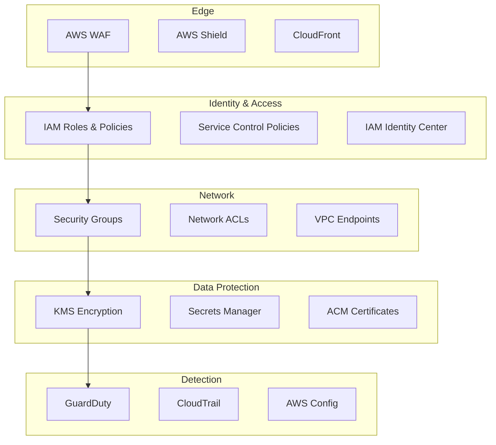

# AWS Security with Terraform

## Overview

Security in AWS follows a defense-in-depth strategy with multiple layers: identity (IAM), encryption (KMS), secrets management, certificate management (ACM), edge protection (WAF, Shield), and threat detection (GuardDuty). This guide covers Terraform patterns for each layer.

---

## Security Layers



---

## IAM — Identity and Access Management

### Principle of Least Privilege

```hcl
# Application role with minimal permissions
resource "aws_iam_role" "app" {
  name = "${var.environment}-${var.app_name}-role"

  assume_role_policy = jsonencode({
    Version = "2012-10-17"
    Statement = [{
      Effect = "Allow"
      Action = "sts:AssumeRole"
      Principal = {
        Service = "ecs-tasks.amazonaws.com"
      }
      Condition = {
        StringEquals = {
          "aws:SourceAccount" = data.aws_caller_identity.current.account_id
        }
      }
    }]
  })

  tags = {
    Environment = var.environment
    Application = var.app_name
  }
}

# Scoped policy — only the S3 bucket this app needs
resource "aws_iam_role_policy" "app_s3" {
  name = "s3-access"
  role = aws_iam_role.app.id

  policy = jsonencode({
    Version = "2012-10-17"
    Statement = [
      {
        Sid    = "ReadWriteAppBucket"
        Effect = "Allow"
        Action = [
          "s3:GetObject",
          "s3:PutObject",
          "s3:DeleteObject",
          "s3:ListBucket",
        ]
        Resource = [
          var.app_bucket_arn,
          "${var.app_bucket_arn}/*",
        ]
      },
      {
        Sid    = "DecryptWithKMS"
        Effect = "Allow"
        Action = [
          "kms:Decrypt",
          "kms:GenerateDataKey",
        ]
        Resource = [var.kms_key_arn]
      }
    ]
  })
}

data "aws_caller_identity" "current" {}
```

### IAM Permission Boundaries

```hcl
# Permission boundary — caps what any role in the account can do
resource "aws_iam_policy" "boundary" {
  name = "${var.environment}-permission-boundary"

  policy = jsonencode({
    Version = "2012-10-17"
    Statement = [
      {
        Sid    = "AllowedServices"
        Effect = "Allow"
        Action = [
          "s3:*",
          "dynamodb:*",
          "sqs:*",
          "sns:*",
          "logs:*",
          "cloudwatch:*",
          "ecr:*",
          "ecs:*",
          "secretsmanager:GetSecretValue",
          "kms:Decrypt",
          "kms:GenerateDataKey",
        ]
        Resource = "*"
      },
      {
        Sid      = "DenyDangerousActions"
        Effect   = "Deny"
        Action = [
          "iam:CreateUser",
          "iam:CreateAccessKey",
          "organizations:*",
          "account:*",
        ]
        Resource = "*"
      },
      {
        Sid      = "RestrictToRegion"
        Effect   = "Deny"
        Action   = "*"
        Resource = "*"
        Condition = {
          StringNotEquals = {
            "aws:RequestedRegion" = var.allowed_regions
          }
        }
      }
    ]
  })
}
```

### IRSA — IAM Roles for Service Accounts (EKS)

```hcl
module "irsa" {
  source = "./modules/irsa"

  cluster_name      = var.cluster_name
  namespace         = "app"
  service_account   = "my-app"
  oidc_provider_arn = var.oidc_provider_arn
  oidc_provider_url = var.oidc_provider_url
  policy_arns       = [aws_iam_policy.app_access.arn]
}

# modules/irsa/main.tf
resource "aws_iam_role" "irsa" {
  name = "${var.cluster_name}-${var.namespace}-${var.service_account}"

  assume_role_policy = jsonencode({
    Version = "2012-10-17"
    Statement = [{
      Effect = "Allow"
      Action = "sts:AssumeRoleWithWebIdentity"
      Principal = {
        Federated = var.oidc_provider_arn
      }
      Condition = {
        StringEquals = {
          "${var.oidc_provider_url}:sub" = "system:serviceaccount:${var.namespace}:${var.service_account}"
          "${var.oidc_provider_url}:aud" = "sts.amazonaws.com"
        }
      }
    }]
  })
}

resource "aws_iam_role_policy_attachment" "irsa" {
  for_each   = toset(var.policy_arns)
  role       = aws_iam_role.irsa.name
  policy_arn = each.value
}
```

---

## KMS — Key Management Service

```hcl
resource "aws_kms_key" "main" {
  description             = "Main encryption key for ${var.environment}"
  deletion_window_in_days = 30
  enable_key_rotation     = true
  rotation_period_in_days = 365

  policy = jsonencode({
    Version = "2012-10-17"
    Statement = [
      {
        Sid    = "RootAccountFullAccess"
        Effect = "Allow"
        Principal = {
          AWS = "arn:aws:iam::${data.aws_caller_identity.current.account_id}:root"
        }
        Action   = "kms:*"
        Resource = "*"
      },
      {
        Sid    = "AllowKeyAdministration"
        Effect = "Allow"
        Principal = {
          AWS = var.key_admin_arns
        }
        Action = [
          "kms:Create*",
          "kms:Describe*",
          "kms:Enable*",
          "kms:List*",
          "kms:Put*",
          "kms:Update*",
          "kms:Revoke*",
          "kms:Disable*",
          "kms:Get*",
          "kms:Delete*",
          "kms:TagResource",
          "kms:UntagResource",
          "kms:ScheduleKeyDeletion",
          "kms:CancelKeyDeletion",
        ]
        Resource = "*"
      },
      {
        Sid    = "AllowKeyUsage"
        Effect = "Allow"
        Principal = {
          AWS = var.key_user_arns
        }
        Action = [
          "kms:Encrypt",
          "kms:Decrypt",
          "kms:ReEncrypt*",
          "kms:GenerateDataKey*",
          "kms:DescribeKey",
        ]
        Resource = "*"
      },
      {
        Sid    = "AllowAWSServiceUsage"
        Effect = "Allow"
        Principal = {
          AWS = "*"
        }
        Action = [
          "kms:Decrypt",
          "kms:GenerateDataKey*",
          "kms:CreateGrant",
          "kms:DescribeKey",
        ]
        Resource = "*"
        Condition = {
          StringEquals = {
            "kms:CallerAccount" = data.aws_caller_identity.current.account_id
            "kms:ViaService" = [
              "s3.${data.aws_region.current.name}.amazonaws.com",
              "rds.${data.aws_region.current.name}.amazonaws.com",
              "ebs.${data.aws_region.current.name}.amazonaws.com",
              "secretsmanager.${data.aws_region.current.name}.amazonaws.com",
            ]
          }
        }
      }
    ]
  })

  tags = {
    Name        = "${var.environment}-main-key"
    Environment = var.environment
  }
}

resource "aws_kms_alias" "main" {
  name          = "alias/${var.environment}-main"
  target_key_id = aws_kms_key.main.key_id
}

data "aws_region" "current" {}
```

---

## Secrets Manager

```hcl
resource "aws_secretsmanager_secret" "db_credentials" {
  name        = "${var.environment}/database/credentials"
  description = "Database credentials for ${var.environment}"
  kms_key_id  = aws_kms_key.main.arn

  # Automatic rotation
  recovery_window_in_days = 30

  tags = {
    Environment = var.environment
    AutoRotate  = "true"
  }
}

resource "aws_secretsmanager_secret_version" "db_credentials" {
  secret_id = aws_secretsmanager_secret.db_credentials.id

  secret_string = jsonencode({
    username = var.db_username
    password = var.db_password
    host     = var.db_endpoint
    port     = 5432
    dbname   = var.db_name
  })

  lifecycle {
    ignore_changes = [secret_string]  # After initial creation, rotation manages this
  }
}

# Rotation with Lambda
resource "aws_secretsmanager_secret_rotation" "db_credentials" {
  secret_id           = aws_secretsmanager_secret.db_credentials.id
  rotation_lambda_arn = var.rotation_lambda_arn

  rotation_rules {
    automatically_after_days = 30
  }
}

# Resource policy — restrict access
resource "aws_secretsmanager_secret_policy" "db_credentials" {
  secret_arn = aws_secretsmanager_secret.db_credentials.arn

  policy = jsonencode({
    Version = "2012-10-17"
    Statement = [{
      Sid    = "AllowAppAccess"
      Effect = "Allow"
      Principal = {
        AWS = [aws_iam_role.app.arn]
      }
      Action   = "secretsmanager:GetSecretValue"
      Resource = "*"
      Condition = {
        StringEquals = {
          "aws:PrincipalTag/Environment" = var.environment
        }
      }
    }]
  })
}
```

---

## ACM — AWS Certificate Manager

```hcl
resource "aws_acm_certificate" "main" {
  domain_name       = var.domain_name
  validation_method = "DNS"

  subject_alternative_names = [
    "*.${var.domain_name}",
  ]

  lifecycle {
    create_before_destroy = true
  }

  tags = {
    Name        = var.domain_name
    Environment = var.environment
  }
}

# DNS validation with Route 53
resource "aws_route53_record" "cert_validation" {
  for_each = {
    for dvo in aws_acm_certificate.main.domain_validation_options : dvo.domain_name => {
      name   = dvo.resource_record_name
      record = dvo.resource_record_value
      type   = dvo.resource_record_type
    }
  }

  allow_overwrite = true
  name            = each.value.name
  records         = [each.value.record]
  ttl             = 60
  type            = each.value.type
  zone_id         = var.hosted_zone_id
}

resource "aws_acm_certificate_validation" "main" {
  certificate_arn         = aws_acm_certificate.main.arn
  validation_record_fqdns = [for record in aws_route53_record.cert_validation : record.fqdn]
}
```

---

## WAF — Web Application Firewall

```hcl
resource "aws_wafv2_web_acl" "main" {
  name        = "${var.environment}-web-acl"
  description = "WAF ACL for ${var.environment}"
  scope       = "REGIONAL"  # Use CLOUDFRONT for CloudFront distributions

  default_action {
    allow {}
  }

  # AWS Managed Rules — Core Rule Set
  rule {
    name     = "AWSManagedRulesCommonRuleSet"
    priority = 1

    override_action {
      none {}
    }

    statement {
      managed_rule_group_statement {
        name        = "AWSManagedRulesCommonRuleSet"
        vendor_name = "AWS"
      }
    }

    visibility_config {
      sampled_requests_enabled   = true
      cloudwatch_metrics_enabled = true
      metric_name                = "CommonRuleSet"
    }
  }

  # SQL Injection protection
  rule {
    name     = "AWSManagedRulesSQLiRuleSet"
    priority = 2

    override_action {
      none {}
    }

    statement {
      managed_rule_group_statement {
        name        = "AWSManagedRulesSQLiRuleSet"
        vendor_name = "AWS"
      }
    }

    visibility_config {
      sampled_requests_enabled   = true
      cloudwatch_metrics_enabled = true
      metric_name                = "SQLiRuleSet"
    }
  }

  # Rate limiting
  rule {
    name     = "RateLimit"
    priority = 3

    action {
      block {}
    }

    statement {
      rate_based_statement {
        limit              = 2000
        aggregate_key_type = "IP"
      }
    }

    visibility_config {
      sampled_requests_enabled   = true
      cloudwatch_metrics_enabled = true
      metric_name                = "RateLimit"
    }
  }

  # Known bad inputs
  rule {
    name     = "AWSManagedRulesKnownBadInputsRuleSet"
    priority = 4

    override_action {
      none {}
    }

    statement {
      managed_rule_group_statement {
        name        = "AWSManagedRulesKnownBadInputsRuleSet"
        vendor_name = "AWS"
      }
    }

    visibility_config {
      sampled_requests_enabled   = true
      cloudwatch_metrics_enabled = true
      metric_name                = "KnownBadInputs"
    }
  }

  visibility_config {
    sampled_requests_enabled   = true
    cloudwatch_metrics_enabled = true
    metric_name                = "${var.environment}-web-acl"
  }

  tags = {
    Environment = var.environment
  }
}

# Associate with ALB
resource "aws_wafv2_web_acl_association" "alb" {
  resource_arn = var.alb_arn
  web_acl_arn  = aws_wafv2_web_acl.main.arn
}
```

---

## Shield Advanced

```hcl
# Shield Advanced subscription (account-level, $3000/month)
resource "aws_shield_subscription" "main" {
  auto_renew = "ENABLED"
}

# Protect specific resources
resource "aws_shield_protection" "alb" {
  name         = "${var.environment}-alb-protection"
  resource_arn = var.alb_arn

  depends_on = [aws_shield_subscription.main]
}

resource "aws_shield_protection" "cloudfront" {
  name         = "${var.environment}-cloudfront-protection"
  resource_arn = var.cloudfront_arn

  depends_on = [aws_shield_subscription.main]
}
```

---

## GuardDuty

```hcl
resource "aws_guardduty_detector" "main" {
  enable = true

  datasources {
    s3_logs {
      enable = true
    }

    kubernetes {
      audit_logs {
        enable = true
      }
    }

    malware_protection {
      scan_ec2_instance_with_findings {
        ebs_volumes {
          enable = true
        }
      }
    }
  }

  finding_publishing_frequency = "FIFTEEN_MINUTES"

  tags = {
    Environment = var.environment
  }
}

# SNS notification for findings
resource "aws_cloudwatch_event_rule" "guardduty" {
  name        = "${var.environment}-guardduty-findings"
  description = "GuardDuty findings"

  event_pattern = jsonencode({
    source      = ["aws.guardduty"]
    "detail-type" = ["GuardDuty Finding"]
    detail = {
      severity = [{ numeric = [">=", 4] }]  # MEDIUM and above
    }
  })
}

resource "aws_cloudwatch_event_target" "guardduty_sns" {
  rule = aws_cloudwatch_event_rule.guardduty.name
  arn  = var.security_sns_topic_arn
}
```

---

## Security Best Practices Checklist

1. **Never use IAM users for applications** — use IAM roles with temporary credentials.
2. **Enable MFA on all human accounts** — enforce via SCP.
3. **Rotate secrets automatically** — use Secrets Manager rotation lambdas.
4. **Encrypt everything** — EBS, S3, RDS, ElastiCache, Secrets Manager.
5. **Enable GuardDuty in all regions** — even regions you do not use.
6. **Use IMDSv2** — prevents SSRF-based metadata theft.
7. **Deploy WAF on all public endpoints** — start with AWS managed rules.
8. **Enable CloudTrail** — with log file validation and multi-region.
9. **Use VPC endpoints** — keep traffic off the public internet.
10. **Apply permission boundaries** — cap maximum permissions for all roles.

---

## Related Guides

- [Networking](networking.md) — Security groups, NACLs, VPC endpoints
- [Secrets Management](../07-production-patterns/secrets-management.md) — Detailed secrets patterns
- [Compliance and Governance](../07-production-patterns/compliance-and-governance.md) — AWS Config, SCPs
- [Pipeline Security](../05-cicd/pipeline-security.md) — OIDC and CI/CD security
