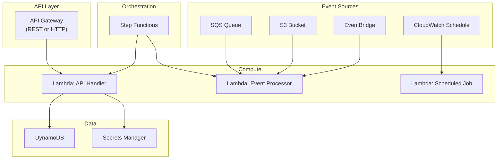

# AWS Serverless with Terraform

## Overview

AWS serverless services — Lambda, API Gateway, and Step Functions — let you build applications without managing servers. This guide covers Terraform patterns for each, event source configuration, and the practical trade-offs between SAM and Terraform for serverless workloads.

---

## Serverless Architecture



---

## Lambda Function

### Complete Lambda Resource

```hcl
resource "aws_lambda_function" "api" {
  function_name = "${var.environment}-${var.function_name}"
  role          = aws_iam_role.lambda.arn
  handler       = "index.handler"
  runtime       = "nodejs20.x"
  architectures = ["arm64"]  # Graviton — 20% cheaper, better perf
  timeout       = 30
  memory_size   = 256

  filename         = data.archive_file.lambda.output_path
  source_code_hash = data.archive_file.lambda.output_base64sha256

  environment {
    variables = {
      ENVIRONMENT   = var.environment
      TABLE_NAME    = var.dynamodb_table_name
      LOG_LEVEL     = var.environment == "production" ? "INFO" : "DEBUG"
    }
  }

  # VPC configuration (only if Lambda needs VPC resources)
  vpc_config {
    subnet_ids         = var.private_subnet_ids
    security_group_ids = [aws_security_group.lambda.id]
  }

  tracing_config {
    mode = "Active"  # X-Ray tracing
  }

  dead_letter_config {
    target_arn = aws_sqs_queue.lambda_dlq.arn
  }

  reserved_concurrent_executions = var.environment == "production" ? 100 : 10

  logging_config {
    log_format = "JSON"
    log_group  = aws_cloudwatch_log_group.lambda.name
  }

  tags = {
    Environment = var.environment
    Application = var.app_name
  }
}

data "archive_file" "lambda" {
  type        = "zip"
  source_dir  = "${path.module}/src"
  output_path = "${path.module}/dist/lambda.zip"
}

resource "aws_cloudwatch_log_group" "lambda" {
  name              = "/aws/lambda/${var.environment}-${var.function_name}"
  retention_in_days = var.environment == "production" ? 90 : 30
  kms_key_id        = var.kms_key_arn
}

# Lambda alias for stable invocation and traffic shifting
resource "aws_lambda_alias" "live" {
  name             = "live"
  function_name    = aws_lambda_function.api.function_name
  function_version = aws_lambda_function.api.version

  routing_config {
    additional_version_weights = {
      # Canary: send 10% to new version
      # (aws_lambda_function.api.version) = 0.1
    }
  }
}

# Provisioned concurrency for low-latency endpoints
resource "aws_lambda_provisioned_concurrency_config" "api" {
  count = var.environment == "production" ? 1 : 0

  function_name                  = aws_lambda_function.api.function_name
  qualifier                      = aws_lambda_alias.live.name
  provisioned_concurrent_executions = 5
}
```

### Lambda IAM Role

```hcl
resource "aws_iam_role" "lambda" {
  name = "${var.environment}-${var.function_name}-role"

  assume_role_policy = jsonencode({
    Version = "2012-10-17"
    Statement = [{
      Action = "sts:AssumeRole"
      Effect = "Allow"
      Principal = { Service = "lambda.amazonaws.com" }
    }]
  })
}

# VPC access (if using VPC config)
resource "aws_iam_role_policy_attachment" "vpc" {
  role       = aws_iam_role.lambda.name
  policy_arn = "arn:aws:iam::aws:policy/service-role/AWSLambdaVPCAccessExecutionRole"
}

# Custom permissions
resource "aws_iam_role_policy" "lambda" {
  name = "function-permissions"
  role = aws_iam_role.lambda.id

  policy = jsonencode({
    Version = "2012-10-17"
    Statement = [
      {
        Effect = "Allow"
        Action = [
          "logs:CreateLogStream",
          "logs:PutLogEvents",
        ]
        Resource = "${aws_cloudwatch_log_group.lambda.arn}:*"
      },
      {
        Effect = "Allow"
        Action = [
          "dynamodb:GetItem",
          "dynamodb:PutItem",
          "dynamodb:UpdateItem",
          "dynamodb:Query",
        ]
        Resource = [
          var.dynamodb_table_arn,
          "${var.dynamodb_table_arn}/index/*",
        ]
      },
      {
        Effect   = "Allow"
        Action   = ["secretsmanager:GetSecretValue"]
        Resource = [var.secret_arn]
      },
      {
        Effect = "Allow"
        Action = [
          "sqs:SendMessage",
          "sqs:ReceiveMessage",
          "sqs:DeleteMessage",
          "sqs:GetQueueAttributes",
        ]
        Resource = [aws_sqs_queue.lambda_dlq.arn]
      },
      {
        Effect   = "Allow"
        Action   = ["xray:PutTraceSegments", "xray:PutTelemetryRecords"]
        Resource = ["*"]
      }
    ]
  })
}
```

---

## Event Source Mappings

```hcl
# SQS event source
resource "aws_lambda_event_source_mapping" "sqs" {
  event_source_arn = var.sqs_queue_arn
  function_name    = aws_lambda_function.api.arn
  batch_size       = 10
  maximum_batching_window_in_seconds = 30

  function_response_types = ["ReportBatchItemFailures"]

  scaling_config {
    maximum_concurrency = 50
  }

  filter_criteria {
    filter {
      pattern = jsonencode({
        body = {
          event_type = ["order.created"]
        }
      })
    }
  }
}

# DynamoDB Streams event source
resource "aws_lambda_event_source_mapping" "dynamodb" {
  event_source_arn  = var.dynamodb_stream_arn
  function_name     = aws_lambda_function.api.arn
  starting_position = "LATEST"
  batch_size        = 100

  maximum_retry_attempts         = 3
  maximum_record_age_in_seconds  = 3600
  bisect_batch_on_function_error = true
  parallelization_factor         = 5

  destination_config {
    on_failure {
      destination_arn = aws_sqs_queue.lambda_dlq.arn
    }
  }

  filter_criteria {
    filter {
      pattern = jsonencode({
        eventName = ["INSERT", "MODIFY"]
      })
    }
  }
}

# S3 event trigger
resource "aws_lambda_permission" "s3" {
  statement_id  = "AllowS3Invoke"
  action        = "lambda:InvokeFunction"
  function_name = aws_lambda_function.api.function_name
  principal     = "s3.amazonaws.com"
  source_arn    = var.s3_bucket_arn
}

resource "aws_s3_bucket_notification" "lambda" {
  bucket = var.s3_bucket_id

  lambda_function {
    lambda_function_arn = aws_lambda_function.api.arn
    events              = ["s3:ObjectCreated:*"]
    filter_prefix       = "uploads/"
    filter_suffix       = ".json"
  }

  depends_on = [aws_lambda_permission.s3]
}
```

---

## API Gateway (HTTP API)

```hcl
resource "aws_apigatewayv2_api" "main" {
  name          = "${var.environment}-api"
  protocol_type = "HTTP"

  cors_configuration {
    allow_origins = var.cors_allowed_origins
    allow_methods = ["GET", "POST", "PUT", "DELETE", "OPTIONS"]
    allow_headers = ["Content-Type", "Authorization"]
    max_age       = 3600
  }

  tags = {
    Environment = var.environment
  }
}

resource "aws_apigatewayv2_stage" "live" {
  api_id      = aws_apigatewayv2_api.main.id
  name        = "$default"
  auto_deploy = true

  access_log_settings {
    destination_arn = aws_cloudwatch_log_group.apigw.arn
    format = jsonencode({
      requestId      = "$context.requestId"
      ip             = "$context.identity.sourceIp"
      requestTime    = "$context.requestTime"
      httpMethod     = "$context.httpMethod"
      routeKey       = "$context.routeKey"
      status         = "$context.status"
      protocol       = "$context.protocol"
      responseLength = "$context.responseLength"
      latency        = "$context.integrationLatency"
    })
  }

  default_route_settings {
    throttling_burst_limit = 100
    throttling_rate_limit  = 50
  }
}

resource "aws_apigatewayv2_integration" "lambda" {
  api_id                 = aws_apigatewayv2_api.main.id
  integration_type       = "AWS_PROXY"
  integration_uri        = aws_lambda_function.api.invoke_arn
  payload_format_version = "2.0"
}

resource "aws_apigatewayv2_route" "get_items" {
  api_id    = aws_apigatewayv2_api.main.id
  route_key = "GET /items"
  target    = "integrations/${aws_apigatewayv2_integration.lambda.id}"

  authorization_type = "JWT"
  authorizer_id      = aws_apigatewayv2_authorizer.cognito.id
}

resource "aws_apigatewayv2_route" "post_items" {
  api_id    = aws_apigatewayv2_api.main.id
  route_key = "POST /items"
  target    = "integrations/${aws_apigatewayv2_integration.lambda.id}"

  authorization_type = "JWT"
  authorizer_id      = aws_apigatewayv2_authorizer.cognito.id
}

# JWT Authorizer (Cognito)
resource "aws_apigatewayv2_authorizer" "cognito" {
  api_id           = aws_apigatewayv2_api.main.id
  authorizer_type  = "JWT"
  identity_sources = ["$request.header.Authorization"]
  name             = "cognito"

  jwt_configuration {
    audience = [var.cognito_client_id]
    issuer   = "https://cognito-idp.${data.aws_region.current.name}.amazonaws.com/${var.cognito_user_pool_id}"
  }
}

resource "aws_lambda_permission" "apigw" {
  statement_id  = "AllowAPIGateway"
  action        = "lambda:InvokeFunction"
  function_name = aws_lambda_function.api.function_name
  principal     = "apigateway.amazonaws.com"
  source_arn    = "${aws_apigatewayv2_api.main.execution_arn}/*/*"
}
```

---

## Step Functions

```hcl
resource "aws_sfn_state_machine" "order_workflow" {
  name     = "${var.environment}-order-workflow"
  role_arn = aws_iam_role.step_functions.arn
  type     = "STANDARD"

  definition = jsonencode({
    Comment = "Order processing workflow"
    StartAt = "ValidateOrder"
    States = {
      ValidateOrder = {
        Type     = "Task"
        Resource = "arn:aws:states:::lambda:invoke"
        Parameters = {
          FunctionName = var.validate_lambda_arn
          "Payload.$"  = "$"
        }
        ResultPath = "$.validation"
        Next       = "CheckValidation"
        Retry = [{
          ErrorEquals     = ["States.TaskFailed"]
          IntervalSeconds = 2
          MaxAttempts     = 3
          BackoffRate     = 2
        }]
        Catch = [{
          ErrorEquals = ["States.ALL"]
          Next        = "HandleError"
          ResultPath  = "$.error"
        }]
      }
      CheckValidation = {
        Type = "Choice"
        Choices = [{
          Variable     = "$.validation.Payload.isValid"
          BooleanEquals = true
          Next         = "ProcessPayment"
        }]
        Default = "RejectOrder"
      }
      ProcessPayment = {
        Type     = "Task"
        Resource = "arn:aws:states:::lambda:invoke"
        Parameters = {
          FunctionName = var.payment_lambda_arn
          "Payload.$"  = "$"
        }
        ResultPath = "$.payment"
        Next       = "NotifyCustomer"
        Catch = [{
          ErrorEquals = ["States.ALL"]
          Next        = "HandleError"
          ResultPath  = "$.error"
        }]
      }
      NotifyCustomer = {
        Type     = "Task"
        Resource = "arn:aws:states:::sns:publish"
        Parameters = {
          TopicArn    = var.notification_topic_arn
          "Message.$" = "States.Format('Order {} processed successfully', $.orderId)"
        }
        End = true
      }
      RejectOrder = {
        Type     = "Task"
        Resource = "arn:aws:states:::dynamodb:putItem"
        Parameters = {
          TableName = var.orders_table_name
          Item = {
            PK     = { "S.$" = "States.Format('ORDER#{}', $.orderId)" }
            status = { S = "REJECTED" }
          }
        }
        End = true
      }
      HandleError = {
        Type     = "Task"
        Resource = "arn:aws:states:::sqs:sendMessage"
        Parameters = {
          QueueUrl    = var.error_queue_url
          "MessageBody.$" = "States.JsonToString($)"
        }
        End = true
      }
    }
  })

  logging_configuration {
    log_destination        = "${aws_cloudwatch_log_group.step_functions.arn}:*"
    include_execution_data = true
    level                  = "ERROR"
  }

  tracing_configuration {
    enabled = true
  }

  tags = {
    Environment = var.environment
  }
}
```

---

## SAM vs Terraform

| Aspect | SAM | Terraform |
|--------|-----|-----------|
| Scope | Serverless-only | Full infrastructure |
| Local Testing | `sam local invoke` | No built-in equivalent |
| Packaging | Built-in build/package | Requires external build |
| State | CloudFormation | Terraform state |
| Ecosystem | AWS-only | Multi-cloud |
| Complexity | Simpler for Lambda | More flexible |
| Team Fit | Serverless-first teams | Platform/infra teams |

**Recommendation**: Use Terraform when Lambda is part of a larger infrastructure. Use SAM for standalone serverless applications or when local testing is critical.

---

## Lambda Layers

```hcl
resource "aws_lambda_layer_version" "common" {
  layer_name          = "${var.environment}-common-layer"
  compatible_runtimes = ["nodejs20.x"]
  compatible_architectures = ["arm64"]

  filename         = "${path.module}/dist/layer.zip"
  source_code_hash = filebase64sha256("${path.module}/dist/layer.zip")

  description = "Common dependencies and utilities"
}

# Reference in Lambda function:
# layers = [aws_lambda_layer_version.common.arn]
```

---

## Best Practices

1. **Use ARM64 (Graviton)** — 20% cheaper with equal or better performance.
2. **Set reserved concurrency** — prevents a single function from consuming all account concurrency.
3. **Configure dead-letter queues** — never lose failed invocations.
4. **Use `ReportBatchItemFailures`** for SQS event sources — prevents re-processing successful items.
5. **Keep functions small** — single responsibility, under 15s timeout for API functions.
6. **Use Lambda Powertools** — structured logging, tracing, and metrics out of the box.
7. **Avoid VPC unless necessary** — VPC adds cold start latency; use VPC endpoints if you must.
8. **Use provisioned concurrency** for latency-sensitive production endpoints.
9. **Use Step Functions** for workflows longer than 15 minutes or with complex branching.

---

## Related Guides

- [Messaging](messaging.md) — SQS, SNS, EventBridge as event sources
- [Monitoring](monitoring.md) — Lambda CloudWatch metrics and alarms
- [Security](security.md) — IAM for Lambda execution roles
- [Cost Management](cost-management.md) — Lambda cost optimization
