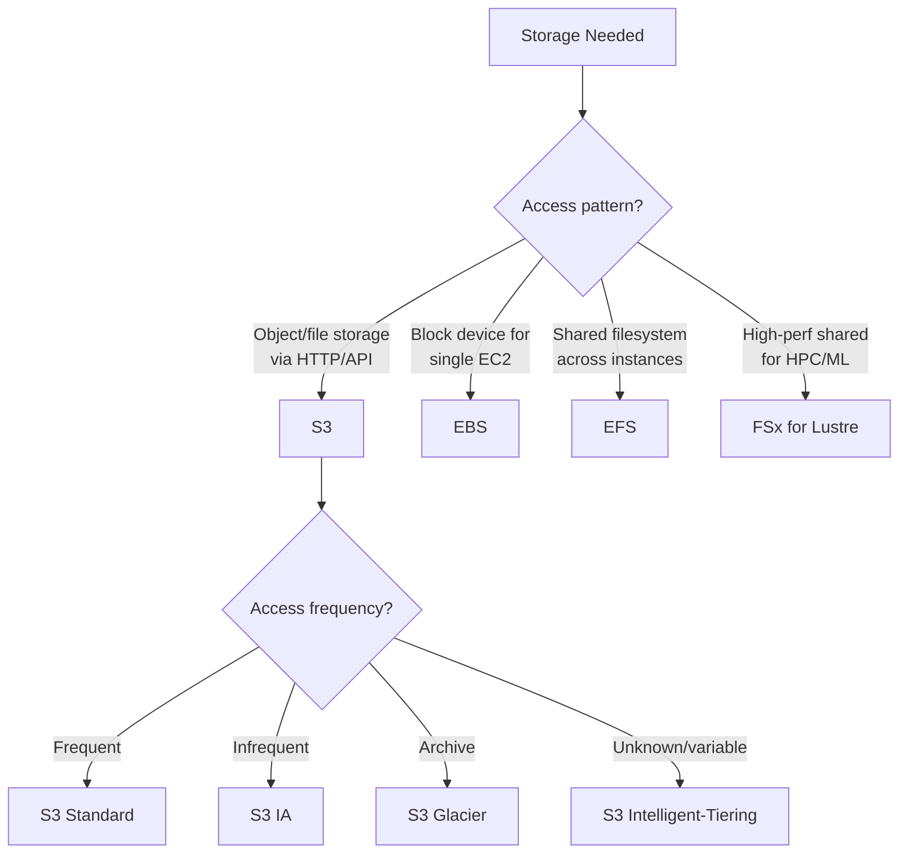

# AWS Storage with Terraform

## Overview

AWS provides three primary storage services: S3 (object storage), EBS (block storage for EC2), and EFS (managed NFS). Each serves distinct use cases. This guide covers Terraform patterns for provisioning, lifecycle management, encryption, and versioning.

---

## Storage Selection



---

## S3 — Simple Storage Service

### Production S3 Bucket

```hcl
resource "aws_s3_bucket" "main" {
  bucket = "${var.project}-${var.environment}-${var.bucket_purpose}"

  tags = {
    Name        = "${var.project}-${var.environment}-${var.bucket_purpose}"
    Environment = var.environment
    Purpose     = var.bucket_purpose
  }
}

# Versioning
resource "aws_s3_bucket_versioning" "main" {
  bucket = aws_s3_bucket.main.id

  versioning_configuration {
    status = "Enabled"
  }
}

# Server-side encryption
resource "aws_s3_bucket_server_side_encryption_configuration" "main" {
  bucket = aws_s3_bucket.main.id

  rule {
    apply_server_side_encryption_by_default {
      sse_algorithm     = "aws:kms"
      kms_master_key_id = var.kms_key_arn
    }
    bucket_key_enabled = true  # Reduces KMS API calls and cost
  }
}

# Block all public access
resource "aws_s3_bucket_public_access_block" "main" {
  bucket = aws_s3_bucket.main.id

  block_public_acls       = true
  block_public_policy     = true
  ignore_public_acls      = true
  restrict_public_buckets = true
}

# Enforce SSL-only access
resource "aws_s3_bucket_policy" "ssl_only" {
  bucket = aws_s3_bucket.main.id

  policy = jsonencode({
    Version = "2012-10-17"
    Statement = [
      {
        Sid       = "EnforceSSLOnly"
        Effect    = "Deny"
        Principal = "*"
        Action    = "s3:*"
        Resource = [
          aws_s3_bucket.main.arn,
          "${aws_s3_bucket.main.arn}/*",
        ]
        Condition = {
          Bool = {
            "aws:SecureTransport" = "false"
          }
        }
      },
      {
        Sid       = "EnforceTLSVersion"
        Effect    = "Deny"
        Principal = "*"
        Action    = "s3:*"
        Resource = [
          aws_s3_bucket.main.arn,
          "${aws_s3_bucket.main.arn}/*",
        ]
        Condition = {
          NumericLessThan = {
            "s3:TlsVersion" = 1.2
          }
        }
      }
    ]
  })
}

# Logging
resource "aws_s3_bucket_logging" "main" {
  bucket = aws_s3_bucket.main.id

  target_bucket = var.logging_bucket_id
  target_prefix = "s3-access-logs/${aws_s3_bucket.main.id}/"
}
```

### Lifecycle Policies

```hcl
resource "aws_s3_bucket_lifecycle_configuration" "main" {
  bucket = aws_s3_bucket.main.id

  # Depends on versioning being enabled
  depends_on = [aws_s3_bucket_versioning.main]

  rule {
    id     = "transition-to-ia"
    status = "Enabled"

    transition {
      days          = 30
      storage_class = "STANDARD_IA"
    }

    transition {
      days          = 90
      storage_class = "GLACIER_IR"  # Glacier Instant Retrieval
    }

    transition {
      days          = 365
      storage_class = "DEEP_ARCHIVE"
    }
  }

  rule {
    id     = "expire-noncurrent-versions"
    status = "Enabled"

    noncurrent_version_transition {
      noncurrent_days = 30
      storage_class   = "STANDARD_IA"
    }

    noncurrent_version_expiration {
      noncurrent_days = 90
    }
  }

  rule {
    id     = "abort-incomplete-uploads"
    status = "Enabled"

    abort_incomplete_multipart_upload {
      days_after_initiation = 7
    }
  }

  rule {
    id     = "expire-old-delete-markers"
    status = "Enabled"

    expiration {
      expired_object_delete_marker = true
    }
  }
}
```

### S3 Storage Classes

| Class | Retrieval | Min Storage | Use Case |
|-------|-----------|-------------|----------|
| Standard | Instant | None | Frequently accessed data |
| Intelligent-Tiering | Instant | 128 KB | Unknown/changing patterns |
| Standard-IA | Instant | 128 KB, 30 days | Infrequent, fast retrieval |
| One Zone-IA | Instant | 128 KB, 30 days | Reproducible, infrequent |
| Glacier Instant | Instant | 128 KB, 90 days | Archive, instant access |
| Glacier Flexible | Minutes-hours | 40 KB, 90 days | Archive, flexible retrieval |
| Deep Archive | 12 hours | 40 KB, 180 days | Long-term compliance |

### Cross-Region Replication

```hcl
resource "aws_s3_bucket_replication_configuration" "main" {
  bucket = aws_s3_bucket.main.id
  role   = aws_iam_role.replication.arn

  depends_on = [aws_s3_bucket_versioning.main]

  rule {
    id     = "replicate-all"
    status = "Enabled"

    destination {
      bucket        = var.dr_bucket_arn
      storage_class = "STANDARD_IA"

      encryption_configuration {
        replica_kms_key_id = var.dr_kms_key_arn
      }
    }

    source_selection_criteria {
      sse_kms_encrypted_objects {
        status = "Enabled"
      }
    }
  }
}
```

### S3 Event Notifications

```hcl
resource "aws_s3_bucket_notification" "main" {
  bucket = aws_s3_bucket.main.id

  lambda_function {
    lambda_function_arn = var.processor_lambda_arn
    events              = ["s3:ObjectCreated:*"]
    filter_prefix       = "uploads/"
    filter_suffix       = ".csv"
  }

  topic {
    topic_arn = var.notification_topic_arn
    events    = ["s3:ObjectRemoved:*"]
  }
}
```

---

## EBS — Elastic Block Store

### Volume Types

| Type | IOPS | Throughput | Use Case |
|------|------|------------|----------|
| gp3 | 3,000-16,000 | 125-1,000 MB/s | General purpose (default) |
| gp2 | 100-16,000 (burst) | Up to 250 MB/s | Legacy general purpose |
| io2 | Up to 256,000 | 4,000 MB/s | High-perf databases |
| st1 | 500 | 500 MB/s | Throughput (big data) |
| sc1 | 250 | 250 MB/s | Cold storage |

### EBS Volume with Terraform

```hcl
resource "aws_ebs_volume" "data" {
  availability_zone = var.availability_zone
  size              = var.volume_size
  type              = "gp3"
  iops              = 3000    # gp3 default, increase as needed
  throughput        = 125     # gp3 default (MB/s)
  encrypted         = true
  kms_key_id        = var.kms_key_arn

  tags = {
    Name        = "${var.environment}-data-volume"
    Environment = var.environment
    Snapshot    = "daily"
  }
}

resource "aws_volume_attachment" "data" {
  device_name = "/dev/sdf"
  volume_id   = aws_ebs_volume.data.id
  instance_id = aws_instance.app.id

  # Prevent forced detach that could corrupt data
  force_detach = false
}

# Enable default encryption for all new EBS volumes in the account
resource "aws_ebs_encryption_by_default" "enabled" {
  enabled = true
}

resource "aws_ebs_default_kms_key" "default" {
  key_arn = var.kms_key_arn
}
```

### EBS Snapshots with Lifecycle Manager

```hcl
resource "aws_dlm_lifecycle_policy" "ebs_snapshots" {
  description        = "EBS snapshot lifecycle policy"
  execution_role_arn = aws_iam_role.dlm.arn
  state              = "ENABLED"

  policy_details {
    resource_types = ["VOLUME"]

    target_tags = {
      Snapshot = "daily"
    }

    schedule {
      name = "daily-snapshots"

      create_rule {
        interval      = 24
        interval_unit = "HOURS"
        times         = ["03:00"]
      }

      retain_rule {
        count = 14
      }

      tags_to_add = {
        SnapshotCreator = "DLM"
      }

      copy_tags = true

      cross_region_copy_rule {
        target    = var.dr_region
        encrypted = true
        cmk_arn   = var.dr_kms_key_arn

        retain_rule {
          interval      = 7
          interval_unit = "DAYS"
        }
      }
    }
  }

  tags = {
    Environment = var.environment
  }
}
```

---

## EFS — Elastic File System

```hcl
resource "aws_efs_file_system" "main" {
  creation_token = "${var.environment}-efs"
  encrypted      = true
  kms_key_id     = var.kms_key_arn

  performance_mode = "generalPurpose"  # or maxIO for high throughput
  throughput_mode  = "elastic"          # or bursting/provisioned

  lifecycle_policy {
    transition_to_ia = "AFTER_30_DAYS"
  }

  lifecycle_policy {
    transition_to_primary_storage_class = "AFTER_1_ACCESS"
  }

  lifecycle_policy {
    transition_to_archive = "AFTER_90_DAYS"
  }

  tags = {
    Name        = "${var.environment}-efs"
    Environment = var.environment
  }
}

# Mount targets — one per AZ
resource "aws_efs_mount_target" "main" {
  count = length(var.private_subnet_ids)

  file_system_id  = aws_efs_file_system.main.id
  subnet_id       = var.private_subnet_ids[count.index]
  security_groups = [aws_security_group.efs.id]
}

resource "aws_security_group" "efs" {
  name_prefix = "${var.environment}-efs-"
  vpc_id      = var.vpc_id

  lifecycle {
    create_before_destroy = true
  }

  tags = {
    Name = "${var.environment}-efs-sg"
  }
}

resource "aws_vpc_security_group_ingress_rule" "efs_nfs" {
  security_group_id            = aws_security_group.efs.id
  referenced_security_group_id = var.app_security_group_id
  from_port                    = 2049
  to_port                      = 2049
  ip_protocol                  = "tcp"
  description                  = "NFS from application instances"
}

# EFS Access Point — for container workloads
resource "aws_efs_access_point" "app" {
  file_system_id = aws_efs_file_system.main.id

  posix_user {
    gid = 1000
    uid = 1000
  }

  root_directory {
    path = "/app-data"

    creation_info {
      owner_gid   = 1000
      owner_uid   = 1000
      permissions = "755"
    }
  }

  tags = {
    Name = "${var.environment}-app-access-point"
  }
}

# EFS Backup
resource "aws_efs_backup_policy" "main" {
  file_system_id = aws_efs_file_system.main.id

  backup_policy {
    status = "ENABLED"
  }
}
```

### EFS Performance Modes

| Mode | Throughput | Latency | Use Case |
|------|-----------|---------|----------|
| General Purpose | Elastic up to 10 GB/s | < 1ms | Most workloads |
| Max I/O | Elastic up to 10 GB/s | Higher | Thousands of clients |
| Elastic Throughput | Scales with demand | < 1ms | Bursty patterns |
| Provisioned | Up to 3 GB/s | < 1ms | Predictable, high throughput |

---

## Storage Comparison

| Feature | S3 | EBS | EFS |
|---------|----|----|-----|
| Type | Object | Block | File (NFS) |
| Access | HTTP/SDK | Single EC2 | Multi-instance |
| Durability | 99.999999999% | 99.999% | 99.999999999% |
| Max Size | Unlimited | 64 TB | Unlimited |
| Latency | 50-100ms | < 1ms | 1-10ms |
| Cost (GB/mo) | $0.023 (Std) | $0.08 (gp3) | $0.30 (Std) |
| Encryption | SSE-S3/KMS | KMS | KMS |
| Snapshots | Versioning | EBS Snapshots | AWS Backup |

---

## S3 for Terraform State

```hcl
# Dedicated state bucket — created once, managed separately
resource "aws_s3_bucket" "terraform_state" {
  bucket = "${var.org_name}-terraform-state"

  tags = {
    Purpose   = "terraform-state"
    ManagedBy = "terraform-bootstrap"
  }
}

resource "aws_s3_bucket_versioning" "terraform_state" {
  bucket = aws_s3_bucket.terraform_state.id

  versioning_configuration {
    status = "Enabled"
  }
}

resource "aws_s3_bucket_server_side_encryption_configuration" "terraform_state" {
  bucket = aws_s3_bucket.terraform_state.id

  rule {
    apply_server_side_encryption_by_default {
      sse_algorithm = "aws:kms"
    }
    bucket_key_enabled = true
  }
}

resource "aws_dynamodb_table" "terraform_locks" {
  name         = "${var.org_name}-terraform-locks"
  billing_mode = "PAY_PER_REQUEST"
  hash_key     = "LockID"

  attribute {
    name = "LockID"
    type = "S"
  }

  tags = {
    Purpose = "terraform-state-locking"
  }
}
```

---

## Best Practices

1. **Enable versioning on all S3 buckets** — protects against accidental deletes.
2. **Block public access at the account level** — use `aws_s3_account_public_access_block`.
3. **Use gp3 over gp2** for EBS — same baseline performance, 20% cheaper, configurable IOPS.
4. **Enable account-level EBS encryption** — ensures no unencrypted volumes are created.
5. **Use S3 Intelligent-Tiering** when access patterns are unpredictable.
6. **Set lifecycle rules** to clean up incomplete multipart uploads and old versions.
7. **Use EFS access points** for container workloads to enforce POSIX permissions.
8. **Enable S3 bucket keys** — reduces KMS API costs by up to 99%.

---

## Related Guides

- [Security](security.md) — KMS encryption, bucket policies
- [Cost Management](cost-management.md) — Storage cost optimization
- [Disaster Recovery](../07-production-patterns/disaster-recovery.md) — Cross-region replication
