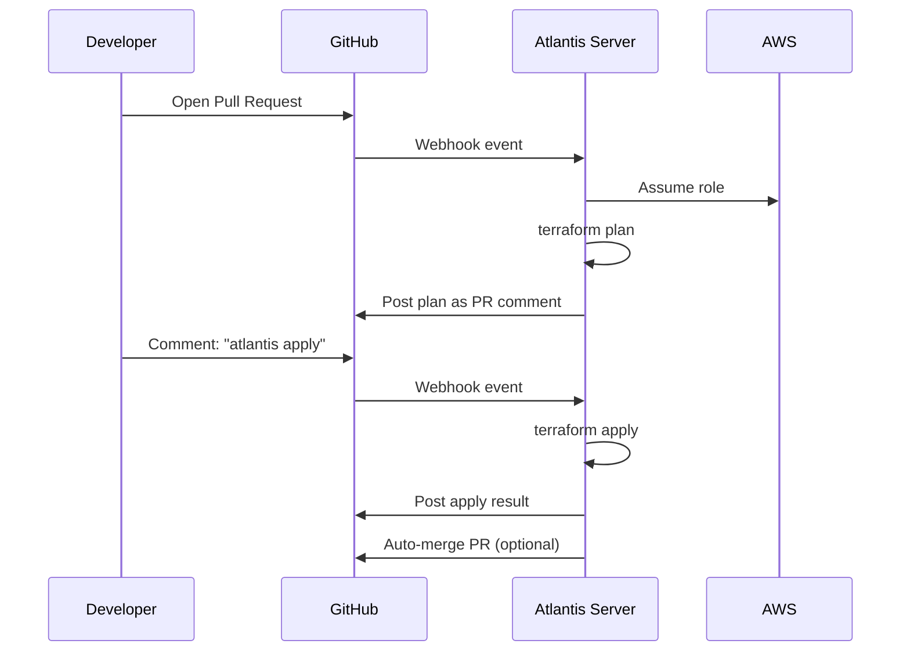

# Atlantis for Terraform Automation

## Overview

Atlantis is an open-source, self-hosted application that automates Terraform plan and apply via pull request comments. It provides built-in state locking, plan/apply workflows, and a collaborative review experience. This guide covers setup, configuration, security hardening, and production operations.

---

## How Atlantis Works



---

## Deployment with Terraform

### ECS Fargate Deployment

```hcl
resource "aws_ecs_task_definition" "atlantis" {
  family                   = "atlantis"
  requires_compatibilities = ["FARGATE"]
  network_mode             = "awsvpc"
  cpu                      = 1024
  memory                   = 2048
  execution_role_arn       = aws_iam_role.atlantis_execution.arn
  task_role_arn            = aws_iam_role.atlantis_task.arn

  container_definitions = jsonencode([{
    name      = "atlantis"
    image     = "ghcr.io/runatlantis/atlantis:v0.28.0"
    essential = true

    portMappings = [{
      containerPort = 4141
      protocol      = "tcp"
    }]

    environment = [
      { name = "ATLANTIS_REPO_ALLOWLIST", value = "github.com/${var.github_org}/*" },
      { name = "ATLANTIS_ATLANTIS_URL", value = "https://${var.atlantis_domain}" },
      { name = "ATLANTIS_GH_USER", value = var.github_user },
      { name = "ATLANTIS_PORT", value = "4141" },
      { name = "ATLANTIS_REPO_CONFIG_JSON", value = jsonencode(local.repo_config) },
      { name = "ATLANTIS_ENABLE_DIFF_MARKDOWN_FORMAT", value = "true" },
      { name = "ATLANTIS_AUTOPLAN_FILE_LIST", value = "**/*.tf,**/*.tfvars" },
      { name = "ATLANTIS_CHECKOUT_STRATEGY", value = "merge" },
      { name = "ATLANTIS_WRITE_GIT_CREDS", value = "true" },
    ]

    secrets = [
      { name = "ATLANTIS_GH_TOKEN", valueFrom = "${aws_secretsmanager_secret.atlantis.arn}:gh_token::" },
      { name = "ATLANTIS_GH_WEBHOOK_SECRET", valueFrom = "${aws_secretsmanager_secret.atlantis.arn}:webhook_secret::" },
    ]

    logConfiguration = {
      logDriver = "awslogs"
      options = {
        "awslogs-group"         = aws_cloudwatch_log_group.atlantis.name
        "awslogs-region"        = data.aws_region.current.name
        "awslogs-stream-prefix" = "atlantis"
      }
    }

    mountPoints = [{
      sourceVolume  = "atlantis-data"
      containerPath = "/atlantis-data"
    }]
  }])

  volume {
    name = "atlantis-data"

    efs_volume_configuration {
      file_system_id     = aws_efs_file_system.atlantis.id
      transit_encryption = "ENABLED"

      authorization_config {
        access_point_id = aws_efs_access_point.atlantis.id
        iam             = "ENABLED"
      }
    }
  }

  tags = {
    Application = "atlantis"
  }
}

resource "aws_ecs_service" "atlantis" {
  name            = "atlantis"
  cluster         = var.ecs_cluster_id
  task_definition = aws_ecs_task_definition.atlantis.arn
  desired_count   = 1  # Atlantis must run as a single instance
  launch_type     = "FARGATE"

  network_configuration {
    subnets          = var.private_subnet_ids
    security_groups  = [aws_security_group.atlantis.id]
    assign_public_ip = false
  }

  load_balancer {
    target_group_arn = aws_lb_target_group.atlantis.arn
    container_name   = "atlantis"
    container_port   = 4141
  }

  enable_execute_command = true
}
```

---

## Repository Configuration

### Server-Side Repo Config

```hcl
locals {
  repo_config = {
    repos = [
      {
        id                  = "github.com/${var.github_org}/*"
        branch              = "/.*/"
        apply_requirements  = ["approved", "mergeable"]
        allowed_overrides   = ["workflow"]
        allow_custom_workflows = false
        delete_source_branch_on_merge = true

        # Require plan before apply
        pre_workflow_hooks = [
          {
            run = "terraform fmt -check -diff"
          }
        ]

        post_workflow_hooks = [
          {
            run = "echo 'Apply complete for ${var.environment}'"
          }
        ]
      }
    ]

    workflows = {
      default = {
        plan = {
          steps = [
            { run = "terraform init -no-color" }
            { run = "terraform validate -no-color" }
            { run = "terraform plan -no-color -out=$PLANFILE" }
          ]
        }
        apply = {
          steps = [
            { run = "terraform apply -no-color $PLANFILE" }
          ]
        }
      }

      with_security_scan = {
        plan = {
          steps = [
            { run = "terraform init -no-color" }
            { run = "terraform validate -no-color" }
            { run = "checkov -d . --quiet --compact || true" }
            { run = "terraform plan -no-color -out=$PLANFILE" }
          ]
        }
        apply = {
          steps = [
            { run = "terraform apply -no-color $PLANFILE" }
          ]
        }
      }
    }
  }
}
```

### Per-Repository Config (atlantis.yaml)

```yaml
# atlantis.yaml — placed in repository root
version: 3
automerge: false
parallel_plan: true
parallel_apply: false  # Serial applies are safer

projects:
  - name: development
    dir: infrastructure/environments/development
    workspace: default
    terraform_version: v1.9.0
    autoplan:
      when_modified:
        - "*.tf"
        - "*.tfvars"
        - "../../modules/**/*.tf"
      enabled: true
    apply_requirements:
      - approved

  - name: staging
    dir: infrastructure/environments/staging
    workspace: default
    terraform_version: v1.9.0
    autoplan:
      when_modified:
        - "*.tf"
        - "*.tfvars"
        - "../../modules/**/*.tf"
      enabled: true
    apply_requirements:
      - approved
      - mergeable

  - name: production
    dir: infrastructure/environments/production
    workspace: default
    terraform_version: v1.9.0
    workflow: with_security_scan
    autoplan:
      when_modified:
        - "*.tf"
        - "*.tfvars"
        - "../../modules/**/*.tf"
      enabled: true
    apply_requirements:
      - approved
      - mergeable
```

---

## Atlantis Commands

| Command | Description |
|---------|-------------|
| `atlantis plan` | Run plan for all modified projects |
| `atlantis plan -p production` | Plan a specific project |
| `atlantis apply` | Apply all planned projects |
| `atlantis apply -p production` | Apply a specific project |
| `atlantis unlock` | Release locks on the PR |
| `atlantis plan -- -target=aws_instance.app` | Plan with extra args |

---

## IAM Configuration

```hcl
# Task role — what Atlantis can do in AWS
resource "aws_iam_role" "atlantis_task" {
  name = "atlantis-task-role"

  assume_role_policy = jsonencode({
    Version = "2012-10-17"
    Statement = [{
      Effect = "Allow"
      Action = "sts:AssumeRole"
      Principal = { Service = "ecs-tasks.amazonaws.com" }
    }]
  })
}

# Allow Atlantis to assume environment-specific roles
resource "aws_iam_role_policy" "atlantis_assume" {
  name = "assume-environment-roles"
  role = aws_iam_role.atlantis_task.id

  policy = jsonencode({
    Version = "2012-10-17"
    Statement = [{
      Effect = "Allow"
      Action = "sts:AssumeRole"
      Resource = [
        "arn:aws:iam::${var.dev_account_id}:role/atlantis-terraform",
        "arn:aws:iam::${var.staging_account_id}:role/atlantis-terraform",
        "arn:aws:iam::${var.prod_account_id}:role/atlantis-terraform",
      ]
    }]
  })
}

# State bucket access
resource "aws_iam_role_policy" "atlantis_state" {
  name = "terraform-state-access"
  role = aws_iam_role.atlantis_task.id

  policy = jsonencode({
    Version = "2012-10-17"
    Statement = [
      {
        Effect = "Allow"
        Action = [
          "s3:GetObject",
          "s3:PutObject",
          "s3:ListBucket",
        ]
        Resource = [
          var.state_bucket_arn,
          "${var.state_bucket_arn}/*",
        ]
      },
      {
        Effect = "Allow"
        Action = [
          "dynamodb:GetItem",
          "dynamodb:PutItem",
          "dynamodb:DeleteItem",
        ]
        Resource = [var.lock_table_arn]
      }
    ]
  })
}
```

---

## Security Hardening

### Network Security

```hcl
resource "aws_security_group" "atlantis" {
  name_prefix = "atlantis-"
  vpc_id      = var.vpc_id

  lifecycle {
    create_before_destroy = true
  }
}

# Only allow traffic from ALB
resource "aws_vpc_security_group_ingress_rule" "atlantis_from_alb" {
  security_group_id            = aws_security_group.atlantis.id
  referenced_security_group_id = var.alb_security_group_id
  from_port                    = 4141
  to_port                      = 4141
  ip_protocol                  = "tcp"
}

resource "aws_vpc_security_group_egress_rule" "atlantis_all" {
  security_group_id = aws_security_group.atlantis.id
  cidr_ipv4         = "0.0.0.0/0"
  ip_protocol       = "-1"
}
```

### Security Best Practices

1. **Webhook secret** — always configure a webhook secret to verify GitHub requests.
2. **Repo allowlist** — restrict which repositories Atlantis can operate on.
3. **Disable custom workflows** — prevent arbitrary command execution via `allow_custom_workflows = false`.
4. **Apply requirements** — require PR approval and mergeable status before apply.
5. **Network isolation** — deploy in private subnet, expose only via ALB with WAF.
6. **Audit logging** — send all Atlantis logs to CloudWatch for auditing.
7. **Use IAM role assumption** — Atlantis assumes per-environment roles rather than having direct permissions.

---

## Monitoring

```hcl
resource "aws_cloudwatch_log_group" "atlantis" {
  name              = "/ecs/atlantis"
  retention_in_days = 90
}

resource "aws_cloudwatch_metric_alarm" "atlantis_health" {
  alarm_name          = "atlantis-unhealthy"
  comparison_operator = "LessThanThreshold"
  evaluation_periods  = 2
  metric_name         = "HealthyHostCount"
  namespace           = "AWS/ApplicationELB"
  period              = 60
  statistic           = "Average"
  threshold           = 1
  alarm_description   = "Atlantis is unhealthy"
  alarm_actions       = [var.alarm_sns_arn]

  dimensions = {
    TargetGroup  = aws_lb_target_group.atlantis.arn_suffix
    LoadBalancer = var.alb_arn_suffix
  }
}
```

---

## Atlantis vs Alternatives

| Feature | Atlantis | GitHub Actions | Terraform Cloud |
|---------|----------|---------------|-----------------|
| Hosting | Self-hosted | GitHub-hosted | SaaS |
| Plan on PR | Native | Custom workflow | Native |
| State Locking | Native | DynamoDB | Native |
| Cost | Free (infra cost) | Free-$$ | Free-$$ |
| Maintenance | You manage | GitHub manages | HashiCorp manages |
| Custom Workflows | Yes | Yes | Limited |
| Multi-repo | Yes | Per-repo | Yes |

---

## Related Guides

- [CI/CD Overview](cicd-overview.md) — Principles and branching strategies
- [GitHub Actions](github-actions-terraform.md) — Alternative approach
- [Pipeline Security](pipeline-security.md) — Security patterns for CI/CD
