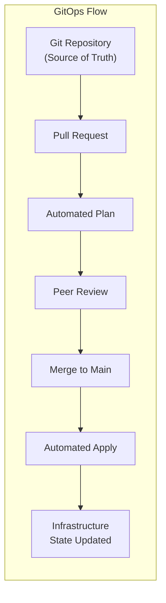
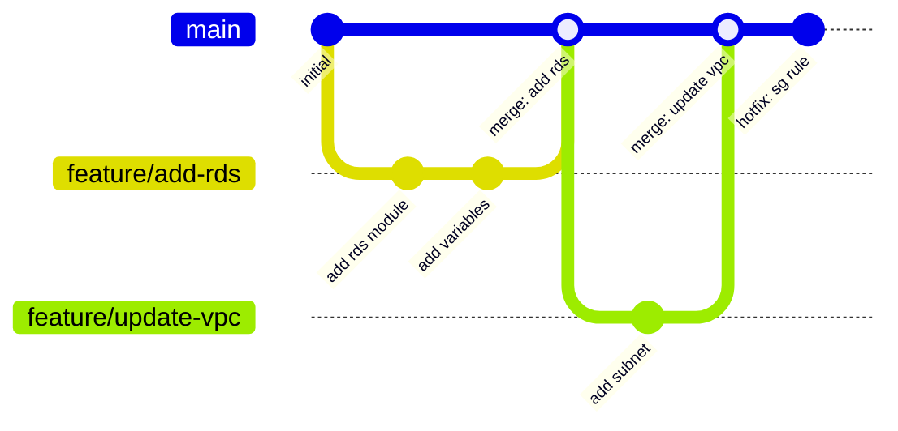
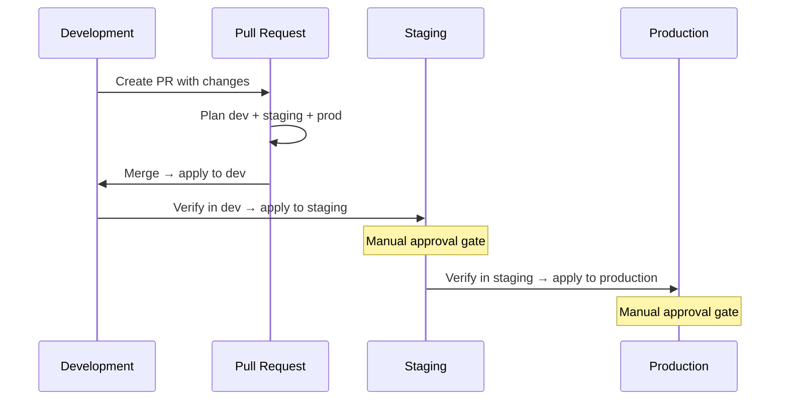

# CI/CD for Infrastructure

## Overview

Continuous Integration and Continuous Delivery for infrastructure code applies software development practices — version control, automated testing, code review, and controlled deployments — to Terraform configurations. This guide covers GitOps principles, branching strategies, and environment promotion patterns.

---

## Why CI/CD for Infrastructure?

Without CI/CD, infrastructure changes happen through local `terraform apply` runs. This leads to:

- **No audit trail** — who ran what, when?
- **No peer review** — missed misconfigurations reach production.
- **No consistency** — different engineers have different provider versions, variable values.
- **No rollback path** — manual applies are hard to reverse.
- **Credential sprawl** — every engineer needs admin-level AWS credentials.

---

## GitOps Principles for Terraform



### Core Principles

1. **Git is the source of truth** — the desired state of infrastructure lives in version control. No manual changes.
2. **Changes via pull requests** — every change, no matter how small, goes through a PR.
3. **Automated plan on PR** — every PR triggers `terraform plan` and posts the result for review.
4. **Apply on merge** — merging to the main branch triggers `terraform apply`.
5. **Drift detection** — scheduled plans detect manual changes and alert the team.
6. **Immutable audit trail** — git history provides a complete log of all infrastructure changes.

---

## Branching Strategies

### Trunk-Based Development (Recommended)



- **Short-lived feature branches** — branch from main, merge back within 1-2 days.
- **No long-lived branches** — avoids merge conflicts and plan drift.
- **Single main branch** — represents the desired state of all environments.
- **Environment promotion** via directory structure or workspace selection, not branches.

### Environment Branches (Not Recommended)

Some teams use `dev`, `staging`, `production` branches. This approach has significant drawbacks:

- Cherry-picking between branches is error-prone.
- Branches diverge over time.
- Hard to know which changes are in which environment.
- Merge conflicts between environment branches.

---

## Environment Promotion

### Directory-Based (Preferred)

```
infrastructure/
  modules/
    vpc/
    ecs/
    rds/
  environments/
    development/
      main.tf        # Uses modules with dev settings
      terraform.tfvars
    staging/
      main.tf        # Uses modules with staging settings
      terraform.tfvars
    production/
      main.tf        # Uses modules with production settings
      terraform.tfvars
```

### Promotion Flow



### Pipeline Configuration

```yaml
# Conceptual pipeline stages
stages:
  - name: plan
    trigger: pull_request
    actions:
      - terraform plan (all environments)
      - post plan output to PR

  - name: deploy-dev
    trigger: merge to main
    actions:
      - terraform apply (development)
    auto_approve: true

  - name: deploy-staging
    trigger: successful dev deploy
    actions:
      - terraform apply (staging)
    requires_approval: true
    approvers: [team-lead]

  - name: deploy-production
    trigger: successful staging deploy
    actions:
      - terraform apply (production)
    requires_approval: true
    approvers: [team-lead, platform-lead]
```

---

## PR Review Checklist for Terraform

### Automated Checks

| Check | Tool | Gate Type |
|-------|------|-----------|
| Format | `terraform fmt -check` | Blocking |
| Validation | `terraform validate` | Blocking |
| Linting | tflint | Blocking |
| Security scan | Checkov, tfsec | Warning |
| Cost estimate | Infracost | Informational |
| Plan output | `terraform plan` | Informational |
| Policy check | OPA/Sentinel | Blocking |

### Manual Review Points

1. **Read the plan carefully** — especially `destroy` and `replace` actions.
2. **Check for secrets** — no hardcoded passwords, keys, or tokens.
3. **Verify resource naming** — follows team conventions.
4. **Check for missing tags** — all required tags present.
5. **Review security groups** — no `0.0.0.0/0` ingress unless intentional.
6. **Check state implications** — moved or renamed resources may cause recreation.
7. **Review cost impact** — large instances, multiple NAT gateways, etc.

---

## Tool Comparison

| Feature | GitHub Actions | Atlantis | Terraform Cloud | GitLab CI |
|---------|---------------|----------|-----------------|-----------|
| Hosting | GitHub-hosted | Self-hosted | SaaS | GitLab-hosted |
| Plan on PR | Yes (custom) | Built-in | Built-in | Yes (custom) |
| Apply on Merge | Yes (custom) | Built-in | Built-in | Yes (custom) |
| Locking | Manual | Built-in | Built-in | Manual |
| Cost | Free (public) | Free (OSS) | Free to $$ | Free (public) |
| OIDC Auth | Native | Manual setup | Built-in | Native |
| Policy as Code | External | External | Sentinel | External |
| Drift Detection | Custom | Custom | Built-in | Custom |

---

## State Management in CI/CD

### Remote State Backend

```hcl
terraform {
  backend "s3" {
    bucket         = "myorg-terraform-state"
    key            = "environments/production/terraform.tfstate"
    region         = "us-east-1"
    dynamodb_table = "myorg-terraform-locks"
    encrypt        = true
  }
}
```

### Locking Strategy

- **DynamoDB locking** — prevents concurrent applies to the same state.
- **One state per environment** — dev, staging, and production should never share state.
- **Pipeline serialization** — ensure only one pipeline runs per environment at a time.

---

## Secrets in CI/CD

| Secret Type | Storage | Access Pattern |
|------------|---------|----------------|
| AWS credentials | OIDC (no static keys) | Assume role per environment |
| Database passwords | AWS Secrets Manager | Read at plan/apply time |
| API keys | GitHub Secrets / Vault | Injected as env vars |
| TLS certificates | ACM | Referenced by ARN |

Never store secrets in:
- Git (even encrypted, unless using SOPS/age)
- Terraform state (use `sensitive = true` and avoid outputs)
- CI/CD logs (mask all sensitive values)

---

## Common Pitfalls

1. **Applying without reviewing the plan** — always require human approval for production.
2. **Running apply on PR branches** — only apply on merge to main.
3. **Not locking state** — concurrent applies corrupt state.
4. **Long-lived feature branches** — causes plan drift and merge conflicts.
5. **Skipping non-prod environments** — always promote through dev and staging first.
6. **Not handling plan failures** — a failed plan should block the PR.
7. **Manual changes after CI/CD is set up** — creates drift and defeats the purpose.

---

## Related Guides

- [GitHub Actions](github-actions-terraform.md) — Complete workflow examples
- [Atlantis](atlantis.md) — Self-hosted plan/apply automation
- [Terraform Cloud VCS](terraform-cloud-vcs.md) — SaaS-based workflows
- [Pipeline Security](pipeline-security.md) — OIDC, secrets, policy enforcement
- [Drift Detection](drift-detection.md) — Detecting and remediating drift
