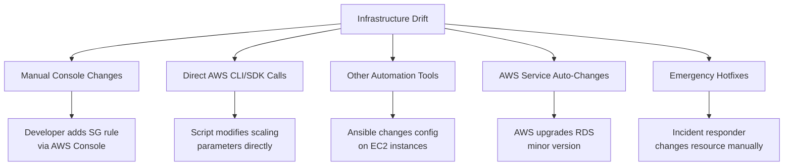

# Drift Detection

## Overview

Drift occurs when the actual state of infrastructure diverges from the desired state defined in Terraform code. This can happen through manual console changes, direct API calls, or changes made by other automation tools. This guide covers detection strategies, automated remediation, and scheduled plan workflows.

---

## What Causes Drift?



### Types of Drift

| Type | Example | Risk |
|------|---------|------|
| Configuration drift | Security group rule added manually | Next apply may remove it |
| State-only drift | Resource deleted outside Terraform | Plan shows recreate |
| Attribute drift | Instance type changed via console | Plan shows modification |
| Tag drift | Tags added/removed manually | Compliance violations |
| Resource drift | New resource created manually | Not tracked in state |

---

## Detection Strategies

### Strategy 1: Scheduled Terraform Plan

The simplest and most effective approach. Run `terraform plan` on a schedule and alert if changes are detected.

```yaml
# .github/workflows/drift-detection.yml
name: Drift Detection

on:
  schedule:
    - cron: '0 6 * * *'  # Daily at 6 AM UTC
  workflow_dispatch: {}    # Allow manual trigger

permissions:
  id-token: write
  contents: read
  issues: write

env:
  TF_VERSION: "1.9.0"

jobs:
  detect-drift:
    runs-on: ubuntu-latest
    strategy:
      fail-fast: false
      matrix:
        environment: [development, staging, production]

    steps:
      - uses: actions/checkout@v4

      - uses: hashicorp/setup-terraform@v3
        with:
          terraform_version: ${{ env.TF_VERSION }}
          terraform_wrapper: false

      - name: Configure AWS credentials
        uses: aws-actions/configure-aws-credentials@v4
        with:
          role-to-assume: arn:aws:iam::${{ secrets.AWS_ACCOUNT_ID }}:role/github-actions-${{ matrix.environment }}
          aws-region: us-east-1

      - name: Terraform Init
        working-directory: infrastructure/environments/${{ matrix.environment }}
        run: terraform init -no-color

      - name: Terraform Plan (Drift Check)
        id: plan
        working-directory: infrastructure/environments/${{ matrix.environment }}
        run: |
          set +e
          terraform plan -detailed-exitcode -no-color -out=tfplan 2>&1 | tee plan_output.txt
          EXIT_CODE=$?
          echo "exit_code=$EXIT_CODE" >> "$GITHUB_OUTPUT"

          if [ $EXIT_CODE -eq 0 ]; then
            echo "drift=false" >> "$GITHUB_OUTPUT"
            echo "No drift detected"
          elif [ $EXIT_CODE -eq 2 ]; then
            echo "drift=true" >> "$GITHUB_OUTPUT"
            echo "DRIFT DETECTED"
          else
            echo "drift=error" >> "$GITHUB_OUTPUT"
            echo "Plan failed"
            exit 1
          fi

      - name: Create Issue on Drift
        if: steps.plan.outputs.drift == 'true'
        uses: actions/github-script@v7
        with:
          script: |
            const fs = require('fs');
            const planOutput = fs.readFileSync(
              'infrastructure/environments/${{ matrix.environment }}/plan_output.txt',
              'utf8'
            );

            // Truncate if too long for GitHub issue
            const maxLen = 60000;
            const truncated = planOutput.length > maxLen
              ? planOutput.substring(0, maxLen) + '\n\n... (truncated)'
              : planOutput;

            const title = `Drift Detected: ${{ matrix.environment }} (${new Date().toISOString().split('T')[0]})`;

            // Check for existing open drift issue
            const { data: issues } = await github.rest.issues.listForRepo({
              owner: context.repo.owner,
              repo: context.repo.repo,
              labels: 'drift,${{ matrix.environment }}',
              state: 'open',
            });

            const body = `## Infrastructure Drift Detected

            **Environment:** \`${{ matrix.environment }}\`
            **Detected at:** ${new Date().toISOString()}
            **Run:** ${context.serverUrl}/${context.repo.owner}/${context.repo.repo}/actions/runs/${context.runId}

            ### Plan Output

            \`\`\`
            ${truncated}
            \`\`\`

            ### Action Required

            1. Review the drift above
            2. If the manual change should be kept: update Terraform code to match
            3. If the manual change should be reverted: run \`terraform apply\` to restore desired state
            4. Close this issue when resolved
            `;

            if (issues.length > 0) {
              await github.rest.issues.createComment({
                owner: context.repo.owner,
                repo: context.repo.repo,
                issue_number: issues[0].number,
                body: body,
              });
            } else {
              await github.rest.issues.create({
                owner: context.repo.owner,
                repo: context.repo.repo,
                title: title,
                body: body,
                labels: ['drift', '${{ matrix.environment }}', 'infrastructure'],
              });
            }

      - name: Send Slack notification on drift
        if: steps.plan.outputs.drift == 'true'
        uses: slackapi/slack-github-action@v1
        with:
          payload: |
            {
              "text": "Infrastructure drift detected in *${{ matrix.environment }}*. Check the GitHub issue for details.",
              "blocks": [
                {
                  "type": "section",
                  "text": {
                    "type": "mrkdwn",
                    "text": ":warning: *Infrastructure Drift Detected*\n*Environment:* ${{ matrix.environment }}\n*Workflow:* <${{ github.server_url }}/${{ github.repository }}/actions/runs/${{ github.run_id }}|View Run>"
                  }
                }
              ]
            }
        env:
          SLACK_WEBHOOK_URL: ${{ secrets.SLACK_WEBHOOK_URL }}
```

### Strategy 2: AWS Config Rules

AWS Config continuously monitors resource configurations and can detect changes in real-time.

```hcl
resource "aws_config_configuration_recorder" "main" {
  name     = "default"
  role_arn = aws_iam_role.config.arn

  recording_group {
    all_supported                 = true
    include_global_resource_types = true
  }
}

resource "aws_config_delivery_channel" "main" {
  name           = "default"
  s3_bucket_name = var.config_bucket_name

  snapshot_delivery_properties {
    delivery_frequency = "TwentyFour_Hours"
  }

  depends_on = [aws_config_configuration_recorder.main]
}

resource "aws_config_configuration_recorder_status" "main" {
  name       = aws_config_configuration_recorder.main.name
  is_enabled = true

  depends_on = [aws_config_delivery_channel.main]
}

# Alert on security group changes
resource "aws_config_config_rule" "sg_changes" {
  name = "security-group-change-detection"

  source {
    owner             = "AWS"
    source_identifier = "VPC_SG_OPEN_ONLY_TO_AUTHORIZED_PORTS"
  }

  input_parameters = jsonencode({
    authorizedTcpPorts = "443,80"
  })

  depends_on = [aws_config_configuration_recorder_status.main]
}

# EventBridge rule for Config compliance changes
resource "aws_cloudwatch_event_rule" "config_compliance" {
  name = "config-compliance-change"

  event_pattern = jsonencode({
    source      = ["aws.config"]
    detail-type = ["Config Rules Compliance Change"]
    detail = {
      messageType        = ["ComplianceChangeNotification"]
      newEvaluationResult = {
        complianceType = ["NON_COMPLIANT"]
      }
    }
  })
}

resource "aws_cloudwatch_event_target" "config_sns" {
  rule = aws_cloudwatch_event_rule.config_compliance.name
  arn  = var.security_sns_topic_arn
}
```

### Strategy 3: CloudTrail + EventBridge

Detect drift in real-time by monitoring API calls that modify resources.

```hcl
# Alert on manual changes to production resources
resource "aws_cloudwatch_event_rule" "manual_changes" {
  name        = "detect-manual-changes"
  description = "Detect manual infrastructure changes"

  event_pattern = jsonencode({
    source      = ["aws.ec2", "aws.rds", "aws.ecs", "aws.s3"]
    detail-type = ["AWS API Call via CloudTrail"]
    detail = {
      eventSource = [
        "ec2.amazonaws.com",
        "rds.amazonaws.com",
        "ecs.amazonaws.com",
      ]
      eventName = [
        "AuthorizeSecurityGroupIngress",
        "AuthorizeSecurityGroupEgress",
        "ModifyDBInstance",
        "UpdateService",
        "CreateSecurityGroup",
        "DeleteSecurityGroup",
      ]
      # Exclude CI/CD role to avoid false positives
      userIdentity = {
        sessionContext = {
          sessionIssuer = {
            userName = [{ "anything-but" = ["github-actions-production", "atlantis-terraform"] }]
          }
        }
      }
    }
  })
}

resource "aws_cloudwatch_event_target" "manual_changes_sns" {
  rule = aws_cloudwatch_event_rule.manual_changes.name
  arn  = var.drift_alert_sns_topic_arn
}
```

---

## Automated Remediation

### Option 1: Auto-Apply on Drift (Cautious)

Only recommended for non-critical resources where the Terraform code is the absolute authority.

```yaml
# In drift detection workflow, add an apply step
- name: Auto-remediate drift
  if: >
    steps.plan.outputs.drift == 'true' &&
    matrix.environment != 'production'
  working-directory: infrastructure/environments/${{ matrix.environment }}
  run: terraform apply -auto-approve -no-color tfplan
```

### Option 2: PR-Based Remediation

Create a PR to import or update the state, requiring human review.

```yaml
- name: Create remediation PR
  if: steps.plan.outputs.drift == 'true'
  run: |
    git checkout -b fix/drift-${{ matrix.environment }}-$(date +%Y%m%d)

    # Option A: Update code to match current state
    # Option B: Create import blocks for untracked resources

    # For now, create a branch with the drift report
    cp infrastructure/environments/${{ matrix.environment }}/plan_output.txt \
       drift-report-${{ matrix.environment }}.txt
    git add .
    git commit -m "docs: drift report for ${{ matrix.environment }}"
    git push origin HEAD

    gh pr create \
      --title "Fix: Infrastructure drift in ${{ matrix.environment }}" \
      --body "Drift was detected. Review the plan output and decide whether to update code or revert the manual change." \
      --label "drift,infrastructure"
```

---

## Drift Prevention

### Preventive Controls

| Control | Implementation | Effect |
|---------|---------------|--------|
| SCP deny console changes | Service Control Policy | Blocks manual changes |
| IAM deny manual changes | IAM policy condition | Blocks API calls not from CI/CD |
| Tag-based protection | Conditional IAM | Only CI/CD role can modify tagged resources |

```hcl
# SCP: Deny changes unless from CI/CD role
resource "aws_organizations_policy" "deny_manual" {
  name = "deny-manual-infra-changes"
  type = "SERVICE_CONTROL_POLICY"

  content = jsonencode({
    Version = "2012-10-17"
    Statement = [{
      Sid    = "DenyManualInfraChanges"
      Effect = "Deny"
      Action = [
        "ec2:AuthorizeSecurityGroup*",
        "ec2:RevokeSecurityGroup*",
        "ec2:ModifyInstanceAttribute",
        "rds:ModifyDBInstance",
      ]
      Resource = "*"
      Condition = {
        StringNotLike = {
          "aws:PrincipalArn" = [
            "arn:aws:iam::*:role/github-actions-*",
            "arn:aws:iam::*:role/atlantis-*",
          ]
        }
      }
    }]
  })
}
```

---

## Monitoring Dashboard

Track drift metrics over time:

| Metric | Source | Alert Threshold |
|--------|--------|----------------|
| Drift detected count | CI/CD workflow | Any detection |
| Time to remediate | GitHub issue lifecycle | > 24 hours |
| Non-compliant resources | AWS Config | > 0 |
| Manual API calls | CloudTrail | Any on production |

---

## Best Practices

1. **Run drift detection daily** — weekly is too infrequent for production.
2. **Never auto-remediate production** — always require human review.
3. **Separate detection from remediation** — detect automatically, remediate deliberately.
4. **Track drift as incidents** — use GitHub issues or Jira tickets with SLAs.
5. **Prevent drift with SCPs** — prevention is cheaper than detection.
6. **Educate the team** — most drift comes from developers making "quick" console changes.
7. **Allow emergency changes** — have a documented break-glass process that still creates a remediation ticket.
8. **Use `terraform plan -detailed-exitcode`** — exit code 2 means changes detected, enabling automation.

---

## Related Guides

- [CI/CD Overview](cicd-overview.md) — Pipeline architecture
- [GitHub Actions](github-actions-terraform.md) — Workflow implementation
- [Compliance](../07-production-patterns/compliance-and-governance.md) — AWS Config rules
- [Incident Response](../08-workflows/incident-response.md) — Handling drift incidents
