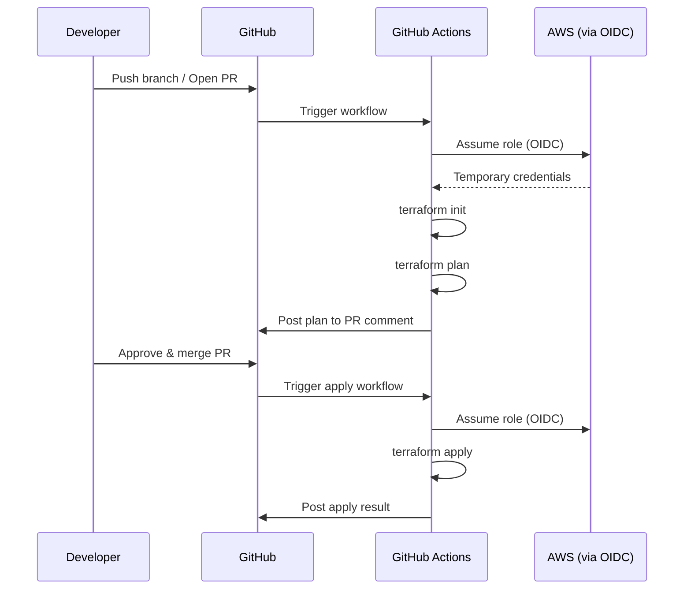

# GitHub Actions for Terraform

## Overview

GitHub Actions is the most widely used CI/CD platform for Terraform. This guide provides production-ready workflow examples covering plan/apply automation, OIDC authentication, environment protection rules, PR comments, matrix strategies, and reusable workflows.

---

## Architecture



---

## OIDC Authentication Setup

### AWS IAM Role for GitHub Actions

```hcl
# OIDC Provider — create once per AWS account
resource "aws_iam_openid_connect_provider" "github" {
  url             = "https://token.actions.githubusercontent.com"
  client_id_list  = ["sts.amazonaws.com"]
  thumbprint_list = ["6938fd4d98bab03faadb97b34396831e3780aea1"]

  tags = {
    Purpose = "github-actions-oidc"
  }
}

# Role per environment
resource "aws_iam_role" "github_actions" {
  for_each = toset(["development", "staging", "production"])

  name = "github-actions-${each.value}"

  assume_role_policy = jsonencode({
    Version = "2012-10-17"
    Statement = [{
      Effect = "Allow"
      Action = "sts:AssumeRoleWithWebIdentity"
      Principal = {
        Federated = aws_iam_openid_connect_provider.github.arn
      }
      Condition = {
        StringEquals = {
          "token.actions.githubusercontent.com:aud" = "sts.amazonaws.com"
        }
        StringLike = {
          "token.actions.githubusercontent.com:sub" = "repo:${var.github_org}/${var.github_repo}:environment:${each.value}"
        }
      }
    }]
  })

  tags = {
    Environment = each.value
  }
}

# Attach appropriate policies per environment
resource "aws_iam_role_policy_attachment" "github_actions" {
  for_each = toset(["development", "staging", "production"])

  role       = aws_iam_role.github_actions[each.value].name
  policy_arn = var.terraform_policy_arns[each.value]
}
```

---

## Complete Plan/Apply Workflow

```yaml
# .github/workflows/terraform.yml
name: Terraform

on:
  pull_request:
    branches: [main]
    paths:
      - 'infrastructure/**'
      - '.github/workflows/terraform.yml'
  push:
    branches: [main]
    paths:
      - 'infrastructure/**'

permissions:
  id-token: write    # Required for OIDC
  contents: read
  pull-requests: write  # Required for PR comments

env:
  TF_VERSION: "1.9.0"
  AWS_REGION: "us-east-1"

jobs:
  # ─── Detect Changed Environments ─────────────────────
  changes:
    runs-on: ubuntu-latest
    outputs:
      environments: ${{ steps.filter.outputs.changes }}
    steps:
      - uses: actions/checkout@v4
      - uses: dorny/paths-filter@v3
        id: filter
        with:
          filters: |
            development:
              - 'infrastructure/environments/development/**'
              - 'infrastructure/modules/**'
            staging:
              - 'infrastructure/environments/staging/**'
              - 'infrastructure/modules/**'
            production:
              - 'infrastructure/environments/production/**'
              - 'infrastructure/modules/**'

  # ─── Terraform Plan ──────────────────────────────────
  plan:
    needs: changes
    if: github.event_name == 'pull_request'
    runs-on: ubuntu-latest
    strategy:
      fail-fast: false
      matrix:
        environment: ${{ fromJson(needs.changes.outputs.environments) }}
    steps:
      - uses: actions/checkout@v4

      - uses: hashicorp/setup-terraform@v3
        with:
          terraform_version: ${{ env.TF_VERSION }}
          terraform_wrapper: false

      - name: Configure AWS credentials (OIDC)
        uses: aws-actions/configure-aws-credentials@v4
        with:
          role-to-assume: arn:aws:iam::${{ secrets.AWS_ACCOUNT_ID }}:role/github-actions-${{ matrix.environment }}
          aws-region: ${{ env.AWS_REGION }}

      - name: Terraform Init
        working-directory: infrastructure/environments/${{ matrix.environment }}
        run: terraform init -no-color

      - name: Terraform Validate
        working-directory: infrastructure/environments/${{ matrix.environment }}
        run: terraform validate -no-color

      - name: Terraform Plan
        id: plan
        working-directory: infrastructure/environments/${{ matrix.environment }}
        run: |
          terraform plan -no-color -out=tfplan 2>&1 | tee plan_output.txt
          echo "plan_output<<PLAN_EOF" >> "$GITHUB_OUTPUT"
          cat plan_output.txt >> "$GITHUB_OUTPUT"
          echo "PLAN_EOF" >> "$GITHUB_OUTPUT"
        continue-on-error: true

      - name: Post Plan to PR
        uses: actions/github-script@v7
        with:
          script: |
            const output = `### Terraform Plan: \`${{ matrix.environment }}\`

            \`\`\`
            ${{ steps.plan.outputs.plan_output }}
            \`\`\`

            *Plan result: ${{ steps.plan.outcome }}*
            *Triggered by: @${{ github.actor }}*`;

            const { data: comments } = await github.rest.issues.listComments({
              owner: context.repo.owner,
              repo: context.repo.repo,
              issue_number: context.issue.number,
            });

            const botComment = comments.find(c =>
              c.user.type === 'Bot' &&
              c.body.includes(`Terraform Plan: \`${{ matrix.environment }}\``)
            );

            if (botComment) {
              await github.rest.issues.updateComment({
                owner: context.repo.owner,
                repo: context.repo.repo,
                comment_id: botComment.id,
                body: output,
              });
            } else {
              await github.rest.issues.createComment({
                owner: context.repo.owner,
                repo: context.repo.repo,
                issue_number: context.issue.number,
                body: output,
              });
            }

      - name: Fail if plan failed
        if: steps.plan.outcome == 'failure'
        run: exit 1

  # ─── Security Scan ───────────────────────────────────
  security:
    needs: changes
    if: github.event_name == 'pull_request'
    runs-on: ubuntu-latest
    strategy:
      matrix:
        environment: ${{ fromJson(needs.changes.outputs.environments) }}
    steps:
      - uses: actions/checkout@v4

      - name: Run Checkov
        uses: bridgecrewio/checkov-action@v12
        with:
          directory: infrastructure/environments/${{ matrix.environment }}
          framework: terraform
          output_format: github_failed_only
          soft_fail: true

  # ─── Cost Estimate ───────────────────────────────────
  cost:
    needs: changes
    if: github.event_name == 'pull_request'
    runs-on: ubuntu-latest
    strategy:
      matrix:
        environment: ${{ fromJson(needs.changes.outputs.environments) }}
    steps:
      - uses: actions/checkout@v4

      - name: Infracost
        uses: infracost/actions/setup@v3
        with:
          api-key: ${{ secrets.INFRACOST_API_KEY }}

      - name: Generate cost diff
        run: |
          infracost diff \
            --path infrastructure/environments/${{ matrix.environment }} \
            --format json \
            --out-file /tmp/infracost.json

      - name: Post cost comment
        run: |
          infracost comment github \
            --path /tmp/infracost.json \
            --repo ${{ github.repository }} \
            --pull-request ${{ github.event.pull_request.number }} \
            --github-token ${{ secrets.GITHUB_TOKEN }} \
            --behavior update

  # ─── Terraform Apply ─────────────────────────────────
  apply-dev:
    needs: changes
    if: github.event_name == 'push' && contains(fromJson(needs.changes.outputs.environments), 'development')
    runs-on: ubuntu-latest
    environment: development
    steps:
      - uses: actions/checkout@v4

      - uses: hashicorp/setup-terraform@v3
        with:
          terraform_version: ${{ env.TF_VERSION }}

      - name: Configure AWS credentials
        uses: aws-actions/configure-aws-credentials@v4
        with:
          role-to-assume: arn:aws:iam::${{ secrets.AWS_ACCOUNT_ID }}:role/github-actions-development
          aws-region: ${{ env.AWS_REGION }}

      - name: Terraform Init
        working-directory: infrastructure/environments/development
        run: terraform init -no-color

      - name: Terraform Apply
        working-directory: infrastructure/environments/development
        run: terraform apply -auto-approve -no-color

  apply-staging:
    needs: [changes, apply-dev]
    if: github.event_name == 'push' && contains(fromJson(needs.changes.outputs.environments), 'staging')
    runs-on: ubuntu-latest
    environment: staging
    steps:
      - uses: actions/checkout@v4

      - uses: hashicorp/setup-terraform@v3
        with:
          terraform_version: ${{ env.TF_VERSION }}

      - name: Configure AWS credentials
        uses: aws-actions/configure-aws-credentials@v4
        with:
          role-to-assume: arn:aws:iam::${{ secrets.AWS_ACCOUNT_ID }}:role/github-actions-staging
          aws-region: ${{ env.AWS_REGION }}

      - name: Terraform Init
        working-directory: infrastructure/environments/staging
        run: terraform init -no-color

      - name: Terraform Apply
        working-directory: infrastructure/environments/staging
        run: terraform apply -auto-approve -no-color

  apply-production:
    needs: [changes, apply-staging]
    if: github.event_name == 'push' && contains(fromJson(needs.changes.outputs.environments), 'production')
    runs-on: ubuntu-latest
    environment: production  # Requires manual approval
    steps:
      - uses: actions/checkout@v4

      - uses: hashicorp/setup-terraform@v3
        with:
          terraform_version: ${{ env.TF_VERSION }}

      - name: Configure AWS credentials
        uses: aws-actions/configure-aws-credentials@v4
        with:
          role-to-assume: arn:aws:iam::${{ secrets.AWS_ACCOUNT_ID }}:role/github-actions-production
          aws-region: ${{ env.AWS_REGION }}

      - name: Terraform Init
        working-directory: infrastructure/environments/production
        run: terraform init -no-color

      - name: Terraform Apply
        working-directory: infrastructure/environments/production
        run: terraform apply -auto-approve -no-color
```

---

## GitHub Environment Protection Rules

Configure in GitHub repository settings:

| Environment | Protection Rules |
|-------------|-----------------|
| development | No approval required |
| staging | 1 reviewer from `@team/platform` |
| production | 2 reviewers from `@team/platform-leads`, wait timer: 5 min |

All environments should:
- Restrict to `main` branch only
- Use environment-specific secrets (AWS role ARN)

---

## Reusable Workflow

```yaml
# .github/workflows/terraform-reusable.yml
name: Terraform Reusable

on:
  workflow_call:
    inputs:
      environment:
        required: true
        type: string
      working_directory:
        required: true
        type: string
      apply:
        required: false
        type: boolean
        default: false
    secrets:
      AWS_ACCOUNT_ID:
        required: true

permissions:
  id-token: write
  contents: read

jobs:
  terraform:
    runs-on: ubuntu-latest
    environment: ${{ inputs.environment }}
    steps:
      - uses: actions/checkout@v4

      - uses: hashicorp/setup-terraform@v3
        with:
          terraform_version: "1.9.0"

      - name: Configure AWS credentials
        uses: aws-actions/configure-aws-credentials@v4
        with:
          role-to-assume: arn:aws:iam::${{ secrets.AWS_ACCOUNT_ID }}:role/github-actions-${{ inputs.environment }}
          aws-region: us-east-1

      - name: Terraform Init
        working-directory: ${{ inputs.working_directory }}
        run: terraform init -no-color

      - name: Terraform Plan
        working-directory: ${{ inputs.working_directory }}
        run: terraform plan -no-color -out=tfplan

      - name: Terraform Apply
        if: inputs.apply
        working-directory: ${{ inputs.working_directory }}
        run: terraform apply -auto-approve -no-color tfplan
```

### Calling the Reusable Workflow

```yaml
# .github/workflows/deploy.yml
name: Deploy

on:
  push:
    branches: [main]

jobs:
  deploy-dev:
    uses: ./.github/workflows/terraform-reusable.yml
    with:
      environment: development
      working_directory: infrastructure/environments/development
      apply: true
    secrets:
      AWS_ACCOUNT_ID: ${{ secrets.AWS_ACCOUNT_ID }}

  deploy-staging:
    needs: deploy-dev
    uses: ./.github/workflows/terraform-reusable.yml
    with:
      environment: staging
      working_directory: infrastructure/environments/staging
      apply: true
    secrets:
      AWS_ACCOUNT_ID: ${{ secrets.AWS_ACCOUNT_ID }}
```

---

## Terraform Format and Lint Workflow

```yaml
# .github/workflows/lint.yml
name: Lint

on:
  pull_request:
    paths: ['infrastructure/**']

jobs:
  lint:
    runs-on: ubuntu-latest
    steps:
      - uses: actions/checkout@v4

      - uses: hashicorp/setup-terraform@v3

      - name: Terraform Format Check
        run: terraform fmt -check -recursive infrastructure/

      - name: Setup TFLint
        uses: terraform-linters/setup-tflint@v4

      - name: Run TFLint
        run: |
          cd infrastructure
          tflint --init
          tflint --recursive --format compact
```

---

## Best Practices

1. **Always use OIDC** — never store static AWS credentials in GitHub secrets.
2. **Use environment protection rules** — require approvals for staging and production.
3. **Pin action versions** — use commit SHAs or specific version tags, not `@latest`.
4. **Post plan output to PRs** — reviewers need to see the plan.
5. **Use `terraform_wrapper: false`** when capturing plan output programmatically.
6. **Restrict apply to main branch** — prevent applies from feature branches.
7. **Use matrix strategy** for multi-environment plans to run in parallel.
8. **Cache Terraform providers** to speed up init.

---

## Related Guides

- [CI/CD Overview](cicd-overview.md) — Principles and branching strategies
- [Pipeline Security](pipeline-security.md) — OIDC deep dive, secret management
- [Drift Detection](drift-detection.md) — Scheduled plan workflows
