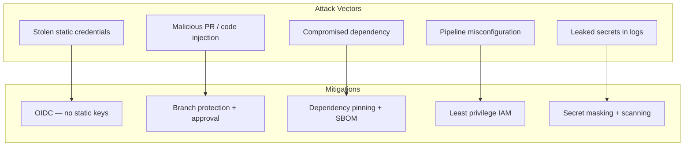
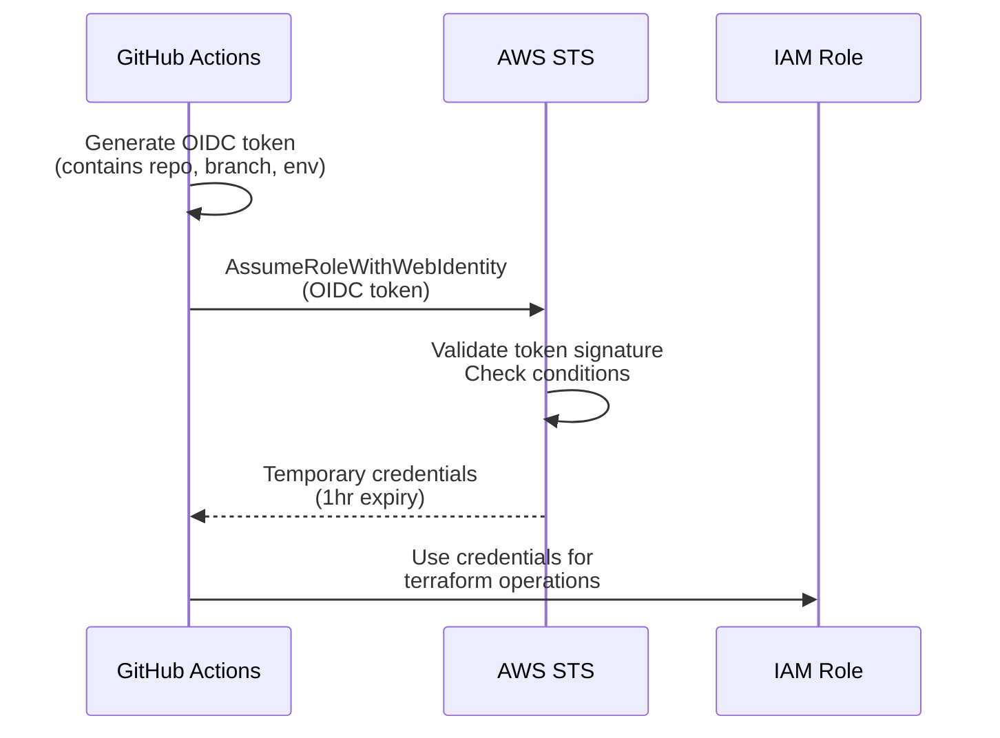

# Pipeline Security

## Overview

CI/CD pipelines for infrastructure have privileged access to cloud accounts. A compromised pipeline can create, modify, or destroy any resource. This guide covers OIDC authentication, secret management, policy checks, image scanning, and supply chain security for Terraform pipelines.

---

## Threat Model



---

## OIDC vs Static Credentials

### The Problem with Static Credentials

Static credentials (AWS access key + secret key) stored in CI/CD secrets:

- Never expire unless manually rotated.
- Are shared across all workflow runs.
- Can be exfiltrated by malicious code in the pipeline.
- Must be rotated manually when compromised.
- Exist in multiple places (GitHub secrets, CI/CD system, potentially logs).

### OIDC: The Solution

OpenID Connect (OIDC) allows your CI/CD platform to request short-lived credentials directly from AWS, scoped to the specific workflow run.



### OIDC Setup for GitHub Actions

```hcl
# Trust policy — only allow specific repo, branch, and environment
resource "aws_iam_role" "cicd" {
  name = "cicd-terraform-${var.environment}"

  assume_role_policy = jsonencode({
    Version = "2012-10-17"
    Statement = [{
      Effect = "Allow"
      Action = "sts:AssumeRoleWithWebIdentity"
      Principal = {
        Federated = var.github_oidc_provider_arn
      }
      Condition = {
        StringEquals = {
          "token.actions.githubusercontent.com:aud" = "sts.amazonaws.com"
        }
        StringLike = {
          # Restrict to specific repo and environment
          "token.actions.githubusercontent.com:sub" = join(":", [
            "repo:${var.github_org}/${var.github_repo}",
            "environment:${var.environment}"
          ])
        }
      }
    }]
  })

  # Maximum session duration
  max_session_duration = 3600  # 1 hour

  tags = {
    Environment = var.environment
    Purpose     = "cicd"
  }
}
```

### OIDC Condition Patterns

| Condition | Value | Purpose |
|-----------|-------|---------|
| `repo:org/repo:ref:refs/heads/main` | Restrict to main branch | Prevent applies from feature branches |
| `repo:org/repo:environment:production` | Restrict to environment | Match GitHub environment protection |
| `repo:org/repo:pull_request` | Restrict to PRs | Only allow plan, not apply |
| `repo:org/*:*` | Any repo in org | Shared role for all repos |

---

## Least Privilege IAM for Pipelines

### Separate Plan and Apply Roles

```hcl
# Plan role — read-only + state access
resource "aws_iam_role" "plan" {
  name = "cicd-plan-${var.environment}"

  assume_role_policy = jsonencode({
    Version = "2012-10-17"
    Statement = [{
      Effect = "Allow"
      Action = "sts:AssumeRoleWithWebIdentity"
      Principal = {
        Federated = var.github_oidc_provider_arn
      }
      Condition = {
        StringEquals = {
          "token.actions.githubusercontent.com:aud" = "sts.amazonaws.com"
        }
        StringLike = {
          "token.actions.githubusercontent.com:sub" = "repo:${var.github_org}/${var.github_repo}:pull_request"
        }
      }
    }]
  })
}

resource "aws_iam_role_policy" "plan" {
  name = "plan-permissions"
  role = aws_iam_role.plan.id

  policy = jsonencode({
    Version = "2012-10-17"
    Statement = [
      {
        Sid    = "ReadOnlyAccess"
        Effect = "Allow"
        Action = [
          "ec2:Describe*",
          "rds:Describe*",
          "ecs:Describe*",
          "ecs:List*",
          "s3:Get*",
          "s3:List*",
          "iam:Get*",
          "iam:List*",
          "lambda:Get*",
          "lambda:List*",
          "elasticache:Describe*",
          "logs:Describe*",
          "cloudwatch:Describe*",
          "tag:Get*",
        ]
        Resource = "*"
      },
      {
        Sid    = "StateAccess"
        Effect = "Allow"
        Action = [
          "s3:GetObject",
          "s3:PutObject",
          "s3:ListBucket",
        ]
        Resource = [
          var.state_bucket_arn,
          "${var.state_bucket_arn}/*",
        ]
      },
      {
        Sid    = "StateLocking"
        Effect = "Allow"
        Action = [
          "dynamodb:GetItem",
          "dynamodb:PutItem",
          "dynamodb:DeleteItem",
        ]
        Resource = [var.lock_table_arn]
      }
    ]
  })
}

# Apply role — full access (used only from main branch with environment protection)
resource "aws_iam_role" "apply" {
  name = "cicd-apply-${var.environment}"

  assume_role_policy = jsonencode({
    Version = "2012-10-17"
    Statement = [{
      Effect = "Allow"
      Action = "sts:AssumeRoleWithWebIdentity"
      Principal = {
        Federated = var.github_oidc_provider_arn
      }
      Condition = {
        StringEquals = {
          "token.actions.githubusercontent.com:aud" = "sts.amazonaws.com"
        }
        StringLike = {
          "token.actions.githubusercontent.com:sub" = "repo:${var.github_org}/${var.github_repo}:environment:${var.environment}"
        }
      }
    }]
  })
}
```

---

## Secret Management in Pipelines

### Hierarchy of Preference

1. **OIDC / dynamic credentials** — no secrets to manage.
2. **AWS Secrets Manager** — fetched at runtime, rotated automatically.
3. **GitHub environment secrets** — scoped to deployment environments.
4. **GitHub repository secrets** — shared across all workflows.
5. **GitHub organization secrets** — shared across all repos (least preferred).

### Fetching Secrets at Runtime

```yaml
- name: Fetch database password
  run: |
    DB_PASSWORD=$(aws secretsmanager get-secret-value \
      --secret-id "${ENVIRONMENT}/database/password" \
      --query SecretString --output text)
    echo "::add-mask::$DB_PASSWORD"
    echo "TF_VAR_db_password=$DB_PASSWORD" >> "$GITHUB_ENV"
```

### Secret Scanning

```yaml
- name: Detect secrets in code
  uses: trufflesecurity/trufflehog@v3
  with:
    path: .
    base: ${{ github.event.pull_request.base.sha }}
    head: ${{ github.event.pull_request.head.sha }}
```

---

## Policy Checks

### Checkov (Open Source)

```yaml
- name: Run Checkov
  uses: bridgecrewio/checkov-action@v12
  with:
    directory: infrastructure/
    framework: terraform
    check: |
      CKV_AWS_18,CKV_AWS_19,CKV_AWS_21,CKV_AWS_23,
      CKV_AWS_24,CKV_AWS_25,CKV_AWS_28,CKV_AWS_33,
      CKV_AWS_35,CKV_AWS_40,CKV_AWS_41,CKV_AWS_46
    soft_fail: false
```

### Key Checks to Enforce

| Check ID | Description | Severity |
|----------|-------------|----------|
| CKV_AWS_18 | S3 access logging enabled | High |
| CKV_AWS_19 | S3 SSE encryption enabled | Critical |
| CKV_AWS_23 | Security group allows 0.0.0.0/0 | Critical |
| CKV_AWS_24 | Security group allows 0.0.0.0/0 to port 22 | Critical |
| CKV_AWS_28 | DynamoDB PITR enabled | High |
| CKV_AWS_35 | CloudTrail log validation | High |
| CKV_AWS_41 | IMDSv2 enforced | Critical |
| CKV_AWS_145 | RDS encryption enabled | Critical |

### OPA (Open Policy Agent)

```yaml
- name: OPA Policy Check
  run: |
    terraform show -json tfplan > plan.json
    opa eval \
      --data policies/ \
      --input plan.json \
      "data.terraform.deny" \
      --format pretty

    # Fail if any denials
    DENIALS=$(opa eval --data policies/ --input plan.json \
      "data.terraform.deny" --format json | jq '.result[0].expressions[0].value | length')
    if [ "$DENIALS" -gt 0 ]; then
      echo "Policy violations found"
      exit 1
    fi
```

---

## Supply Chain Security

### Pin Action Versions

```yaml
# Bad — mutable tag
- uses: actions/checkout@v4

# Good — immutable commit SHA
- uses: actions/checkout@b4ffde65f46336ab88eb53be808477a3936bae11  # v4.1.1
```

### Dependency Lock Files

```hcl
# .terraform.lock.hcl — always commit this file
# Generated by: terraform init
# Contains hashes of provider binaries
```

### SBOM Generation

```yaml
- name: Generate SBOM
  uses: anchore/sbom-action@v0
  with:
    path: infrastructure/
    format: spdx-json
    output-file: sbom.spdx.json

- name: Upload SBOM
  uses: actions/upload-artifact@v4
  with:
    name: sbom
    path: sbom.spdx.json
```

---

## Audit Trail

Every pipeline run should produce an audit record containing:

| Field | Source | Purpose |
|-------|--------|---------|
| Who triggered | `github.actor` | Accountability |
| What changed | `terraform plan` output | Change record |
| When | Workflow run timestamp | Timeline |
| Which environment | GitHub environment | Scope |
| Approval | PR review + environment gate | Authorization |
| Result | Apply output | Outcome |

```yaml
- name: Record audit event
  run: |
    aws dynamodb put-item \
      --table-name infrastructure-audit \
      --item '{
        "id": {"S": "${{ github.run_id }}"},
        "timestamp": {"S": "'$(date -u +%Y-%m-%dT%H:%M:%SZ)'"},
        "actor": {"S": "${{ github.actor }}"},
        "environment": {"S": "${{ matrix.environment }}"},
        "action": {"S": "apply"},
        "commit": {"S": "${{ github.sha }}"},
        "result": {"S": "success"}
      }'
```

---

## Security Checklist

- [ ] OIDC authentication (no static AWS keys)
- [ ] Separate plan and apply IAM roles
- [ ] Branch protection on main (require reviews)
- [ ] GitHub environment protection rules
- [ ] Secret scanning enabled on repository
- [ ] Policy checks (Checkov/OPA) as blocking gates
- [ ] Action versions pinned to commit SHAs
- [ ] `.terraform.lock.hcl` committed and verified
- [ ] Sensitive Terraform outputs marked `sensitive = true`
- [ ] CI/CD logs scrubbed of secrets (`::add-mask::`)
- [ ] Audit trail of all applies
- [ ] Terraform state bucket encrypted with versioning

---

## Related Guides

- [CI/CD Overview](cicd-overview.md) — Foundational CI/CD principles
- [GitHub Actions](github-actions-terraform.md) — Workflow implementation
- [Security](../04-aws-services-guide/security.md) — AWS IAM patterns
- [Compliance](../07-production-patterns/compliance-and-governance.md) — Policy enforcement
