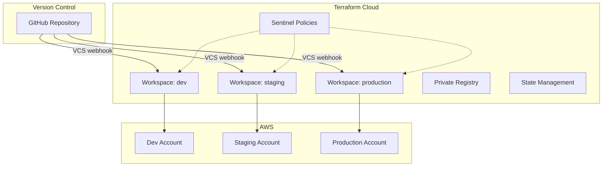
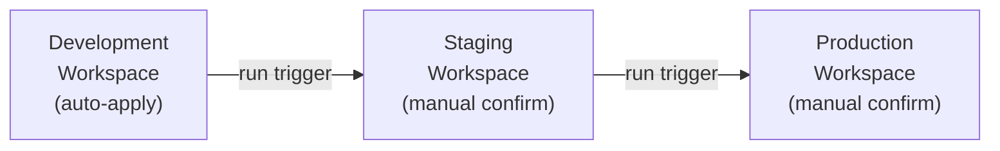

# Terraform Cloud VCS-Driven Workflows

## Overview

Terraform Cloud (TFC) provides a SaaS platform for Terraform operations with built-in state management, VCS integration, policy enforcement, and team collaboration. This guide covers VCS-driven workflows, speculative plans, run triggers, workspace linking, and production configuration patterns.

---

## Architecture



---

## Workspace Configuration with Terraform

```hcl
# Configure the TFC provider
terraform {
  required_providers {
    tfe = {
      source  = "hashicorp/tfe"
      version = "~> 0.58"
    }
  }
}

provider "tfe" {
  # Token set via TFE_TOKEN environment variable
}

# Organization
data "tfe_organization" "main" {
  name = var.tfc_org_name
}

# Project for grouping workspaces
resource "tfe_project" "infrastructure" {
  organization = data.tfe_organization.main.name
  name         = "infrastructure"
}

# VCS-connected workspaces
resource "tfe_workspace" "environments" {
  for_each = {
    development = {
      auto_apply          = true
      working_directory   = "infrastructure/environments/development"
      trigger_patterns    = [
        "infrastructure/environments/development/**/*",
        "infrastructure/modules/**/*",
      ]
    }
    staging = {
      auto_apply          = false
      working_directory   = "infrastructure/environments/staging"
      trigger_patterns    = [
        "infrastructure/environments/staging/**/*",
        "infrastructure/modules/**/*",
      ]
    }
    production = {
      auto_apply          = false
      working_directory   = "infrastructure/environments/production"
      trigger_patterns    = [
        "infrastructure/environments/production/**/*",
        "infrastructure/modules/**/*",
      ]
    }
  }

  name              = "${var.project_name}-${each.key}"
  organization      = data.tfe_organization.main.name
  project_id        = tfe_project.infrastructure.id
  terraform_version = "1.9.0"
  queue_all_runs    = false

  working_directory   = each.value.working_directory
  auto_apply          = each.value.auto_apply
  file_triggers_enabled = true
  trigger_patterns    = each.value.trigger_patterns

  vcs_repo {
    identifier     = "${var.github_org}/${var.github_repo}"
    oauth_token_id = var.tfc_oauth_token_id
    branch         = "main"
  }

  tags = [each.key, "infrastructure", var.project_name]
}

# Workspace variables
resource "tfe_variable" "environment" {
  for_each = tfe_workspace.environments

  key          = "environment"
  value        = each.key
  category     = "terraform"
  workspace_id = each.value.id
}

# AWS credentials via dynamic provider credentials
resource "tfe_variable" "tfc_aws_provider_auth" {
  for_each = tfe_workspace.environments

  key          = "TFC_AWS_PROVIDER_AUTH"
  value        = "true"
  category     = "env"
  workspace_id = each.value.id
}

resource "tfe_variable" "tfc_aws_run_role_arn" {
  for_each = tfe_workspace.environments

  key          = "TFC_AWS_RUN_ROLE_ARN"
  value        = var.aws_role_arns[each.key]
  category     = "env"
  workspace_id = each.value.id
}
```

---

## Speculative Plans

Speculative plans run automatically on pull requests, showing what would change without applying. They appear as GitHub status checks.

### How It Works

1. Developer opens a PR against `main`.
2. TFC detects the VCS event and runs a speculative plan.
3. Plan result appears as a GitHub check with a link to the full output.
4. Reviewer reads the plan before approving the PR.
5. On merge, a real plan + apply runs on the workspace.

### Configuration

Speculative plans are enabled by default for VCS-connected workspaces. No additional configuration is needed.

---

## Run Triggers (Workspace Chaining)

Run triggers allow one workspace to automatically trigger a run in another workspace when it applies successfully.

```hcl
# Staging triggers after development succeeds
resource "tfe_run_trigger" "staging_after_dev" {
  workspace_id  = tfe_workspace.environments["staging"].id
  sourceable_id = tfe_workspace.environments["development"].id
}

# Production triggers after staging succeeds (still requires confirmation)
resource "tfe_run_trigger" "prod_after_staging" {
  workspace_id  = tfe_workspace.environments["production"].id
  sourceable_id = tfe_workspace.environments["staging"].id
}
```



---

## Workspace Linking with Remote State

Share outputs between workspaces using `tfe_outputs` data source:

```hcl
# In the networking workspace
output "vpc_id" {
  value = aws_vpc.main.id
}

output "private_subnet_ids" {
  value = aws_subnet.private[*].id
}

# In the application workspace
data "tfe_outputs" "networking" {
  organization = var.tfc_org_name
  workspace    = "${var.project_name}-networking-${var.environment}"
}

locals {
  vpc_id             = data.tfe_outputs.networking.values.vpc_id
  private_subnet_ids = data.tfe_outputs.networking.values.private_subnet_ids
}
```

---

## Team Access and Permissions

```hcl
resource "tfe_team" "platform" {
  name         = "platform"
  organization = data.tfe_organization.main.name
}

resource "tfe_team" "developers" {
  name         = "developers"
  organization = data.tfe_organization.main.name
}

resource "tfe_team_access" "platform_admin" {
  for_each = tfe_workspace.environments

  team_id      = tfe_team.platform.id
  workspace_id = each.value.id

  permissions {
    runs              = "apply"
    variables         = "write"
    state_versions    = "read-outputs"
    sentinel_mocks    = "read"
    workspace_locking = true
    run_tasks         = false
  }
}

resource "tfe_team_access" "developers_read" {
  for_each = tfe_workspace.environments

  team_id      = tfe_team.developers.id
  workspace_id = each.value.id

  permissions {
    runs              = "plan"
    variables         = "read"
    state_versions    = "read-outputs"
    sentinel_mocks    = "none"
    workspace_locking = false
    run_tasks         = false
  }
}
```

---

## Sentinel Policy Example

```python
# policies/require-tags.sentinel
import "tfplan/v2" as tfplan

required_tags = ["Environment", "Team", "ManagedBy"]

tagged_resource_types = [
  "aws_instance",
  "aws_s3_bucket",
  "aws_rds_cluster",
  "aws_ecs_service",
  "aws_lambda_function",
]

all_resources = filter tfplan.resource_changes as _, rc {
  rc.type in tagged_resource_types and
  rc.mode is "managed" and
  (rc.change.actions contains "create" or rc.change.actions contains "update")
}

violations = []

for all_resources as _, resource {
  tags = resource.change.after.tags else {}
  for required_tags as tag {
    if tag not in keys(tags) {
      append(violations, "${resource.address} is missing required tag: ${tag}")
    }
  }
}

main = rule {
  length(violations) is 0
}
```

```hcl
# Policy set configuration
resource "tfe_policy_set" "security" {
  name         = "security-policies"
  organization = data.tfe_organization.main.name

  kind = "sentinel"

  vcs_repo {
    identifier     = "${var.github_org}/terraform-policies"
    oauth_token_id = var.tfc_oauth_token_id
    branch         = "main"
  }

  workspace_ids = [for ws in tfe_workspace.environments : ws.id]
}
```

---

## Dynamic Provider Credentials (OIDC)

```hcl
# AWS IAM role trusting Terraform Cloud
resource "aws_iam_role" "tfc" {
  name = "terraform-cloud-${var.environment}"

  assume_role_policy = jsonencode({
    Version = "2012-10-17"
    Statement = [{
      Effect = "Allow"
      Action = "sts:AssumeRoleWithWebIdentity"
      Principal = {
        Federated = aws_iam_openid_connect_provider.tfc.arn
      }
      Condition = {
        StringEquals = {
          "app.terraform.io:aud" = "aws.workload.identity"
        }
        StringLike = {
          "app.terraform.io:sub" = "organization:${var.tfc_org}:project:${var.project}:workspace:*-${var.environment}:run_phase:*"
        }
      }
    }]
  })
}

resource "aws_iam_openid_connect_provider" "tfc" {
  url             = "https://app.terraform.io"
  client_id_list  = ["aws.workload.identity"]
  thumbprint_list = ["9e99a48a9960b14926bb7f3b02e22da2b0ab7280"]
}
```

---

## TFC vs Self-Managed

| Feature | Terraform Cloud | Self-Managed (S3 + GH Actions) |
|---------|----------------|-------------------------------|
| State Management | Built-in, versioned | S3 + DynamoDB |
| Locking | Automatic | DynamoDB |
| Policy as Code | Sentinel (native) | OPA/Checkov (external) |
| Cost Estimation | Built-in | Infracost |
| Private Registry | Built-in | S3 or Artifactory |
| OIDC | Native | Manual setup |
| Drift Detection | Built-in | Custom cron job |
| Cost | Free (up to 500 resources) | Infrastructure cost only |

---

## Best Practices

1. **Use dynamic provider credentials** — avoid static AWS keys in workspace variables.
2. **Enable speculative plans** — every PR should show what will change.
3. **Use run triggers for promotion** — chain dev to staging to production.
4. **Separate workspaces by blast radius** — networking, compute, and data in different workspaces.
5. **Use Sentinel or OPA** — enforce organizational policies before apply.
6. **Lock sensitive variables** — mark credentials as sensitive and write-only.
7. **Use projects** to group related workspaces for access control.

---

## Related Guides

- [CI/CD Overview](cicd-overview.md) — Foundational CI/CD concepts
- [GitHub Actions](github-actions-terraform.md) — Alternative workflow approach
- [Pipeline Security](pipeline-security.md) — OIDC and credential management
