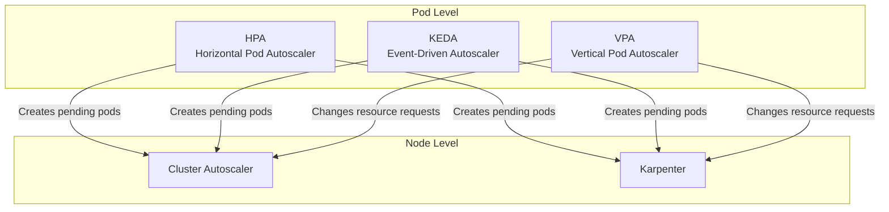

# Kubernetes Autoscaling

## Overview

Kubernetes autoscaling operates at two layers: pod-level (scaling application replicas) and node-level (scaling cluster capacity). This guide covers Cluster Autoscaler, Karpenter, HPA, VPA, and KEDA — when and how to use each.

---

## Autoscaling Layers



---

## Cluster Autoscaler

Adjusts the number of nodes by watching for pending pods that cannot be scheduled.

### Installation

```hcl
resource "aws_iam_role" "cluster_autoscaler" {
  name = "${local.cluster_name}-cluster-autoscaler"

  assume_role_policy = jsonencode({
    Version = "2012-10-17"
    Statement = [{
      Effect = "Allow"
      Action = "sts:AssumeRoleWithWebIdentity"
      Principal = { Federated = local.oidc_provider_arn }
      Condition = {
        StringEquals = {
          "${local.oidc_provider}:aud" = "sts.amazonaws.com"
          "${local.oidc_provider}:sub" = "system:serviceaccount:kube-system:cluster-autoscaler"
        }
      }
    }]
  })
}

resource "aws_iam_role_policy" "cluster_autoscaler" {
  name = "cluster-autoscaler"
  role = aws_iam_role.cluster_autoscaler.id

  policy = jsonencode({
    Version = "2012-10-17"
    Statement = [{
      Effect = "Allow"
      Action = [
        "autoscaling:DescribeAutoScalingGroups",
        "autoscaling:DescribeAutoScalingInstances",
        "autoscaling:DescribeLaunchConfigurations",
        "autoscaling:DescribeScalingActivities",
        "autoscaling:DescribeTags",
        "autoscaling:SetDesiredCapacity",
        "autoscaling:TerminateInstanceInAutoScalingGroup",
        "ec2:DescribeLaunchTemplateVersions",
        "ec2:DescribeInstanceTypes",
        "ec2:DescribeImages",
        "ec2:GetInstanceTypesFromInstanceRequirements",
        "eks:DescribeNodegroup",
      ]
      Resource = "*"
    }]
  })
}

resource "helm_release" "cluster_autoscaler" {
  name       = "cluster-autoscaler"
  repository = "https://kubernetes.github.io/autoscaler"
  chart      = "cluster-autoscaler"
  version    = "9.37.0"
  namespace  = "kube-system"

  values = [yamlencode({
    autoDiscovery = {
      clusterName = aws_eks_cluster.main.name
    }
    awsRegion = data.aws_region.current.name
    rbac = {
      serviceAccount = {
        create = true
        name   = "cluster-autoscaler"
        annotations = {
          "eks.amazonaws.com/role-arn" = aws_iam_role.cluster_autoscaler.arn
        }
      }
    }
    extraArgs = {
      "balance-similar-node-groups"   = true
      "skip-nodes-with-system-pods"   = false
      "expander"                      = "least-waste"
      "scale-down-delay-after-add"    = "5m"
      "scale-down-unneeded-time"      = "5m"
      "scale-down-utilization-threshold" = "0.5"
    }
    resources = {
      requests = { cpu = "100m", memory = "300Mi" }
      limits   = { memory = "600Mi" }
    }
  })]
}
```

---

## Karpenter (Recommended)

Karpenter is the next-generation node autoscaler. It provisions right-sized nodes directly (bypassing ASGs), supports diverse instance types, and consolidates underutilized nodes.

### Why Karpenter over Cluster Autoscaler

| Feature | Cluster Autoscaler | Karpenter |
|---------|-------------------|-----------|
| Provisioning | Via ASG (predefined sizes) | Direct EC2 API (any size) |
| Speed | 1-3 minutes | 30-60 seconds |
| Right-sizing | Limited to ASG config | Matches pod requirements |
| Consolidation | Basic | Advanced (bin-packing) |
| Spot handling | ASG mixed instances | Native, with interruption handling |
| Configuration | Node groups per type | NodePool with constraints |

### Installation

```hcl
resource "aws_iam_role" "karpenter" {
  name = "${local.cluster_name}-karpenter"

  assume_role_policy = jsonencode({
    Version = "2012-10-17"
    Statement = [{
      Effect = "Allow"
      Action = "sts:AssumeRoleWithWebIdentity"
      Principal = { Federated = local.oidc_provider_arn }
      Condition = {
        StringEquals = {
          "${local.oidc_provider}:aud" = "sts.amazonaws.com"
          "${local.oidc_provider}:sub" = "system:serviceaccount:kube-system:karpenter"
        }
      }
    }]
  })
}

resource "helm_release" "karpenter" {
  name       = "karpenter"
  repository = "oci://public.ecr.aws/karpenter"
  chart      = "karpenter"
  version    = "1.0.0"
  namespace  = "kube-system"

  values = [yamlencode({
    settings = {
      clusterName       = aws_eks_cluster.main.name
      clusterEndpoint   = aws_eks_cluster.main.endpoint
      interruptionQueue = aws_sqs_queue.karpenter.name
    }
    serviceAccount = {
      annotations = {
        "eks.amazonaws.com/role-arn" = aws_iam_role.karpenter.arn
      }
    }
    replicas = 2
    resources = {
      requests = { cpu = "250m", memory = "256Mi" }
      limits   = { memory = "512Mi" }
    }
  })]

  depends_on = [aws_eks_node_group.general]
}
```

### NodePool and EC2NodeClass

```yaml
apiVersion: karpenter.sh/v1
kind: NodePool
metadata:
  name: general
spec:
  template:
    metadata:
      labels:
        role: general
    spec:
      nodeClassRef:
        group: karpenter.k8s.aws
        kind: EC2NodeClass
        name: default
      requirements:
        - key: kubernetes.io/arch
          operator: In
          values: ["arm64"]         # Graviton for cost savings
        - key: karpenter.sh/capacity-type
          operator: In
          values: ["on-demand", "spot"]
        - key: karpenter.k8s.aws/instance-category
          operator: In
          values: ["m", "c", "r"]   # General, compute, memory
        - key: karpenter.k8s.aws/instance-generation
          operator: Gt
          values: ["5"]             # 6th gen and newer
  limits:
    cpu: "200"
    memory: 400Gi
  disruption:
    consolidationPolicy: WhenEmptyOrUnderutilized
    consolidateAfter: 1m
  weight: 50

---
apiVersion: karpenter.k8s.aws/v1
kind: EC2NodeClass
metadata:
  name: default
spec:
  amiSelectorTerms:
    - alias: al2023@latest
  subnetSelectorTerms:
    - tags:
        karpenter.sh/discovery: production-eks
  securityGroupSelectorTerms:
    - tags:
        karpenter.sh/discovery: production-eks
  role: karpenter-node-role
  tags:
    Environment: production
    ManagedBy: karpenter
  blockDeviceMappings:
    - deviceName: /dev/xvda
      ebs:
        volumeSize: 50Gi
        volumeType: gp3
        encrypted: true
```

---

## HPA — Horizontal Pod Autoscaler

```yaml
apiVersion: autoscaling/v2
kind: HorizontalPodAutoscaler
metadata:
  name: api
  namespace: app
spec:
  scaleTargetRef:
    apiVersion: apps/v1
    kind: Deployment
    name: api
  minReplicas: 3
  maxReplicas: 50
  behavior:
    scaleUp:
      stabilizationWindowSeconds: 30
      policies:
        - type: Percent
          value: 100       # Double capacity at most
          periodSeconds: 60
    scaleDown:
      stabilizationWindowSeconds: 300  # Wait 5 min before scaling down
      policies:
        - type: Percent
          value: 10        # Scale down 10% at a time
          periodSeconds: 60
  metrics:
    - type: Resource
      resource:
        name: cpu
        target:
          type: Utilization
          averageUtilization: 60
```

---

## VPA — Vertical Pod Autoscaler

VPA adjusts pod resource requests based on actual usage. Use it in recommendation mode alongside HPA.

```yaml
apiVersion: autoscaling.k8s.io/v1
kind: VerticalPodAutoscaler
metadata:
  name: api
  namespace: app
spec:
  targetRef:
    apiVersion: apps/v1
    kind: Deployment
    name: api
  updatePolicy:
    updateMode: "Off"  # "Off" = recommendations only; "Auto" = auto-resize
  resourcePolicy:
    containerPolicies:
      - containerName: api
        minAllowed:
          cpu: 100m
          memory: 128Mi
        maxAllowed:
          cpu: 4
          memory: 8Gi
        controlledResources: ["cpu", "memory"]
```

**Important**: Do not use VPA in `Auto` mode with HPA on CPU/memory — they will conflict. Use VPA in `Off` (recommendation) mode and apply suggestions manually.

---

## KEDA — Event-Driven Autoscaling

KEDA scales based on external metrics: SQS queue depth, Kafka lag, Prometheus queries, cron schedules, and 60+ other sources.

```hcl
resource "helm_release" "keda" {
  name             = "keda"
  repository       = "https://kedacore.github.io/charts"
  chart            = "keda"
  version          = "2.15.0"
  namespace        = "keda"
  create_namespace = true

  values = [yamlencode({
    serviceAccount = {
      create = true
      annotations = {
        "eks.amazonaws.com/role-arn" = aws_iam_role.keda.arn
      }
    }
  })]
}
```

### Scale on SQS Queue Depth

```yaml
apiVersion: keda.sh/v1alpha1
kind: ScaledObject
metadata:
  name: order-processor
  namespace: app
spec:
  scaleTargetRef:
    name: order-processor
  minReplicaCount: 1
  maxReplicaCount: 50
  pollingInterval: 15
  cooldownPeriod: 300
  triggers:
    - type: aws-sqs-queue
      metadata:
        queueURL: https://sqs.us-east-1.amazonaws.com/123456789012/orders
        queueLength: "5"       # Target 5 messages per pod
        awsRegion: us-east-1
        identityOwner: operator
```

### Scale on Cron Schedule

```yaml
apiVersion: keda.sh/v1alpha1
kind: ScaledObject
metadata:
  name: batch-processor
  namespace: app
spec:
  scaleTargetRef:
    name: batch-processor
  minReplicaCount: 0
  maxReplicaCount: 10
  triggers:
    - type: cron
      metadata:
        timezone: America/New_York
        start: "0 8 * * 1-5"    # 8 AM weekdays
        end: "0 18 * * 1-5"     # 6 PM weekdays
        desiredReplicas: "5"
```

---

## When to Use Each

| Scenario | Tool | Why |
|----------|------|-----|
| Scale pods on CPU/memory | HPA | Built-in, simple |
| Scale pods on queue depth | KEDA | External metric support |
| Scale pods on custom Prometheus metric | HPA + Prometheus adapter or KEDA | Flexible |
| Right-size pod resources | VPA (Off mode) | Recommendations |
| Scale nodes for pending pods | Karpenter | Fast, right-sized |
| Scale nodes (legacy ASG) | Cluster Autoscaler | Simpler, proven |
| Scale to zero | KEDA | Native zero-to-N |

---

## Best Practices

1. **Use Karpenter over Cluster Autoscaler** for new clusters — faster provisioning, better bin-packing.
2. **Set HPA behavior policies** — prevent flapping with stabilization windows.
3. **Do not combine HPA and VPA on the same metric** — they conflict.
4. **Use KEDA for event-driven workloads** — SQS, Kafka, and cron-based scaling.
5. **Set PodDisruptionBudgets** — protect against aggressive scale-down.
6. **Use Spot instances with Karpenter** — automatic diversification and interruption handling.
7. **Monitor scaling events** — create CloudWatch alarms for node count and HPA metrics.
8. **Use `ignore_changes = [scaling_config[0].desired_size]`** on Terraform node groups managed by autoscalers.

---

## Related Guides

- [EKS Terraform](eks-terraform.md) — Cluster and node group setup
- [K8s Manifests](k8s-manifests-guide.md) — HPA and PDB configuration
- [Cost Optimization](../07-production-patterns/cost-optimization.md) — Spot and right-sizing
