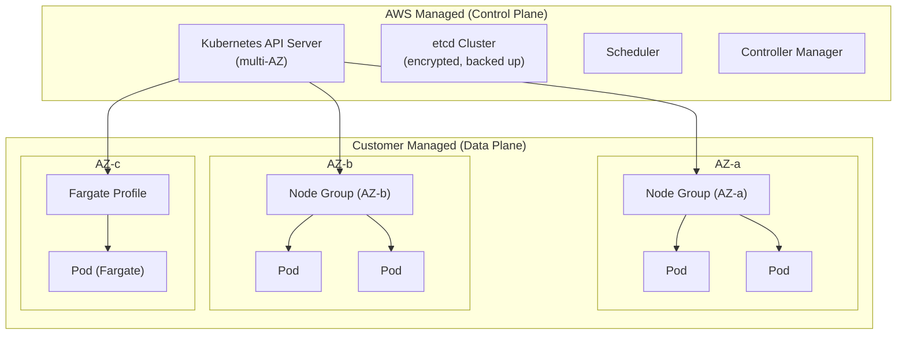
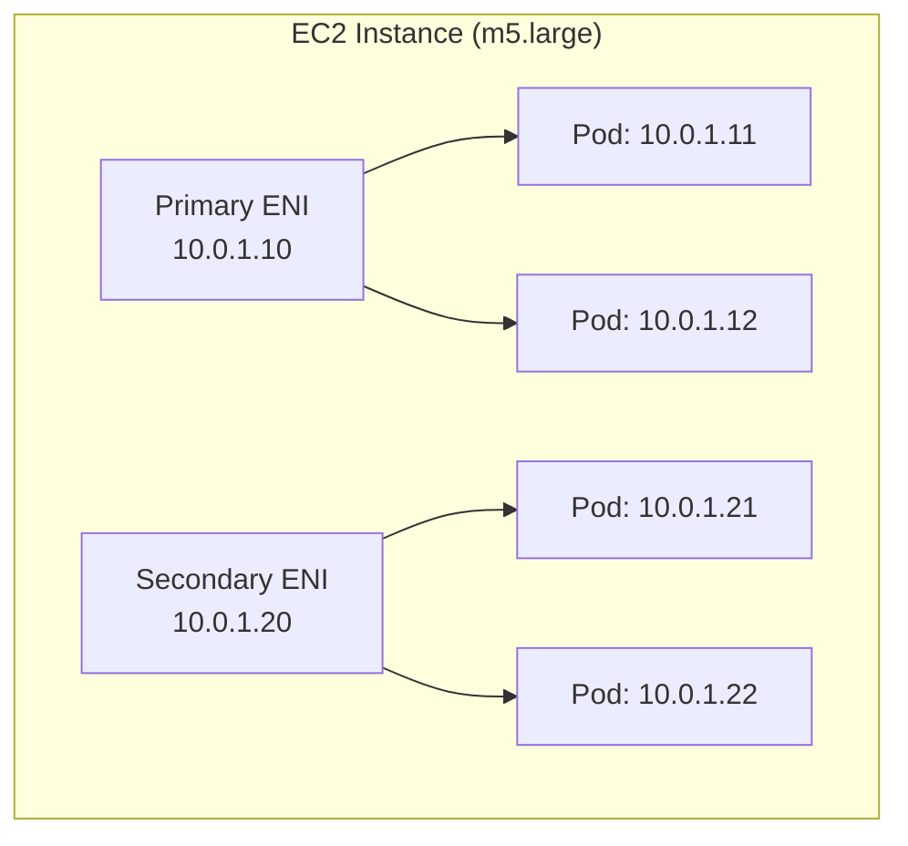
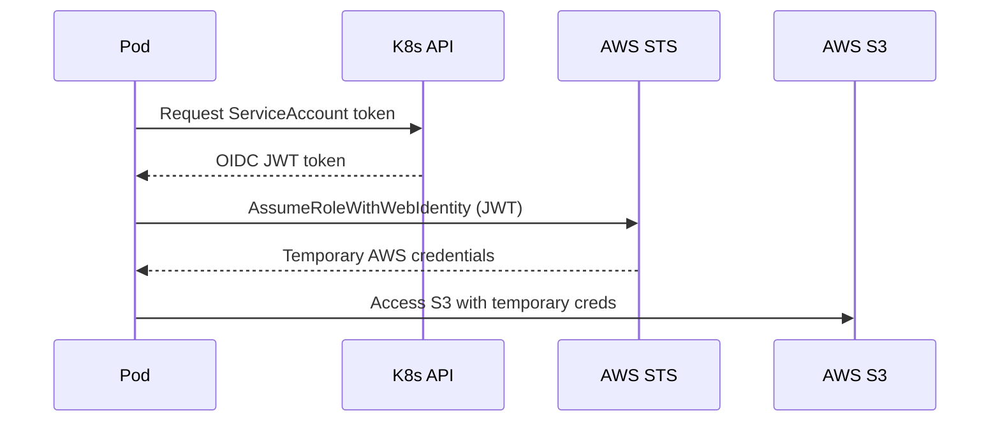

# EKS Overview

## Overview

Amazon Elastic Kubernetes Service (EKS) is a managed Kubernetes control plane. AWS manages the Kubernetes API servers, etcd cluster, and control plane infrastructure. You manage the worker nodes (or use Fargate to avoid that too). This guide covers EKS architecture, networking, IAM integration, and pricing considerations.

---

## EKS Architecture

---

## Control Plane

| Component | Details |
|-----------|---------|
| API Server | Multi-AZ, auto-scaled, managed by AWS |
| etcd | Encrypted at rest, automatically backed up |
| Kubernetes Version | AWS supports last 4 minor versions |
| SLA | 99.95% uptime SLA |
| Endpoint Access | Public, private, or both |
| Logging | API server, audit, authenticator, controller manager, scheduler |

### Endpoint Access Modes

| Mode | Use Case | Security |
|------|----------|----------|
| Public only | Development, learning | Least secure — API exposed to internet |
| Public + Private | Most production setups | Nodes use private endpoint, humans use public |
| Private only | High-security environments | Requires VPN/Direct Connect for access |

---

## Data Plane Options

### Managed Node Groups

- AWS manages the EC2 instances lifecycle (provisioning, updates, draining).
- You choose instance types, AMI, and scaling parameters.
- Supports custom launch templates for advanced configuration.
- Best for most production workloads.

### Self-Managed Node Groups

- You manage the EC2 ASG and node lifecycle.
- Required for specific AMIs, GPU instances, or custom configurations not supported by managed groups.
- More operational overhead.

### Fargate

- No nodes to manage at all.
- Each pod gets its own isolated micro-VM.
- No DaemonSets support.
- Higher per-pod cost, but zero node management.
- Best for batch jobs, low-traffic services, or when you want zero node ops.

### Comparison

| Feature | Managed Node Groups | Self-Managed | Fargate |
|---------|-------------------|--------------|---------|
| Node Management | AWS-managed | You manage | No nodes |
| Custom AMI | Yes (via launch template) | Yes | No |
| GPU Support | Yes | Yes | No |
| DaemonSets | Yes | Yes | No |
| Spot Instances | Yes | Yes | No |
| Per-pod isolation | No (shared node) | No | Yes |
| Startup Time | Minutes | Minutes | 30-60 seconds |
| Cost Efficiency | High (at scale) | Highest (full control) | Lower (at scale) |

---

## Networking — VPC CNI

EKS uses the Amazon VPC CNI plugin by default. Each pod gets a real VPC IP address from the subnet CIDR.

### Key Points

- Pod IPs are real VPC IPs — pods can communicate with any VPC resource without NAT.
- IP address count limited by ENI limits per instance type.
- **Max pods per node** = (Number of ENIs x IPs per ENI) - 1.
- For large clusters, use VPC CNI prefix delegation to support more pods per node.

### IP Planning

| Instance Type | Max ENIs | IPs per ENI | Max Pods (standard) | Max Pods (prefix delegation) |
|--------------|----------|-------------|---------------------|-------------------------------|
| t3.medium | 3 | 6 | 17 | 110 |
| m5.large | 3 | 10 | 29 | 110 |
| m5.xlarge | 4 | 15 | 58 | 110 |
| m5.2xlarge | 4 | 15 | 58 | 110 |

### Subnet Sizing for EKS

With VPC CNI, pods consume subnet IPs. For a cluster with 100 nodes running 50 pods each:
- Standard mode: ~5,000 IPs needed
- Use **/19 subnets** (8,190 IPs) minimum for private subnets.

---

## IAM Integration

EKS integrates with IAM through two mechanisms:

### 1. IRSA — IAM Roles for Service Accounts

Maps a Kubernetes service account to an IAM role. The recommended approach for pod-level AWS access.

### 2. EKS Pod Identity (Newer)

Simpler alternative to IRSA. No need to manage OIDC providers. AWS manages the token exchange.

### 3. aws-auth ConfigMap (Legacy)

Maps IAM users/roles to Kubernetes RBAC groups. Being replaced by EKS Access Entries.

### 4. EKS Access Entries (Recommended)

Native EKS API for managing cluster access, replacing the aws-auth ConfigMap.

---

## EKS Add-ons

EKS add-ons are AWS-managed Kubernetes components:

| Add-on | Purpose | Required? |
|--------|---------|-----------|
| vpc-cni | Pod networking | Yes |
| kube-proxy | Service networking | Yes |
| coredns | DNS resolution | Yes |
| aws-ebs-csi-driver | EBS persistent volumes | If using EBS |
| aws-efs-csi-driver | EFS shared storage | If using EFS |
| aws-mountpoint-s3-csi-driver | S3 as filesystem | If mounting S3 |
| adot | OpenTelemetry observability | Optional |
| guardduty-agent | Threat detection | Recommended |

---

## Pricing

| Component | Cost | Notes |
|-----------|------|-------|
| EKS Control Plane | $0.10/hour ($73/month) | Per cluster |
| EC2 Nodes | Standard EC2 pricing | m5.large ~ $70/month |
| Fargate | vCPU + memory per second | ~20% premium over EC2 |
| EKS Anywhere | Per cluster license | On-premise |
| Data Transfer | Standard VPC rates | Cross-AZ: $0.01/GB each way |
| Load Balancers | Standard ALB/NLB pricing | Per LB + LCU |

### Cost Optimization Tips

- Use **Spot instances** for non-critical workloads (via Karpenter or managed node groups).
- Use **Graviton (ARM64) nodes** for 20-40% savings.
- **Right-size node groups** — avoid large nodes with low utilization.
- Use **Fargate only for low-utilization workloads** — at scale, EC2 nodes are cheaper.
- **Minimize cross-AZ traffic** — topology-aware routing and pod affinity rules help.
- **Run one cluster per team/org**, not per environment — control plane costs add up.

---

## EKS vs ECS Decision

| Factor | Choose EKS | Choose ECS |
|--------|-----------|-----------|
| Team has K8s experience | Yes | -- |
| Need K8s ecosystem (Helm, Istio, ArgoCD) | Yes | -- |
| Multi-cloud portability needed | Yes | -- |
| Small team, simple workloads | -- | Yes |
| Deep AWS-native integration | -- | Yes |
| Minimize operational overhead | -- | Yes |
| Startup / small org | -- | Yes |
| Large org with platform team | Yes | -- |

---

## Cluster Strategy

### Single Cluster vs Multi-Cluster

| Strategy | Pros | Cons |
|----------|------|------|
| Single cluster, namespace isolation | Lower cost, simpler | Blast radius, noisy neighbor |
| Cluster per environment | Strong isolation | 3x control plane cost |
| Cluster per team | Full autonomy | Many clusters to manage |

**Recommended**: Start with one cluster per environment (dev, staging, prod). Use namespaces for team/service isolation within each cluster.

---

## Related Guides

- [EKS with Terraform](eks-terraform.md) — Complete cluster setup
- [Helm with Terraform](helm-with-terraform.md) — Deploying applications
- [Autoscaling](autoscaling.md) — Cluster and pod autoscaling
- [Observability](observability.md) — Monitoring EKS clusters
