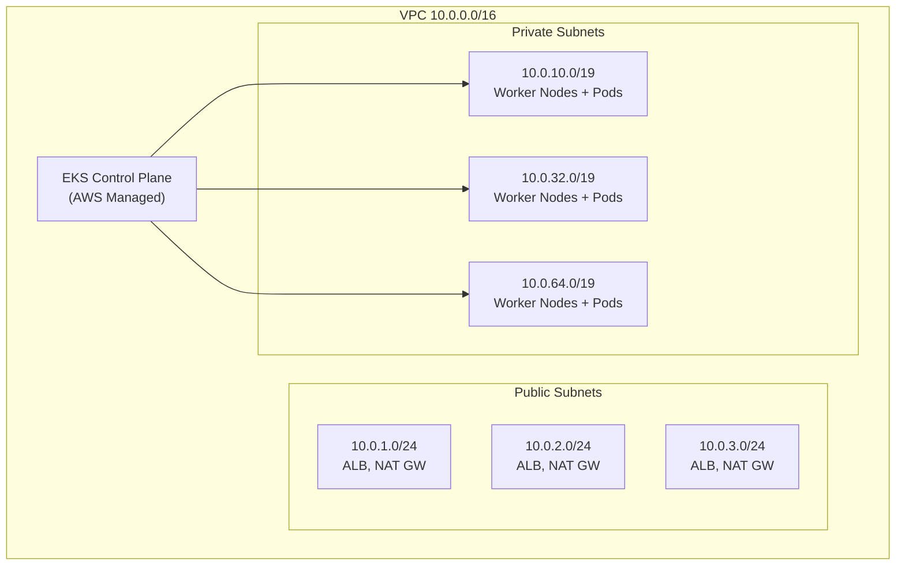

# EKS Cluster Setup with Terraform

## Overview

This guide provides a complete, production-ready EKS cluster setup using Terraform. It covers VPC networking, the EKS cluster resource, managed node groups, EKS add-ons, IRSA (IAM Roles for Service Accounts), and access management.

---

## Architecture



---

## VPC for EKS

```hcl
locals {
  cluster_name = "${var.environment}-eks"
  azs          = slice(data.aws_availability_zones.available.names, 0, 3)
}

data "aws_availability_zones" "available" {
  state = "available"
}

resource "aws_vpc" "main" {
  cidr_block           = "10.0.0.0/16"
  enable_dns_hostnames = true
  enable_dns_support   = true

  tags = {
    Name                                        = "${var.environment}-vpc"
    "kubernetes.io/cluster/${local.cluster_name}" = "shared"
  }
}

# Public subnets — /24 for ALBs and NAT gateways
resource "aws_subnet" "public" {
  count                   = 3
  vpc_id                  = aws_vpc.main.id
  cidr_block              = cidrsubnet("10.0.0.0/16", 8, count.index + 1)
  availability_zone       = local.azs[count.index]
  map_public_ip_on_launch = true

  tags = {
    Name                                        = "${var.environment}-public-${local.azs[count.index]}"
    "kubernetes.io/role/elb"                    = "1"
    "kubernetes.io/cluster/${local.cluster_name}" = "shared"
  }
}

# Private subnets — /19 for nodes and pods (8190 IPs each)
resource "aws_subnet" "private" {
  count             = 3
  vpc_id            = aws_vpc.main.id
  cidr_block        = cidrsubnet("10.0.0.0/16", 3, count.index + 1)
  availability_zone = local.azs[count.index]

  tags = {
    Name                                        = "${var.environment}-private-${local.azs[count.index]}"
    "kubernetes.io/role/internal-elb"           = "1"
    "kubernetes.io/cluster/${local.cluster_name}" = "shared"
    "karpenter.sh/discovery"                    = local.cluster_name
  }
}

# Internet Gateway, NAT Gateways, and Route Tables (see networking.md for details)
resource "aws_internet_gateway" "main" {
  vpc_id = aws_vpc.main.id
  tags   = { Name = "${var.environment}-igw" }
}

resource "aws_eip" "nat" {
  count  = 3
  domain = "vpc"
  tags   = { Name = "${var.environment}-nat-eip-${count.index}" }
}

resource "aws_nat_gateway" "main" {
  count         = 3
  allocation_id = aws_eip.nat[count.index].id
  subnet_id     = aws_subnet.public[count.index].id
  tags          = { Name = "${var.environment}-nat-${count.index}" }
}

resource "aws_route_table" "public" {
  vpc_id = aws_vpc.main.id
  route {
    cidr_block = "0.0.0.0/0"
    gateway_id = aws_internet_gateway.main.id
  }
  tags = { Name = "${var.environment}-public-rt" }
}

resource "aws_route_table_association" "public" {
  count          = 3
  subnet_id      = aws_subnet.public[count.index].id
  route_table_id = aws_route_table.public.id
}

resource "aws_route_table" "private" {
  count  = 3
  vpc_id = aws_vpc.main.id
  route {
    cidr_block     = "0.0.0.0/0"
    nat_gateway_id = aws_nat_gateway.main[count.index].id
  }
  tags = { Name = "${var.environment}-private-rt-${count.index}" }
}

resource "aws_route_table_association" "private" {
  count          = 3
  subnet_id      = aws_subnet.private[count.index].id
  route_table_id = aws_route_table.private[count.index].id
}
```

---

## EKS Cluster

```hcl
resource "aws_eks_cluster" "main" {
  name     = local.cluster_name
  role_arn = aws_iam_role.cluster.arn
  version  = var.kubernetes_version

  vpc_config {
    subnet_ids              = aws_subnet.private[*].id
    endpoint_private_access = true
    endpoint_public_access  = true
    public_access_cidrs     = var.cluster_public_access_cidrs
    security_group_ids      = [aws_security_group.cluster.id]
  }

  enabled_cluster_log_types = [
    "api",
    "audit",
    "authenticator",
    "controllerManager",
    "scheduler",
  ]

  encryption_config {
    provider {
      key_arn = var.kms_key_arn
    }
    resources = ["secrets"]
  }

  access_config {
    authentication_mode                         = "API_AND_CONFIG_MAP"
    bootstrap_cluster_creator_admin_permissions = true
  }

  depends_on = [
    aws_iam_role_policy_attachment.cluster_policy,
    aws_iam_role_policy_attachment.cluster_vpc_controller,
    aws_cloudwatch_log_group.eks,
  ]

  tags = {
    Name        = local.cluster_name
    Environment = var.environment
  }
}

resource "aws_cloudwatch_log_group" "eks" {
  name              = "/aws/eks/${local.cluster_name}/cluster"
  retention_in_days = 90
}

# Cluster IAM Role
resource "aws_iam_role" "cluster" {
  name = "${local.cluster_name}-cluster-role"

  assume_role_policy = jsonencode({
    Version = "2012-10-17"
    Statement = [{
      Action = "sts:AssumeRole"
      Effect = "Allow"
      Principal = { Service = "eks.amazonaws.com" }
    }]
  })
}

resource "aws_iam_role_policy_attachment" "cluster_policy" {
  role       = aws_iam_role.cluster.name
  policy_arn = "arn:aws:iam::aws:policy/AmazonEKSClusterPolicy"
}

resource "aws_iam_role_policy_attachment" "cluster_vpc_controller" {
  role       = aws_iam_role.cluster.name
  policy_arn = "arn:aws:iam::aws:policy/AmazonEKSVPCResourceController"
}

# Cluster Security Group
resource "aws_security_group" "cluster" {
  name_prefix = "${local.cluster_name}-cluster-"
  vpc_id      = aws_vpc.main.id
  description = "EKS cluster security group"

  lifecycle {
    create_before_destroy = true
  }

  tags = { Name = "${local.cluster_name}-cluster-sg" }
}
```

---

## Managed Node Groups

```hcl
resource "aws_eks_node_group" "general" {
  cluster_name    = aws_eks_cluster.main.name
  node_group_name = "${var.environment}-general"
  node_role_arn   = aws_iam_role.node.arn
  subnet_ids      = aws_subnet.private[*].id

  instance_types = ["m7g.large"]  # Graviton for cost savings
  ami_type       = "AL2023_ARM_64_STANDARD"
  capacity_type  = "ON_DEMAND"
  disk_size      = 50

  scaling_config {
    desired_size = var.node_desired_size
    min_size     = var.node_min_size
    max_size     = var.node_max_size
  }

  update_config {
    max_unavailable_percentage = 25
  }

  labels = {
    role = "general"
  }

  tags = {
    Name        = "${var.environment}-general-node"
    Environment = var.environment
  }

  depends_on = [
    aws_iam_role_policy_attachment.node_policy,
    aws_iam_role_policy_attachment.node_cni,
    aws_iam_role_policy_attachment.node_ecr,
  ]

  lifecycle {
    ignore_changes = [scaling_config[0].desired_size]
  }
}

# Spot node group for non-critical workloads
resource "aws_eks_node_group" "spot" {
  cluster_name    = aws_eks_cluster.main.name
  node_group_name = "${var.environment}-spot"
  node_role_arn   = aws_iam_role.node.arn
  subnet_ids      = aws_subnet.private[*].id

  instance_types = ["m7g.large", "m6g.large", "m7g.xlarge", "m6g.xlarge"]
  ami_type       = "AL2023_ARM_64_STANDARD"
  capacity_type  = "SPOT"
  disk_size      = 50

  scaling_config {
    desired_size = 2
    min_size     = 0
    max_size     = 20
  }

  labels = {
    role     = "spot"
    lifecycle = "spot"
  }

  taint {
    key    = "spot"
    value  = "true"
    effect = "NO_SCHEDULE"
  }

  tags = {
    Name = "${var.environment}-spot-node"
  }

  depends_on = [
    aws_iam_role_policy_attachment.node_policy,
    aws_iam_role_policy_attachment.node_cni,
    aws_iam_role_policy_attachment.node_ecr,
  ]

  lifecycle {
    ignore_changes = [scaling_config[0].desired_size]
  }
}

# Node IAM Role
resource "aws_iam_role" "node" {
  name = "${local.cluster_name}-node-role"

  assume_role_policy = jsonencode({
    Version = "2012-10-17"
    Statement = [{
      Action = "sts:AssumeRole"
      Effect = "Allow"
      Principal = { Service = "ec2.amazonaws.com" }
    }]
  })
}

resource "aws_iam_role_policy_attachment" "node_policy" {
  role       = aws_iam_role.node.name
  policy_arn = "arn:aws:iam::aws:policy/AmazonEKSWorkerNodePolicy"
}

resource "aws_iam_role_policy_attachment" "node_cni" {
  role       = aws_iam_role.node.name
  policy_arn = "arn:aws:iam::aws:policy/AmazonEKS_CNI_Policy"
}

resource "aws_iam_role_policy_attachment" "node_ecr" {
  role       = aws_iam_role.node.name
  policy_arn = "arn:aws:iam::aws:policy/AmazonEC2ContainerRegistryReadOnly"
}

resource "aws_iam_role_policy_attachment" "node_ssm" {
  role       = aws_iam_role.node.name
  policy_arn = "arn:aws:iam::aws:policy/AmazonSSMManagedInstanceCore"
}
```

---

## EKS Add-ons

```hcl
resource "aws_eks_addon" "vpc_cni" {
  cluster_name                = aws_eks_cluster.main.name
  addon_name                  = "vpc-cni"
  addon_version               = var.vpc_cni_version
  resolve_conflicts_on_update = "OVERWRITE"
  service_account_role_arn    = aws_iam_role.vpc_cni.arn

  configuration_values = jsonencode({
    enableNetworkPolicy = "true"
    env = {
      ENABLE_PREFIX_DELEGATION = "true"
      WARM_PREFIX_TARGET       = "1"
    }
  })
}

resource "aws_eks_addon" "coredns" {
  cluster_name                = aws_eks_cluster.main.name
  addon_name                  = "coredns"
  addon_version               = var.coredns_version
  resolve_conflicts_on_update = "OVERWRITE"
}

resource "aws_eks_addon" "kube_proxy" {
  cluster_name                = aws_eks_cluster.main.name
  addon_name                  = "kube-proxy"
  addon_version               = var.kube_proxy_version
  resolve_conflicts_on_update = "OVERWRITE"
}

resource "aws_eks_addon" "ebs_csi" {
  cluster_name                = aws_eks_cluster.main.name
  addon_name                  = "aws-ebs-csi-driver"
  addon_version               = var.ebs_csi_version
  resolve_conflicts_on_update = "OVERWRITE"
  service_account_role_arn    = aws_iam_role.ebs_csi.arn
}
```

---

## IRSA — IAM Roles for Service Accounts

```hcl
# OIDC Provider
data "tls_certificate" "eks" {
  url = aws_eks_cluster.main.identity[0].oidc[0].issuer
}

resource "aws_iam_openid_connect_provider" "eks" {
  client_id_list  = ["sts.amazonaws.com"]
  thumbprint_list = [data.tls_certificate.eks.certificates[0].sha1_fingerprint]
  url             = aws_eks_cluster.main.identity[0].oidc[0].issuer
}

locals {
  oidc_provider     = replace(aws_eks_cluster.main.identity[0].oidc[0].issuer, "https://", "")
  oidc_provider_arn = aws_iam_openid_connect_provider.eks.arn
}

# Example: EBS CSI Driver IRSA
resource "aws_iam_role" "ebs_csi" {
  name = "${local.cluster_name}-ebs-csi"

  assume_role_policy = jsonencode({
    Version = "2012-10-17"
    Statement = [{
      Effect = "Allow"
      Action = "sts:AssumeRoleWithWebIdentity"
      Principal = {
        Federated = local.oidc_provider_arn
      }
      Condition = {
        StringEquals = {
          "${local.oidc_provider}:aud" = "sts.amazonaws.com"
          "${local.oidc_provider}:sub" = "system:serviceaccount:kube-system:ebs-csi-controller-sa"
        }
      }
    }]
  })
}

resource "aws_iam_role_policy_attachment" "ebs_csi" {
  role       = aws_iam_role.ebs_csi.name
  policy_arn = "arn:aws:iam::aws:policy/service-role/AmazonEBSCSIDriverPolicy"
}

# VPC CNI IRSA
resource "aws_iam_role" "vpc_cni" {
  name = "${local.cluster_name}-vpc-cni"

  assume_role_policy = jsonencode({
    Version = "2012-10-17"
    Statement = [{
      Effect = "Allow"
      Action = "sts:AssumeRoleWithWebIdentity"
      Principal = { Federated = local.oidc_provider_arn }
      Condition = {
        StringEquals = {
          "${local.oidc_provider}:aud" = "sts.amazonaws.com"
          "${local.oidc_provider}:sub" = "system:serviceaccount:kube-system:aws-node"
        }
      }
    }]
  })
}

resource "aws_iam_role_policy_attachment" "vpc_cni" {
  role       = aws_iam_role.vpc_cni.name
  policy_arn = "arn:aws:iam::aws:policy/AmazonEKS_CNI_Policy"
}
```

---

## Access Management

```hcl
# EKS Access Entries (replaces aws-auth ConfigMap)
resource "aws_eks_access_entry" "admin" {
  cluster_name  = aws_eks_cluster.main.name
  principal_arn = var.admin_role_arn
  type          = "STANDARD"
}

resource "aws_eks_access_policy_association" "admin" {
  cluster_name  = aws_eks_cluster.main.name
  principal_arn = var.admin_role_arn
  policy_arn    = "arn:aws:eks::aws:cluster-access-policy/AmazonEKSClusterAdminPolicy"

  access_scope {
    type = "cluster"
  }
}

resource "aws_eks_access_entry" "developers" {
  cluster_name  = aws_eks_cluster.main.name
  principal_arn = var.developer_role_arn
  type          = "STANDARD"
}

resource "aws_eks_access_policy_association" "developers" {
  cluster_name  = aws_eks_cluster.main.name
  principal_arn = var.developer_role_arn
  policy_arn    = "arn:aws:eks::aws:cluster-access-policy/AmazonEKSViewPolicy"

  access_scope {
    type       = "namespace"
    namespaces = ["default", "app-*"]
  }
}
```

---

## Outputs

```hcl
output "cluster_name" {
  value = aws_eks_cluster.main.name
}

output "cluster_endpoint" {
  value = aws_eks_cluster.main.endpoint
}

output "cluster_certificate_authority" {
  value = aws_eks_cluster.main.certificate_authority[0].data
}

output "oidc_provider_arn" {
  value = local.oidc_provider_arn
}

output "oidc_provider_url" {
  value = local.oidc_provider
}
```

---

## Related Guides

- [EKS Overview](eks-overview.md) — Architecture and concepts
- [Helm with Terraform](helm-with-terraform.md) — Deploying apps after cluster creation
- [Autoscaling](autoscaling.md) — Karpenter and Cluster Autoscaler setup
- [Networking](../04-aws-services-guide/networking.md) — VPC design patterns
