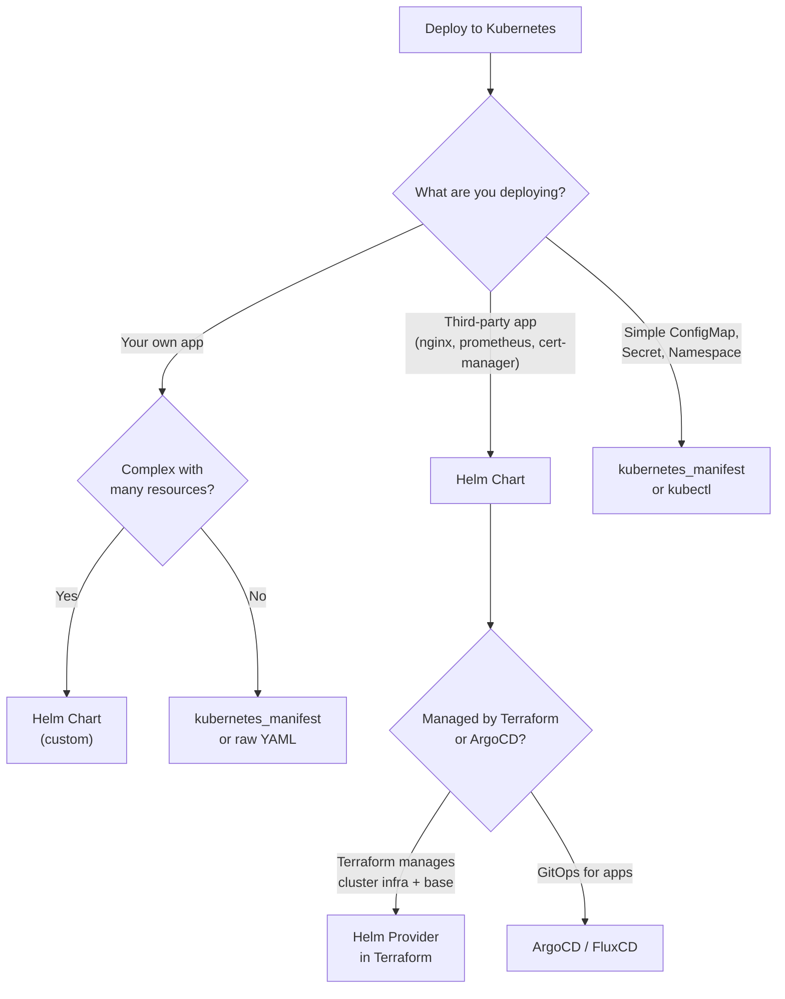

# Helm with Terraform

## Overview

The Terraform Helm provider allows you to deploy Helm charts as part of your infrastructure code. This guide covers provider configuration, chart deployment patterns, values management, release lifecycle, and when to use Helm vs kubectl vs raw Kubernetes manifests.

---

## When to Use What



### Comparison

| Approach | Best For | Terraform Integration |
|----------|----------|----------------------|
| Helm provider | Cluster add-ons, infra charts | Native |
| kubernetes_manifest | Simple resources, CRDs | Native |
| kubectl provider | Raw YAML, multi-doc manifests | Community provider |
| ArgoCD/Flux | Application deployments, GitOps | Separate tool |

---

## Provider Configuration

```hcl
provider "helm" {
  kubernetes {
    host                   = aws_eks_cluster.main.endpoint
    cluster_ca_certificate = base64decode(aws_eks_cluster.main.certificate_authority[0].data)

    exec {
      api_version = "client.authentication.k8s.io/v1beta1"
      command     = "aws"
      args        = ["eks", "get-token", "--cluster-name", aws_eks_cluster.main.name]
    }
  }
}

provider "kubernetes" {
  host                   = aws_eks_cluster.main.endpoint
  cluster_ca_certificate = base64decode(aws_eks_cluster.main.certificate_authority[0].data)

  exec {
    api_version = "client.authentication.k8s.io/v1beta1"
    command     = "aws"
    args        = ["eks", "get-token", "--cluster-name", aws_eks_cluster.main.name]
  }
}
```

---

## Deploying Charts

### AWS Load Balancer Controller

```hcl
resource "helm_release" "aws_lb_controller" {
  name       = "aws-load-balancer-controller"
  repository = "https://aws.github.io/eks-charts"
  chart      = "aws-load-balancer-controller"
  version    = "1.8.1"
  namespace  = "kube-system"

  set {
    name  = "clusterName"
    value = aws_eks_cluster.main.name
  }

  set {
    name  = "serviceAccount.create"
    value = "true"
  }

  set {
    name  = "serviceAccount.name"
    value = "aws-load-balancer-controller"
  }

  set {
    name  = "serviceAccount.annotations.eks\\.amazonaws\\.com/role-arn"
    value = aws_iam_role.lb_controller.arn
  }

  set {
    name  = "region"
    value = data.aws_region.current.name
  }

  set {
    name  = "vpcId"
    value = aws_vpc.main.id
  }

  depends_on = [
    aws_eks_node_group.general,
    aws_iam_role_policy_attachment.lb_controller,
  ]
}
```

### External DNS

```hcl
resource "helm_release" "external_dns" {
  name       = "external-dns"
  repository = "https://kubernetes-sigs.github.io/external-dns"
  chart      = "external-dns"
  version    = "1.14.5"
  namespace  = "kube-system"

  values = [yamlencode({
    provider = "aws"
    aws = {
      region = data.aws_region.current.name
    }
    domainFilters = [var.domain_name]
    policy        = "sync"
    txtOwnerId    = local.cluster_name
    serviceAccount = {
      create = true
      name   = "external-dns"
      annotations = {
        "eks.amazonaws.com/role-arn" = aws_iam_role.external_dns.arn
      }
    }
    resources = {
      requests = {
        cpu    = "50m"
        memory = "64Mi"
      }
      limits = {
        memory = "128Mi"
      }
    }
  })]

  depends_on = [aws_eks_node_group.general]
}
```

### Metrics Server

```hcl
resource "helm_release" "metrics_server" {
  name       = "metrics-server"
  repository = "https://kubernetes-sigs.github.io/metrics-server"
  chart      = "metrics-server"
  version    = "3.12.1"
  namespace  = "kube-system"

  values = [yamlencode({
    replicas = 2
    resources = {
      requests = {
        cpu    = "100m"
        memory = "200Mi"
      }
    }
    podDisruptionBudget = {
      enabled      = true
      minAvailable = 1
    }
  })]

  depends_on = [aws_eks_node_group.general]
}
```

---

## Values Management

### Using `values` Block (Recommended for Complex Config)

```hcl
resource "helm_release" "example" {
  name  = "example"
  chart = "example/chart"

  values = [
    # Base values
    file("${path.module}/helm-values/base.yaml"),
    # Environment-specific overrides
    file("${path.module}/helm-values/${var.environment}.yaml"),
    # Dynamic values from Terraform
    yamlencode({
      database = {
        host = aws_rds_cluster.main.endpoint
        port = 5432
      }
      serviceAccount = {
        annotations = {
          "eks.amazonaws.com/role-arn" = aws_iam_role.app.arn
        }
      }
    })
  ]
}
```

### Using `set` Blocks (For Individual Values)

```hcl
resource "helm_release" "example" {
  name  = "example"
  chart = "example/chart"

  set {
    name  = "replicaCount"
    value = "3"
  }

  # Sensitive values
  set_sensitive {
    name  = "database.password"
    value = var.db_password
  }
}
```

### Values File Structure

```
helm-values/
  base.yaml              # Shared across all environments
  development.yaml       # Dev overrides
  staging.yaml           # Staging overrides
  production.yaml        # Production overrides
```

```yaml
# helm-values/base.yaml
replicaCount: 2
image:
  pullPolicy: IfNotPresent
resources:
  requests:
    cpu: 100m
    memory: 128Mi
  limits:
    memory: 256Mi
```

```yaml
# helm-values/production.yaml
replicaCount: 3
resources:
  requests:
    cpu: 500m
    memory: 512Mi
  limits:
    memory: 1Gi
podDisruptionBudget:
  enabled: true
  minAvailable: 2
```

---

## Release Lifecycle

### Upgrading

Terraform handles upgrades automatically when you change chart version or values:

```hcl
resource "helm_release" "app" {
  name    = "my-app"
  chart   = "my-repo/my-app"
  version = "2.1.0"  # Change this to upgrade

  # Control upgrade behavior
  atomic           = true   # Rollback on failure
  cleanup_on_fail  = true   # Clean up new resources on failure
  wait             = true   # Wait for resources to be ready
  wait_for_jobs    = true   # Wait for Jobs to complete
  timeout          = 600    # 10 minute timeout

  # Force resource update through delete/recreate
  force_update  = false
  recreate_pods = false

  # Keep history for rollback
  max_history = 5
}
```

### Import Existing Releases

```bash
terraform import helm_release.app kube-system/my-app
```

---

## Namespace Management

```hcl
# Create namespaces before deploying charts
resource "kubernetes_namespace" "app" {
  metadata {
    name = var.app_namespace

    labels = {
      name        = var.app_namespace
      environment = var.environment
      managed-by  = "terraform"
    }

    annotations = {
      "scheduler.alpha.kubernetes.io/defaultTolerations" = jsonencode([])
    }
  }
}

# Resource quota per namespace
resource "kubernetes_resource_quota" "app" {
  metadata {
    name      = "default-quota"
    namespace = kubernetes_namespace.app.metadata[0].name
  }

  spec {
    hard = {
      "requests.cpu"    = "4"
      "requests.memory" = "8Gi"
      "limits.cpu"      = "8"
      "limits.memory"   = "16Gi"
      pods              = "50"
    }
  }
}

# Limit range for default resource requests
resource "kubernetes_limit_range" "app" {
  metadata {
    name      = "default-limits"
    namespace = kubernetes_namespace.app.metadata[0].name
  }

  spec {
    limit {
      type = "Container"
      default = {
        memory = "256Mi"
        cpu    = "250m"
      }
      default_request = {
        memory = "128Mi"
        cpu    = "100m"
      }
    }
  }
}
```

---

## Helm vs kubectl vs kubernetes_manifest

| Feature | helm_release | kubernetes_manifest | kubectl_manifest |
|---------|-------------|-------------------|-----------------|
| Provider | hashicorp/helm | hashicorp/kubernetes | gavinbunney/kubectl |
| Templating | Go templates | None (raw YAML) | None |
| Dependency mgmt | Built-in | Manual | Manual |
| Rollback | Built-in | Manual | Manual |
| Multi-resource | Single release | One per resource | Multi-doc YAML |
| CRD support | In chart | Good | Good |
| Community charts | Full ecosystem | N/A | N/A |

---

## Best Practices

1. **Pin chart versions** — never use `latest` or omit the version.
2. **Use `yamlencode()` for dynamic values** — cleaner than multiple `set` blocks.
3. **Layer values files** — base + environment overlay pattern.
4. **Set `atomic = true`** — automatic rollback on deployment failure.
5. **Use IRSA for service accounts** — never store AWS credentials in Kubernetes secrets.
6. **Separate infra charts from app charts** — Terraform manages cluster add-ons; ArgoCD manages applications.
7. **Set resource requests and limits** — prevent noisy neighbor problems.
8. **Use `depends_on`** — ensure node groups exist before deploying charts.

---

## Related Guides

- [EKS Terraform](eks-terraform.md) — Cluster setup (prerequisite)
- [K8s Manifests Guide](k8s-manifests-guide.md) — Raw Kubernetes resources
- [Ingress and DNS](ingress-and-dns.md) — ALB controller and external-dns setup
