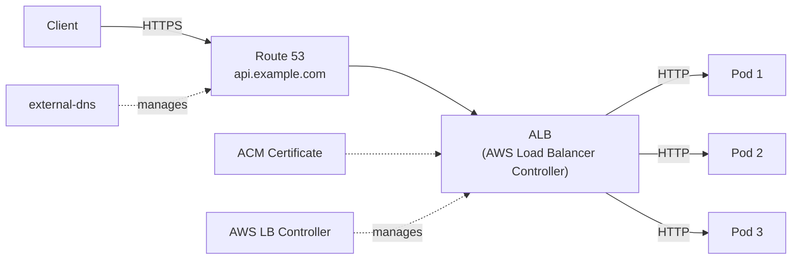
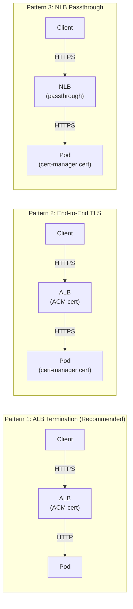

# Ingress and DNS

## Overview

Exposing Kubernetes services to the internet requires an ingress controller (for HTTP routing), DNS management (for domain names), and TLS certificates (for HTTPS). On EKS, this typically means the AWS Load Balancer Controller, external-dns, and cert-manager. This guide covers setup, configuration, and TLS termination patterns.

---

## Architecture



---

## AWS Load Balancer Controller

### Installation with Terraform

```hcl
# IRSA role for the controller
resource "aws_iam_role" "lb_controller" {
  name = "${local.cluster_name}-lb-controller"

  assume_role_policy = jsonencode({
    Version = "2012-10-17"
    Statement = [{
      Effect = "Allow"
      Action = "sts:AssumeRoleWithWebIdentity"
      Principal = { Federated = local.oidc_provider_arn }
      Condition = {
        StringEquals = {
          "${local.oidc_provider}:aud" = "sts.amazonaws.com"
          "${local.oidc_provider}:sub" = "system:serviceaccount:kube-system:aws-load-balancer-controller"
        }
      }
    }]
  })
}

resource "aws_iam_role_policy_attachment" "lb_controller" {
  role       = aws_iam_role.lb_controller.name
  policy_arn = aws_iam_policy.lb_controller.arn
}

# Policy from: https://raw.githubusercontent.com/kubernetes-sigs/aws-load-balancer-controller/main/docs/install/iam_policy.json
resource "aws_iam_policy" "lb_controller" {
  name   = "${local.cluster_name}-lb-controller"
  policy = file("${path.module}/policies/lb-controller-policy.json")
}

resource "helm_release" "aws_lb_controller" {
  name       = "aws-load-balancer-controller"
  repository = "https://aws.github.io/eks-charts"
  chart      = "aws-load-balancer-controller"
  version    = "1.8.1"
  namespace  = "kube-system"

  values = [yamlencode({
    clusterName = aws_eks_cluster.main.name
    region      = data.aws_region.current.name
    vpcId       = aws_vpc.main.id

    serviceAccount = {
      create = true
      name   = "aws-load-balancer-controller"
      annotations = {
        "eks.amazonaws.com/role-arn" = aws_iam_role.lb_controller.arn
      }
    }

    replicaCount = 2
    resources = {
      requests = {
        cpu    = "100m"
        memory = "128Mi"
      }
      limits = {
        memory = "256Mi"
      }
    }

    podDisruptionBudget = {
      minAvailable = 1
    }

    enableCertManager = false
    defaultTags = {
      Environment = var.environment
      ManagedBy   = "aws-lb-controller"
    }
  })]

  depends_on = [aws_eks_node_group.general]
}
```

### ALB Ingress Example

```yaml
apiVersion: networking.k8s.io/v1
kind: Ingress
metadata:
  name: app-ingress
  namespace: app
  annotations:
    alb.ingress.kubernetes.io/scheme: internet-facing
    alb.ingress.kubernetes.io/target-type: ip
    alb.ingress.kubernetes.io/certificate-arn: arn:aws:acm:us-east-1:123456789012:certificate/abc-123
    alb.ingress.kubernetes.io/listen-ports: '[{"HTTP": 80}, {"HTTPS": 443}]'
    alb.ingress.kubernetes.io/ssl-redirect: "443"
    alb.ingress.kubernetes.io/healthcheck-path: /ready
    alb.ingress.kubernetes.io/group.name: shared-alb
    alb.ingress.kubernetes.io/group.order: "10"
    alb.ingress.kubernetes.io/tags: Environment=production,ManagedBy=k8s
spec:
  ingressClassName: alb
  rules:
    - host: api.example.com
      http:
        paths:
          - path: /
            pathType: Prefix
            backend:
              service:
                name: api
                port:
                  number: 80
    - host: admin.example.com
      http:
        paths:
          - path: /
            pathType: Prefix
            backend:
              service:
                name: admin
                port:
                  number: 80
```

### Shared ALB Pattern

Use `alb.ingress.kubernetes.io/group.name` to share a single ALB across multiple Ingress resources. This reduces cost (one ALB instead of many) and simplifies DNS.

---

## External DNS

### Installation

```hcl
resource "aws_iam_role" "external_dns" {
  name = "${local.cluster_name}-external-dns"

  assume_role_policy = jsonencode({
    Version = "2012-10-17"
    Statement = [{
      Effect = "Allow"
      Action = "sts:AssumeRoleWithWebIdentity"
      Principal = { Federated = local.oidc_provider_arn }
      Condition = {
        StringEquals = {
          "${local.oidc_provider}:aud" = "sts.amazonaws.com"
          "${local.oidc_provider}:sub" = "system:serviceaccount:kube-system:external-dns"
        }
      }
    }]
  })
}

resource "aws_iam_role_policy" "external_dns" {
  name = "external-dns"
  role = aws_iam_role.external_dns.id

  policy = jsonencode({
    Version = "2012-10-17"
    Statement = [
      {
        Effect = "Allow"
        Action = [
          "route53:ChangeResourceRecordSets",
        ]
        Resource = ["arn:aws:route53:::hostedzone/${var.hosted_zone_id}"]
      },
      {
        Effect = "Allow"
        Action = [
          "route53:ListHostedZones",
          "route53:ListResourceRecordSets",
          "route53:ListTagsForResource",
        ]
        Resource = ["*"]
      }
    ]
  })
}

resource "helm_release" "external_dns" {
  name       = "external-dns"
  repository = "https://kubernetes-sigs.github.io/external-dns"
  chart      = "external-dns"
  version    = "1.14.5"
  namespace  = "kube-system"

  values = [yamlencode({
    provider      = "aws"
    domainFilters = [var.domain_name]
    policy        = "sync"     # "sync" deletes records; "upsert-only" is safer
    txtOwnerId    = local.cluster_name
    aws = {
      region = data.aws_region.current.name
    }
    serviceAccount = {
      create = true
      name   = "external-dns"
      annotations = {
        "eks.amazonaws.com/role-arn" = aws_iam_role.external_dns.arn
      }
    }
    sources = ["ingress", "service"]
  })]

  depends_on = [aws_eks_node_group.general]
}
```

### Usage

Add the annotation to any Ingress or Service:

```yaml
annotations:
  external-dns.alpha.kubernetes.io/hostname: api.example.com
  external-dns.alpha.kubernetes.io/ttl: "300"
```

---

## Cert-Manager

For clusters that need Kubernetes-native certificate management (e.g., internal TLS, mTLS):

```hcl
resource "helm_release" "cert_manager" {
  name       = "cert-manager"
  repository = "https://charts.jetstack.io"
  chart      = "cert-manager"
  version    = "1.15.1"
  namespace  = "cert-manager"
  create_namespace = true

  values = [yamlencode({
    installCRDs = true
    replicaCount = 2
    serviceAccount = {
      create = true
      name   = "cert-manager"
      annotations = {
        "eks.amazonaws.com/role-arn" = aws_iam_role.cert_manager.arn
      }
    }
    securityContext = {
      runAsNonRoot = true
    }
    resources = {
      requests = {
        cpu    = "50m"
        memory = "64Mi"
      }
      limits = {
        memory = "128Mi"
      }
    }
  })]

  depends_on = [aws_eks_node_group.general]
}
```

### ClusterIssuer for Let's Encrypt

```yaml
apiVersion: cert-manager.io/v1
kind: ClusterIssuer
metadata:
  name: letsencrypt-production
spec:
  acme:
    server: https://acme-v02.api.letsencrypt.org/directory
    email: platform@example.com
    privateKeySecretRef:
      name: letsencrypt-production
    solvers:
      - selector:
          dnsZones:
            - example.com
        dns01:
          route53:
            region: us-east-1
            hostedZoneID: Z1234567890
```

---

## TLS Termination Patterns



| Pattern | Performance | Security | Complexity |
|---------|-------------|----------|------------|
| ALB Termination | Best (offloads TLS) | Good (private VPC) | Low |
| End-to-End TLS | Good | Best (encrypted in transit) | Medium |
| NLB Passthrough | Good | Best (no termination) | High |

**Recommendation**: Use ALB termination with ACM certificates for most workloads. Use end-to-end TLS only for compliance requirements (PCI-DSS, HIPAA).

---

## Internal Services

For services that should not be exposed to the internet:

```yaml
apiVersion: networking.k8s.io/v1
kind: Ingress
metadata:
  name: internal-api
  namespace: app
  annotations:
    alb.ingress.kubernetes.io/scheme: internal
    alb.ingress.kubernetes.io/target-type: ip
    alb.ingress.kubernetes.io/certificate-arn: arn:aws:acm:us-east-1:123456789012:certificate/internal-cert
    alb.ingress.kubernetes.io/group.name: internal-alb
    external-dns.alpha.kubernetes.io/hostname: internal-api.private.example.com
spec:
  ingressClassName: alb
  rules:
    - host: internal-api.private.example.com
      http:
        paths:
          - path: /
            pathType: Prefix
            backend:
              service:
                name: internal-api
                port:
                  number: 80
```

---

## Best Practices

1. **Use shared ALBs** via ingress groups — one ALB per use case (public, internal), not per service.
2. **Terminate TLS at the ALB** with ACM certificates — free, auto-renewed, no cert rotation needed.
3. **Use `target-type: ip`** for ALB — avoids extra hop through NodePort, works with Fargate.
4. **Set external-dns policy to `sync`** in production — ensures stale records are cleaned up.
5. **Use `txtOwnerId`** in external-dns — prevents multiple clusters from conflicting on DNS records.
6. **Use cert-manager** only for internal TLS or when you need Kubernetes-native certificates.
7. **Health check paths** — configure ALB health checks to use the readiness probe endpoint.

---

## Related Guides

- [EKS Terraform](eks-terraform.md) — Cluster and VPC setup
- [Helm with Terraform](helm-with-terraform.md) — Installing controllers
- [K8s Manifests](k8s-manifests-guide.md) — Ingress resource patterns
- [Security](../04-aws-services-guide/security.md) — ACM certificate management
