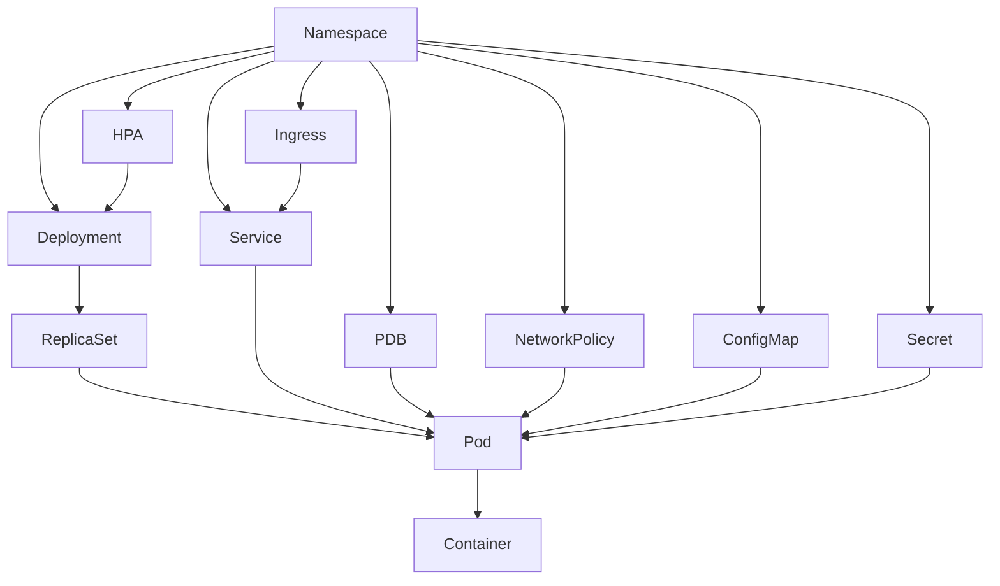

# Kubernetes Manifests Guide

## Overview

This guide covers the essential Kubernetes resources for deploying production applications: Deployments, Services, Ingress, ConfigMaps, Secrets, HPA, PDB, and NetworkPolicies. All examples are production-ready and follow best practices.

---

## Resource Hierarchy



---

## Deployment

```yaml
apiVersion: apps/v1
kind: Deployment
metadata:
  name: api
  namespace: app
  labels:
    app: api
    version: v1
spec:
  replicas: 3
  revisionHistoryLimit: 5
  selector:
    matchLabels:
      app: api
  strategy:
    type: RollingUpdate
    rollingUpdate:
      maxSurge: 1
      maxUnavailable: 0  # Zero-downtime deployments
  template:
    metadata:
      labels:
        app: api
        version: v1
      annotations:
        prometheus.io/scrape: "true"
        prometheus.io/port: "8080"
        prometheus.io/path: "/metrics"
    spec:
      serviceAccountName: api
      terminationGracePeriodSeconds: 60

      # Spread across AZs and nodes
      topologySpreadConstraints:
        - maxSkew: 1
          topologyKey: topology.kubernetes.io/zone
          whenUnsatisfiable: DoNotSchedule
          labelSelector:
            matchLabels:
              app: api
        - maxSkew: 1
          topologyKey: kubernetes.io/hostname
          whenUnsatisfiable: ScheduleAnyway
          labelSelector:
            matchLabels:
              app: api

      securityContext:
        runAsNonRoot: true
        runAsUser: 1000
        runAsGroup: 1000
        fsGroup: 1000
        seccompProfile:
          type: RuntimeDefault

      containers:
        - name: api
          image: 123456789012.dkr.ecr.us-east-1.amazonaws.com/api:v1.2.3
          imagePullPolicy: IfNotPresent
          ports:
            - name: http
              containerPort: 8080
              protocol: TCP
          env:
            - name: ENVIRONMENT
              valueFrom:
                configMapKeyRef:
                  name: api-config
                  key: environment
            - name: DATABASE_URL
              valueFrom:
                secretKeyRef:
                  name: api-secrets
                  key: database-url
            - name: POD_NAME
              valueFrom:
                fieldRef:
                  fieldPath: metadata.name

          resources:
            requests:
              cpu: 250m
              memory: 256Mi
            limits:
              memory: 512Mi
              # No CPU limit — allows bursting

          livenessProbe:
            httpGet:
              path: /healthz
              port: http
            initialDelaySeconds: 15
            periodSeconds: 10
            timeoutSeconds: 5
            failureThreshold: 3

          readinessProbe:
            httpGet:
              path: /ready
              port: http
            initialDelaySeconds: 5
            periodSeconds: 5
            timeoutSeconds: 3
            failureThreshold: 3

          startupProbe:
            httpGet:
              path: /healthz
              port: http
            initialDelaySeconds: 5
            periodSeconds: 5
            failureThreshold: 30  # 5 * 30 = 150s max startup

          lifecycle:
            preStop:
              exec:
                command: ["/bin/sh", "-c", "sleep 10"]

          securityContext:
            allowPrivilegeEscalation: false
            readOnlyRootFilesystem: true
            capabilities:
              drop: ["ALL"]

          volumeMounts:
            - name: tmp
              mountPath: /tmp
            - name: config
              mountPath: /etc/app/config
              readOnly: true

      volumes:
        - name: tmp
          emptyDir: {}
        - name: config
          configMap:
            name: api-config
```

---

## Service

```yaml
apiVersion: v1
kind: Service
metadata:
  name: api
  namespace: app
  labels:
    app: api
spec:
  type: ClusterIP
  selector:
    app: api
  ports:
    - name: http
      port: 80
      targetPort: http
      protocol: TCP
```

### Service Types

| Type | Use Case | Access |
|------|----------|--------|
| ClusterIP | Internal communication | Cluster only |
| NodePort | Development/testing | Node IP:Port |
| LoadBalancer | Direct external access | AWS NLB/CLB |
| ExternalName | DNS alias to external service | DNS CNAME |

---

## Ingress

```yaml
apiVersion: networking.k8s.io/v1
kind: Ingress
metadata:
  name: api
  namespace: app
  annotations:
    kubernetes.io/ingress.class: alb
    alb.ingress.kubernetes.io/scheme: internet-facing
    alb.ingress.kubernetes.io/target-type: ip
    alb.ingress.kubernetes.io/certificate-arn: arn:aws:acm:us-east-1:123456789012:certificate/abc-123
    alb.ingress.kubernetes.io/ssl-redirect: "443"
    alb.ingress.kubernetes.io/healthcheck-path: /ready
    alb.ingress.kubernetes.io/healthcheck-interval-seconds: "15"
    alb.ingress.kubernetes.io/wafv2-acl-arn: arn:aws:wafv2:us-east-1:123456789012:regional/webacl/prod-waf/abc-123
    alb.ingress.kubernetes.io/group.name: shared-alb
    alb.ingress.kubernetes.io/group.order: "100"
    external-dns.alpha.kubernetes.io/hostname: api.example.com
spec:
  ingressClassName: alb
  rules:
    - host: api.example.com
      http:
        paths:
          - path: /
            pathType: Prefix
            backend:
              service:
                name: api
                port:
                  number: 80
```

---

## ConfigMap

```yaml
apiVersion: v1
kind: ConfigMap
metadata:
  name: api-config
  namespace: app
data:
  environment: "production"
  log_level: "info"
  cache_ttl: "300"

  # File-based config
  config.yaml: |
    server:
      port: 8080
      read_timeout: 30s
      write_timeout: 30s
    features:
      new_dashboard: true
      beta_api: false
```

---

## Secrets

```yaml
# Use external-secrets-operator in production instead of raw Kubernetes secrets
apiVersion: external-secrets.io/v1beta1
kind: ExternalSecret
metadata:
  name: api-secrets
  namespace: app
spec:
  refreshInterval: 1h
  secretStoreRef:
    name: aws-secrets-manager
    kind: ClusterSecretStore
  target:
    name: api-secrets
    creationPolicy: Owner
  data:
    - secretKey: database-url
      remoteRef:
        key: production/api/database
        property: url
    - secretKey: api-key
      remoteRef:
        key: production/api/credentials
        property: api_key
```

---

## HorizontalPodAutoscaler

```yaml
apiVersion: autoscaling/v2
kind: HorizontalPodAutoscaler
metadata:
  name: api
  namespace: app
spec:
  scaleTargetRef:
    apiVersion: apps/v1
    kind: Deployment
    name: api
  minReplicas: 3
  maxReplicas: 20
  behavior:
    scaleUp:
      stabilizationWindowSeconds: 60
      policies:
        - type: Percent
          value: 100
          periodSeconds: 60
    scaleDown:
      stabilizationWindowSeconds: 300
      policies:
        - type: Percent
          value: 10
          periodSeconds: 60
  metrics:
    - type: Resource
      resource:
        name: cpu
        target:
          type: Utilization
          averageUtilization: 60
    - type: Resource
      resource:
        name: memory
        target:
          type: Utilization
          averageUtilization: 75
    # Custom metric from Prometheus
    - type: Pods
      pods:
        metric:
          name: http_requests_per_second
        target:
          type: AverageValue
          averageValue: "1000"
```

---

## PodDisruptionBudget

```yaml
apiVersion: policy/v1
kind: PodDisruptionBudget
metadata:
  name: api
  namespace: app
spec:
  minAvailable: 2    # OR use maxUnavailable: 1
  selector:
    matchLabels:
      app: api
```

PDBs protect against:
- Node drains during upgrades
- Cluster Autoscaler scale-down
- Karpenter node consolidation
- Manual `kubectl drain`

---

## NetworkPolicy

```yaml
# Default deny all ingress
apiVersion: networking.k8s.io/v1
kind: NetworkPolicy
metadata:
  name: default-deny-ingress
  namespace: app
spec:
  podSelector: {}
  policyTypes:
    - Ingress

---
# Allow specific traffic to API
apiVersion: networking.k8s.io/v1
kind: NetworkPolicy
metadata:
  name: allow-api-ingress
  namespace: app
spec:
  podSelector:
    matchLabels:
      app: api
  policyTypes:
    - Ingress
    - Egress
  ingress:
    # Allow from ALB (ingress controller namespace)
    - from:
        - namespaceSelector:
            matchLabels:
              name: kube-system
          podSelector:
            matchLabels:
              app.kubernetes.io/name: aws-load-balancer-controller
      ports:
        - port: 8080
          protocol: TCP
    # Allow from other app pods in same namespace
    - from:
        - podSelector:
            matchLabels:
              app: frontend
      ports:
        - port: 8080
          protocol: TCP
  egress:
    # Allow DNS
    - to:
        - namespaceSelector: {}
          podSelector:
            matchLabels:
              k8s-app: kube-dns
      ports:
        - port: 53
          protocol: UDP
        - port: 53
          protocol: TCP
    # Allow to database (external)
    - to:
        - ipBlock:
            cidr: 10.0.20.0/24  # Data subnet CIDR
      ports:
        - port: 5432
          protocol: TCP
    # Allow to AWS services (VPC endpoints)
    - to:
        - ipBlock:
            cidr: 10.0.0.0/16
      ports:
        - port: 443
          protocol: TCP
```

---

## ServiceAccount with IRSA

```yaml
apiVersion: v1
kind: ServiceAccount
metadata:
  name: api
  namespace: app
  annotations:
    eks.amazonaws.com/role-arn: arn:aws:iam::123456789012:role/eks-api-role
  labels:
    app: api
```

---

## Production Checklist

| Category | Check | Why |
|----------|-------|-----|
| Resources | Set requests AND memory limits | Prevent OOM and scheduling issues |
| Probes | Liveness, readiness, and startup probes | Proper health checking |
| Security | readOnlyRootFilesystem: true | Prevent filesystem attacks |
| Security | runAsNonRoot: true | Prevent root escalation |
| Security | Drop all capabilities | Least privilege |
| Availability | topologySpreadConstraints | Spread across AZs |
| Availability | PodDisruptionBudget | Survive node drains |
| Networking | NetworkPolicy | Zero-trust networking |
| Scaling | HPA with appropriate metrics | Handle traffic spikes |
| Lifecycle | preStop hook with sleep | Graceful shutdown |
| Images | Immutable tags (not :latest) | Reproducible deployments |

---

## Related Guides

- [Helm with Terraform](helm-with-terraform.md) — Deploying charts
- [Ingress and DNS](ingress-and-dns.md) — ALB and DNS setup
- [Autoscaling](autoscaling.md) — HPA, VPA, and cluster scaling
- [Observability](observability.md) — Monitoring Kubernetes workloads
