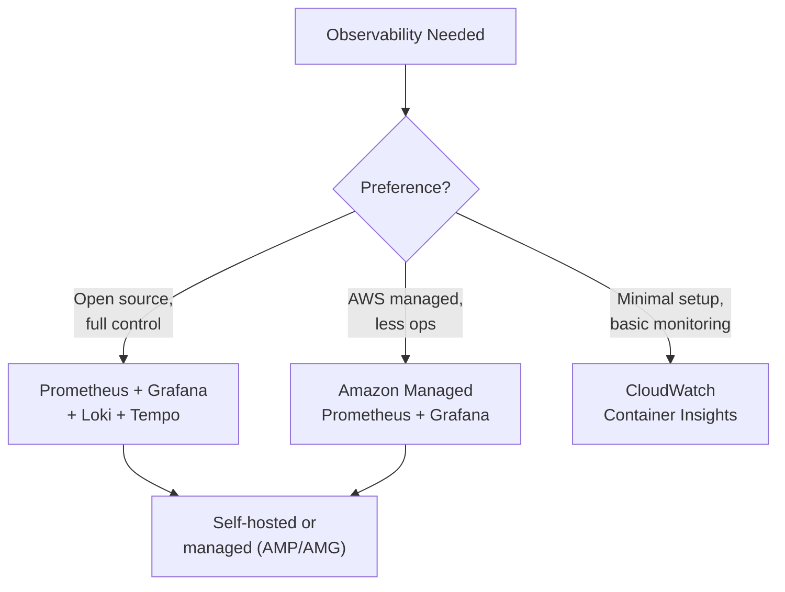

# Kubernetes Observability

## Overview

Observability for Kubernetes encompasses three pillars: metrics, logs, and traces. This guide covers Prometheus, Grafana, Loki, the EFK stack, OpenTelemetry, and AWS Container Insights — with installation patterns and practical guidance on choosing the right stack.

---

## Observability Stack Decision



### Stack Comparison

| Feature | Prometheus + Grafana | AWS Managed (AMP/AMG) | Container Insights |
|---------|---------------------|----------------------|-------------------|
| Metrics | Prometheus | Prometheus (managed) | CloudWatch Metrics |
| Logs | Loki or EFK | CloudWatch Logs | CloudWatch Logs |
| Traces | Tempo or Jaeger | X-Ray / ADOT | X-Ray |
| Dashboards | Grafana | Grafana (managed) | CloudWatch Dashboards |
| Alerting | Alertmanager | SNS via Grafana | CloudWatch Alarms |
| Cost | Infra + storage | Per-metric ingested | Per-log/metric |
| Operational Overhead | High | Medium | Low |

---

## Prometheus + Grafana Stack

### Installation with kube-prometheus-stack

```hcl
resource "helm_release" "prometheus" {
  name             = "kube-prometheus-stack"
  repository       = "https://prometheus-community.github.io/helm-charts"
  chart            = "kube-prometheus-stack"
  version          = "61.3.0"
  namespace        = "monitoring"
  create_namespace = true

  values = [yamlencode({
    # Prometheus
    prometheus = {
      prometheusSpec = {
        retention         = "15d"
        retentionSize     = "40GB"
        replicas          = 2
        replicaExternalLabelName = "prometheus_replica"

        resources = {
          requests = { cpu = "500m", memory = "2Gi" }
          limits   = { memory = "4Gi" }
        }

        storageSpec = {
          volumeClaimTemplate = {
            spec = {
              storageClassName = "gp3"
              resources = {
                requests = { storage = "50Gi" }
              }
            }
          }
        }

        # Scrape all ServiceMonitors across namespaces
        serviceMonitorSelectorNilUsesHelmValues = false
        podMonitorSelectorNilUsesHelmValues     = false
      }
    }

    # Grafana
    grafana = {
      replicas = 2
      adminPassword = "change-me"  # Use external secret in production

      persistence = {
        enabled          = true
        storageClassName = "gp3"
        size             = "10Gi"
      }

      dashboardProviders = {
        "dashboardproviders.yaml" = {
          apiVersion = 1
          providers = [{
            name      = "default"
            orgId     = 1
            folder    = ""
            type      = "file"
            disableDeletion = true
            options = {
              path = "/var/lib/grafana/dashboards/default"
            }
          }]
        }
      }

      ingress = {
        enabled = true
        ingressClassName = "alb"
        annotations = {
          "alb.ingress.kubernetes.io/scheme"      = "internal"
          "alb.ingress.kubernetes.io/target-type"  = "ip"
          "alb.ingress.kubernetes.io/group.name"   = "internal-alb"
          "external-dns.alpha.kubernetes.io/hostname" = "grafana.internal.example.com"
        }
        hosts = ["grafana.internal.example.com"]
      }
    }

    # Alertmanager
    alertmanager = {
      alertmanagerSpec = {
        replicas = 2
        resources = {
          requests = { cpu = "50m", memory = "64Mi" }
          limits   = { memory = "128Mi" }
        }
      }
      config = {
        global = {
          resolve_timeout = "5m"
        }
        route = {
          receiver       = "slack"
          group_by       = ["alertname", "namespace"]
          group_wait     = "30s"
          group_interval = "5m"
          repeat_interval = "4h"
          routes = [
            {
              receiver = "critical-slack"
              match    = { severity = "critical" }
              repeat_interval = "1h"
            }
          ]
        }
        receivers = [
          {
            name = "slack"
            slack_configs = [{
              api_url  = "SLACK_WEBHOOK_URL"
              channel  = "#alerts"
              title    = "{{ .GroupLabels.alertname }}"
              text     = "{{ range .Alerts }}{{ .Annotations.description }}\n{{ end }}"
            }]
          },
          {
            name = "critical-slack"
            slack_configs = [{
              api_url  = "SLACK_WEBHOOK_URL"
              channel  = "#alerts-critical"
              title    = "CRITICAL: {{ .GroupLabels.alertname }}"
              text     = "{{ range .Alerts }}{{ .Annotations.description }}\n{{ end }}"
            }]
          }
        ]
      }
    }

    # Node exporter for host metrics
    nodeExporter = {
      enabled = true
    }

    # kube-state-metrics for K8s object metrics
    kubeStateMetrics = {
      enabled = true
    }
  })]

  depends_on = [aws_eks_node_group.general]
}
```

### Custom ServiceMonitor

```yaml
apiVersion: monitoring.coreos.com/v1
kind: ServiceMonitor
metadata:
  name: api
  namespace: app
  labels:
    release: kube-prometheus-stack  # Must match Prometheus selector
spec:
  selector:
    matchLabels:
      app: api
  endpoints:
    - port: http
      path: /metrics
      interval: 15s
      scrapeTimeout: 10s
  namespaceSelector:
    matchNames:
      - app
```

---

## Loki for Logs

```hcl
resource "helm_release" "loki" {
  name             = "loki"
  repository       = "https://grafana.github.io/helm-charts"
  chart            = "loki"
  version          = "6.7.0"
  namespace        = "monitoring"

  values = [yamlencode({
    loki = {
      auth_enabled = false
      storage = {
        type = "s3"
        s3 = {
          region = data.aws_region.current.name
          bucketnames = var.loki_bucket_name
        }
      }
      schemaConfig = {
        configs = [{
          from         = "2024-01-01"
          store        = "tsdb"
          object_store = "s3"
          schema       = "v13"
          index = {
            prefix = "index_"
            period = "24h"
          }
        }]
      }
    }
    deploymentMode = "SimpleScalable"
    backend  = { replicas = 2 }
    read     = { replicas = 2 }
    write    = { replicas = 3 }
  })]
}

# Promtail — log collection agent
resource "helm_release" "promtail" {
  name       = "promtail"
  repository = "https://grafana.github.io/helm-charts"
  chart      = "promtail"
  version    = "6.16.4"
  namespace  = "monitoring"

  values = [yamlencode({
    config = {
      clients = [{
        url = "http://loki-gateway.monitoring.svc.cluster.local/loki/api/v1/push"
      }]
    }
  })]
}
```

---

## OpenTelemetry

```hcl
resource "helm_release" "otel_collector" {
  name             = "otel-collector"
  repository       = "https://open-telemetry.github.io/opentelemetry-helm-charts"
  chart            = "opentelemetry-collector"
  version          = "0.96.0"
  namespace        = "monitoring"

  values = [yamlencode({
    mode = "deployment"  # or "daemonset" for node-level collection

    config = {
      receivers = {
        otlp = {
          protocols = {
            grpc = { endpoint = "0.0.0.0:4317" }
            http = { endpoint = "0.0.0.0:4318" }
          }
        }
      }

      processors = {
        batch = {
          timeout       = "10s"
          send_batch_size = 1024
        }
        "resource/env" = {
          attributes = [{
            key    = "environment"
            value  = var.environment
            action = "insert"
          }]
        }
      }

      exporters = {
        "otlphttp/prometheus" = {
          endpoint = "http://kube-prometheus-stack-prometheus.monitoring:9090/api/v1/otlp"
        }
        "otlphttp/loki" = {
          endpoint = "http://loki-gateway.monitoring:3100/otlp"
        }
        awsxray = {
          region = data.aws_region.current.name
        }
      }

      service = {
        pipelines = {
          metrics = {
            receivers  = ["otlp"]
            processors = ["batch", "resource/env"]
            exporters  = ["otlphttp/prometheus"]
          }
          logs = {
            receivers  = ["otlp"]
            processors = ["batch"]
            exporters  = ["otlphttp/loki"]
          }
          traces = {
            receivers  = ["otlp"]
            processors = ["batch"]
            exporters  = ["awsxray"]
          }
        }
      }
    }
  })]
}
```

---

## AWS Container Insights

The simplest option — enable via the EKS add-on:

```hcl
resource "aws_eks_addon" "cloudwatch_observability" {
  cluster_name                = aws_eks_cluster.main.name
  addon_name                  = "amazon-cloudwatch-observability"
  resolve_conflicts_on_update = "OVERWRITE"
  service_account_role_arn    = aws_iam_role.cloudwatch_agent.arn
}
```

Container Insights provides:
- Node and pod CPU/memory metrics in CloudWatch
- Container-level metrics
- Log collection to CloudWatch Logs
- No additional infrastructure to manage

---

## Key Metrics to Monitor

| Category | Metric | Alert Threshold |
|----------|--------|----------------|
| Cluster | Node count | Below min or above max |
| Cluster | Node CPU/memory utilization | > 80% |
| Cluster | Pod pending count | > 0 for > 5 min |
| Pod | Container restart count | > 3 in 5 min |
| Pod | OOMKilled events | Any |
| Application | Request latency (p99) | > 2s |
| Application | Error rate (5xx) | > 1% |
| Application | Request throughput | Anomaly detection |
| Storage | PVC usage | > 80% |

---

## Best Practices

1. **Start with kube-prometheus-stack** — it provides Prometheus, Grafana, Alertmanager, and default dashboards.
2. **Use ServiceMonitors** for application metrics — avoids fragile annotation-based scraping.
3. **Set retention and storage limits** on Prometheus — unbounded storage is a cost trap.
4. **Use Loki over EFK** — lower resource usage and operational complexity.
5. **Adopt OpenTelemetry** — vendor-neutral instrumentation that works with any backend.
6. **Separate alert channels** by severity — critical goes to PagerDuty/Slack, warnings to email.
7. **Create SLO dashboards** — track error budget burn rate, not just raw metrics.
8. **Use Container Insights** as a baseline — it is the lowest-effort option.

---

## Related Guides

- [EKS Terraform](eks-terraform.md) — Cluster setup
- [Helm with Terraform](helm-with-terraform.md) — Installing monitoring stack
- [Monitoring](../04-aws-services-guide/monitoring.md) — CloudWatch and CloudTrail
- [Service Mesh](service-mesh.md) — Mesh-level observability
