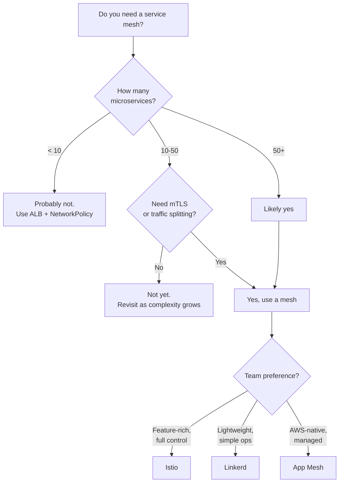

# Kubernetes Service Mesh

## Overview

A service mesh provides infrastructure-level capabilities for service-to-service communication: mutual TLS (mTLS), traffic management, observability, and resilience. This guide covers Istio, Linkerd, and AWS App Mesh — when to use each, installation patterns, and the trade-offs of adopting a mesh.

---

## Do You Need a Service Mesh?



### When to Use a Service Mesh

| Requirement | Without Mesh | With Mesh |
|------------|-------------|-----------|
| mTLS between services | Manual cert management | Automatic, transparent |
| Traffic splitting (canary) | Multiple Deployments + LB config | Declarative routing rules |
| Retry/timeout policies | Application code | Infrastructure config |
| Distributed tracing | SDK instrumentation | Automatic span injection |
| Service-level metrics | Per-app Prometheus setup | Automatic L7 metrics |
| Rate limiting | Application middleware | Mesh-level enforcement |

### When NOT to Use a Service Mesh

- Fewer than 10 microservices
- Simple request/response patterns with no traffic management needs
- Team lacks operational capacity for mesh maintenance
- Performance overhead is unacceptable (adds ~1ms per hop)

---

## Comparison

| Feature | Istio | Linkerd | App Mesh |
|---------|-------|---------|----------|
| Proxy | Envoy | linkerd2-proxy (Rust) | Envoy |
| Resource Usage | Higher | Lower | Medium |
| mTLS | Yes (default off) | Yes (default on) | Yes |
| Traffic Management | Very rich | Basic | Basic |
| Multi-cluster | Yes | Yes | No |
| Observability | Excellent | Good | CloudWatch |
| Learning Curve | Steep | Moderate | Moderate |
| CNCF Status | Graduated | Graduated | N/A (AWS) |
| Ambient Mode | Yes (no sidecar) | No | No |
| Control Plane | istiod | Control plane + destination | App Mesh controller |

---

## Istio

### Installation

```hcl
resource "helm_release" "istio_base" {
  name             = "istio-base"
  repository       = "https://istio-release.storage.googleapis.com/charts"
  chart            = "base"
  version          = "1.22.3"
  namespace        = "istio-system"
  create_namespace = true
}

resource "helm_release" "istiod" {
  name       = "istiod"
  repository = "https://istio-release.storage.googleapis.com/charts"
  chart      = "istiod"
  version    = "1.22.3"
  namespace  = "istio-system"

  values = [yamlencode({
    pilot = {
      resources = {
        requests = { cpu = "200m", memory = "256Mi" }
        limits   = { memory = "512Mi" }
      }
      autoscaleMin = 2
    }
    meshConfig = {
      accessLogFile = "/dev/stdout"
      enableTracing = true
      defaultConfig = {
        tracing = {
          sampling = 10  # 10% sampling rate
        }
      }
    }
    global = {
      proxy = {
        resources = {
          requests = { cpu = "50m", memory = "64Mi" }
          limits   = { memory = "256Mi" }
        }
      }
    }
  })]

  depends_on = [helm_release.istio_base]
}

# Istio ingress gateway
resource "helm_release" "istio_gateway" {
  name       = "istio-ingressgateway"
  repository = "https://istio-release.storage.googleapis.com/charts"
  chart      = "gateway"
  version    = "1.22.3"
  namespace  = "istio-system"

  values = [yamlencode({
    service = {
      type = "LoadBalancer"
      annotations = {
        "service.beta.kubernetes.io/aws-load-balancer-type"   = "external"
        "service.beta.kubernetes.io/aws-load-balancer-scheme" = "internet-facing"
        "service.beta.kubernetes.io/aws-load-balancer-nlb-target-type" = "ip"
      }
    }
  })]

  depends_on = [helm_release.istiod]
}
```

### Traffic Management

```yaml
# VirtualService — route traffic
apiVersion: networking.istio.io/v1
kind: VirtualService
metadata:
  name: api
  namespace: app
spec:
  hosts:
    - api.example.com
  gateways:
    - istio-system/main-gateway
  http:
    - match:
        - headers:
            x-canary:
              exact: "true"
      route:
        - destination:
            host: api
            subset: canary
    - route:
        - destination:
            host: api
            subset: stable
          weight: 90
        - destination:
            host: api
            subset: canary
          weight: 10
      retries:
        attempts: 3
        perTryTimeout: 2s
        retryOn: "5xx,reset,connect-failure"
      timeout: 10s

---
# DestinationRule — define subsets and connection policies
apiVersion: networking.istio.io/v1
kind: DestinationRule
metadata:
  name: api
  namespace: app
spec:
  host: api
  trafficPolicy:
    connectionPool:
      http:
        h2UpgradePolicy: DEFAULT
        maxRequestsPerConnection: 100
      tcp:
        maxConnections: 100
    outlierDetection:
      consecutive5xxErrors: 3
      interval: 10s
      baseEjectionTime: 30s
      maxEjectionPercent: 50
  subsets:
    - name: stable
      labels:
        version: v1
    - name: canary
      labels:
        version: v2
```

### mTLS Configuration

```yaml
apiVersion: security.istio.io/v1
kind: PeerAuthentication
metadata:
  name: default
  namespace: app
spec:
  mtls:
    mode: STRICT  # Enforce mTLS for all traffic in namespace
```

---

## Linkerd

### Installation

```hcl
resource "helm_release" "linkerd_crds" {
  name             = "linkerd-crds"
  repository       = "https://helm.linkerd.io/edge"
  chart            = "linkerd-crds"
  version          = "2024.7.5"
  namespace        = "linkerd"
  create_namespace = true
}

resource "helm_release" "linkerd" {
  name       = "linkerd-control-plane"
  repository = "https://helm.linkerd.io/edge"
  chart      = "linkerd-control-plane"
  version    = "2024.7.5"
  namespace  = "linkerd"

  values = [yamlencode({
    identity = {
      issuer = {
        scheme = "kubernetes.io/tls"
      }
    }
    proxy = {
      resources = {
        cpu    = { request = "20m" }
        memory = { request = "32Mi", limit = "128Mi" }
      }
    }
  })]

  depends_on = [helm_release.linkerd_crds]
}
```

### Enable mTLS for a Namespace

```yaml
# Add annotation to namespace
apiVersion: v1
kind: Namespace
metadata:
  name: app
  annotations:
    linkerd.io/inject: enabled
```

Linkerd automatically injects the sidecar proxy and enables mTLS for all pods in annotated namespaces. No additional configuration is needed for basic mTLS.

---

## Observability with a Mesh

All service meshes automatically provide L7 metrics for every service-to-service call:

| Metric | Description |
|--------|-------------|
| Request rate | Requests per second |
| Error rate | Percentage of 5xx responses |
| Latency (p50, p99) | Response time distribution |
| Connection count | Active TCP connections |
| Bytes transferred | Request/response sizes |

These metrics appear automatically without any application instrumentation.

### Grafana Dashboards

Istio and Linkerd both provide pre-built Grafana dashboards showing:
- Service dependency graphs
- Per-service golden signals (latency, traffic, errors, saturation)
- mTLS status
- Retry and timeout metrics

---

## Best Practices

1. **Start simple** — use NetworkPolicies and ALB before adding a mesh.
2. **Choose Linkerd for simplicity** — lowest resource overhead, mTLS by default.
3. **Choose Istio for advanced traffic management** — canary, fault injection, rate limiting.
4. **Enable mTLS in STRICT mode** in production — prevents unencrypted service communication.
5. **Set proxy resource limits** — sidecar containers consume CPU and memory on every pod.
6. **Use ambient mode (Istio)** if sidecar overhead is a concern — no per-pod proxy.
7. **Monitor mesh control plane health** — istiod/linkerd-destination failures affect the entire cluster.
8. **Plan for upgrades** — mesh upgrades require careful rollout to avoid traffic disruption.

---

## Related Guides

- [EKS Terraform](eks-terraform.md) — Cluster setup
- [Helm with Terraform](helm-with-terraform.md) — Installing mesh via Helm
- [Observability](observability.md) — Monitoring stack
- [Blue-Green/Canary](../07-production-patterns/blue-green-canary.md) — Deployment strategies with mesh
