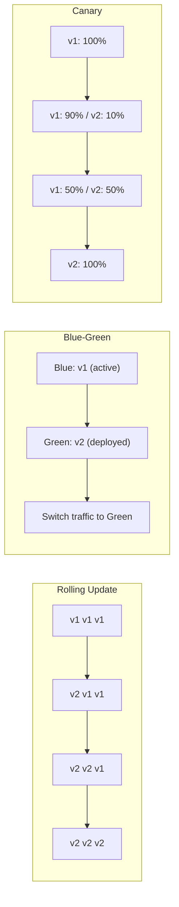
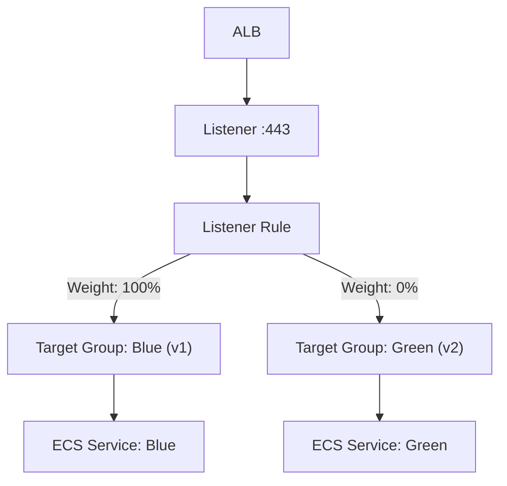
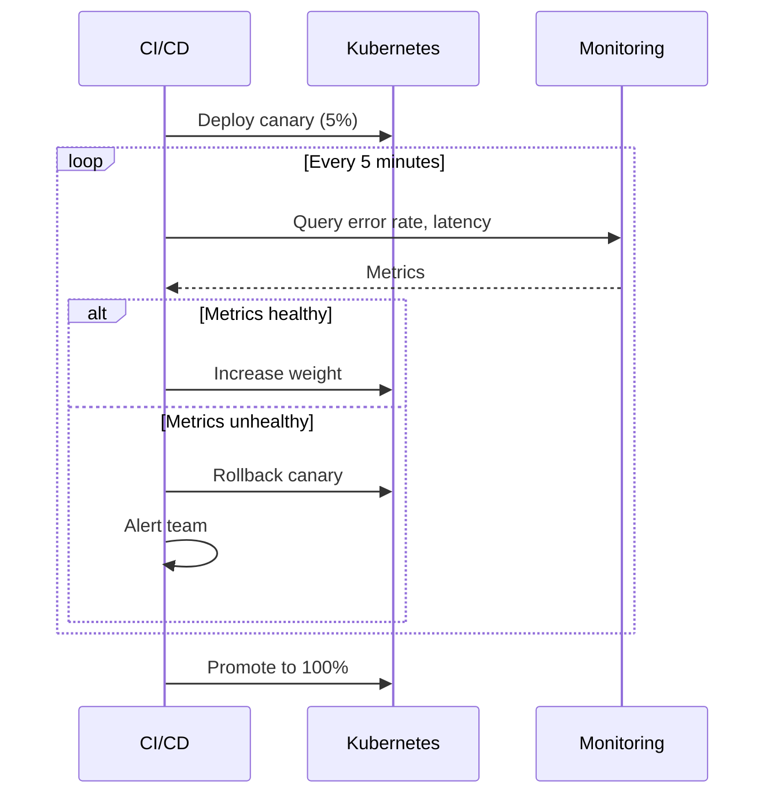

# Blue-Green and Canary Deployments

## Overview

Blue-green and canary deployments are strategies for releasing changes with minimal risk and zero downtime. This guide covers implementation patterns with Terraform and Kubernetes, weighted routing, rollback procedures, and decision criteria for each strategy.

---

## Deployment Strategy Comparison



| Strategy | Risk | Rollback Speed | Resource Cost | Complexity |
|----------|------|----------------|---------------|------------|
| Rolling Update | Medium | Minutes | 1x | Low |
| Blue-Green | Low | Seconds | 2x during deploy | Medium |
| Canary | Lowest | Seconds | 1.1x | High |
| A/B Testing | Lowest | Seconds | 1.1x | Highest |

---

## Blue-Green with ALB and Terraform

### Architecture



### Implementation

```hcl
variable "active_color" {
  description = "Active deployment color (blue or green)"
  type        = string
  default     = "blue"
}

variable "green_image_tag" {
  description = "Image tag for green deployment"
  type        = string
  default     = "latest"
}

variable "blue_image_tag" {
  description = "Image tag for blue deployment"
  type        = string
  default     = "latest"
}

# Two target groups
resource "aws_lb_target_group" "blue" {
  name        = "${var.environment}-blue"
  port        = var.container_port
  protocol    = "HTTP"
  vpc_id      = var.vpc_id
  target_type = "ip"

  health_check {
    path                = "/ready"
    healthy_threshold   = 2
    unhealthy_threshold = 3
    interval            = 15
  }

  tags = { Color = "blue" }
}

resource "aws_lb_target_group" "green" {
  name        = "${var.environment}-green"
  port        = var.container_port
  protocol    = "HTTP"
  vpc_id      = var.vpc_id
  target_type = "ip"

  health_check {
    path                = "/ready"
    healthy_threshold   = 2
    unhealthy_threshold = 3
    interval            = 15
  }

  tags = { Color = "green" }
}

# Weighted listener rule
resource "aws_lb_listener_rule" "app" {
  listener_arn = var.https_listener_arn
  priority     = 100

  action {
    type = "forward"

    forward {
      target_group {
        arn    = aws_lb_target_group.blue.arn
        weight = var.active_color == "blue" ? 100 : 0
      }

      target_group {
        arn    = aws_lb_target_group.green.arn
        weight = var.active_color == "green" ? 100 : 0
      }

      stickiness {
        enabled  = true
        duration = 3600
      }
    }
  }

  condition {
    host_header {
      values = [var.domain_name]
    }
  }
}

# Two ECS services
resource "aws_ecs_service" "blue" {
  name            = "${var.environment}-app-blue"
  cluster         = var.ecs_cluster_id
  task_definition = aws_ecs_task_definition.blue.arn
  desired_count   = var.active_color == "blue" ? var.desired_count : var.desired_count

  network_configuration {
    subnets          = var.private_subnet_ids
    security_groups  = [var.app_security_group_id]
    assign_public_ip = false
  }

  load_balancer {
    target_group_arn = aws_lb_target_group.blue.arn
    container_name   = var.app_name
    container_port   = var.container_port
  }
}

resource "aws_ecs_service" "green" {
  name            = "${var.environment}-app-green"
  cluster         = var.ecs_cluster_id
  task_definition = aws_ecs_task_definition.green.arn
  desired_count   = var.active_color == "green" ? var.desired_count : var.desired_count

  network_configuration {
    subnets          = var.private_subnet_ids
    security_groups  = [var.app_security_group_id]
    assign_public_ip = false
  }

  load_balancer {
    target_group_arn = aws_lb_target_group.green.arn
    container_name   = var.app_name
    container_port   = var.container_port
  }
}
```

### Deployment Process

1. Deploy new version to the inactive color (e.g., green).
2. Run health checks and smoke tests against the green target group.
3. Switch `active_color` from `blue` to `green` and apply.
4. Monitor metrics for errors.
5. If issues arise, switch back to `blue` immediately.
6. After confidence period, scale down or update the old color.

---

## Canary with Kubernetes

### Using Istio VirtualService

```yaml
apiVersion: networking.istio.io/v1
kind: VirtualService
metadata:
  name: api
  namespace: app
spec:
  hosts:
    - api.example.com
  http:
    - route:
        - destination:
            host: api
            subset: stable
          weight: 95
        - destination:
            host: api
            subset: canary
          weight: 5

---
apiVersion: networking.istio.io/v1
kind: DestinationRule
metadata:
  name: api
  namespace: app
spec:
  host: api
  subsets:
    - name: stable
      labels:
        version: v1
    - name: canary
      labels:
        version: v2
```

### Using AWS ALB Weighted Routing

```hcl
resource "aws_lb_listener_rule" "canary" {
  listener_arn = var.https_listener_arn
  priority     = 100

  action {
    type = "forward"

    forward {
      target_group {
        arn    = aws_lb_target_group.stable.arn
        weight = var.canary_weight > 0 ? 100 - var.canary_weight : 100
      }

      target_group {
        arn    = aws_lb_target_group.canary.arn
        weight = var.canary_weight
      }
    }
  }

  condition {
    host_header {
      values = [var.domain_name]
    }
  }
}

variable "canary_weight" {
  description = "Percentage of traffic to send to canary (0-100)"
  type        = number
  default     = 0

  validation {
    condition     = var.canary_weight >= 0 && var.canary_weight <= 100
    error_message = "Canary weight must be between 0 and 100."
  }
}
```

### Canary Progression

```
Step 1: canary_weight = 5    (5% canary)   — monitor for 10 min
Step 2: canary_weight = 25   (25% canary)  — monitor for 15 min
Step 3: canary_weight = 50   (50% canary)  — monitor for 15 min
Step 4: canary_weight = 100  (full rollout) — promote to stable
Step 5: Update stable to new version, set canary_weight = 0
```

---

## Rollback Procedures

### Immediate Rollback (Blue-Green)

```bash
# Simply switch the active color back
# In terraform.tfvars:
# active_color = "blue"  # was "green"
terraform apply
```

### Canary Rollback

```bash
# Set canary weight to 0
# In terraform.tfvars:
# canary_weight = 0
terraform apply
```

### Kubernetes Rollback

```bash
# Rollback deployment to previous revision
kubectl rollout undo deployment/api -n app

# Or rollback to a specific revision
kubectl rollout undo deployment/api -n app --to-revision=3
```

### ECS Rollback

```hcl
# ECS with circuit breaker — auto-rollback on deployment failure
resource "aws_ecs_service" "app" {
  # ...

  deployment_circuit_breaker {
    enable   = true
    rollback = true
  }
}
```

---

## Automated Canary Analysis



### Flagger (Automated Canary for K8s)

```yaml
apiVersion: flagger.app/v1beta1
kind: Canary
metadata:
  name: api
  namespace: app
spec:
  targetRef:
    apiVersion: apps/v1
    kind: Deployment
    name: api
  service:
    port: 80
    targetPort: 8080
  analysis:
    interval: 1m
    threshold: 5
    maxWeight: 50
    stepWeight: 10
    metrics:
      - name: request-success-rate
        thresholdRange:
          min: 99
        interval: 1m
      - name: request-duration
        thresholdRange:
          max: 500
        interval: 1m
    webhooks:
      - name: load-test
        url: http://flagger-loadtester.test/
        metadata:
          cmd: "hey -z 2m -q 10 -c 2 http://api-canary.app:80/"
```

---

## Strategy Selection Guide

| Scenario | Strategy | Why |
|----------|----------|-----|
| Database migration | Blue-green | Need instant rollback |
| Feature release | Canary | Gradual validation |
| Major version upgrade | Blue-green | Binary switch |
| Performance optimization | Canary | Compare metrics side-by-side |
| Simple bug fix | Rolling update | Low risk, fast |
| Infrastructure change | Blue-green | Validate before switching |

---

## Best Practices

1. **Always have a rollback plan** — document the exact steps before deploying.
2. **Monitor canary metrics actively** — error rate, latency, and business metrics.
3. **Use automated canary analysis** — human monitoring misses subtle regressions.
4. **Keep both versions running** during validation — do not tear down the old version immediately.
5. **Test rollback procedures** — a rollback plan you have never tested is not a plan.
6. **Use feature flags** alongside canary — decouple code deployment from feature activation.

---

## Related Guides

- [Service Mesh](../06-kubernetes/service-mesh.md) — Traffic management for canary
- [Monitoring](../04-aws-services-guide/monitoring.md) — Metrics for canary analysis
- [Developer Workflow](../08-workflows/developer-workflow.md) — Release process
