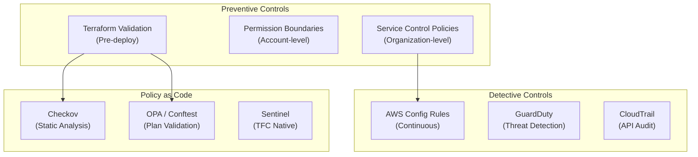
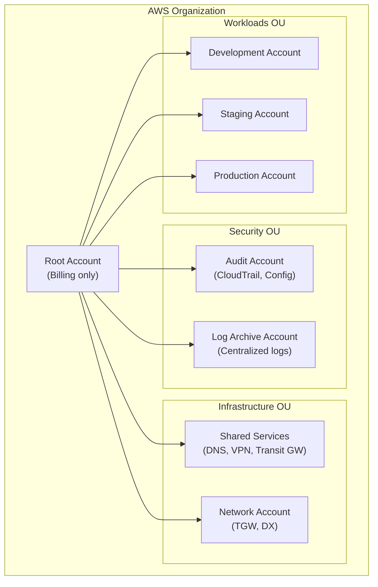

# Compliance and Governance

## Overview

Compliance and governance ensure that infrastructure meets security standards, regulatory requirements, and organizational policies. This guide covers AWS Config, Service Control Policies (SCPs), policy-as-code tools (Sentinel, OPA, Checkov), CIS benchmarks, and landing zone patterns.

---

## Governance Layers



---

## AWS Config

### Setup

```hcl
resource "aws_config_configuration_recorder" "main" {
  name     = "default"
  role_arn = aws_iam_role.config.arn

  recording_group {
    all_supported                 = true
    include_global_resource_types = true
  }

  recording_mode {
    recording_frequency = "CONTINUOUS"
  }
}

resource "aws_config_delivery_channel" "main" {
  name           = "default"
  s3_bucket_name = var.config_bucket_name
  s3_key_prefix  = "config"
  sns_topic_arn  = var.config_sns_topic_arn

  snapshot_delivery_properties {
    delivery_frequency = "TwentyFour_Hours"
  }

  depends_on = [aws_config_configuration_recorder.main]
}

resource "aws_config_configuration_recorder_status" "main" {
  name       = aws_config_configuration_recorder.main.name
  is_enabled = true

  depends_on = [aws_config_delivery_channel.main]
}
```

### Key Config Rules

```hcl
locals {
  managed_rules = {
    # Encryption
    "s3-bucket-server-side-encryption-enabled" = "S3_BUCKET_SERVER_SIDE_ENCRYPTION_ENABLED"
    "rds-storage-encrypted"                    = "RDS_STORAGE_ENCRYPTED"
    "encrypted-volumes"                        = "ENCRYPTED_VOLUMES"
    "ebs-encryption-by-default"                = "EC2_EBS_ENCRYPTION_BY_DEFAULT"

    # Access Control
    "s3-bucket-public-read-prohibited"  = "S3_BUCKET_PUBLIC_READ_PROHIBITED"
    "s3-bucket-public-write-prohibited" = "S3_BUCKET_PUBLIC_WRITE_PROHIBITED"
    "iam-root-access-key-check"         = "IAM_ROOT_ACCESS_KEY_CHECK"
    "iam-user-mfa-enabled"              = "IAM_USER_MFA_ENABLED"
    "mfa-enabled-for-iam-console-access" = "MFA_ENABLED_FOR_IAM_CONSOLE_ACCESS"

    # Network
    "restricted-ssh"                    = "INCOMING_SSH_DISABLED"
    "vpc-flow-logs-enabled"             = "VPC_FLOW_LOGS_ENABLED"
    "vpc-sg-open-only-to-authorized-ports" = "VPC_SG_OPEN_ONLY_TO_AUTHORIZED_PORTS"

    # Logging
    "cloud-trail-enabled"               = "CLOUD_TRAIL_ENABLED"
    "cloudtrail-s3-dataevents-enabled"  = "CLOUDTRAIL_S3_DATAEVENTS_ENABLED"

    # Backup
    "db-instance-backup-enabled"        = "DB_INSTANCE_BACKUP_ENABLED"
    "dynamodb-pitr-enabled"             = "DYNAMODB_PITR_ENABLED"

    # Tagging
    "required-tags"                     = "REQUIRED_TAGS"
  }
}

resource "aws_config_config_rule" "managed" {
  for_each = local.managed_rules

  name = each.key

  source {
    owner             = "AWS"
    source_identifier = each.value
  }

  depends_on = [aws_config_configuration_recorder_status.main]

  tags = {
    Environment = var.environment
  }
}
```

### Conformance Packs

```hcl
resource "aws_config_conformance_pack" "cis" {
  name = "cis-aws-foundations-benchmark"

  template_s3_uri = "s3://${var.config_bucket_name}/conformance-packs/cis-benchmark.yaml"

  depends_on = [aws_config_configuration_recorder_status.main]
}
```

---

## Service Control Policies (SCPs)

SCPs are guardrails at the AWS Organizations level. They define the maximum permissions for accounts.

```hcl
# Deny actions in disallowed regions
resource "aws_organizations_policy" "region_restriction" {
  name = "restrict-regions"
  type = "SERVICE_CONTROL_POLICY"

  content = jsonencode({
    Version = "2012-10-17"
    Statement = [{
      Sid    = "RestrictRegions"
      Effect = "Deny"
      Action = "*"
      Resource = "*"
      Condition = {
        StringNotEquals = {
          "aws:RequestedRegion" = var.allowed_regions
        }
        # Exclude global services
        "ForAnyValue:StringNotLike" = {
          "aws:PrincipalServiceName" = [
            "cloudfront.amazonaws.com",
            "iam.amazonaws.com",
            "route53.amazonaws.com",
            "support.amazonaws.com",
          ]
        }
      }
    }]
  })
}

# Prevent disabling CloudTrail
resource "aws_organizations_policy" "protect_cloudtrail" {
  name = "protect-cloudtrail"
  type = "SERVICE_CONTROL_POLICY"

  content = jsonencode({
    Version = "2012-10-17"
    Statement = [{
      Sid    = "ProtectCloudTrail"
      Effect = "Deny"
      Action = [
        "cloudtrail:StopLogging",
        "cloudtrail:DeleteTrail",
        "cloudtrail:UpdateTrail",
      ]
      Resource = "*"
    }]
  })
}

# Prevent leaving the organization
resource "aws_organizations_policy" "prevent_leave" {
  name = "prevent-leave-org"
  type = "SERVICE_CONTROL_POLICY"

  content = jsonencode({
    Version = "2012-10-17"
    Statement = [{
      Sid      = "PreventLeaveOrg"
      Effect   = "Deny"
      Action   = "organizations:LeaveOrganization"
      Resource = "*"
    }]
  })
}

# Require encryption on new resources
resource "aws_organizations_policy" "require_encryption" {
  name = "require-encryption"
  type = "SERVICE_CONTROL_POLICY"

  content = jsonencode({
    Version = "2012-10-17"
    Statement = [
      {
        Sid    = "RequireS3Encryption"
        Effect = "Deny"
        Action = "s3:PutObject"
        Resource = "*"
        Condition = {
          StringNotEquals = {
            "s3:x-amz-server-side-encryption" = ["aws:kms", "AES256"]
          }
          "Null" = {
            "s3:x-amz-server-side-encryption" = "true"
          }
        }
      },
      {
        Sid    = "RequireEBSEncryption"
        Effect = "Deny"
        Action = "ec2:CreateVolume"
        Resource = "*"
        Condition = {
          Bool = {
            "ec2:Encrypted" = "false"
          }
        }
      }
    ]
  })
}
```

---

## Policy as Code

### Checkov

```yaml
# .github/workflows/checkov.yml
- name: Run Checkov
  uses: bridgecrewio/checkov-action@v12
  with:
    directory: infrastructure/
    framework: terraform
    skip_check: CKV_AWS_126  # Skip specific checks with justification
    soft_fail: false
    output_format: cli,junitxml
    output_file_path: console,results.xml
```

### OPA / Conftest

```rego
# policies/deny_public_s3.rego
package terraform

deny[msg] {
  resource := input.resource_changes[_]
  resource.type == "aws_s3_bucket_public_access_block"
  change := resource.change.after

  not change.block_public_acls
  msg := sprintf("S3 bucket %s must block public ACLs", [resource.address])
}

deny[msg] {
  resource := input.resource_changes[_]
  resource.type == "aws_security_group_rule"
  change := resource.change.after

  change.type == "ingress"
  change.cidr_blocks[_] == "0.0.0.0/0"
  change.from_port == 22

  msg := sprintf("Security group %s allows SSH from 0.0.0.0/0", [resource.address])
}

deny[msg] {
  resource := input.resource_changes[_]
  resource.type == "aws_db_instance"
  change := resource.change.after

  not change.storage_encrypted
  msg := sprintf("RDS instance %s must have encryption enabled", [resource.address])
}
```

```bash
# Run in CI
terraform show -json tfplan > plan.json
conftest test plan.json --policy policies/ --output table
```

### Sentinel (Terraform Cloud)

```python
# policies/restrict-instance-types.sentinel
import "tfplan/v2" as tfplan

allowed_types = ["t3.micro", "t3.small", "t3.medium", "m6i.large", "m7g.large"]

ec2_instances = filter tfplan.resource_changes as _, rc {
  rc.type is "aws_instance" and
  rc.mode is "managed" and
  (rc.change.actions contains "create" or rc.change.actions contains "update")
}

main = rule {
  all ec2_instances as _, instance {
    instance.change.after.instance_type in allowed_types
  }
}
```

---

## CIS AWS Foundations Benchmark

Key controls from the CIS benchmark:

| Control | Terraform Implementation |
|---------|------------------------|
| 1.4 — Ensure no root access keys | Config rule: `iam-root-access-key-check` |
| 1.10 — Ensure MFA on console | Config rule: `mfa-enabled-for-iam-console-access` |
| 2.1 — Ensure CloudTrail enabled | `aws_cloudtrail` with multi-region |
| 2.6 — S3 bucket access logging | `aws_s3_bucket_logging` on all buckets |
| 3.1 — Log metric filter for unauthorized API | CloudWatch metric filter |
| 4.1 — Ensure no SGs allow 0.0.0.0/0 to 22 | Config rule: `restricted-ssh` |
| 4.3 — Ensure VPC flow logs | Config rule: `vpc-flow-logs-enabled` |

---

## Landing Zone Pattern



---

## Best Practices

1. **Enable AWS Config in all regions** — even regions you do not use.
2. **Apply SCPs at the OU level** — not individual accounts.
3. **Use Checkov in CI/CD** — catch violations before they reach AWS.
4. **Automate compliance reporting** — use Config conformance packs.
5. **Separate audit and log accounts** — defense in depth for audit trails.
6. **Review SCP impact carefully** — overly restrictive SCPs break legitimate operations.
7. **Use OPA for custom policies** — more flexible than Checkov for organization-specific rules.
8. **Map to compliance frameworks** — tag Config rules to CIS, SOC2, HIPAA controls.

---

## Related Guides

- [Security](../04-aws-services-guide/security.md) — IAM, KMS, GuardDuty
- [Tagging Strategy](tagging-strategy.md) — Tag enforcement
- [Pipeline Security](../05-cicd/pipeline-security.md) — Policy checks in CI/CD
- [Monitoring](../04-aws-services-guide/monitoring.md) — CloudTrail and alerting
