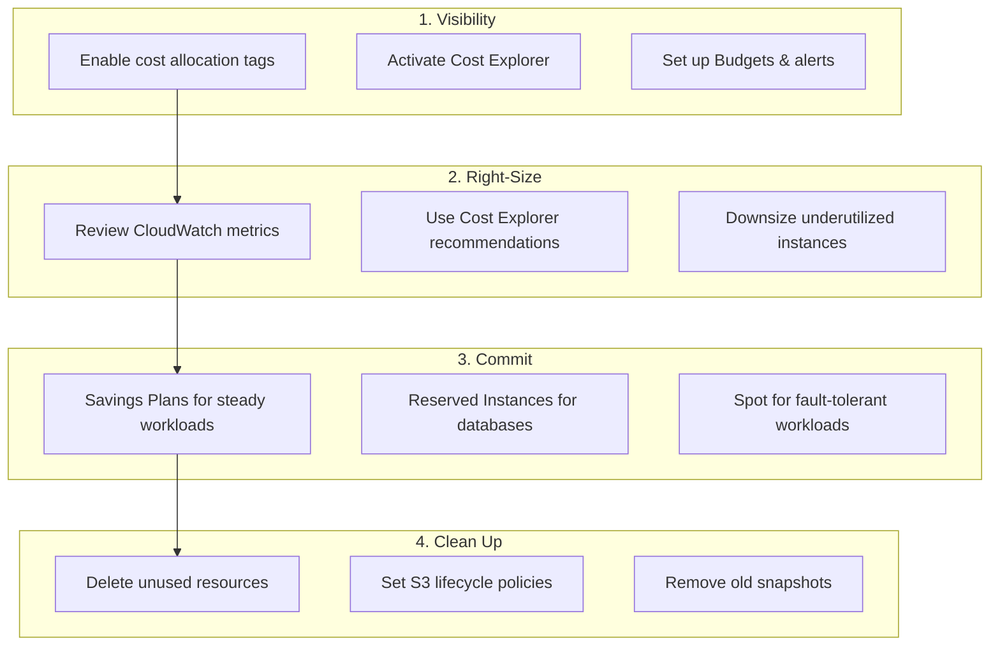

# Cost Optimization

## Overview

Cloud cost optimization is an ongoing practice of matching resource provisioning to actual workload requirements. This guide covers right-sizing, Reserved Instances, Spot instances, storage tiering, cleanup automation, and organizational practices for maintaining cost efficiency.

---

## Cost Optimization Framework



---

## Compute Right-Sizing

### Identifying Over-Provisioned Instances

An instance is over-provisioned if average CPU is below 30% and memory below 50%.

```hcl
# CloudWatch alarm for underutilization detection
resource "aws_cloudwatch_metric_alarm" "underutilized" {
  alarm_name          = "${var.environment}-ec2-underutilized"
  comparison_operator = "LessThanThreshold"
  evaluation_periods  = 336  # 14 days of hourly checks
  datapoints_to_alarm = 300  # Alarm if 300 of 336 periods are below
  metric_name         = "CPUUtilization"
  namespace           = "AWS/EC2"
  period              = 3600
  statistic           = "Average"
  threshold           = 20
  alarm_description   = "Instance may be over-provisioned"
  alarm_actions       = [var.cost_alert_sns_arn]

  dimensions = {
    InstanceId = var.instance_id
  }
}
```

### Graviton Migration

Graviton (ARM64) instances provide 20-40% better price/performance. Most workloads require no code changes.

```hcl
locals {
  # Migration map: x86 → Graviton equivalent
  graviton_map = {
    "m5.large"    = "m7g.large"
    "m5.xlarge"   = "m7g.xlarge"
    "c5.large"    = "c7g.large"
    "r5.large"    = "r7g.large"
    "t3.medium"   = "t4g.medium"
    "t3.large"    = "t4g.large"
  }
}

resource "aws_instance" "app" {
  instance_type = local.graviton_map[var.original_instance_type]
  # ...
}
```

---

## Spot Instances

### EKS with Karpenter Spot

```yaml
apiVersion: karpenter.sh/v1
kind: NodePool
metadata:
  name: spot-general
spec:
  template:
    spec:
      requirements:
        - key: karpenter.sh/capacity-type
          operator: In
          values: ["spot"]
        - key: kubernetes.io/arch
          operator: In
          values: ["arm64"]
        - key: karpenter.k8s.aws/instance-category
          operator: In
          values: ["m", "c", "r"]
        - key: karpenter.k8s.aws/instance-generation
          operator: Gt
          values: ["5"]
      nodeClassRef:
        group: karpenter.k8s.aws
        kind: EC2NodeClass
        name: default
  limits:
    cpu: "100"
  disruption:
    consolidationPolicy: WhenEmptyOrUnderutilized
    consolidateAfter: 30s
```

### Spot Best Practices

1. **Diversify instance types** — use 10+ types across sizes and families.
2. **Use capacity-optimized allocation** — reduces interruption risk.
3. **Handle interruptions gracefully** — use PodDisruptionBudgets and graceful shutdown.
4. **Mix On-Demand and Spot** — baseline on-demand, burst with Spot.

---

## Reserved Instances and Savings Plans

### Savings Plans

```hcl
# Track Savings Plan coverage
resource "aws_ce_anomaly_monitor" "savings_plan" {
  name              = "savings-plan-coverage"
  monitor_type      = "DIMENSIONAL"
  monitor_dimension = "SERVICE"
}
```

### Purchase Strategy

| Workload Pattern | Commitment | Term |
|-----------------|------------|------|
| Stable baseline | Compute Savings Plan | 1 year, no upfront |
| Known DB workload | RDS Reserved Instance | 1 year, partial upfront |
| Variable but predictable | EC2 Instance Savings Plan | 1 year, no upfront |
| Unknown/new | No commitment | - |

**Target**: 70-80% of steady-state compute covered by commitments, 20-30% on-demand for flexibility.

---

## Storage Optimization

### S3 Lifecycle Policies

```hcl
resource "aws_s3_bucket_lifecycle_configuration" "optimized" {
  bucket = aws_s3_bucket.data.id

  rule {
    id     = "optimize-storage-class"
    status = "Enabled"

    transition {
      days          = 30
      storage_class = "STANDARD_IA"
    }

    transition {
      days          = 90
      storage_class = "GLACIER_IR"
    }

    transition {
      days          = 365
      storage_class = "DEEP_ARCHIVE"
    }
  }

  rule {
    id     = "cleanup-versions"
    status = "Enabled"

    noncurrent_version_transition {
      noncurrent_days = 30
      storage_class   = "STANDARD_IA"
    }

    noncurrent_version_expiration {
      noncurrent_days = 90
    }
  }

  rule {
    id     = "abort-multipart"
    status = "Enabled"

    abort_incomplete_multipart_upload {
      days_after_initiation = 3
    }
  }
}
```

### EBS Optimization

```hcl
# gp3 is 20% cheaper than gp2 with the same baseline performance
resource "aws_ebs_volume" "app" {
  type       = "gp3"  # NOT gp2
  size       = var.volume_size
  iops       = 3000   # gp3 baseline (gp2 charges for this)
  throughput = 125     # gp3 baseline
  encrypted  = true
}
```

---

## Network Cost Reduction

### VPC Endpoints vs NAT Gateway

```hcl
# NAT Gateway: $0.045/hr + $0.045/GB processed
# Gateway Endpoint (S3, DynamoDB): FREE
# Interface Endpoint: $0.01/hr per AZ + $0.01/GB

resource "aws_vpc_endpoint" "s3" {
  vpc_id       = var.vpc_id
  service_name = "com.amazonaws.${data.aws_region.current.name}.s3"
  route_table_ids = var.private_route_table_ids
}

resource "aws_vpc_endpoint" "dynamodb" {
  vpc_id       = var.vpc_id
  service_name = "com.amazonaws.${data.aws_region.current.name}.dynamodb"
  route_table_ids = var.private_route_table_ids
}
```

### Cross-AZ Traffic

Cross-AZ data transfer costs $0.01/GB each way. Reduce it by:

- **Topology-aware routing** in Kubernetes
- **Single-AZ read replicas** for read-heavy workloads
- **Service mesh locality routing** (Istio, Linkerd)

---

## Cleanup Automation

### Lambda for Unused Resource Cleanup

```hcl
resource "aws_lambda_function" "cleanup" {
  function_name = "${var.environment}-resource-cleanup"
  role          = aws_iam_role.cleanup.arn
  handler       = "cleanup.handler"
  runtime       = "python3.12"
  timeout       = 300

  filename         = "${path.module}/lambda/cleanup.zip"
  source_code_hash = filebase64sha256("${path.module}/lambda/cleanup.zip")

  environment {
    variables = {
      DRY_RUN     = var.environment == "production" ? "true" : "false"
      MAX_AGE_DAYS = "30"
    }
  }
}

# Run daily
resource "aws_cloudwatch_event_rule" "cleanup" {
  name                = "${var.environment}-daily-cleanup"
  schedule_expression = "cron(0 4 * * ? *)"
}

resource "aws_cloudwatch_event_target" "cleanup" {
  rule = aws_cloudwatch_event_rule.cleanup.name
  arn  = aws_lambda_function.cleanup.arn
}
```

### Resources to Clean Up

| Resource Type | Detection Method | Savings |
|--------------|-----------------|---------|
| Unattached EBS volumes | Config rule: `ec2-volume-inuse-check` | $0.08/GB/mo |
| Unused Elastic IPs | Config rule: `eip-attached` | $3.60/mo each |
| Old EBS snapshots | Age > 90 days, no AMI reference | Varies |
| Idle RDS instances | 0 connections for > 7 days | Instance cost |
| Unused NAT gateways | 0 bytes processed for > 7 days | $32/mo each |
| Empty S3 buckets | 0 objects | Minimal |
| Old AMIs | Age > 90 days, not in use | Snapshot storage |

---

## Cost Monitoring

```hcl
# Monthly budget per environment
resource "aws_budgets_budget" "environment" {
  name         = "${var.environment}-monthly"
  budget_type  = "COST"
  limit_amount = var.monthly_budget
  limit_unit   = "USD"
  time_unit    = "MONTHLY"

  cost_filter {
    name   = "TagKeyValue"
    values = ["user:Environment$${var.environment}"]
  }

  notification {
    comparison_operator        = "GREATER_THAN"
    threshold                  = 80
    threshold_type             = "PERCENTAGE"
    notification_type          = "ACTUAL"
    subscriber_email_addresses = var.cost_alert_emails
  }

  notification {
    comparison_operator        = "GREATER_THAN"
    threshold                  = 100
    threshold_type             = "PERCENTAGE"
    notification_type          = "FORECASTED"
    subscriber_email_addresses = var.cost_alert_emails
    subscriber_sns_topic_arns  = [var.cost_alert_sns_arn]
  }
}
```

---

## Monthly Review Checklist

1. [ ] Review Cost Explorer for unexpected spikes
2. [ ] Check RI/SP coverage and utilization
3. [ ] Review right-sizing recommendations
4. [ ] Clean up unused resources
5. [ ] Check untagged resource costs
6. [ ] Review data transfer costs
7. [ ] Verify lifecycle policies are working
8. [ ] Update budget thresholds if needed

---

## Best Practices

1. **Start with visibility** — you cannot optimize what you cannot see.
2. **Right-size before committing** — do not buy RIs for over-provisioned instances.
3. **Use Graviton everywhere possible** — easiest 20-40% savings.
4. **Automate cleanup** — human processes for cleanup do not scale.
5. **Set budgets with alerts** — catch problems before the bill arrives.
6. **Review monthly** — cost optimization is not a one-time project.
7. **Assign cost ownership** — teams that see their costs make better decisions.
8. **Use Spot aggressively** — most containerized workloads tolerate interruption.

---

## Related Guides

- [Cost Management](../04-aws-services-guide/cost-management.md) — AWS cost tools
- [Tagging Strategy](tagging-strategy.md) — Cost allocation tags
- [Compute](../04-aws-services-guide/compute.md) — Instance type selection
