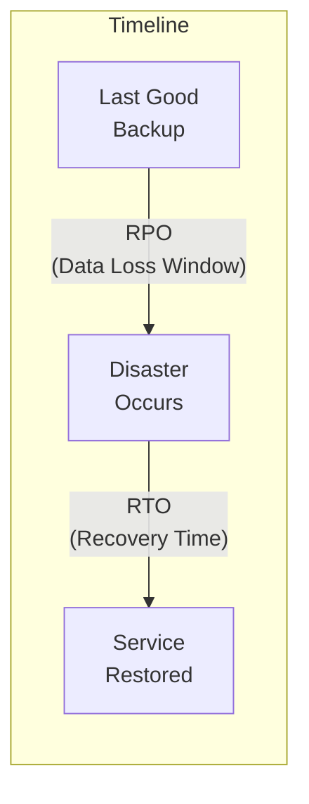
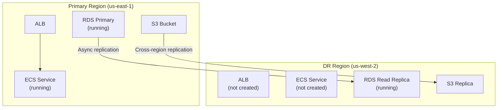

# Disaster Recovery

## Overview

Disaster recovery (DR) ensures business continuity when a primary region or service fails. This guide covers RPO/RTO definitions, multi-region strategies (pilot light, warm standby, active-active), and Terraform patterns for implementing each.

---

## RPO and RTO



| Metric | Definition | Business Impact |
|--------|-----------|-----------------|
| **RPO** (Recovery Point Objective) | Maximum acceptable data loss | How much data can you afford to lose? |
| **RTO** (Recovery Time Objective) | Maximum acceptable downtime | How long can you be offline? |

### RPO/RTO by Strategy

| Strategy | RPO | RTO | Cost | Complexity |
|----------|-----|-----|------|------------|
| Backup & Restore | Hours | Hours | $ | Low |
| Pilot Light | Minutes | 10-30 min | $$ | Medium |
| Warm Standby | Seconds-minutes | Minutes | $$$ | Medium-high |
| Active-Active | Near-zero | Near-zero | $$$$ | High |

---

## Strategy 1: Backup & Restore

The lowest-cost DR strategy. Backups are replicated to the DR region but no infrastructure runs there until needed.

```hcl
# Cross-region RDS snapshot copy
resource "aws_db_instance_automated_backups_replication" "dr" {
  provider = aws.dr_region

  source_db_instance_arn = aws_db_instance.primary.arn
  kms_key_id             = var.dr_kms_key_arn
  retention_period       = 7
}

# Cross-region S3 replication (see storage.md)
resource "aws_s3_bucket_replication_configuration" "dr" {
  bucket = aws_s3_bucket.primary.id
  role   = aws_iam_role.replication.arn

  rule {
    id     = "dr-replication"
    status = "Enabled"

    destination {
      bucket        = aws_s3_bucket.dr.arn
      storage_class = "STANDARD_IA"
    }
  }
}

# DynamoDB global table
resource "aws_dynamodb_table" "global" {
  # ... table definition ...

  replica {
    region_name = var.dr_region
    kms_key_arn = var.dr_kms_key_arn
  }
}
```

---

## Strategy 2: Pilot Light

Core infrastructure (database replicas, DNS) runs in the DR region. Compute resources are provisioned only during failover.



### Terraform Configuration

```hcl
# Primary region — full stack
module "primary" {
  source = "./modules/application-stack"
  providers = {
    aws = aws.primary
  }

  environment  = var.environment
  region       = "us-east-1"
  deploy_compute = true
  deploy_database = true
  is_primary   = true
}

# DR region — database replica only (pilot light)
module "dr" {
  source = "./modules/application-stack"
  providers = {
    aws = aws.dr
  }

  environment     = var.environment
  region          = "us-west-2"
  deploy_compute  = var.dr_activated  # false by default
  deploy_database = true
  is_primary      = false

  # Read replica of primary
  rds_source_identifier = module.primary.rds_instance_arn
}

variable "dr_activated" {
  description = "Set to true to activate DR compute resources"
  type        = bool
  default     = false
}
```

### Failover Process

1. Set `dr_activated = true` in terraform.tfvars.
2. Run `terraform apply` to provision compute in DR region.
3. Promote the RDS read replica to a standalone instance.
4. Update Route 53 to point to the DR region ALB.
5. Verify application health in DR region.

---

## Strategy 3: Warm Standby

A scaled-down copy of the production environment runs continuously in the DR region.

```hcl
# DR region — scaled-down but running
module "dr_warm" {
  source = "./modules/application-stack"
  providers = {
    aws = aws.dr
  }

  environment    = var.environment
  region         = "us-west-2"
  deploy_compute = true
  is_primary     = false

  # Scaled down
  ecs_desired_count  = 1       # vs 3 in primary
  rds_instance_class = "db.r6g.large"  # vs xlarge in primary
}

# Route 53 health check and failover
resource "aws_route53_health_check" "primary" {
  fqdn              = module.primary.alb_dns_name
  port               = 443
  type               = "HTTPS"
  resource_path      = "/health"
  failure_threshold  = 3
  request_interval   = 10

  tags = {
    Name = "primary-health-check"
  }
}

resource "aws_route53_record" "failover_primary" {
  zone_id = var.hosted_zone_id
  name    = "api.example.com"
  type    = "A"

  alias {
    name                   = module.primary.alb_dns_name
    zone_id                = module.primary.alb_zone_id
    evaluate_target_health = true
  }

  failover_routing_policy {
    type = "PRIMARY"
  }

  set_identifier  = "primary"
  health_check_id = aws_route53_health_check.primary.id
}

resource "aws_route53_record" "failover_dr" {
  zone_id = var.hosted_zone_id
  name    = "api.example.com"
  type    = "A"

  alias {
    name                   = module.dr_warm.alb_dns_name
    zone_id                = module.dr_warm.alb_zone_id
    evaluate_target_health = true
  }

  failover_routing_policy {
    type = "SECONDARY"
  }

  set_identifier = "secondary"
}
```

---

## Strategy 4: Active-Active

Both regions serve traffic simultaneously. Route 53 distributes requests based on latency or geography.

```hcl
# Both regions run full stacks
module "us_east" {
  source = "./modules/application-stack"
  providers = { aws = aws.us_east_1 }

  environment    = var.environment
  region         = "us-east-1"
  deploy_compute = true
  is_primary     = true
}

module "eu_west" {
  source = "./modules/application-stack"
  providers = { aws = aws.eu_west_1 }

  environment    = var.environment
  region         = "eu-west-1"
  deploy_compute = true
  is_primary     = true
}

# Latency-based routing
resource "aws_route53_record" "latency_us" {
  zone_id = var.hosted_zone_id
  name    = "api.example.com"
  type    = "A"

  alias {
    name                   = module.us_east.alb_dns_name
    zone_id                = module.us_east.alb_zone_id
    evaluate_target_health = true
  }

  latency_routing_policy {
    region = "us-east-1"
  }

  set_identifier = "us-east-1"
}

resource "aws_route53_record" "latency_eu" {
  zone_id = var.hosted_zone_id
  name    = "api.example.com"
  type    = "A"

  alias {
    name                   = module.eu_west.alb_dns_name
    zone_id                = module.eu_west.alb_zone_id
    evaluate_target_health = true
  }

  latency_routing_policy {
    region = "eu-west-1"
  }

  set_identifier = "eu-west-1"
}

# Aurora Global Database
resource "aws_rds_global_cluster" "main" {
  global_cluster_identifier = "${var.environment}-global"
  engine                    = "aurora-postgresql"
  engine_version            = "16.3"
  storage_encrypted         = true
}
```

---

## DR Testing

| Test Type | Frequency | Scope | Duration |
|-----------|-----------|-------|----------|
| Tabletop exercise | Quarterly | Full team | 2-4 hours |
| Component failover test | Monthly | Individual service | 1-2 hours |
| Full regional failover | Annually | Entire stack | 4-8 hours |
| Backup restore test | Monthly | Database | 1-2 hours |

---

## DR Checklist

- [ ] RPO and RTO defined for each critical service
- [ ] Database replication configured and monitored
- [ ] S3 cross-region replication enabled
- [ ] Route 53 health checks configured
- [ ] DR infrastructure tested (not just documented)
- [ ] Runbook for failover procedure written and practiced
- [ ] DNS TTL set low enough for fast failover (60-300 seconds)
- [ ] Terraform code can deploy to DR region
- [ ] Secrets replicated to DR region
- [ ] Monitoring and alerting active in DR region

---

## Best Practices

1. **Test your DR plan regularly** — an untested plan is not a plan.
2. **Automate failover** where possible — manual steps are slow and error-prone under stress.
3. **Keep DR Terraform code in the same repo** — treat it as part of the main infrastructure.
4. **Monitor replication lag** — a replica that is hours behind provides hours of data loss.
5. **Use low DNS TTLs** — 60 seconds allows fast failover; 86400 seconds means a day of waiting.
6. **Document everything** — the person executing the failover may not be the one who designed it.
7. **Budget for DR** — warm standby costs real money; factor it into infrastructure budgets.

---

## Related Guides

- [Networking Advanced](../04-aws-services-guide/networking-advanced.md) — Multi-region connectivity
- [Databases](../04-aws-services-guide/databases.md) — Cross-region replication
- [Incident Response](../08-workflows/incident-response.md) — Failover runbook
