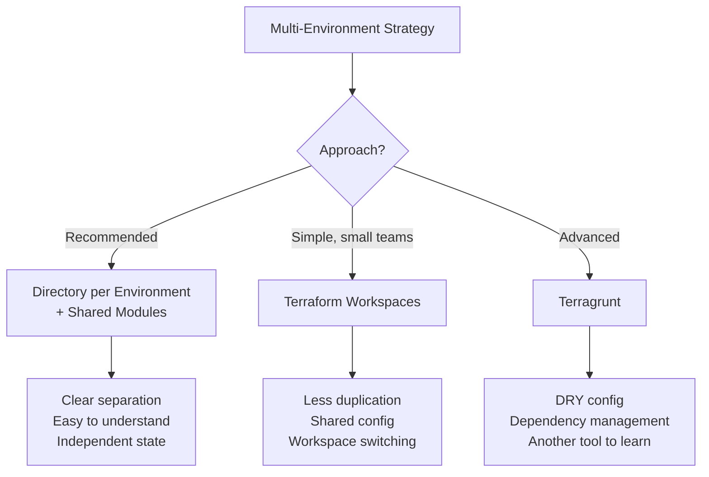

# Multi-Environment Patterns

## Overview

Managing multiple environments (development, staging, production) with Terraform requires a strategy for code reuse, variable composition, and environment promotion. This guide compares directory-based and workspace-based approaches, covers DRY strategies, and provides production-ready patterns.

---

## Strategy Comparison



### Decision Matrix

| Factor | Directory-Based | Workspaces | Terragrunt |
|--------|----------------|------------|------------|
| Clarity | High — explicit | Medium — implicit | Medium |
| DRY | Module reuse | Variable interpolation | Includes + generate |
| State isolation | File-based | Workspace-based | File-based |
| CI/CD integration | Straightforward | Needs workspace selection | Terragrunt-aware CI |
| Learning curve | Low | Low | Medium |
| Drift risk | Low | Medium (wrong workspace) | Low |
| Team size fit | Any | Small | Medium-large |

---

## Directory-Based (Recommended)

### Structure

```
infrastructure/
  modules/                    # Shared, reusable modules
    vpc/
      main.tf
      variables.tf
      outputs.tf
    ecs/
      main.tf
      variables.tf
      outputs.tf
    rds/
      main.tf
      variables.tf
      outputs.tf

  environments/
    development/
      main.tf                 # Calls modules with dev settings
      variables.tf
      terraform.tfvars        # Dev-specific values
      backend.tf              # Dev state config
      providers.tf
    staging/
      main.tf
      variables.tf
      terraform.tfvars
      backend.tf
      providers.tf
    production/
      main.tf
      variables.tf
      terraform.tfvars
      backend.tf
      providers.tf
```

### Module Call Pattern

```hcl
# environments/production/main.tf
module "vpc" {
  source = "../../modules/vpc"

  environment        = var.environment
  vpc_cidr           = var.vpc_cidr
  availability_zones = var.availability_zones
  enable_nat_gateway = true
  single_nat_gateway = false  # HA in production
}

module "ecs" {
  source = "../../modules/ecs"

  environment       = var.environment
  vpc_id            = module.vpc.vpc_id
  private_subnet_ids = module.vpc.private_subnet_ids
  desired_count     = var.ecs_desired_count
  instance_type     = var.ecs_instance_type
}

module "rds" {
  source = "../../modules/rds"

  environment       = var.environment
  vpc_id            = module.vpc.vpc_id
  data_subnet_ids   = module.vpc.data_subnet_ids
  instance_class    = var.rds_instance_class
  multi_az          = true  # Always in production
}
```

### Variable Composition

```hcl
# environments/production/terraform.tfvars
environment        = "production"
vpc_cidr           = "10.0.0.0/16"
availability_zones = ["us-east-1a", "us-east-1b", "us-east-1c"]

# ECS
ecs_desired_count = 3
ecs_instance_type = "m7g.large"

# RDS
rds_instance_class = "db.r6g.xlarge"
```

```hcl
# environments/development/terraform.tfvars
environment        = "development"
vpc_cidr           = "10.2.0.0/16"
availability_zones = ["us-east-1a", "us-east-1b"]

# ECS
ecs_desired_count = 1
ecs_instance_type = "t3.medium"

# RDS
rds_instance_class = "db.t4g.medium"
```

### Backend Configuration

```hcl
# environments/production/backend.tf
terraform {
  backend "s3" {
    bucket         = "myorg-terraform-state"
    key            = "environments/production/terraform.tfstate"
    region         = "us-east-1"
    dynamodb_table = "myorg-terraform-locks"
    encrypt        = true
  }
}
```

---

## Workspace-Based

Workspaces share the same configuration but maintain separate state files.

```hcl
# main.tf — single config for all environments
locals {
  environment = terraform.workspace

  config = {
    development = {
      vpc_cidr        = "10.2.0.0/16"
      instance_type   = "t3.medium"
      desired_count   = 1
      multi_az        = false
      nat_single      = true
    }
    staging = {
      vpc_cidr        = "10.1.0.0/16"
      instance_type   = "m6i.large"
      desired_count   = 2
      multi_az        = true
      nat_single      = true
    }
    production = {
      vpc_cidr        = "10.0.0.0/16"
      instance_type   = "m7g.large"
      desired_count   = 3
      multi_az        = true
      nat_single      = false
    }
  }

  env = local.config[local.environment]
}

module "vpc" {
  source = "./modules/vpc"

  environment        = local.environment
  vpc_cidr           = local.env.vpc_cidr
  single_nat_gateway = local.env.nat_single
}
```

### Workspace Limitations

- **Accidental wrong workspace**: Running `terraform apply` in the wrong workspace modifies the wrong environment.
- **Shared configuration**: Hard to have production-only resources.
- **CI/CD complexity**: Must select workspace before each operation.
- **State co-location**: All workspace states share the same backend path prefix.

---

## Environment Promotion Flow

```mermaid
sequenceDiagram
    participant Dev as Developer
    participant PR as Pull Request
    participant CI as CI/CD Pipeline
    participant D as Development
    participant S as Staging
    participant P as Production

    Dev->>PR: Open PR with changes
    CI->>CI: Plan all environments
    PR->>PR: Review plans
    Dev->>PR: Merge to main
    CI->>D: Apply to development
    CI->>CI: Run integration tests
    CI->>S: Apply to staging (approval gate)
    CI->>CI: Run smoke tests
    CI->>P: Apply to production (approval gate)
```



### Key Rules

1. **Same code, different values** — modules are identical; only tfvars differ.
2. **Promote through all environments** — never skip staging.
3. **Approval gates** — require human approval before staging and production.
4. **Automated tests between stages** — validate each environment before promoting.

---

## DRY Strategies

### Shared Variable Definitions

```hcl
# environments/_shared/variables.tf (symlinked or copied)
variable "environment" {
  type = string
}

variable "vpc_cidr" {
  type = string
}

variable "availability_zones" {
  type = list(string)
}
```

### Common Locals

```hcl
# environments/_shared/common.tf
locals {
  common_tags = {
    Environment = var.environment
    ManagedBy   = "terraform"
    Project     = "myproject"
  }

  is_production = var.environment == "production"
}
```

### Shared Provider Configuration

```hcl
# environments/_shared/providers.tf
terraform {
  required_version = ">= 1.9.0"

  required_providers {
    aws = {
      source  = "hashicorp/aws"
      version = "~> 5.60"
    }
  }
}

provider "aws" {
  region = var.aws_region

  default_tags {
    tags = local.common_tags
  }
}
```

---

## Anti-Patterns

| Anti-Pattern | Problem | Solution |
|-------------|---------|----------|
| Copy-pasting modules | Configurations drift | Use shared modules |
| Environment branches | Merge conflicts, inconsistency | Trunk-based development |
| Shared state across envs | Blast radius | Separate state per environment |
| Manual env promotion | Inconsistent, error-prone | CI/CD pipeline with gates |
| Hardcoded values in modules | Not reusable | Variables with sensible defaults |
| Monolithic state | Slow plans, large blast radius | Split by service/layer |

---

## State Organization

```
s3://myorg-terraform-state/
  environments/
    development/
      networking/terraform.tfstate
      compute/terraform.tfstate
      database/terraform.tfstate
    staging/
      networking/terraform.tfstate
      compute/terraform.tfstate
      database/terraform.tfstate
    production/
      networking/terraform.tfstate
      compute/terraform.tfstate
      database/terraform.tfstate
```

---

## Best Practices

1. **Use directory-based separation** for production environments.
2. **Keep modules environment-agnostic** — pass environment as a variable.
3. **Use `default_tags`** in the provider to apply consistent tags everywhere.
4. **Split state by layer** — networking, compute, and data in separate states.
5. **Use remote state data sources** to connect layers.
6. **Automate promotion** — never manually apply to production.
7. **Version your modules** — use git tags or a module registry.

---

## Related Guides

- [CI/CD Overview](../05-cicd/cicd-overview.md) — Pipeline architecture
- [GitHub Actions](../05-cicd/github-actions-terraform.md) — Workflow implementation
- [Developer Workflow](../08-workflows/developer-workflow.md) — Day-to-day workflow
