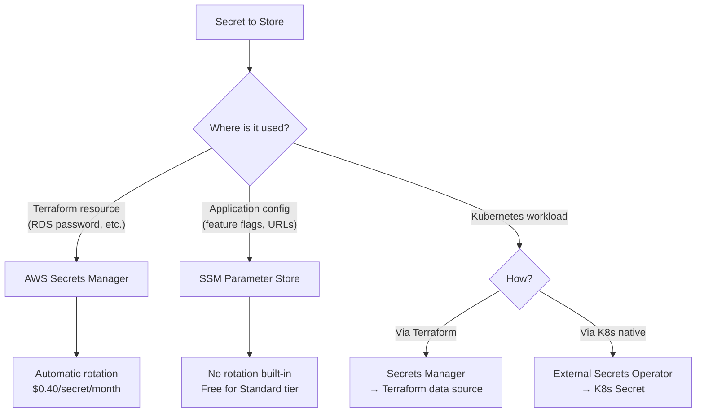
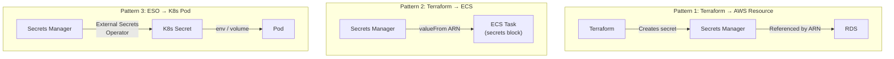

# Secrets Management

## Overview

Secrets (database passwords, API keys, TLS certificates) must never be stored in plaintext in code, state files, or CI/CD logs. This guide covers AWS Secrets Manager, SSM Parameter Store, the External Secrets Operator for Kubernetes, secret rotation, and Terraform integration patterns.

---

## Secrets Storage Decision



### Comparison

| Feature | Secrets Manager | SSM Parameter Store | HashiCorp Vault |
|---------|----------------|-------------------|-----------------|
| Rotation | Built-in Lambda | Manual / custom | Built-in |
| Cost | $0.40/secret/mo | Free (Standard) | License + infra |
| Max Size | 64 KB | 8 KB (Advanced) | Unlimited |
| Cross-Account | Resource policy | Shared via RAM | Policies |
| Audit | CloudTrail | CloudTrail | Audit log |
| K8s Integration | External Secrets | External Secrets | Vault Agent |
| Versioning | Yes | Yes | Yes |
| Encryption | KMS (mandatory) | KMS (optional) | Transit engine |

---

## AWS Secrets Manager with Terraform

### Creating Secrets

```hcl
# Generate a random password
resource "random_password" "db" {
  length  = 32
  special = true
  # Exclude characters that cause issues in connection strings
  override_special = "!#$%&*()-_=+[]{}|:,.<>?"
}

# Store in Secrets Manager
resource "aws_secretsmanager_secret" "db_password" {
  name        = "${var.environment}/database/master-password"
  description = "Master password for ${var.environment} database"
  kms_key_id  = var.kms_key_arn

  recovery_window_in_days = var.environment == "production" ? 30 : 7

  tags = {
    Environment = var.environment
    AutoRotate  = "true"
    Service     = "database"
  }
}

resource "aws_secretsmanager_secret_version" "db_password" {
  secret_id     = aws_secretsmanager_secret.db_password.id
  secret_string = random_password.db.result

  lifecycle {
    ignore_changes = [secret_string]  # Rotation will manage this
  }
}

# Reference in RDS
resource "aws_db_instance" "main" {
  # ...
  password = random_password.db.result

  lifecycle {
    ignore_changes = [password]
  }
}
```

### Reading Secrets in Terraform

```hcl
# Read an existing secret
data "aws_secretsmanager_secret_version" "api_key" {
  secret_id = "${var.environment}/api/external-key"
}

locals {
  api_credentials = jsondecode(data.aws_secretsmanager_secret_version.api_key.secret_string)
}

# Use in a resource
resource "aws_ecs_task_definition" "app" {
  # ...
  container_definitions = jsonencode([{
    secrets = [
      {
        name      = "API_KEY"
        valueFrom = data.aws_secretsmanager_secret_version.api_key.arn
      }
    ]
  }])
}
```

---

## SSM Parameter Store

```hcl
# Standard parameters (free, up to 10,000)
resource "aws_ssm_parameter" "config" {
  name  = "/${var.environment}/${var.app_name}/config"
  type  = "String"
  value = jsonencode({
    log_level       = "info"
    feature_flags   = { new_ui = true, beta_api = false }
    cache_ttl       = 300
  })

  tags = {
    Environment = var.environment
    Application = var.app_name
  }
}

# Secure string (encrypted with KMS)
resource "aws_ssm_parameter" "api_key" {
  name   = "/${var.environment}/${var.app_name}/api-key"
  type   = "SecureString"
  value  = var.api_key
  key_id = var.kms_key_arn

  lifecycle {
    ignore_changes = [value]
  }

  tags = {
    Environment = var.environment
  }
}
```

---

## Secret Rotation

### RDS Password Rotation

```hcl
resource "aws_secretsmanager_secret_rotation" "db_password" {
  secret_id           = aws_secretsmanager_secret.db_password.id
  rotation_lambda_arn = aws_lambda_function.rotation.arn

  rotation_rules {
    automatically_after_days = 30
    schedule_expression      = "rate(30 days)"
  }
}

# AWS provides managed rotation Lambdas for RDS
resource "aws_serverlessapplicationrepository_cloudformation_stack" "rotation" {
  name           = "${var.environment}-db-rotation"
  application_id = "arn:aws:serverlessrepo:us-east-1:297356227824:applications/SecretsManagerRDSPostgreSQLRotationSingleUser"

  capabilities = ["CAPABILITY_IAM"]

  parameters = {
    endpoint            = "https://secretsmanager.${data.aws_region.current.name}.amazonaws.com"
    functionName        = "${var.environment}-db-rotation"
    vpcSubnetIds        = join(",", var.private_subnet_ids)
    vpcSecurityGroupIds = aws_security_group.rotation.id
  }
}
```

---

## External Secrets Operator (Kubernetes)

### Installation

```hcl
resource "helm_release" "external_secrets" {
  name             = "external-secrets"
  repository       = "https://charts.external-secrets.io"
  chart            = "external-secrets"
  version          = "0.10.0"
  namespace        = "external-secrets"
  create_namespace = true

  values = [yamlencode({
    serviceAccount = {
      create = true
      name   = "external-secrets"
      annotations = {
        "eks.amazonaws.com/role-arn" = aws_iam_role.external_secrets.arn
      }
    }
    webhook = {
      create = true
    }
    certController = {
      create = true
    }
  })]
}
```

### ClusterSecretStore

```yaml
apiVersion: external-secrets.io/v1beta1
kind: ClusterSecretStore
metadata:
  name: aws-secrets-manager
spec:
  provider:
    aws:
      service: SecretsManager
      region: us-east-1
      auth:
        jwt:
          serviceAccountRef:
            name: external-secrets
            namespace: external-secrets
```

### ExternalSecret Resource

```yaml
apiVersion: external-secrets.io/v1beta1
kind: ExternalSecret
metadata:
  name: api-secrets
  namespace: app
spec:
  refreshInterval: 1h
  secretStoreRef:
    name: aws-secrets-manager
    kind: ClusterSecretStore

  target:
    name: api-secrets
    creationPolicy: Owner
    template:
      type: Opaque
      data:
        DATABASE_URL: "postgresql://{{ .username }}:{{ .password }}@{{ .host }}:5432/{{ .dbname }}"

  data:
    - secretKey: username
      remoteRef:
        key: production/database/credentials
        property: username
    - secretKey: password
      remoteRef:
        key: production/database/credentials
        property: password
    - secretKey: host
      remoteRef:
        key: production/database/credentials
        property: host
    - secretKey: dbname
      remoteRef:
        key: production/database/credentials
        property: dbname
```

---

## Terraform State and Secrets

Terraform state contains plaintext values of all managed resources, including secrets. Protect it:

```hcl
# Mark outputs as sensitive
output "db_password" {
  value     = random_password.db.result
  sensitive = true
}

# Use sensitive variables
variable "db_password" {
  type      = string
  sensitive = true
}
```

### State Protection

| Control | Implementation |
|---------|---------------|
| Encryption at rest | S3 SSE with KMS |
| Encryption in transit | HTTPS backend |
| Access control | IAM policies on S3 bucket |
| Audit logging | S3 access logging + CloudTrail |
| Versioning | S3 versioning (for recovery) |
| Locking | DynamoDB |

---

## Secret Access Patterns



---

## Best Practices

1. **Never store secrets in Terraform code or tfvars files** — use data sources or random_password.
2. **Use `sensitive = true`** on all secret variables and outputs.
3. **Enable automatic rotation** — 30-day rotation for database passwords.
4. **Use External Secrets Operator** for Kubernetes — sync from Secrets Manager to K8s Secrets.
5. **Encrypt state files** — always use KMS-encrypted S3 backend.
6. **Audit secret access** — CloudTrail logs all GetSecretValue API calls.
7. **Use `ignore_changes`** on secret values — let rotation manage updates.
8. **Scope IAM access** — each service should only access its own secrets.
9. **Use resource policies** on secrets — explicit deny for unauthorized principals.
10. **Replicate secrets to DR region** — secrets are region-scoped.

---

## Related Guides

- [Security](../04-aws-services-guide/security.md) — KMS and IAM patterns
- [Pipeline Security](../05-cicd/pipeline-security.md) — Secrets in CI/CD
- [Disaster Recovery](disaster-recovery.md) — Cross-region secret replication
