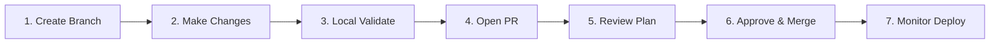

# Developer Workflow

## Overview

This guide covers the day-to-day workflow for making infrastructure changes with Terraform: branch strategy, local development, PR creation, plan review, and deployment. It provides a practical checklist-driven approach for consistent, safe infrastructure changes.

---

## Workflow Overview



---

## Step 1: Create a Feature Branch

```bash
# Sync with main
git checkout main
git pull origin main

# Create a descriptive branch name
git checkout -b feat/add-redis-cluster
# or: fix/rds-security-group
# or: chore/upgrade-provider-version
```

### Branch Naming Conventions

| Prefix | Use Case | Example |
|--------|----------|---------|
| `feat/` | New infrastructure | `feat/add-ecs-service` |
| `fix/` | Bug fix or correction | `fix/sg-ingress-rule` |
| `chore/` | Maintenance, upgrades | `chore/terraform-1.9-upgrade` |
| `refactor/` | Code restructuring | `refactor/extract-vpc-module` |
| `docs/` | Documentation only | `docs/update-runbook` |

---

## Step 2: Make Changes

### Local Development Setup

```bash
# Ensure correct Terraform version
terraform version
# If using tfenv: tfenv use 1.9.0

# Navigate to the environment you are changing
cd infrastructure/environments/development

# Initialize (if not already)
terraform init

# Format your code
terraform fmt -recursive
```

### Writing Changes

1. **Start in a module** if the change is reusable across environments.
2. **Add variables** with descriptions, types, and validations.
3. **Add outputs** for anything other modules or environments will need.
4. **Use `moved` blocks** when renaming resources to avoid destroy/create:

```hcl
moved {
  from = aws_security_group.app
  to   = aws_security_group.application
}
```

---

## Step 3: Local Validation

```bash
# Format check
terraform fmt -check -recursive

# Validate syntax and configuration
terraform validate

# Run a plan against development
terraform plan

# Optional: Run linting
tflint --recursive

# Optional: Run security scan
checkov -d . --quiet
```

### Pre-Commit Hooks

```yaml
# .pre-commit-config.yaml
repos:
  - repo: https://github.com/antonbabenko/pre-commit-terraform
    rev: v1.92.0
    hooks:
      - id: terraform_fmt
      - id: terraform_validate
      - id: terraform_tflint
      - id: terraform_checkov
        args: ['--args=--quiet --compact']
```

---

## Step 4: Open a Pull Request

### Commit Messages

```
feat(ecs): add Redis ElastiCache cluster for session caching

- Add ElastiCache replication group with 2 replicas
- Configure encryption at rest and in transit
- Add security group allowing access from ECS tasks
- Add CloudWatch alarms for CPU and memory

Refs: INFRA-1234
```

### PR Description Template

```markdown
## What

Brief description of the infrastructure change.

## Why

Business or technical reason for the change.

## Changes

- Added `aws_elasticache_replication_group` for Redis
- Added security group for Redis access
- Added CloudWatch alarms for cache metrics

## Environments Affected

- [x] Development
- [x] Staging
- [x] Production

## Risk Assessment

- [ ] Low risk — additive change, no existing resources modified
- [ ] Medium risk — existing resources modified
- [ ] High risk — destructive changes or production-critical

## Testing

- [ ] `terraform validate` passes
- [ ] `terraform plan` shows expected changes
- [ ] Checked for security issues (no public access, encryption enabled)
- [ ] Cost impact reviewed

## Rollback Plan

Describe how to revert this change if something goes wrong.
```

---

## Step 5: Review the Plan

### What to Look For in a Terraform Plan

```
# Safe operations
  + create    — new resource being added
  ~ update    — existing resource being modified in-place

# Dangerous operations
  - destroy   — resource being deleted
  -/+ replace — resource being destroyed and recreated
  <= read     — data source being read
```

### Plan Review Checklist

- [ ] **No unexpected destroys** — any `-` or `-/+` should be intentional.
- [ ] **Correct environment** — the plan runs against the right account/region.
- [ ] **Security groups** — no `0.0.0.0/0` ingress unless intentional.
- [ ] **Encryption** — all new storage resources have encryption enabled.
- [ ] **Tags** — required tags present on all new resources.
- [ ] **Resource names** — follow naming conventions.
- [ ] **Cost impact** — large instances, multiple NAT gateways, etc.
- [ ] **State moves** — any `moved` blocks needed for renames.
- [ ] **Provider/module versions** — intentional updates only.

### Red Flags in Plans

| Pattern | Concern | Action |
|---------|---------|--------|
| `forces replacement` | Resource will be destroyed and recreated | Verify this is acceptable; check for data loss |
| `sensitive value` removed | Output no longer marked sensitive | Verify intentional |
| Many unexpected changes | Possible state issue | Check if someone made manual changes |
| `destroy` on database | Data loss risk | Verify `deletion_protection` is handled |
| Changes to IAM policies | Security impact | Extra scrutiny required |

---

## Step 6: Approve and Merge

### Approval Requirements

| Environment | Minimum Reviewers | Who |
|-------------|-------------------|-----|
| Development | 1 | Any team member |
| Staging | 1 | Senior engineer |
| Production | 2 | Senior engineer + team lead |

### Merge Process

1. All CI checks pass (format, validate, plan, security scan).
2. Required reviewers approve.
3. Merge to main (squash merge preferred for clean history).
4. CI/CD pipeline triggers apply sequence: dev -> staging -> production.

---

## Step 7: Monitor the Deployment

### Post-Apply Checks

```bash
# Verify resources are healthy
aws ecs describe-services --cluster production --services my-app
aws rds describe-db-instances --db-instance-identifier production-postgres
aws elasticache describe-replication-groups --replication-group-id production-redis

# Check application health
curl -s https://api.example.com/health | jq .

# Monitor CloudWatch for errors
# Check the monitoring dashboard
```

### What to Monitor After Deploy

| Metric | Duration | Threshold |
|--------|----------|-----------|
| Application error rate | 30 minutes | < 0.1% |
| Response latency (p99) | 30 minutes | < 2s |
| ECS task health | 10 minutes | All healthy |
| RDS connections | 10 minutes | < max |
| CloudWatch alarms | 30 minutes | No new alarms |

---

## Common Scenarios

### Scenario: Update an Instance Type

```bash
# 1. Update tfvars
# environments/production/terraform.tfvars
# ecs_instance_type = "m7g.xlarge"  # was m7g.large

# 2. Plan to verify the change
terraform plan

# 3. Check if it requires replacement or in-place update
# ECS: usually in-place via launch template update + instance refresh
# EC2: may require replacement (check plan output)
```

### Scenario: Add a New Module

```bash
# 1. Create the module
mkdir -p modules/redis
# Write main.tf, variables.tf, outputs.tf

# 2. Call from environment
# environments/production/main.tf:
# module "redis" { source = "../../modules/redis" ... }

# 3. Init to download/register the module
terraform init

# 4. Plan and review
terraform plan
```

### Scenario: Import an Existing Resource

```hcl
# Add an import block (Terraform 1.5+)
import {
  to = aws_security_group.legacy_app
  id = "sg-0123456789abcdef0"
}

# Write the matching resource config
resource "aws_security_group" "legacy_app" {
  name   = "legacy-app-sg"
  vpc_id = module.vpc.vpc_id
  # ... match existing configuration exactly
}
```

---

## Emergency Changes

When a change is urgent and cannot wait for the normal PR process:

1. **Document the change** — create a PR even if you apply first.
2. **Apply to development first** — even in emergencies, validate somewhere.
3. **Get verbal approval** — call or message a senior engineer.
4. **Create a follow-up PR** — within 24 hours, create the formal PR with the changes.
5. **Post-incident review** — discuss the emergency change in the next retrospective.

---

## Best Practices

1. **Small, focused PRs** — one logical change per PR. Do not bundle unrelated changes.
2. **Always read the plan** — never approve without understanding every change.
3. **Use `moved` blocks** — avoid destroy/create cycles when renaming.
4. **Test in development first** — never deploy untested changes to production.
5. **Keep branches short-lived** — merge within 1-2 days to avoid drift.
6. **Document the "why"** — commit messages and PR descriptions should explain intent, not just what changed.

---

## Related Guides

- [CI/CD Overview](../05-cicd/cicd-overview.md) — Pipeline architecture
- [Multi-Environment](../07-production-patterns/multi-environment.md) — Environment structure
- [Incident Response](incident-response.md) — Emergency procedures
- [Onboarding Guide](onboarding-guide.md) — New team member setup
