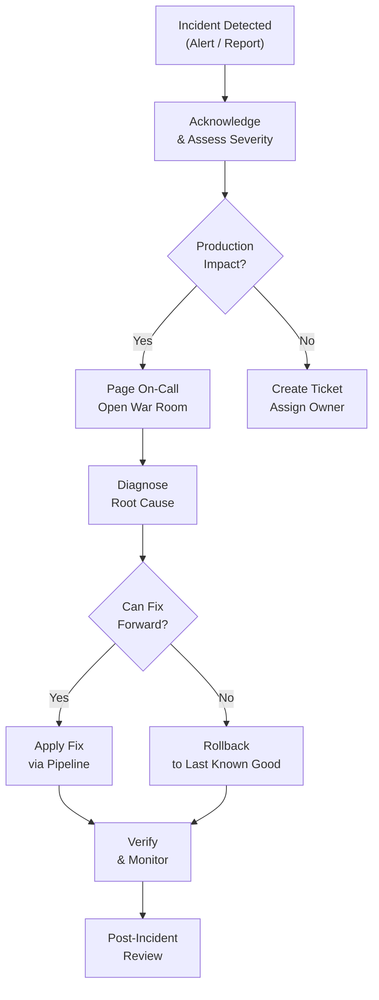

# Incident Response for Infrastructure

## Overview

Infrastructure incidents — failed deployments, state corruption, manual changes gone wrong, or regional outages — require structured response procedures. This guide provides playbooks for common infrastructure incidents, state recovery, manual intervention, and rollback procedures.

---

## Incident Severity Levels

| Level | Description | Response Time | Example |
|-------|-------------|---------------|---------|
| SEV-1 | Production down | Immediate (< 15 min) | Region failure, data loss |
| SEV-2 | Production degraded | < 30 min | High error rate, slow response |
| SEV-3 | Non-production impacted | < 2 hours | Staging broken, CI/CD failure |
| SEV-4 | Minor issue | Next business day | Documentation gap, cosmetic |

---

## Incident Response Flow



---

## Playbook: Failed Terraform Apply

### Symptoms

- CI/CD pipeline shows `terraform apply` failure.
- Partial resource creation (some resources created, others failed).
- State may be inconsistent.

### Response Steps

1. **Do not re-run immediately.** Understand what failed first.

2. **Check the error message:**
   ```bash
   # View the pipeline logs for the exact error
   # Common errors:
   # - "Error creating X: already exists" → resource created but state not updated
   # - "Error creating X: limit exceeded" → service quota hit
   # - "Error creating X: access denied" → IAM permission issue
   # - "Error: timeout" → resource took too long to provision
   ```

3. **Check the current state:**
   ```bash
   terraform state list | grep <resource_prefix>
   terraform state show <resource_address>
   ```

4. **If resource exists but is not in state:**
   ```hcl
   # Use import block
   import {
     to = aws_instance.app
     id = "i-0123456789abcdef0"
   }
   ```

5. **If resource is in state but does not exist:**
   ```bash
   terraform state rm <resource_address>
   ```

6. **Fix the root cause and re-run:**
   ```bash
   # Fix the issue (quota, permissions, etc.)
   terraform plan  # Verify the fix
   terraform apply
   ```

---

## Playbook: State Corruption

### Symptoms

- `terraform plan` shows unexpected destroy/create for existing resources.
- `terraform state list` shows missing or duplicate entries.
- Error: "resource already exists" or "resource not found."

### Response Steps

1. **Pull the current state for inspection:**
   ```bash
   terraform state pull > current_state.json
   ```

2. **Check state file version history (S3 versioning):**
   ```bash
   aws s3api list-object-versions \
     --bucket myorg-terraform-state \
     --prefix environments/production/terraform.tfstate \
     --max-keys 10
   ```

3. **Restore a previous state version if needed:**
   ```bash
   # Download a specific version
   aws s3api get-object \
     --bucket myorg-terraform-state \
     --key environments/production/terraform.tfstate \
     --version-id <version-id> \
     restored_state.json

   # Verify the restored state
   # Then push it back
   terraform state push restored_state.json
   ```

4. **After restoration, verify:**
   ```bash
   terraform plan
   # Should show minimal or no changes if state matches reality
   ```

### Prevention

- Always enable S3 versioning on state buckets.
- Enable DynamoDB locking to prevent concurrent writes.
- Never edit state files manually without a backup.

---

## Playbook: Rollback a Deployment

### Terraform Rollback

Terraform does not have a built-in "rollback" command. Rollback means reverting the code and re-applying.

```bash
# 1. Find the last good commit
git log --oneline -10

# 2. Revert the bad commit
git revert <bad-commit-sha>

# 3. Push and let CI/CD apply the revert
git push origin main

# OR for immediate rollback:
# 4. Checkout the last good commit and apply
git checkout <good-commit-sha> -- infrastructure/
terraform plan
terraform apply
```

### ECS Rollback

```bash
# ECS tracks previous task definitions
aws ecs describe-services --cluster production --services my-app \
  --query 'services[0].taskDefinition'

# Update to the previous task definition
aws ecs update-service --cluster production --service my-app \
  --task-definition <previous-task-def-arn>
```

### Kubernetes Rollback

```bash
# View rollout history
kubectl rollout history deployment/api -n app

# Rollback to previous version
kubectl rollout undo deployment/api -n app

# Rollback to specific revision
kubectl rollout undo deployment/api -n app --to-revision=5
```

---

## Playbook: Manual Change Detected (Drift)

### Symptoms

- `terraform plan` shows unexpected changes.
- Someone made a change via AWS Console or CLI.

### Response Steps

1. **Identify what changed:**
   ```bash
   terraform plan
   # Look for resources with modifications you did not make
   ```

2. **Determine intent:**
   - Was this an emergency fix? Update Terraform code to match.
   - Was this an unauthorized change? Revert by applying Terraform.

3. **If keeping the manual change:**
   ```bash
   # Update Terraform code to match the current state
   # Commit and push
   terraform plan  # Should show no changes
   ```

4. **If reverting the manual change:**
   ```bash
   terraform apply  # Restores the desired state
   ```

5. **Create an incident ticket** to track the drift event.

---

## Playbook: State Lock Stuck

### Symptoms

- Error: "Error acquiring the state lock"
- Another apply crashed or was interrupted.

### Response Steps

1. **Check who holds the lock:**
   ```bash
   aws dynamodb get-item \
     --table-name myorg-terraform-locks \
     --key '{"LockID":{"S":"myorg-terraform-state/environments/production/terraform.tfstate-md5"}}'
   ```

2. **Verify no apply is running:**
   - Check CI/CD pipelines for in-progress runs.
   - Check with team members.

3. **Force unlock only if certain no apply is running:**
   ```bash
   terraform force-unlock <lock-id>
   ```

4. **Never force-unlock during an active apply** — this can corrupt state.

---

## Playbook: AWS Region Degradation

### Symptoms

- AWS Health Dashboard shows service issues.
- Multiple services failing in one region.
- CloudWatch alarms firing across services.

### Response Steps

1. **Confirm the issue is regional** — check AWS Health Dashboard.

2. **Activate DR if available:**
   ```bash
   # If using warm standby / active-active
   # Route 53 health checks should auto-failover

   # If using pilot light
   # Set dr_activated = true and apply
   cd infrastructure/environments/dr
   terraform apply -var="dr_activated=true"
   ```

3. **Communicate status** to stakeholders.

4. **Monitor the primary region** for recovery.

5. **Fail back after recovery:**
   - Verify primary region is stable.
   - Switch traffic back gradually.
   - Deactivate DR compute if using pilot light.

---

## Communication Template

```markdown
## Infrastructure Incident — [SEV-X]

**Status:** Investigating / Mitigating / Resolved
**Start Time:** YYYY-MM-DD HH:MM UTC
**Impact:** [Description of user impact]
**Affected Services:** [List]

### Timeline
- HH:MM — Alert fired: [description]
- HH:MM — On-call acknowledged
- HH:MM — Root cause identified: [description]
- HH:MM — Fix applied
- HH:MM — Monitoring confirms resolution

### Root Cause
[Brief description]

### Action Items
- [ ] [Preventive action]
- [ ] [Detection improvement]
- [ ] [Documentation update]
```

---

## Post-Incident Review

### Template

1. **What happened?** — Timeline of events.
2. **What was the impact?** — Duration, affected users, data loss.
3. **What was the root cause?** — Not "human error" — dig deeper.
4. **What went well?** — What helped in detection or resolution.
5. **What could be improved?** — Gaps in monitoring, runbooks, or tooling.
6. **Action items** — Specific, assigned tasks with deadlines.

---

## Emergency Access (Break Glass)

For situations requiring elevated access beyond normal CI/CD:

1. **Use a documented break-glass process** — separate IAM role with MFA requirement.
2. **Log all actions** — CloudTrail captures everything; announce in team channel.
3. **Create a follow-up PR** within 24 hours with the changes made.
4. **Rotate credentials** if any were used outside normal channels.

```hcl
# Break-glass role — only assumable with MFA
resource "aws_iam_role" "break_glass" {
  name = "break-glass-admin"

  assume_role_policy = jsonencode({
    Version = "2012-10-17"
    Statement = [{
      Effect = "Allow"
      Action = "sts:AssumeRole"
      Principal = {
        AWS = var.senior_engineer_arns
      }
      Condition = {
        Bool = { "aws:MultiFactorAuthPresent" = "true" }
        NumericLessThan = { "aws:MultiFactorAuthAge" = 3600 }
      }
    }]
  })

  max_session_duration = 3600  # 1 hour max
}
```

---

## Best Practices

1. **Have runbooks for common incidents** — do not rely on tribal knowledge under stress.
2. **Practice incident response** — run gameday exercises quarterly.
3. **Enable state versioning** — it is your safety net for state corruption.
4. **Never force-unlock without verification** — confirm no apply is running.
5. **Communicate early and often** — stakeholders prefer "investigating" over silence.
6. **Blame-free post-mortems** — focus on systemic improvements, not individuals.
7. **Automate recovery where possible** — Route 53 failover, ECS circuit breakers.

---

## Related Guides

- [Disaster Recovery](../07-production-patterns/disaster-recovery.md) — Multi-region failover
- [Drift Detection](../05-cicd/drift-detection.md) — Detecting manual changes
- [Developer Workflow](developer-workflow.md) — Normal change process
- [Runbook Template](runbook-template.md) — Creating operational runbooks
