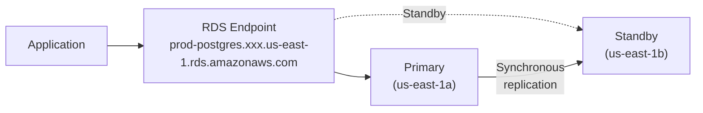

# Runbook Template

## Overview

Operational runbooks provide step-by-step instructions for common infrastructure operations and incident response. This page provides a runbook template and a complete example (RDS failover).

---

## Template

Use this template when creating new runbooks. Copy the sections below and fill in the details for your specific operation.

---

### Runbook: [Operation Name]

**Last Updated:** YYYY-MM-DD
**Author:** [Name]
**Reviewers:** [Names]
**Service:** [Affected service]
**Frequency:** [How often this is performed]
**Estimated Duration:** [Time to complete]

---

#### Prerequisites

- [ ] Access to [account/role/tool]
- [ ] Notifications sent to [team/stakeholders]
- [ ] Maintenance window scheduled (if applicable)
- [ ] Rollback plan reviewed

---

#### Procedure

**Step 1: [Action Name]**

```bash
# Command to execute
```

Expected output:
```
[What you should see]
```

If this step fails:
- [Recovery action]
- [Who to escalate to]

**Step 2: [Action Name]**

```bash
# Command to execute
```

**Step 3: Verify**

```bash
# Verification command
```

Expected behavior: [Description of what success looks like]

---

#### Rollback

If the operation needs to be reversed:

1. [Rollback step 1]
2. [Rollback step 2]
3. [Verification step]

---

#### Post-Operation

- [ ] Verify application health
- [ ] Check monitoring dashboards
- [ ] Update ticket/changelog
- [ ] Notify stakeholders of completion

---

## Example Runbook: RDS Failover

**Last Updated:** 2026-03-01
**Author:** Platform Team
**Reviewers:** SRE Lead, Database Admin
**Service:** PostgreSQL RDS (production)
**Frequency:** Quarterly testing, on-demand for incidents
**Estimated Duration:** 15-30 minutes

---

### When to Use This Runbook

- Planned maintenance requiring a failover
- Primary instance is degraded or unresponsive
- Testing DR capabilities (quarterly exercise)
- AWS has announced maintenance on the primary AZ

---

### Prerequisites

- [ ] AWS CLI configured with production access
- [ ] RDS instance is configured as Multi-AZ
- [ ] Application uses the RDS endpoint (not a specific IP)
- [ ] Monitoring dashboard open: [dashboard URL]
- [ ] Stakeholders notified via `#infrastructure` Slack channel
- [ ] Off-peak hours (if planned)

### Architecture Context



During failover, the RDS endpoint automatically switches to the standby instance. DNS propagation takes 60-120 seconds.

---

### Procedure

**Step 1: Check Current Instance Status**

```bash
aws rds describe-db-instances \
  --db-instance-identifier production-postgres \
  --query 'DBInstances[0].{Status:DBInstanceStatus, AZ:AvailabilityZone, MultiAZ:MultiAZ, Endpoint:Endpoint.Address}' \
  --output table
```

Expected output:
```
---------------------------------------------------------------------
|                       DescribeDBInstances                          |
+------------------+--------------------------------------------------+
|  AZ              |  us-east-1a                                      |
|  Endpoint        |  production-postgres.xxx.us-east-1.rds.amazonaws.com |
|  MultiAZ         |  True                                            |
|  Status          |  available                                       |
+------------------+--------------------------------------------------+
```

**Verify:** Status must be `available` and MultiAZ must be `True`.

If MultiAZ is False, **STOP** — failover is not possible without a standby.

---

**Step 2: Check Application Health (Baseline)**

```bash
# Check current error rate and latency
curl -s https://api.example.com/health | jq .

# Note current connection count
aws cloudwatch get-metric-statistics \
  --namespace AWS/RDS \
  --metric-name DatabaseConnections \
  --dimensions Name=DBInstanceIdentifier,Value=production-postgres \
  --start-time $(date -u -d '5 minutes ago' +%Y-%m-%dT%H:%M:%S) \
  --end-time $(date -u +%Y-%m-%dT%H:%M:%S) \
  --period 60 \
  --statistics Average \
  --query 'Datapoints[0].Average'
```

Record baseline values:
- Connection count: ______
- Error rate: ______
- Response time (p99): ______

---

**Step 3: Announce Failover**

Post in `#infrastructure`:

```
@here Starting RDS failover for production-postgres.
Expect 60-120 seconds of database connectivity issues.
Monitoring at: [dashboard URL]
```

---

**Step 4: Initiate Failover**

```bash
aws rds reboot-db-instance \
  --db-instance-identifier production-postgres \
  --force-failover
```

Expected output:
```json
{
    "DBInstance": {
        "DBInstanceStatus": "rebooting",
        ...
    }
}
```

**Start a timer.** Failover typically takes 60-120 seconds.

---

**Step 5: Monitor Failover Progress**

```bash
# Poll until status returns to 'available'
watch -n 5 'aws rds describe-db-instances \
  --db-instance-identifier production-postgres \
  --query "DBInstances[0].{Status:DBInstanceStatus, AZ:AvailabilityZone}" \
  --output table'
```

Wait for:
- Status: `available`
- AZ: Should be different from the original (e.g., `us-east-1b`)

If the instance is not available after 10 minutes, escalate to the Database Admin.

---

**Step 6: Verify Application Recovery**

```bash
# Check application health
curl -s https://api.example.com/health | jq .

# Check database connectivity from application
kubectl logs -n app deployment/api --tail=20 | grep -i "database\|connection\|postgres"

# Verify connection count is recovering
aws cloudwatch get-metric-statistics \
  --namespace AWS/RDS \
  --metric-name DatabaseConnections \
  --dimensions Name=DBInstanceIdentifier,Value=production-postgres \
  --start-time $(date -u -d '5 minutes ago' +%Y-%m-%dT%H:%M:%S) \
  --end-time $(date -u +%Y-%m-%dT%H:%M:%S) \
  --period 60 \
  --statistics Average \
  --query 'Datapoints[0].Average'
```

Expected behavior:
- Application health endpoint returns 200.
- Connection count returns to baseline within 5 minutes.
- No elevated error rate in CloudWatch.

---

**Step 7: Verify New Primary AZ**

```bash
aws rds describe-db-instances \
  --db-instance-identifier production-postgres \
  --query 'DBInstances[0].{Status:DBInstanceStatus, AZ:AvailabilityZone, SecondaryAZ:SecondaryAvailabilityZone}' \
  --output table
```

The AZ should now be different from the original. The old primary becomes the new standby.

---

**Step 8: Check RDS Events**

```bash
aws rds describe-events \
  --source-identifier production-postgres \
  --source-type db-instance \
  --duration 60 \
  --query 'Events[].{Time:Date, Message:Message}' \
  --output table
```

Expected events:
```
Multi-AZ instance failover started
Multi-AZ instance failover completed
DB instance restarted
```

---

### Rollback

RDS failover is self-contained. If the new primary is unhealthy:

1. **Initiate another failover** to switch back:
   ```bash
   aws rds reboot-db-instance \
     --db-instance-identifier production-postgres \
     --force-failover
   ```

2. **If both AZs are problematic**, restore from the latest automated backup:
   ```bash
   aws rds restore-db-instance-to-point-in-time \
     --source-db-instance-identifier production-postgres \
     --target-db-instance-identifier production-postgres-restored \
     --restore-time $(date -u +%Y-%m-%dT%H:%M:%SZ) \
     --use-latest-restorable-time
   ```
   This creates a new instance. Update the application to point to the new endpoint.

---

### Post-Operation

- [ ] Verify error rate is at baseline levels
- [ ] Verify latency (p99) is at baseline levels
- [ ] Verify connection count has recovered
- [ ] Check no CloudWatch alarms are firing
- [ ] Post completion message in `#infrastructure`:
  ```
  RDS failover complete. production-postgres now in us-east-1b.
  All metrics nominal. Total downtime: ~XX seconds.
  ```
- [ ] Update the incident/change ticket
- [ ] If this was a drill, record results in the DR testing log

---

### Troubleshooting

| Symptom | Possible Cause | Resolution |
|---------|---------------|------------|
| Failover takes > 5 minutes | Large transactions rolling back | Wait; check `aws rds describe-events` |
| Application not reconnecting | Connection pool not refreshing | Restart application pods |
| Elevated errors after failover | DNS caching in application | Check DNS TTL; restart if needed |
| Failover did not change AZ | Standby was in same AZ (rare) | Check Multi-AZ configuration |
| Status stuck in "rebooting" | Internal AWS issue | Open AWS support case (Severity: Urgent) |

---

## Runbook Index

Maintain a central list of all runbooks:

| Runbook | Service | Last Tested | Owner |
|---------|---------|-------------|-------|
| RDS Failover | PostgreSQL | 2026-02-15 | Platform |
| ECS Service Recovery | API | 2026-01-20 | Platform |
| Redis Failover | ElastiCache | 2026-02-01 | Platform |
| EKS Node Drain | Kubernetes | 2026-03-01 | Platform |
| State Recovery | Terraform | 2026-01-15 | Platform |
| DR Activation | All | 2025-12-10 | Platform |
| Certificate Renewal | ACM | N/A (auto-renew) | Platform |
| Secret Rotation | Secrets Manager | 2026-02-01 | Security |

---

## Best Practices for Runbooks

1. **Test every runbook** — an untested runbook is dangerous. Test at least quarterly.
2. **Write for the stressed reader** — use clear steps, expected outputs, and explicit "if this fails" guidance.
3. **Include verification steps** — after every action, verify it worked.
4. **Keep them current** — review and update after every use.
5. **Link to dashboards and logs** — the reader should not have to search for monitoring.
6. **Include rollback steps** — every runbook needs a way to undo the operation.
7. **Use copy-pasteable commands** — minimize the chance of typos under pressure.
8. **Record the time estimate** — set expectations for the person executing.

---

## Related Guides

- [Incident Response](incident-response.md) — Incident workflow
- [Disaster Recovery](../07-production-patterns/disaster-recovery.md) — DR strategies
- [Developer Workflow](developer-workflow.md) — Standard change process
