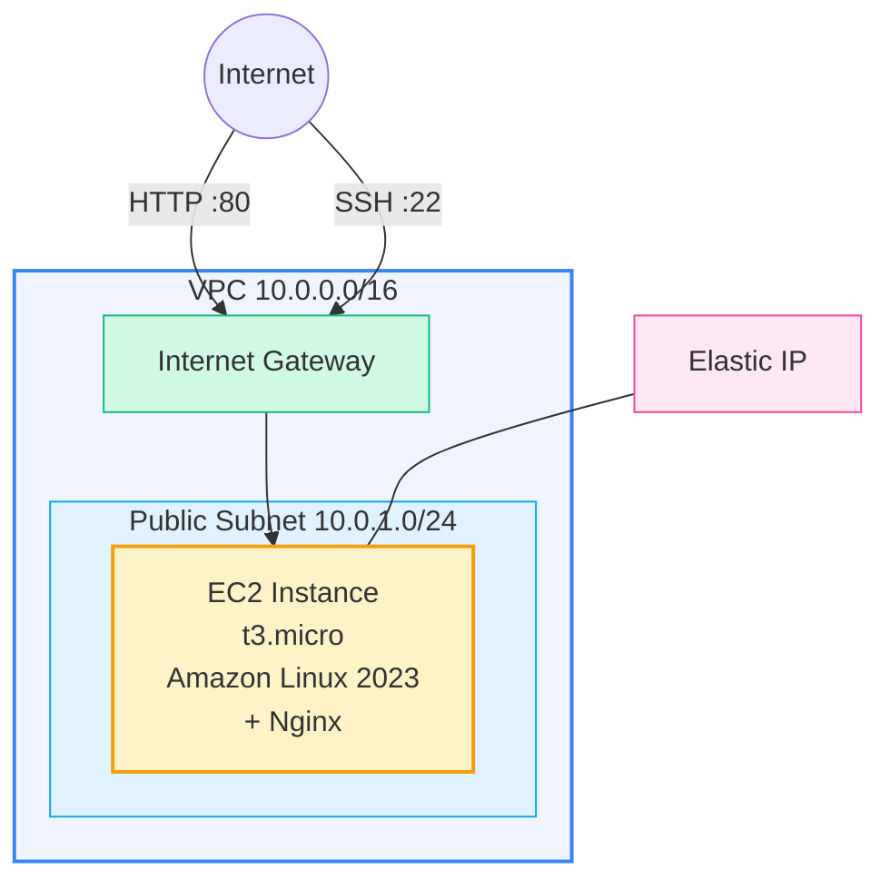

# Example 01 — Hello World: Single EC2 with Nginx

A minimal Terraform example that provisions a single EC2 instance running Nginx in a custom VPC, accessible via an Elastic IP.

## Architecture



## What Gets Created

| Resource | Description |
|----------|-------------|
| VPC | Custom VPC with DNS support |
| Public Subnet | Single subnet with auto-assign public IP |
| Internet Gateway | Enables internet access |
| Route Table | Routes 0.0.0.0/0 through the IGW |
| Security Group | Allows SSH (22) and HTTP (80) inbound |
| Key Pair | SSH key pair for instance access |
| EC2 Instance | t3.micro running Amazon Linux 2023 with Nginx |
| Elastic IP | Static public IP attached to the instance |

## Prerequisites

- Terraform >= 1.9.0
- AWS CLI configured with appropriate credentials
- An SSH key pair (generate with `ssh-keygen -t ed25519 -f ~/.ssh/hello-world-key -N ""`)

## Usage

```bash
# Copy and edit variables
cp terraform.tfvars.example terraform.tfvars
# Edit terraform.tfvars with your SSH public key

# Deploy
make apply

# Access
curl http://<public_ip>
ssh -i ~/.ssh/hello-world-key ec2-user@<public_ip>

# Destroy
make destroy
```

## Cost Estimate

| Resource | Monthly Cost (ap-south-1) |
|----------|--------------------------|
| EC2 t3.micro | ~$7.60 |
| Elastic IP (attached) | $0.00 |
| EBS gp3 8GB | ~$0.72 |
| Data transfer | ~$0.00 (minimal) |
| **Total** | **~$8.32/month** |

> Costs are approximate. t3.micro is Free Tier eligible for the first 12 months.

## Cleanup

```bash
# Destroy all resources
make destroy

# Remove local Terraform files
make clean
```

## Inputs

| Name | Description | Type | Default |
|------|-------------|------|---------|
| aws_region | AWS region | string | ap-south-1 |
| project_name | Project name for tagging | string | hello-world |
| environment | Environment name | string | dev |
| vpc_cidr | VPC CIDR block | string | 10.0.0.0/16 |
| public_subnet_cidr | Public subnet CIDR | string | 10.0.1.0/24 |
| instance_type | EC2 instance type | string | t3.micro |
| ssh_public_key | SSH public key | string | — |
| allowed_ssh_cidr | CIDR allowed for SSH | string | 0.0.0.0/0 |

## Outputs

| Name | Description |
|------|-------------|
| public_ip | Elastic IP of the instance |
| ssh_command | Ready-to-use SSH command |
| website_url | URL to the hello world page |
| instance_id | EC2 instance ID |
| vpc_id | VPC ID |
