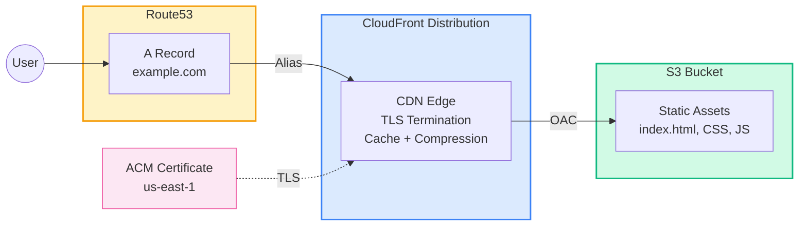

# Example 02 — Static Website: S3 + CloudFront + Route53 + ACM

A production-grade static website setup using S3 as the origin (with Origin Access Control), CloudFront for CDN/TLS termination, ACM for the certificate, and Route53 for DNS.

## Architecture



## What Gets Created

| Resource | Description |
|----------|-------------|
| S3 Bucket | Private bucket for static assets (versioned, encrypted) |
| CloudFront Distribution | CDN with OAC, TLS, compression |
| Origin Access Control | Secure S3 access from CloudFront only |
| ACM Certificate | TLS certificate with DNS validation (us-east-1) |
| Route53 A Records | Apex and www alias records to CloudFront |
| S3 Bucket Policy | Allows CloudFront service principal via OAC |
| Sample index.html | Uploaded to S3 for immediate testing |

## Prerequisites

- Terraform >= 1.9.0
- AWS CLI configured with appropriate credentials
- A registered domain with a Route53 hosted zone

## Usage

```bash
# Copy and edit variables
cp terraform.tfvars.example terraform.tfvars

# Deploy infrastructure
make apply

# Sync your static site build
aws s3 sync ./dist s3://<bucket_name> --delete

# Invalidate CloudFront cache
make invalidate

# Destroy everything
make destroy
```

## Cost Estimate

| Resource | Monthly Cost |
|----------|-------------|
| S3 Standard (1 GB) | ~$0.025 |
| CloudFront (10 GB transfer, 1M requests) | ~$1.20 |
| Route53 Hosted Zone | $0.50 |
| ACM Certificate | Free |
| **Total** | **~$1.73/month** |

> Costs scale with traffic. CloudFront Free Tier includes 1 TB transfer and 10M requests/month for the first 12 months.

## Cleanup

```bash
# Destroy all resources (bucket contents will be deleted if force_destroy = true)
make destroy

# Remove local Terraform files
make clean
```

## Inputs

| Name | Description | Type | Default |
|------|-------------|------|---------|
| aws_region | AWS region for S3 | string | ap-south-1 |
| project_name | Project name | string | static-website |
| environment | Environment | string | prod |
| domain_name | Root domain (Route53 zone) | string | — |
| site_domain | Full site domain | string | — |
| bucket_name | S3 bucket name (globally unique) | string | — |
| force_destroy_bucket | Allow bucket destruction with objects | bool | true |
| cloudfront_price_class | CloudFront price class | string | PriceClass_200 |

## Outputs

| Name | Description |
|------|-------------|
| website_url | HTTPS URL of the website |
| cloudfront_distribution_id | Distribution ID for cache invalidation |
| s3_bucket_name | Bucket name for syncing content |
| sync_command | Ready-to-use S3 sync command |
| invalidation_command | Ready-to-use invalidation command |
