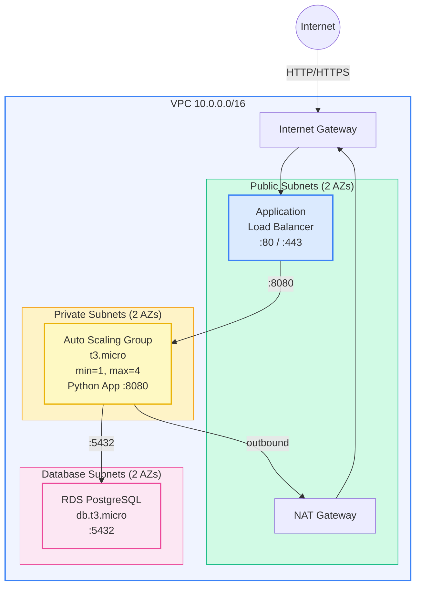

# Example 03 — Three-Tier App: VPC + ALB + EC2 ASG + RDS

A classic three-tier architecture with an Application Load Balancer in public subnets, an Auto Scaling Group of application servers in private subnets, and an RDS PostgreSQL database in isolated database subnets.

## Architecture



## What Gets Created

| Resource | Description |
|----------|-------------|
| VPC | 10.0.0.0/16 with DNS support |
| Public Subnets (x2) | For ALB and NAT Gateway |
| Private Subnets (x2) | For application EC2 instances |
| Database Subnets (x2) | Isolated subnets for RDS |
| Internet Gateway | Internet access for public subnets |
| NAT Gateway | Outbound internet for private subnets |
| ALB | Application Load Balancer with health checks |
| Launch Template | Amazon Linux 2023, Python app on port 8080 |
| ASG | 1-4 instances, CPU target tracking at 60% |
| RDS PostgreSQL | Single-AZ, db.t3.micro, encrypted storage |
| Security Groups | ALB(:80/:443), App(:8080 from ALB), DB(:5432 from App) |

## Prerequisites

- Terraform >= 1.9.0
- AWS CLI configured with appropriate credentials

## Usage

```bash
cp terraform.tfvars.example terraform.tfvars
# Edit terraform.tfvars (set a strong db_password)

make apply

# Test
curl http://<alb_dns_name>/
curl http://<alb_dns_name>/health

make destroy
```

## Cost Estimate

| Resource | Monthly Cost (ap-south-1) |
|----------|--------------------------|
| ALB | ~$22.00 |
| EC2 t3.micro x2 | ~$15.20 |
| NAT Gateway | ~$32.40 |
| RDS db.t3.micro | ~$14.00 |
| EBS gp3 20GB x2 | ~$3.60 |
| RDS Storage 20GB | ~$2.30 |
| **Total** | **~$89.50/month** |

> NAT Gateway is the largest cost component. For dev/test, consider removing it and using VPC endpoints instead.

## Cleanup

```bash
make destroy
make clean
```

## Inputs

| Name | Description | Type | Default |
|------|-------------|------|---------|
| aws_region | AWS region | string | ap-south-1 |
| project_name | Project name | string | three-tier |
| environment | Environment | string | dev |
| vpc_cidr | VPC CIDR | string | 10.0.0.0/16 |
| app_instance_type | EC2 instance type | string | t3.micro |
| asg_min | Min ASG instances | number | 1 |
| asg_max | Max ASG instances | number | 4 |
| asg_desired | Desired ASG instances | number | 2 |
| db_instance_class | RDS instance class | string | db.t3.micro |
| db_name | Database name | string | appdb |
| db_username | Database username | string | appadmin |
| db_password | Database password | string | — |

## Outputs

| Name | Description |
|------|-------------|
| app_url | Application URL via ALB |
| health_check_url | Health check endpoint |
| alb_dns_name | ALB DNS name |
| rds_endpoint | RDS endpoint |
| vpc_id | VPC ID |
