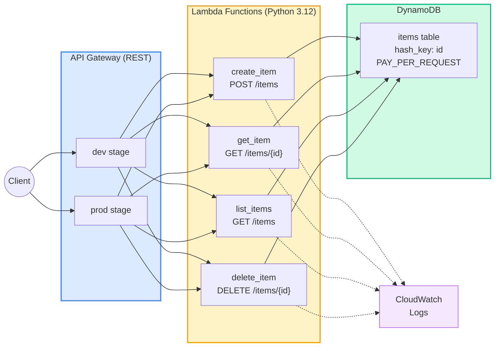

# Example 04 — Serverless API: API Gateway + Lambda + DynamoDB

A fully serverless REST API with CRUD operations. Four Lambda functions back a REST API Gateway, storing data in DynamoDB with pay-per-request billing.

## Architecture



## API Endpoints

| Method | Path | Lambda | Description |
|--------|------|--------|-------------|
| POST | /items | create_item | Create a new item |
| GET | /items | list_items | List all items |
| GET | /items/{id} | get_item | Get item by ID |
| DELETE | /items/{id} | delete_item | Delete item by ID |

## What Gets Created

| Resource | Description |
|----------|-------------|
| DynamoDB Table | Pay-per-request, point-in-time recovery enabled |
| IAM Role | Lambda execution role with DynamoDB permissions |
| Lambda Functions (x4) | Python 3.12, 128MB, 10s timeout |
| API Gateway REST API | Regional endpoint |
| API Gateway Stages | dev and prod with CloudWatch logging |
| CloudWatch Log Groups | One per Lambda + one per stage |

## Prerequisites

- Terraform >= 1.9.0
- AWS CLI configured with appropriate credentials

## Usage

```bash
cp terraform.tfvars.example terraform.tfvars

make apply

# Test the API
# Create
curl -X POST $(terraform output -raw dev_invoke_url)/items \
  -H "Content-Type: application/json" \
  -d '{"name": "My Item", "description": "Hello from Lambda"}'

# List
curl $(terraform output -raw dev_invoke_url)/items

# Get (replace <id> with actual UUID)
curl $(terraform output -raw dev_invoke_url)/items/<id>

# Delete
curl -X DELETE $(terraform output -raw dev_invoke_url)/items/<id>

# Or run automated test
make test

make destroy
```

## Cost Estimate

| Resource | Monthly Cost |
|----------|-------------|
| Lambda (1M requests) | ~$0.20 |
| API Gateway (1M requests) | ~$3.50 |
| DynamoDB (1M reads + 1M writes) | ~$1.50 |
| CloudWatch Logs (1 GB) | ~$0.50 |
| **Total** | **~$5.70/month** |

> All services have generous Free Tier allowances. Actual costs depend on usage.

## Cleanup

```bash
make destroy
make clean
```

## Inputs

| Name | Description | Type | Default |
|------|-------------|------|---------|
| aws_region | AWS region | string | ap-south-1 |
| project_name | Project name | string | serverless-api |
| environment | Environment | string | dev |

## Outputs

| Name | Description |
|------|-------------|
| dev_invoke_url | Dev stage base URL |
| prod_invoke_url | Prod stage base URL |
| dynamodb_table_name | DynamoDB table name |
| lambda_function_names | Map of all Lambda function names |
| example_curl_commands | Ready-to-use curl commands |
