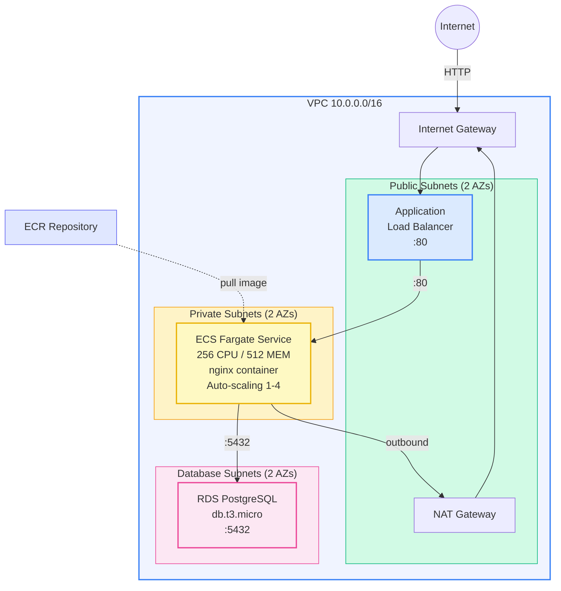

# Example 05 — Container App: ECS Fargate + ALB + ECR + RDS

A containerized application running on ECS Fargate behind an Application Load Balancer, with an ECR repository for images and RDS PostgreSQL for persistence.

## Architecture



## What Gets Created

| Resource | Description |
|----------|-------------|
| VPC | Full networking with public, private, and database subnets |
| NAT Gateway | Outbound internet for Fargate tasks |
| ALB | Application Load Balancer with health checks |
| ECR Repository | Container image registry with lifecycle policy |
| ECS Cluster | Fargate cluster with Container Insights |
| Task Definition | 256 CPU, 512 MEM, nginx placeholder |
| ECS Service | Fargate service with deployment circuit breaker |
| Auto Scaling | CPU (60%) and memory (70%) target tracking |
| RDS PostgreSQL | Single-AZ, encrypted, db.t3.micro |
| Security Groups | ALB -> ECS -> RDS chain |
| CloudWatch Logs | Container log group |

## Prerequisites

- Terraform >= 1.9.0
- AWS CLI configured with appropriate credentials
- Docker (for building and pushing images)

## Usage

```bash
cp terraform.tfvars.example terraform.tfvars
# Edit terraform.tfvars

# Deploy infrastructure (starts with nginx placeholder)
make apply

# Build and push your app image
aws ecr get-login-password --region ap-south-1 | \
  docker login --username AWS --password-stdin <account_id>.dkr.ecr.ap-south-1.amazonaws.com

docker build -t <ecr_repo_url>:latest .
docker push <ecr_repo_url>:latest

# Update the service
aws ecs update-service --cluster container-app-cluster \
  --service container-app-service --force-new-deployment

make destroy
```

## Cost Estimate

| Resource | Monthly Cost (ap-south-1) |
|----------|--------------------------|
| ALB | ~$22.00 |
| Fargate (256 CPU, 512 MEM) x2 | ~$18.00 |
| NAT Gateway | ~$32.40 |
| RDS db.t3.micro | ~$14.00 |
| ECR (1 GB) | ~$0.10 |
| CloudWatch Logs (1 GB) | ~$0.50 |
| **Total** | **~$87.00/month** |

## Cleanup

```bash
make destroy
make clean
```

## Inputs

| Name | Description | Type | Default |
|------|-------------|------|---------|
| aws_region | AWS region | string | ap-south-1 |
| project_name | Project name | string | container-app |
| container_image | Docker image | string | nginx:alpine |
| container_port | Container port | number | 80 |
| task_cpu | Fargate CPU | number | 256 |
| task_memory | Fargate memory | number | 512 |
| desired_count | Desired tasks | number | 2 |
| db_password | Database password | string | — |

## Outputs

| Name | Description |
|------|-------------|
| app_url | Application URL via ALB |
| ecr_repository_url | ECR repository URL |
| ecr_login_command | Docker ECR login command |
| rds_endpoint | RDS endpoint |
| deploy_command | ECS force-redeploy command |
