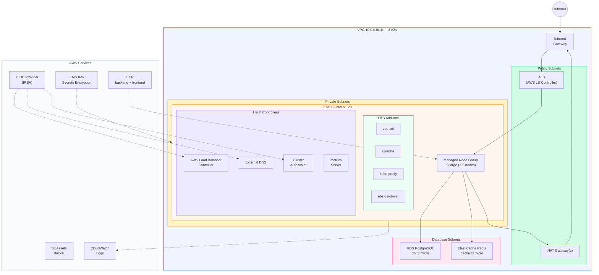

# Example 06 — Full EKS Deployment

A comprehensive Amazon EKS stack with managed node groups, RDS PostgreSQL, ElastiCache Redis, ECR repositories, S3 assets bucket, and Helm-managed Kubernetes controllers (ALB Ingress, External DNS, Cluster Autoscaler, Metrics Server). All service accounts use IRSA for fine-grained IAM permissions. EKS secrets are encrypted with a dedicated KMS key.

## Architecture



## What Gets Created

| Category | Resource | Details |
|----------|----------|---------|
| **Networking** | VPC, 3x Public/Private/DB Subnets | 10.0.0.0/16, 3 AZs |
| | NAT Gateway(s) | Single (dev) or per-AZ (prod) |
| **EKS** | Cluster | v1.29, secrets encryption via KMS |
| | Managed Node Group | t3.large, 2-5 nodes |
| | OIDC Provider | For IAM Roles for Service Accounts |
| **Add-ons** | vpc-cni, coredns, kube-proxy, ebs-csi-driver | Latest compatible versions |
| **Helm Charts** | AWS Load Balancer Controller | ALB/NLB Ingress |
| | External DNS | Route53 record management |
| | Cluster Autoscaler | Node auto-scaling |
| | Metrics Server | HPA/VPA support |
| **Data** | RDS PostgreSQL | db.t3.micro, encrypted |
| | ElastiCache Redis | cache.t3.micro |
| | S3 Bucket | Versioned, encrypted |
| **Container Registry** | ECR (backend + frontend) | Scan on push, lifecycle policy |
| **Security** | KMS Key | EKS secrets encryption |
| | IRSA Roles | Per-controller IAM roles |
| | Security Groups | Cluster, Nodes, RDS, Redis |

## Prerequisites

- Terraform >= 1.9.0
- AWS CLI v2 configured
- kubectl installed
- Helm v3 installed

## Deployment Steps

```bash
# 1. Configure variables
cp terraform.tfvars.example terraform.tfvars
# Edit terraform.tfvars with your values

# 2. Deploy infrastructure (~20-30 minutes)
make apply

# 3. Configure kubectl
make kubeconfig

# 4. Verify cluster
kubectl get nodes
kubectl get pods -A

# 5. Build and push images
aws ecr get-login-password --region ap-south-1 | \
  docker login --username AWS --password-stdin <account_id>.dkr.ecr.ap-south-1.amazonaws.com

docker build -t <backend_ecr_url>:latest ./backend
docker push <backend_ecr_url>:latest

# 6. Deploy your application
kubectl apply -f k8s/

# 7. Destroy when done
make destroy
```

## Cost Estimate

| Resource | Monthly Cost (ap-south-1) |
|----------|--------------------------|
| EKS Control Plane | $73.00 |
| EC2 t3.large x2 | ~$120.00 |
| NAT Gateway (single) | ~$32.40 |
| RDS db.t3.micro | ~$14.00 |
| ElastiCache cache.t3.micro | ~$12.50 |
| EBS volumes | ~$10.00 |
| S3 + ECR | ~$1.00 |
| CloudWatch Logs | ~$5.00 |
| **Total** | **~$268/month** |

> This is a dev-sized deployment. Production costs will be higher with multi-AZ NAT, larger nodes, and multi-AZ RDS.

## Cleanup

```bash
# Remove any Kubernetes resources with AWS dependencies first
kubectl delete ingress --all -A
kubectl delete svc --all -A --field-selector metadata.name!=kubernetes

# Wait for AWS resources (ALBs, etc.) to be cleaned up
sleep 60

# Destroy Terraform resources
make destroy
make clean
```

## Inputs

| Name | Description | Type | Default |
|------|-------------|------|---------|
| aws_region | AWS region | string | ap-south-1 |
| project_name | Project name | string | eks-full |
| vpc_cidr | VPC CIDR | string | 10.0.0.0/16 |
| single_nat_gateway | Single NAT for cost savings | bool | true |
| eks_version | EKS version | string | 1.29 |
| node_instance_type | Node instance type | string | t3.large |
| node_min_size | Min nodes | number | 2 |
| node_max_size | Max nodes | number | 5 |
| db_password | RDS password | string | — |
| redis_node_type | Redis node type | string | cache.t3.micro |

## Outputs

| Name | Description |
|------|-------------|
| cluster_name | EKS cluster name |
| cluster_endpoint | EKS API endpoint |
| kubeconfig_command | kubectl config command |
| ecr_backend_url | Backend ECR URL |
| ecr_frontend_url | Frontend ECR URL |
| rds_endpoint | RDS endpoint |
| redis_endpoint | Redis endpoint |
| irsa_roles | Map of IRSA role ARNs |
