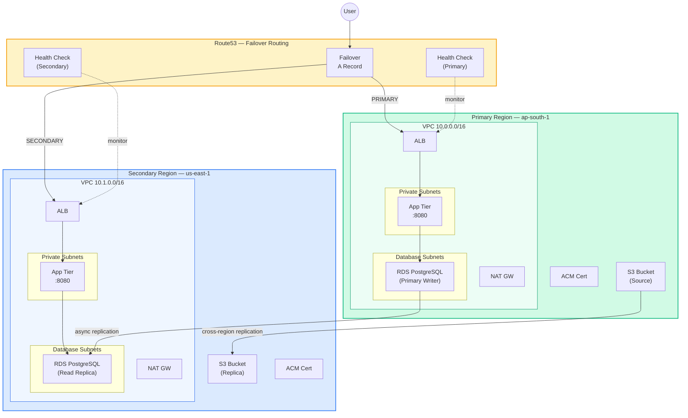

# Example 07 — Multi-Region DR: Route53 Failover

A multi-region disaster recovery architecture with automatic failover. The primary region (ap-south-1) serves traffic normally; if it becomes unhealthy, Route53 automatically routes to the secondary region (us-east-1). Includes cross-region RDS read replica, S3 cross-region replication, ACM certificates in both regions, and CloudWatch alarms.

## Architecture



## What Gets Created

| Resource | Primary (ap-south-1) | Secondary (us-east-1) |
|----------|---------------------|----------------------|
| VPC | 10.0.0.0/16, 2 AZs | 10.1.0.0/16, 2 AZs |
| Subnets | Public + Private + Database | Public + Private + Database |
| NAT Gateway | Single | Single |
| ALB | With health check target group | With health check target group |
| Security Groups | ALB -> App -> DB chain | ALB -> App -> DB chain |
| RDS PostgreSQL | Primary writer | Cross-region read replica |
| S3 Bucket | Source (versioned) | Replica (versioned) |
| ACM Certificate | DNS validated | DNS validated |
| Route53 Health Check | HTTP /health on ALB | HTTP /health on ALB |
| Route53 Record | Failover PRIMARY | Failover SECONDARY |
| CloudWatch Alarm | Healthy host count < 1 | Healthy host count < 1 |

## How Failover Works

1. Route53 continuously checks the primary ALB health endpoint (`/health` on port 80)
2. If the primary health check fails 3 times (90 seconds), Route53 marks it unhealthy
3. DNS responses switch from the primary ALB to the secondary ALB
4. The secondary region serves traffic using the RDS read replica
5. When the primary recovers, Route53 automatically switches back

**RPO (Recovery Point Objective):** Minutes (async RDS replication + S3 replication lag)
**RTO (Recovery Time Objective):** ~90 seconds (3 failed checks x 30s interval)

## Prerequisites

- Terraform >= 1.9.0
- AWS CLI configured with credentials that have access to both regions
- A registered domain with a Route53 hosted zone

## Usage

```bash
cp terraform.tfvars.example terraform.tfvars
# Edit terraform.tfvars

make apply

# Test failover by checking health
curl http://app.example.com/health

# Test direct region access
curl http://<primary_alb_dns>/health
curl http://<secondary_alb_dns>/health

make destroy
```

## Cost Estimate

| Resource | Monthly Cost |
|----------|-------------|
| ALB x2 | ~$44.00 |
| NAT Gateway x2 | ~$64.80 |
| RDS db.t3.micro x2 | ~$28.00 |
| S3 (1 GB x2, replication) | ~$0.10 |
| Route53 Health Checks x2 | ~$1.50 |
| Route53 Hosted Zone | $0.50 |
| ACM Certificates | Free |
| CloudWatch Alarms x2 | ~$0.20 |
| **Total** | **~$139.10/month** |

> Costs do not include EC2 instances for the application tier. Add instances to the target groups for a complete deployment.

## Cleanup

```bash
# RDS replica must be deleted before the primary
make destroy
make clean
```

## Inputs

| Name | Description | Type | Default |
|------|-------------|------|---------|
| primary_region | Primary region | string | ap-south-1 |
| secondary_region | DR region | string | us-east-1 |
| project_name | Project name | string | multi-region |
| domain_name | Route53 hosted zone | string | — |
| site_domain | Application domain | string | — |
| db_password | Database password | string | — |

## Outputs

| Name | Description |
|------|-------------|
| app_url | Application URL (failover) |
| primary_alb_dns | Primary ALB DNS |
| secondary_alb_dns | Secondary ALB DNS |
| primary_rds_endpoint | Primary RDS endpoint |
| secondary_rds_endpoint | Secondary RDS endpoint |
| primary_s3_bucket | Primary S3 bucket |
| secondary_s3_bucket | Secondary S3 bucket |
